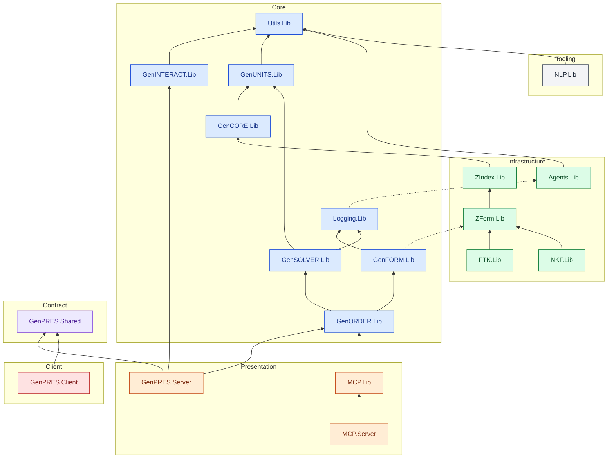

# GenPRES Architecture Overview

This file is an **index and landing page** for the architecture documentation. It provides a stable entry point; the detailed material lives under `docs/`:

- [`docs/adr/0001-system-architecture.md`](docs/adr/0001-system-architecture.md) – the foundational architecture decision (SAFE Stack, all-F#, spreadsheet-backed rules, Docker delivery)
- [`docs/adr/`](docs/adr/) – all Architecture Decision Records; [ADR-0000](docs/adr/0000-documentation-rules.md) states when one is written
- [`docs/domain/`](docs/domain/) – the domain model: [Core Domain](docs/domain/core-domain.md), GenFORM, GenORDER and GenSOLVER specifications
- [`docs/README.md`](docs/README.md) – the map of the documentation folder

Build, run and toolchain details are in [`DEVELOPMENT.md`](DEVELOPMENT.md).

## Project dependencies

Every project under `src/`, grouped by the ring that
[ADR-0001](docs/adr/0001-system-architecture.md#dependency-rule-and-effects--amended-2026-09-06) assigns it. The
block below is generated by `scripts/ProjectGraph.fsx` from the `.fsproj` files and the ring map in
`scripts/DependencyRule.fsx`, and CI fails when it is out of date; refresh it with
`dotnet fsi scripts/ProjectGraph.fsx --write`.

<!-- project-graph:start -->
<!-- Generated by `dotnet fsi scripts/ProjectGraph.fsx --write`; do not edit by hand. -->

19 projects, 22 project references. An arrow points at the dependency. A dashed arrow is an
outward reference the dependency rule still tolerates; the reasons are in `scripts/DependencyRule.fsx`.
<!-- project-graph:end -->
