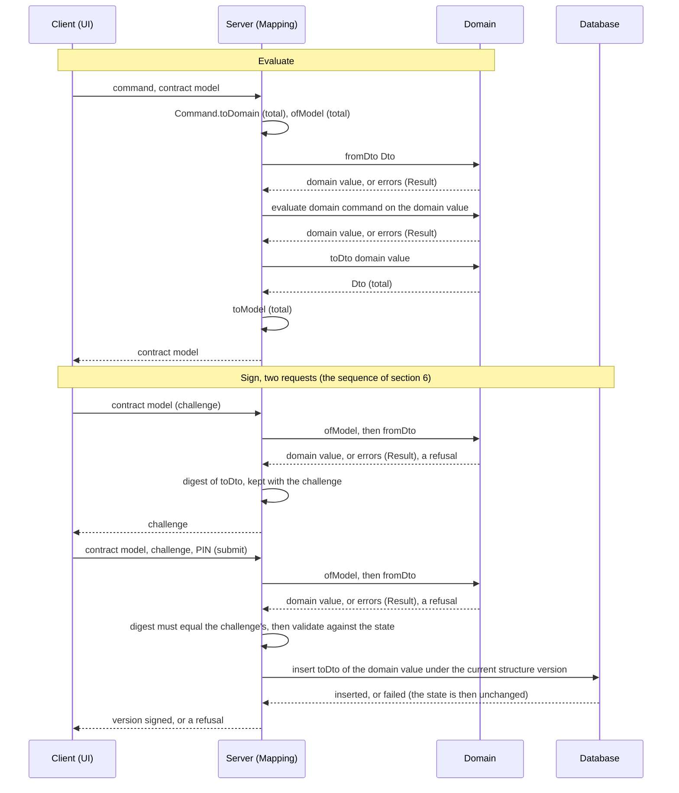

# ADR-0008: Contract Model, Domain Dto, and the Mapping Boundary

**Date**: 2026-09-16

**Status**: Proposed (becomes Accepted when the documents named in Phase 0 of plan 725 refer to
this ADR instead of restating it, and the fitness test of rule R9 runs in CI)

**Related Issues**: [#725 — One data-flow pattern: contract model, domain Dto, domain-typed ports](https://github.com/informedica/GenPRES/issues/725),
[#516 — GenPRES SessionRecord Store](https://github.com/informedica/GenPRES/issues/516),
[#378 — Change project architecture](https://github.com/informedica/GenPRES/issues/378),
[#667 — Context per order](https://github.com/informedica/GenPRES/issues/667)

**Related plan**: [`docs/implementation-plans/725-contract-model-dto-domain-flow.md`](../implementation-plans/725-contract-model-dto-domain-flow.md)
— the evidence, the round-trip laws and the migration

## Context

The client and the server exchange the records of `Informedica.GenPRES.Shared`, the Contract
ring of [ADR-0001](0001-system-architecture.md). The rules live in the `Informedica.*.Lib`
libraries, the Core ring, which never references Shared. The server maps between them. At
commit `026a0351` that mapping has no one shape. Part 1 of plan 725 holds the evidence:

- `Order` and `Variable` follow one shape: a serializable `Dto` owned by the domain library,
  with `toDto` and `fromDto`, and the server mapping the contract record to the Dto.
- Five of the seven aggregates that cross the boundary have no Dto and are mapped by hand onto
  domain records.
- Three of those mappings drop data silently.
- `OrderPlan` has no domain type; its rules run in the server, out of the contract library.
- The reply is merged onto the request.
- The session state holds contract records, which plan 516 would freeze into SQL columns.
- The write path stores what the client sent before anything parses it.
- Three `fromDto` conventions coexist: `Option`, `Result`, and throwing.

The shape of that boundary is hard to reverse. It decides what the database stores, and a stored
record outlives every release that wrote it; it decides what every port is typed on, and so every
service and adapter signature; and it decides what Shared may contain, which is transpiled to
JavaScript and references nothing but `FSharp.Core`. ADR-0000 §2 puts such a decision in an ADR.
This ADR records the vocabulary, the invariants and the rules once. Other documents refer to it.

## Decision

### 1. Vocabulary

One data flow, in one line:

```text
UI -> Command + Model -> Server -> Mapping -> Command + Dto -> Domain -> Dto -> Database   (and back)
```

A request is a pair: a command, the verb, and a contract model, the thing it acts on. The server
maps both; only the model comes back. The same flow as a sequence, in two exchanges: evaluate,
which touches no database, and sign, which writes. Each message carries one kind of value: a
command, a contract model, a Dto, or a domain value.



| Term | Meaning | In the code |
|---|---|---|
| **contract model** | the records the client shows, edits and sends, and the server receives and answers; shared by client and server, not a view model of either side | `Shared.Types.*`; ADR-0001's Contract ring |
| **Dto** | a logic-free, serializable data type for exactly one domain aggregate, owned by the domain library | `Order.Dto`, `Variable.Dto`, GenFORM `Patient.Dto`, `OrderPlan.Dto`, ... |
| **domain** | the domain types and their rules, and pure business logic; the GenFORM `Patient` type can hold a patient below the minimum data, so `Patient.validate` is a separate check | `GenOrder.Lib.Types.Order`, `OrderContext`, `PlanContext`, `OrderPlan`, GenFORM `Patient`, ... |
| **order plan version** | a version of an order plan, created by a prescriber signing it | `OrderPlanVersion` with `No` and `Base` |
| **JSON structure** | the field names, nesting and value formats (how a `BigRational`, an option or a category is written) of a stored Dto's JSON; the serializer and its settings are part of it | the serializer of plan 725 step 1.3 |
| **JSON structure version** ("structure version") | the number the database adapter keeps beside a stored JSON Dto; a code change creates one by changing a stored Dto's JSON structure | `order_plan.json_version` in plan 516 |
| **SQL schema** | the tables and columns; changes only by a SQL migration. A Dto change never needs one, except when it adds a new stored root | plan 516 |
| **release** | the deployed server build; changes at a deploy | — |
| **database** | what the server persists, behind a database adapter | today nothing is persisted and `Session.State` holds everything in memory; later, the SQL tables of plan 516 |

Two mapping pairs. The domain library owns `toDto` (domain to Dto) and `fromDto` (Dto to
domain, a `Result`), nested as `module Dto` under the type. The server owns `ofModel` (contract
model to Dto) and `toModel` (Dto to contract model). Commands are mapped the same way, totally,
from the contract command union to the domain's.

### 2. The contract model and the Dto are two things

They stay apart even where they look alike. Shared compiles as F# on the server and is transpiled
to JavaScript for the client, so it references only `FSharp.Core` and Fable-compatible code, and
only the client and the server reference it. The Dto is the domain's serializable data type,
produced and read at the domain's boundaries: the server mappers, the database, the cache
adapters, the MCP host. It lives in the domain library and cannot be transpiled (`ValueUnit.Dto`
carries `BigRational[]` from MathNet, and `Order.Dto` nests it). The two have different owners
and change for different reasons. The server's mappers are the only production code where they
meet.

### 3. The five Dto invariants

1. A Dto is a logic-free, serializable data type for exactly one domain aggregate, nested as
   `module Dto` under that type, in the library that owns the type.
2. `toDto` is total.
3. `fromDto` validates and returns a failure value (`Result` preferred, `Option` tolerated),
   never throws.
4. Only boundary code (server mapping, database, cache adapter, MCP host) constructs or reads a
   Dto; domain functions take domain types.
5. A Dto persisted across a restart is a stored JSON structure, and the adapter keeps a
   structure version beside each stored root, never as a field of the Dto: a `json_version`
   column in SQL for an order plan version, a header in a cache file when the cache follow-up
   lands. On load the adapter upgrades the record to the current structure before `fromDto`
   sees it; the Dtos nested in a root are governed by the root's version, and `fromDto` and
   `toModel` know nothing of versions. Nothing else is versioned: not Dtos on ports, not
   in-memory state, not the contract model.

An order plan version and a structure version are independent. Each order plan version is stored
under the structure version current at signing and keeps it; an upgrade on load changes what the
server sees, not the stored row or its structure version. Style (class or record, field naming)
is free; the concept is fixed.

### 4. Ports are typed on domain values; parsing runs only in the adapters

A port is defined in domain terms. `OrderContextPort`, `OrderPlanPort` and `SessionPort` take
and return `PlanContext`, `OrderPlan` and `OrderPlanVersion` (`StoredVersion` where a loaded
version may be unreadable, §6). The command handler does `ofModel >> fromDto` on the way in,
refusing on `Error`, and `toDto >> toModel` on the way out. The database adapter does `fromDto`
when it loads a row and `toDto` when it writes one, and supplies the digest function (`toDto`
followed by the canonical serialization), which signing uses (§6). No service sees a Dto;
`Session.State` holds domain values. This is the standard shape of ports and adapters; the
alternative, ports typed on Dtos, is recorded below.

### 5. The rules

| # | Rule | Checked by |
|---|---|---|
| R1 | `Shared.Types` holds contract model records only; `Shared.Models` holds pure client-side projections and the [ADR-0003](0003-shared-clinical-calculations.md) formulas, nothing the server executes as a rule. | review; the agreement test (law L6) for the client's copies |
| R2 | Every domain aggregate that crosses a boundary has a Dto meeting the five invariants. | review: which aggregates cross a boundary is a judgement no script makes |
| R3 | All contract model to Dto mapping on the server lives in `ServerApi.Mappers*.fs`; one function per aggregate per direction; commands included. Named exceptions, port answers with no domain Dto behind them: `Adapters.toSharedDrugInteraction`, `LaunchResult -> LaunchOutcome`, `SessionLookup -> SessionResponse`. | review |
| R4 | Inbound is `ofModel` (total, loses nothing) followed by `fromDto` (a `Result`, reports every failure); no filtering of failed items; the success type is a domain value, never the contract model type. | laws L3 and L4 |
| R5 | Outbound is a pure function `Dto -> contract model` (plus explicit non-domain inputs such as the demo flag); never a merge onto the request. | law L4 |
| R6 | Services and ports are typed on domain types, never on Dtos and never on Shared; Dtos appear only in the adapters. Named exception: the session service in `ServerApi.Session.fs` and the identity half of `SessionPort` keep identity as contract types (`UserContext`, `OpenedToken`, `SessionEnding`, the refusals) and run the signing rules in the server, until the session domain named in [ADR-0007](0007-session-persistence.md) §3 exists. | the fitness test for "never on Shared" (the contract model stays in the edge files); review for "never on Dtos" |
| R7 | The database holds domain Dtos: a stored record is `toDto` of a domain value on write, and on load the adapter upgrades it to the current structure version and parses it with `fromDto`, so the state behind the ports holds domain values, or an unreadable entry (§6). | laws L1 and L5 |
| R8 | Domain code never constructs or reads a Dto. New code only; the existing cases (`Order.Dto.continuous` and its siblings as sole constructors, `Medication.toOrderDto`, `Totals.getTotals`, GenSOLVER `Api`) are a follow-up issue. | review |
| R9 | A fitness test enforces mechanically what can be: the contract model stays in the edge files, no domain library references Shared, and Shared references nothing but `FSharp.Core` and an explicit list of Fable-compatible packages. The rest of this table is checked by the laws or in review, as the column says. | the fitness test itself, in CI |
| R10 | The write path is an inbound path: the signing sequence of §6, which parses the model before anything is stored and writes `toDto` of the domain value under a structure version beside the root. | the signing tests of plan 725 step 5.1 and law L1 |

### 6. What the database holds, and what stays in memory

- **Stored.** Plan 516 stores the order plan versions, the one long-lived root, and whatever
  identity or audit data must survive a restart.
- **Append-only.** The `order_plan` table is insert-only: signing inserts a row, no `UPDATE` or
  `DELETE` ever runs on it, and a unique constraint on `(patient_id, no)` rejects a second
  version with the same number.
- **Working state.** What a Session opened with, its notice and its challenge live in memory
  while the in-memory stub is the database, carry no structure version there, and are gone at
  every startup. In the store of plan 516 they are stored like any other root, as Dtos under a
  structure version, because a restart must end nothing and a second server must find them
  (ADR-0007, Rules 32 and 36). Their rows are short-lived and dropped whole after their
  lifetime. One the release cannot read is not kept as an unreadable entry: an opened-with or a
  notice ends the Session with a new `SessionEnding` case, `Unreadable`, appended as a
  `session_ending` row and told at the next request; a challenge is refused.
- **Loading, and `StoredVersion`.** The adapter loads a patient's order plan versions when a
  request needs them, never once at startup, since a second server would not see an order plan
  version signed after it started (Rule 36); it upgrades and parses each with `fromDto` as it
  loads. A row it cannot load, because its structure version
  is newer than the release knows, an upgrade fails, or `fromDto` refuses it, does not stop the
  server and is not dropped: its identity columns (`id`, `no`, `patient_id`, `base`, the signer,
  `signed_at`) are authoritative, and the entry is kept as unreadable with the reason. The
  session service therefore holds a `StoredVersion` per row, readable (an `OrderPlanVersion`) or
  unreadable (identity and reason). The head is the newest entry whatever its case; a sign is
  refused while the head is unreadable, and a reopen of an unreadable version says it cannot be
  shown.
- **Signing.** The one sequence R10 and §4 refer to. The challenge parses the order plan with
  `ofModel >> fromDto`, refusing on `Error`, and keeps the digest of `toDto` of the domain
  value. The commit parses the submission the same way, compares its digest with the
  challenge's, and validates against the state (the PIN attempts, the head unchanged) as a pure
  function that returns the write as a value. The adapter runs that write, inserting `toDto` of
  the domain value under the current structure version, and assigns the new state only if the
  insert succeeded; a failed insert leaves the state unchanged and answers a refusal. Within
  one process the lock that serializes session commands orders validation and write; across
  servers the transaction and the unique constraint on `(patient_id, no)` do, and a violated
  constraint is another server's sign, answered as a stale sign, the head changed, not as a
  failed store. The Storage section of plan 725 has the crash and retry cases.

### 7. Settled while drafting

| Question | Decision |
|---|---|
| What the database holds | Domain-derived Dtos, never the contract model; ADR-0007 §3 is amended. Lands before plan 516 freezes a SQL schema. |
| Where the domain `OrderPlan` lives | `Informedica.GenORDER.Lib`, next to `OrderContext`, with `PlanContext` and `OrderPlanVersion`, each with a Dto like `Order`. |
| Business logic in `Shared.Models` used by the server | Moves to the domain. The client keeps display projections only, with a test that the two agree. |
| Dto style | Not uniform; the concept is fixed by the five invariants. |
| Dto used as a domain constructor; cache Dtos for ZIndex and NKF; MCP output records | Follow-up issues, not part of plan 725. |
| Digest serializer | The canonical serializer is the one the database uses; its settings are part of the stored JSON structure. |
| What an order plan version stores | The whole order plan, `Filtered`, `Totals` and each context's `Intake` included: what the signer saw. `Intake` and `Totals` are copied fields, never recomputed on open. |
| Upgrade policy for stored Dtos | Upgrade on load: one pure function per structure-version step, on raw JSON, each tested on a stored fixture. Rows are never rewritten. Rolling back a release is not supported once records exist under the newer structure. |
| Ports on Dtos or on domain values | Domain values. |
| Contract model versioning | None: client and server are built and deployed together from the same Shared project. |

The domain fixes the migration needs (an access case added to GenFORM, a department default
removed from the mapper, measured flags on the patient) are decisions of plan 725, recorded in
its decisions table.

## Consequences

- Six round-trip laws (plan 725) become tests: one per step, one for the whole round trip, one
  for stored records, one for the client's copies of domain rules. Where the contract model has a
  field the domain lacks, the field is added to the domain or named as server-computed; a Dto
  never grows a field the domain does not have.
- Every change to a stored JSON structure comes with a new structure version, an upgrade step and
  a stored fixture; a snapshot test of the serialized graph catches a structure change without a
  new number. Most code changes touch no SQL table.
- Every request that needs a patient's order plan versions loads, upgrades and parses them. The
  cost is paid per request, bounded by one patient's history, and measured once the Dtos exist.
- `OrderPlan`, `PlanContext` and `OrderPlanVersion` become GenORDER domain types and the order
  plan rules move out of `ServerApi.Services.fs` and `Shared.Models`.
- ADR-0007 §3 is amended: the session state holds the clinical records and its working state as
  domain values, Dtos appear only in the adapters (the server mappers and the database adapter),
  and identity stays as contract types
  until a session domain exists. Plan 516 stores `order_plan.plan` as `OrderPlan.Dto` under
  `order_plan.json_version`, and the working state the same way in its own tables.
- [`docs/domain/core-domain.md`](../domain/core-domain.md) calls the wire records the contract
  model, not "DTO"; the GenORDER domain document gains the three types.
- The session service keeps its identity types and signing rules in the server, the named
  exception of R6, until the refactor ADR-0007 §3 names.
- The rules table says what checks each rule. A rule checked by a law fails a test once the
  aggregate's Dto and mappers exist; a review rule keeps CI green when broken, so a reviewer
  points at this ADR.

## Alternatives considered

| Alternative | Reason rejected |
| ----------- | --------------- |
| Ports typed on Dtos | Saves one `fromDto` per loaded row, at the cost of Dtos in every service and every port signature and a state that holds unparsed data. The load cost is measured once the Dtos exist; loading per patient keeps it bounded. |
| One Dto family for the contract model and the database | ADR-0001 lets only the server and the client reference Shared, and Shared must stay transpilable; the Dto carries `BigRational`. |
| Mapping inside the services, the reply merged onto the request | The bug class this decision removes: a reply that depends on what the client sent. |
| A structure version as a field of the Dto | The Dto would carry a fact about storage; the adapter owns storage, so the version sits beside the root, and `fromDto` stays ignorant of it. |
| Keeping the working state in memory once a store exists | On the stub, memory is enough, since the stub loses everything at a restart. A store exists so that a restart ends nothing and a second server continues a Session (ADR-0007), which the working state in one process would defeat. |
| Freezing the contract model into SQL columns, as the first plan 516 sketch did | A contract change would become a SQL migration, and the stored record would never have been a domain value. |
| One Dto style for every library (all records, or all mutable classes) | Style is not what differs in concept; the throwing `fromDto` is. Fixing the five invariants fixes the concept and leaves the style. |
| A session domain now, so that R6 has no exception | A refactor with a plan of its own, deferred by ADR-0007 §3; not a precondition for the mapping boundary. |

## References

- [ADR-0000: Documentation Rules](0000-documentation-rules.md) — §2, when a decision is an ADR
- [ADR-0001: System Architecture](0001-system-architecture.md) — the rings, the Contract ring,
  parsing at every inbound boundary
- [ADR-0003: Shared Clinical Calculations](0003-shared-clinical-calculations.md) — the pure
  formulas that stay in Shared
- [ADR-0007: Session Persistence](0007-session-persistence.md) — the append-only store this ADR
  decides the contents of
- [`docs/implementation-plans/725-contract-model-dto-domain-flow.md`](../implementation-plans/725-contract-model-dto-domain-flow.md)
  — Part 1 the evidence, the laws and the storage behavior; Part 3 the migration
- [`docs/implementation-plans/516-sessionrecord-store.md`](../implementation-plans/516-sessionrecord-store.md)
  — the schema and the adapter
- Alexis King, [Parse, don't validate](https://lexi-lambda.github.io/blog/2019/11/05/parse-don-t-validate/) (2019)
- Scott Wlaschin, *Domain Modeling Made Functional* (2018) — Dtos at the boundary, domain types inside
- Alistair Cockburn, [Hexagonal architecture](https://alistair.cockburn.us/hexagonal-architecture/) (2005)
