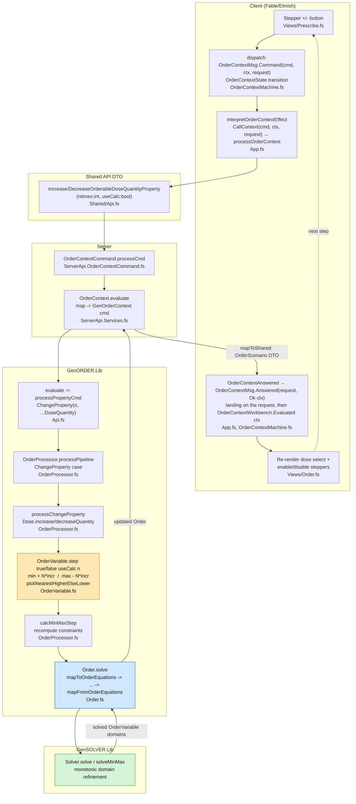
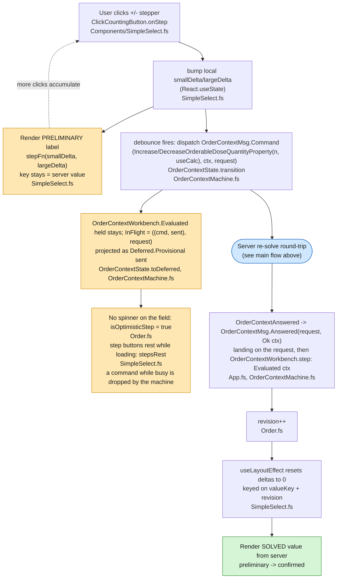

# Dose Quantity Stepping Flow

How `Order.Dose.Quantity` is handled by the UI when the user steps the dose
quantity up/down and the order is re-solved. Every step round-trips through the
server and the constraint solver — the client never computes the value locally.

## Zoom-in: client-side optimistic stepping

The client does **not** block while the server re-solves. It shows a
*preliminary* stepped value immediately using local delta state, keeps the
context it sent visible (`Deferred.Provisional`), and reconciles when the
server answer arrives. Rapid clicks accumulate into the delta and the click
count until the debounced button fires one command; while that command is in
flight the step buttons rest, since the machine drops a command sent while one
is in flight.

The machine is two stages (`OrderContextMachine.fs`): the `OrderContextWorkbench`, the
context as the clinical model has it, which knows no request, and the one
request under way (`InFlight`: the command and the context sent, and the id
the answer must name). `transition` runs them in order. An answer passes the
request first (`landing`) and reaches the workbench only when it names the
request under way, so a stale answer is dropped by its id. A command passes
the workbench first (`OrderContextWorkbench.step`) and reaches the request as an intent,
dropped while a request is under way. A failed command, whether the server
refused it or the call did not complete, goes back to the context held, the
last one the server confirmed, never the one sent.

### Deferred state cases (`Deferred.fs`)

The pages read the workbench as a `Deferred<OrderContext>` projected from
`OrderContextState` (`OrderContextState.toDeferred` in `OrderContextMachine.fs`):

| Case | Machine state | Meaning | UI effect |
| ---- | ------------- | ------- | --------- |
| `HasNotStartedYet` | `OrderContextWorkbench.NoPatient` | no patient, no workbench | empty |
| `InProgress` | `OrderContextWorkbench.Unevaluated`, the first evaluation under way | in flight, **no** prior value | loading placeholder / spinner |
| `Provisional of 't` | `OrderContextWorkbench.Evaluated held`, `InFlight ((cmd, sent), request)` | in flight, **the context sent kept**, not yet confirmed | preliminary value stays visible |
| `Resolved of 't` | `OrderContextWorkbench.Evaluated ctx` with nothing under way | answer received | confirmed value |

Stepping uses **`Provisional`** (not `InProgress`), which is why the previous
dose quantity remains on screen as a preliminary result instead of blanking out.
The orange nodes are the preliminary (awaiting-server) phase; green is the
confirmed solver result.

## Key points

- **Stepping is server-side**, not local: every `+`/`-` round-trips through the
  solver. The client only dispatches
  `Increase/DecreaseOrderableDoseQuantityProperty(ntimes, useCalc)` and renders
  the result.
- **One command in flight**: the pure `OrderContextState.transition` sends a
  command only while nothing is under way; while a request is in flight a
  further command is dropped, and the step buttons rest until the answer
  arrives.
- **`useCalc`** flag decides whether stepping uses calculated constraints vs
  defined ones (`OrderVariable.step`).
- **The step math** (`OrderVariable.fs`): increase = `min + N*incr`,
  decrease = `max - N*incr`, then `pickNearestHigherElseLower` snaps to a
  feasible value in the variable's domain.
- **Re-solve**: after the property change, `calcMinMaxStep` recomputes
  constraints and `Order.solve` feeds equations to GenSOLVER, which returns
  refined domains mapped back into the `OrderScenario` DTO.

## Source references

| Hop | File | Symbol |
| --- | ---- | ------ |
| UI stepper | `src/Informedica.GenPRES.Client/Views/Prescribe.fs` | `Increase/DecreaseOrderableDoseQuantityProperty` |
| Client machine | `src/Informedica.GenPRES.Client/OrderContextMachine.fs` | `OrderContextMsg.Command`, `OrderContextWorkbench.step`, `OrderContextState.transition` |
| Server call | `src/Informedica.GenPRES.Client/App.fs` | `interpretOrderContextEffect`, `OrderContextAnswered` |
| Shared DTO | `src/Informedica.GenPRES.Shared/Api.fs` | `OrderContextCommand` |
| Server cmd | `src/Informedica.GenPRES.Server/ServerApi.OrderContextCommand.fs` | `processCmd` |
| Server service | `src/Informedica.GenPRES.Server/ServerApi.Services.fs` | `OrderContext.evaluate` |
| GenORDER eval | `src/Informedica.GenORDER.Lib/Api.fs` | `evaluate` / `processPropertyCmd` |
| Pipeline | `src/Informedica.GenORDER.Lib/OrderProcessor.fs` | `processPipeline` |
| Property change | `src/Informedica.GenORDER.Lib/OrderProcessor.fs` | `processChangeProperty` |
| Step math | `src/Informedica.GenORDER.Lib/OrderVariable.fs` | `step`, `pickNearestHigherElseLower` |
| Constraint recalc | `src/Informedica.GenORDER.Lib/OrderProcessor.fs` | `calcMinMaxStep` |
| Solve | `src/Informedica.GenORDER.Lib/Order.fs` | `solve` |
| UI re-render | `src/Informedica.GenPRES.Client/Views/Order.fs` | dose quantity select |
