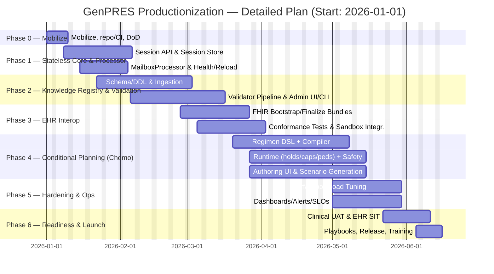

# GenPRES — Productionization Plan (Detailed) — F# Distributed Server–Client

**Start date:** 2026-01-01 · **Duration:** ~26 weeks · **Stack:** F# end‑to‑end (Server: Giraffe/Saturn; Client: SAFE/Fable/Elmish)

## 1) Current State & Gaps

- **Core calculation engine** (order math with `OrderVariable` semantics) exists and supports “enter in any order” solving with precise units and BigRationals; selection flow hinges on `hasValues` vs `isSolved` distinctions and name‑based exclusions in some prescription types.
- **Data sources** are currently **Google Spreadsheets** configured via `GENPRES_URL_ID` with sheets for **Routes, Units, ShapeRoute, ValidShapes, Reconstitution, Enteral feeding (EntFeeding), Parenterals (ParentMeds)** and rule sets (**DoseRules, SolutionRules, RenalRules**). This creates governance and validation gaps for production.
- **Sessioning** is not yet stateless w.r.t. PHI; the **stateless proposal** defines clear EHR/GenPRES boundaries, required session lifecycle, and ops properties; needs implementation.
- **Processor**: a **MailboxProcessor** wrapper around `GenOrder.Lib` is proposed to centralize resource access, health, and reload; not yet implemented.
- **Chemo workflows** (conditional planning, safety, BCMA/pumps/compounding steps) are specified and require a dedicated regimen engine + UI.

> **Implication:** Move from demo/prototype data + ad‑hoc validation to a governed **Knowledge Registry** with formal validation and versioning; implement **stateless session** boundaries and an **EHR adapter**; add **chemo regimen planning** and **feeding** views.

## 2) Scope — Missing Requirements to Implement (with acceptance criteria)

### 2.1 Stateless Session Management (Server + Client)

**Implement:**

- `InitializeSession`(POST) → returns `SessionId`, pins resource versions, accepts EHR context (user roles, patient snapshot).  
- `Process`(POST) → pure commands against session state via `MailboxProcessor`; no PHI persisted.  
- `FinalizeSession`(POST) → returns order/lab deltas (FHIR bundle) and discards session.  
- In‑mem **SessionStore** with TTL, LRU eviction, metrics; concurrent clinician handling and idempotent replay.

**Acceptance:**

- Killing a pod during an active session and re‑issuing `Process` after `InitializeSession`+context replay resumes reliably; no PHI in storage or logs.  
- Session TTL expiry triggers EHR notification hook; metrics show cleanup and max‑concurrency thresholds.

### 2.2 MailboxProcessor around GenOrder.Lib

**Implement:**

- `OrderProcessor` with commands for order context, treatment plan, formulary, parenteralia; single‑threaded resource access, **/health** and **/reload** endpoints, back‑pressure (bounded queue).

**Acceptance:**

- Hot reload of Dose/Solution/Renal/Product rules with no request failures; /health exposes `IsLoaded`, `LastReloaded`, queue depth.

### 2.3 Knowledge Registry (replace Google Sheets) + Formal Validation

**Implement:**

- **Schema/DDL** mirroring existing sheets: `Routes, Units, ShapeRoute, ValidShapes, Reconstitution, EntFeeding, ParentMeds, DoseRules, SolutionRules, RenalRules`.  
- **Versioning** (semver + effective dates), **ownership**, four‑eyes approval for chemo regimens.  
- **Ingestion service** with deterministic loader building arrays for `IResourceProvider`.  
- **Validator pipeline**: schema → referential integrity → **clinical invariants** (dose bounds, route/shape rules, pediatric caps, renal applicability ≥28 days).

**Acceptance:**

- Any missing column or invalid value blocks publish with a precise error (sheet, row, column, rule).  
- A snapshot publish produces identical results to Sheets for a golden set of orders.

### 2.4 EHR Interoperability (FHIR/IHE)

**Implement:**

- **FHIR** R4 bundles for bootstrap (Patient, Practitioner, Observation, Medication, MedicationRequest, ServiceRequest) and finalize (MedicationRequest changes, worklist).  
- **IHE Pharmacy** mapping points for Medication Treatment Plan & Hospital Medication Workflow; durable IDs handled by EHR; **no PHI stored**.

**Acceptance:**

- Conformance tests pass for bootstrap/finalize; rate‑limit & burst tests ≥100 req/s pass.

### 2.5 Conditional Planning Engine (Chemotherapy)

**Implement:**

- **Regimen DSL** → compiler to Registry (cycles/days, premeds, hydration, monitoring).  
- **Runtime evaluator**: lab‑gated **holds**, dose‑modification rules, pediatric mg/kg & mg/m², max caps, cumulative dose tracking, contraindicated route **hard‑stops** (e.g., vinca minibag only).  
- **Safety controls**: two‑person verify, BCMA, smart‑pump auto‑programming hooks, gravimetric checks, intrathecal segregation.

**Acceptance (samples):**

- Attempted **vincristine syringe** order blocks with minibag policy; cannot sign.  
- **Carboplatin AUC** dose matches Calvert; changes to weight/SCr force re‑approval.  
- Gravimetric out‑of‑tolerance blocks label printing until remediated.

### 2.6 Feeding Prescribing Views (Enteral & Parenteral)

**Implement (UI+calc):**

- **Enteral**: kcal/kg targets, formula picker (from `EntFeeding`), rate titration, interruptions; totals by kcal/protein/carbs/fat and electrolytes.  
- **Parenteral**: macro/micro nutrients (ParentMeds) with constraints, osmolarity warnings, glucose infusion rate, central vs peripheral line rules, compounding labels.  
- Reuse `OrderVariable`/`hasValues` selection flow; add guardrails via `ShapeRoute` + reconstitution rules.

**Acceptance:**

- For a neonatal PN example, osmolarity limit violation prompts dilution or central‑line requirement; labels show composition and BUD.

### 2.7 UI — Settings & Planning

**Settings**: institution profile (units/routes), version pins, TTLs, alert thresholds (gravimetric %, cumulative dose caps), integration toggles (BCMA/pumps/robots).  
**Planning**: regimen timeline (cycles/days), chair/bed capacity, lab‑gated readiness, pause/hold logic visualization; pediatric recalc prompts.

### 2.8 Quality, Security & Compliance

- **Test strategy**: unit/integration/contract tests, golden data, chaos tests on session expiry/restart.  
- **Security**: OWASP ASVS L2, NEN 7510/7513 logging & audit; GDPR data minimization (no PHI storage).

## 3) Architecture (F#)

- **Server**: .NET 9 F# (Giraffe/Saturn), `MailboxProcessor` for resource isolation, `IServerApi` implementation exposing session/EHR endpoints.
- **Client**: SAFE/Elmish SPA; session‑aware containers; Settings/Planning/Feeding views.  
- **Registry**: PostgreSQL (or equivalent), ingestion service, validator lib; snapshots feed the processor via `IResourceProvider`.

## 4) Plan & Timeline

## 5) Team — based on prior interest (“x” in your list)

- **Zaid Ajaj** (UI Lead), **Florian Verdonck** (UI), **Isaac Abraham** (Backend/SAFE), **Patrick Drechsler** (QA), **Kit Eason** (API/Code quality), **Mark Seeman** (Architecture), **Mathias Brandewinder** (Perf), **Houston Haynes** (Interop). Optional: **Dave Daw**, **Luis Quintanilla**.

## 6) Budget

### By person (26 weeks, 40 h/week)

| Name                 | Role                                     | Phase Focus     |   FTE |   Rate €/h |   Hours |   Cost € | Bucket    |
|:---------------------|:-----------------------------------------|:----------------|------:|-----------:|--------:|---------:|:----------|
| Dev 1.               | UI Lead (Fable/Elmish, SAFE)             | P1,P4C,UI       |  0.8  |        x |     832 |   108160 | Core Devs |
| Dev 2.               | Senior UI (SAFE/UX)                      | P1,P2B,P4C,UI   |  0.8  |        x |     832 |   104000 | Core Devs |
| Dev 3.               | Backend/SAFE Integration & Delivery      | P1,P3B,P6       |  0.5  |        x |     520 |    72800 | Core Devs |
| Dev 4.               | QA & Test Automation Lead                | P2B,P4B,P5,P6   |  0.6  |        x |     624 |    68640 | Core Devs |
| Dev 5.               | Code Quality & API Design                | P1B,Reviews     |  0.3  |        x |     312 |    43680 | Core Devs |
| Dev 6.               | Architecture Reviews & DDD               | P2A,P4A,Reviews |  0.3  |        x |     312 |    49920 | Core Devs |
| Dev 7.               | Performance & numerical checks           | P4B,P5          |  0.4  |        x |     416 |    54080 | Core Devs |
| Dev 8.               | Interop & resilience (FHIR/IHE adapters) | P3A,P6          |  0.4  |        x |     416 |    49920 | Core Devs |
| Dev 9.               | Tooling & code quality (Fantomas/FX)     | Reviews         |  0.1  |        x |     104 |    10400 | Core Devs |
| Dev 10.              | AI assist & doc gen (optional)           | Tooling         |  0.1  |        x |     104 |    12480 | Core Devs |
| Project Manager      | PM/Scrum Master                          | ALL             |  0.5  |        x |     520 |    52000 | Support   |
| DevOps/SRE           | CI/CD, observability, release            | P0,P5,P6        |  0.25 |        x |     260 |    28600 | Support   |
| Clinical Pharmacist  | Chemo governance & UAT                   | P4,P6           |  0.3  |        x |     312 |    37440 | Support   |
| Security Reviewer    | Threat modeling, ASVS L2                 | P0,P5           |  0.1  |        x |     104 |    14560 | Support   |

### Phase allocation (rough cut)

| Phase   |   Weight |   Budget € |
|:--------|---------:|-----------:|
| P0      |     0.04 |    28,267.20 |
| P1      |     0.18 |   127,202.00   |
| P2      |     0.22 |   155,470.00   |
| P3      |     0.14 |    98,935.20 |
| P4      |     0.26 |   183,737.00   |
| P5      |     0.1  |    70,668.00   |
| P6      |     0.06 |    42,400.80 |

_Scope exclusions_: EHR vendor fees, pump/robot integration licenses, external penetration test lab, production hosting.

## 7) Milestones & Exit Criteria

- **M1 (P1)**: Stateless sessions + MailboxProcessor online; E2E calc via Session API; /health & /reload functional.  
- **M2 (P2)**: Knowledge Registry live; ingestion + validators; golden parity with Sheets on sample set.  
- **M3 (P3)**: FHIR bootstrap/finalize round‑trip; conformance tests green at 100 req/s burst.  
- **M4 (P4)**: Regimen DSL+engine with holds/caps; authoring UI; safety hard‑stops working.  
- **M5 (P5)**: Perf/chaos tests, dashboards/alerts; SLOs documented.  
- **M6 (P6)**: Clinical UAT with oncology pharmacist; go‑live playbooks and rollback.

## 8) Deliverables

- F# server & SAFE client, Docker images, Helm charts, runbooks; Registry DDL/migrations, ingestion & validator libs; Authoring UI; Settings/Planning/Feeding UIs; test suites; conformance packs.

---

**Appendix — Validation Rules (excerpt)**  

- **Routes/Units** must exist and be mapped (no free‑text); **ShapeRoute** must define dose/timed/reconstitution flags per route/form.  
- **RenalRules** only apply for age ≥28 days; enforce nephrology guidelines; rejection on out‑of‑range GFR.  
- **Reconstitution** must list acceptable diluents; reject unknown diluent names.  
- **EntFeeding/ParentMeds** numeric composition required; units normalized; osmolarity/line rules enforced at runtime.

**Appendix — Safety Controls (excerpt)**  

- Vinca minibag enforcement, BCMA everywhere, gravimetric tolerances, two‑person checks, pump auto‑programming ACKs, intrathecal segregation.

## Appendix — Expanded Chemotherapy Acceptance Pack

### A) Regimen Authoring & Compiler

- **Acceptance**: Authoring UI allows definition of cycles (e.g., 21‑day CHOP), days (Day 1: cyclophosphamide, doxorubicin, vincristine; Day 5: prednisone taper), with support for pre‑medications, hydration, monitoring steps.
- **Validation**: Attempt to save regimen missing hydration pre‑med step yields error. Attempt to assign drug not in formulary is blocked.

### B) Runtime Evaluator — Dose Calculation & Holds

- **Carboplatin AUC**: Dose = AUC × (GFR + 25). Acceptance if computed dose matches Calvert formula ±0.1%. Change in SCr triggers recalculation and flags “re‑approval required”.
- **Pediatric mg/m²**: For a child (BSA 0.6 m², protocol 75 mg/m²), correct dose 45 mg ± rounding. Max cap of 2 mg/kg enforced where specified.
- **Renal hold**: If GFR < 30 mL/min/1.73 m², flagged “do not proceed”, order cannot be signed until override documented.

### C) Safety Hard‑stops & Never Events

- **Vinca alkaloids**: Order in “syringe” form factor is blocked; minibag enforced. Attempt yields error “Vinca must be minibag — safety stop”.
- **Intrathecal segregation**: Any vinca marked contraindicated for intrathecal; cannot co‑sign with intrathecal cytarabine/methotrexate in same session.
- **Anthracycline cumulative dose**: If cumulative doxorubicin > 550 mg/m², further cycles require cardiology override. Runtime evaluator enforces block.

### D) Workflow Controls

- **Two‑person verify**: At both prescription and compounding, system requires independent second sign‑off. Acceptance: one user cannot satisfy both roles.
- **Gravimetric checks**: For compounding step, if measured ± system‑calc weight deviates by >10%, block label print and require supervisor override.

### E) Device Integration Hooks

- **Smart pump programming**: Export of infusion parameters (drug, rate, volume) as pump‑ready profile; acceptance when external pump simulator loads file with no manual edits.
- **BCMA scanning**: Simulated nurse scan of patient wristband + drug vial must match system order; mismatch blocks administration.

### F) Pediatric / Neonatal Specifics

- **Neonatal PN**: For a 3 kg neonate, parenteral osmolarity > 900 mOsm/L flagged as “central line required” before sign‑off.
- **Cumulative lifetime anthracycline tracking**: Across multiple protocols, totals roll up per patient, enforced at runtime.

### G) Reporting & Audit

- **Audit log**: Every regimen publish, override, hold, and block event logged with user, timestamp, clinical justification.
- **Regimen versioning**: Attempt to start a cycle with outdated regimen version triggers warning and requires confirmation.

---
