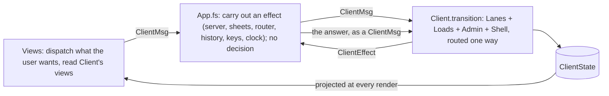

# Implementation plan for issue #1224: the App as wiring

The wider aim: every piece of the client's UI logic expressed as isolated commands over the
contract models, in `Client.Core`, where Expecto and FSI reach it, and traced step by step. The
order lanes are there ([the order machines simplified](1224-the-order-machines-simplified.md)):
five machines, `Lanes`, `Busy`, the start-up and url policies, one `transition` each, no guard.
What `App.fs` still decides itself is the rest of the client: the loads, the pages that follow the
workbench, the list pages, the page switch, the language, the hospital, the disclaimer, the
snackbar, the error banner, the url applied, the admin. This plan moves that into `Client.Core`
the same way, so that `App.fs` is left with what cannot leave the browser: the calls to the server
and to the sheets, the router, the history, the browser keys, the Elmish program, the projection
the views read and the view itself.

The principle, the same as before: a page sends what the user wants, a machine turns that and its
state into a new state and the effects to run, the App carries the effects out. After this plan
`App.update` is one call, `Client.transition`, followed by the effects; no arm of `update` reads
or writes a field of the state.

- [Words used in this plan](#words-used-in-this-plan)
- [Problem description](#problem-description)
- [Decisions](#decisions)
- [Steps](#steps)
- [Verification, per step](#verification-per-step)
- [Out of scope](#out-of-scope)

## Words used in this plan

The plan names code by symbol, not by line number, since every step moves the lines. The symbols
of `App.fs` named below exist today; the new ones are introduced where the plan defines them.

- **A machine**: a state record, a message DU, an effect DU and one function
  `transition : Msg -> State -> State * Effect list`, as the five order machines have.
- **A closing arm**: the last arm of a `transition`, `| _ -> state, []`, which takes a message
  that cannot be acted on in the state it arrives in. It replaces a guard in the App or the view.
- **A part**: what `Client.transition` composes: the `Lanes` composition of the five order
  machines, and the three machines `Loads`, `Admin` and `Shell`.
- **A route**: an effect of one part that `Client.transition` turns into a message for another
  part in the same transition, one way.
- **A reading**: a `Deferred` value of what a call brought, `HasNotStartedYet`, `InProgress`,
  `Resolved` or `Refreshing`.
- **A load**: a case of `Busy.Load`, the key under which the busy policy and the start-up gate
  know a reading.
- **The snackbar**: the transient message at the foot of the page, `UiState.Snackbar`, one
  sentence with a severity, shown by `Snackbar.shown` and closed by the user or by the next one.
- **The error banner**: the strip at the head of the page, `serverErrorBanner` in `App.fs`, that
  shows `UiState.ServerError`: the text of the last server answer that failed, with the
  `ServerErrorPolicy.ErrorSource` it answered. The next successful answer of that source clears
  it, a successful server check clears it whatever the source, and the user can dismiss it.
- **An alert**: a case of the `Alert` DU, decision 5, one per sentence the client shows on the
  snackbar; the view turns it into text. The error banner shows no alert but a `ServerError`.
- **The patient**: who the Session identifies, or the anonymous patient of a tab without one.
- **The patient data**: the `Patient` contract value the lanes evaluate with: age, weight,
  height, gender, gestational age, department, central line. Two values can hold the same
  patient data for the same patient, as the patient as signed does when the server computes the
  age again.
- **The envelope**: `Answer<'r>`, in which a call under the session lands: `From`, the
  `OpenedToken option` that tells the Session which token answered, and `Reply`, the payload.

## Problem description

`App.fs` is 2742 lines. Of the arms of `update`, some 80, the lanes take six, each one line
through `runLanes`. Every other arm decides something itself, over fields of `State` that only
`App` can read, so none of it has a test and none of it leaves a trail line. What it decides, by
kind:

- **The loads** (`FetchesState`; the arms from `LoadLocalization` on). Eleven data loads with a
  reading each, the settings, the localization, the hospitals, the normal values, the bolus and
  continuous medication, the products, the formulary, the parenteralia, the interactions and the
  drug names, and the server check (`ServerStatus`, `CheckServer`). The hospitals are not
  fetched: they are derived from the bolus medication when it lands
  (`LoadBolusMedication Finished`). The formulary, the parenteralia, the interactions and the
  drug names are calls under the session (`createApiMsg`) and land in the envelope; the others
  land as a plain `Result`, with `exn`, `string` or `string[]` as the error. Each load has the
  same three arms, `Started`, `Finished(Ok)` and `Finished(Error)`, and its own rules beside
  them: a second request while one runs is dropped (`LoadFormulary Started`, `LoadParenteralia
  Started`, `LoadInteractionDrugNames Started`); a failed start-up load is recorded for the gate
  (`recordFailed`); the server check asks again after five seconds; the drug names ask again
  after three seconds, three times, then say so; the settings set the language default and the
  demo flag. `loads` maps the eleven readings and the admin's three to `Busy.Load` for the busy
  policy (`loadsOut`) and the start-up gate (`loaded`).
- **The pages that follow the workbench** (`UpdateFormulary`, `UpdateParenteralia`,
  `syncFormulary`, `syncParenteralia`, `patientPages`, `refreshPages`). The formulary and
  parenteralia pages are synced to the filter the workbench answered and loaded for it in the
  same update; while a load of the page runs the page is marked (`FormularyAskAgain`,
  `ParenteraliaAskAgain`) and asked again when it lands (`askFormularyAgain`,
  `askParenteraliaAgain`); a change on one page puts its choices on the other and seeds the
  workbench (`seedFromPage`); the patient set reloads both pages and clears the list filters; a
  resource reload seeds the workbench again, or reloads the two pages without a patient.
- **The interactions** (`checkInteractions`, `applyInteraction`, `withdrawInteractionsNotice`).
  A check is numbered (`InteractionCheck`) so that an earlier answer is dropped; fewer than two
  drugs clears the rows and withdraws the notice; the notice on the snackbar is recognised by its
  Dutch text (`interactionsNotice`) to withdraw it.
- **The list pages** (`OnSelectEmergencyListItem`, `OnSelectContinuousMedicationItem`,
  `selectMedicationItem`). An item chosen is looked up in the loaded list and turned into a
  `FilterSeed` over the workbench (generic, indication, route, dose type), and the page is
  switched to Prescribe; without a patient it is dropped and said. The two list filters are state
  of the UI.
- **The shell** (`UiState`). The page switch, which also starts the loads of the formulary and
  parenteralia pages, retries the drug names and refuses the settings page to a user not logged in;
  the language (`LanguagePolicy` decides, `App` applies); the hospital; the disclaimer, shown again
  on a language or hospital change and accepted (`AcceptDisclaimer`); the snackbar with sentences
  built in `App`, Dutch but for "Invalid password", and closed (`CloseSnackbar`); the server error
  banner, raised by a failed call of one of the nine `ErrorSource` kinds (the plan command, the
  formulary, the parenteralia, the interactions, the login, the log listing, the analysis, the
  reload, the server check) and cleared by the next success of that kind (`processError`,
  `clearError`, `ServerErrorPolicy.raised`, `clearedBy`, `DismissServerError`); `processError` also
  shows the snackbar "Er ging iets mis, herladen" and builds the banner text from the errors, the
  first three, each cut at 200 characters, joined with "; " after "Server fout: "; a failed start-up
  load or drug names load raises nothing, it is logged and recorded for the gate; the counting flag;
  the start-up ended flag (`markStarted`); the url shown and the question open (`UrlPolicy` decides,
  `App` applies).
- **The url** (`parsePatient`, `parseLaunch` and the url comment above them; `applyPage`,
  `applyUrl`, `startOver`; the `UrlChanged`, `LeaveForUrl` and `StayOnUrl` arms). The parse of a
  `#/patient?...` or `#/session?...` url into the patient, the page, the language, the
  disclaimer, the medication and the launch, with `DateTime.Now` for the age and `Logging` for
  what did not parse; the url applied as a patient change, a seed, a page and a launch; the start
  over; the launch erased from the history; the url put back. The parse uses the `Route.Query`
  and `Route.Int` active patterns of the vendored router (`Components/FelizRouter.fs`), which
  opens `Browser.Dom`: the old parse cannot run outside Fable.
- **The admin** (`AdminState`; the `Login` to `LoadReloadResult` arms). The login attempt counted
  (`LoginAttempt`) so that an earlier answer is dropped; the token; the logout, which also leaves
  the settings page; the three readings of the admin, the log listing (`LogFiles`), the analysis
  (`LogAnalysisReport`) and the reload (`Reloading`), each a call under the token; a token the
  server no longer takes logs out (`tokenError`); the reload done refreshes the pages.
- **The Session's sentences in `update`** (the `SessionMsg` arm). A failed close and a PIN that
  never reached the server are said on the snackbar before the message reaches the machine, over
  a match on the Session's view: a decision of the machine's, made beside it.
- **The same patient data sent again** (#1229). After a signature the Session's token renewed
  emits `SessionEffect.SetPatient` with the patient as signed, and `Lanes.route` sends it on to
  the workbench and the plan as `PatientChanged` without comparing the patient data with what
  they hold, so an evaluation, a plan recalculation and a reload of the two pages start for the
  same patient data. The route runs inside `Lanes`, not in `App`. Checked on 2026-10-09 with a
  script that plays a signature over `Lanes.transition` and prints the trail: after the token is
  renewed with patient data equal to what the lanes hold, three calls go out, the patient, the
  workbench's UpdatePatient and the plan's UpdatePatient. It still happens; step 7c fixes it in
  `PatientMachine`.
- **Decisions in the projection** (`ConcreteAppEnv`). `UpdatePatient` and `EditPatient` are
  dropped when the patient is held (`patientHeld`), a guard of the kind the last plan removed;
  `Sign` computes the differences from the plan lane and `Accept` passes whether the patient is
  held: the env builds the message the page should be sending as it is. `Estimated` applies the
  normal values to the draft (`applyNormalValues`), a pure function over contract models in the
  projection.

Three things are not logic and stay: the calls to the server and the sheets behind every effect
(`applySessionEffect` and the other four, `createApiMsg`, `createAdminMsg`, `GoogleDocs`), the
Elmish program with the debugger, and the view.

## Decisions

1. **One transition for the client.** `Client.fs` in `Client.Core` composes four parts, `Lanes`,
   `Loads`, `Admin` and `Shell`, into `ClientState`, `ClientMsg`, `ClientEffect` and
   `Client.transition newRequest msg state`, as `Lanes` composes the five machines: a message runs
   the part it is for, and a route passes an effect of one part on to another in the same
   transition, one way; an effect that no part takes comes out for the App, in the order the parts
   emitted it, and the App runs the effects in that order. `App.update` is `Client.transition` and
   the effects carried out; `init` is `Client.initial url`, over the `UrlParts` of the page's url,
   and `Client.pageLoad`, which returns the effects a page load starts. `Client` is a new module
   above `Lanes`; `Lanes` keeps its routes; step 7 renames the cases that pass the patient data on,
   adds one effect to two of its machines and stops the patient machine resending equal data. The
   compile order of the project, each new file taking its place when its step adds it:
   - `Alert` before `SessionMachine`, since the Session machine shows alerts;
   - after `Lanes`: `Busy`, `StartupPolicy`, `UrlPolicy`, `Url`, `Loads`, `Admin`, `Shell`,
     `Client`, `Trail`. `Loads` needs `Busy.Load`, `Client` needs `Busy` and the two policies,
     and `Trail` needs `Client` for the lines of its routes.
2. **Each part is a machine with the shape the order machines have.** A state record, a message
   DU, an effect DU, one `transition`, no guard: a message that cannot come, because the control
   that sends it is disabled, falls to a closing arm. The test constructors are on the state
   module.
3. **Effects carry contract models, never client types.** `LoadsEffect` has one `Fetch` case per
   load, carrying what the call needs: `FetchFormulary of Formulary`, `FetchParenteralia of
   Parenteralia`, `FetchInteractions of string list`, and the argument-free `FetchSettings`,
   `FetchLocalization`, `FetchNormalValues`, `FetchBolusMedication`, `FetchContinuousMedication`,
   `FetchProducts`, `FetchDrugNames`. A seed carries a `FilterSeed`; a url effect carries the
   `string list` the router gives. The App turns an effect into a call and the answer into a
   message, as it does for the lanes.
4. **Time, ids and delays enter through parameters and messages.** `newRequest` is passed in, as
   for `Lanes`; `now` is passed to the url parse for the age from a birth date. A retry is an
   effect that carries its wait in seconds, `AskAgainLater of Load * int` for the drug names and
   `CheckServerLater of int` for the server check; the App waits that long and sends `Start` or
   `CheckServer`. No machine reads a clock, and the App decides no wait.
5. **What the snackbar shows is a case, not a sentence.** `Alert.fs` in `Client.Core` holds
   the `Alert` DU, one case per sentence (`InteractionsFound of int`, `NoPatientForMedication`,
   `ServerFailed`, `CloseFailed`, `PinNotSent`, `DrugNamesNotLoaded`, `InvalidPassword`,
   `LaunchNotOpened`, `PatientFailed of string`, `WorkbenchFailed of string`,
   `SigningSendFailed`, ...), and `Alert.severity`, the severity the snackbar shows it with.
   Every machine that shows one emits the same effect, `Alert of Alert`, and `Client` routes it
   to the shell. `Views/AlertText.fs` in the Client project turns a case into text in one
   function, `AlertText.text terms alert`, over the localized terms: `SigningSendFailed` is the
   one sentence localized today, through the term `Signing Send Failed`, and keeps that; every
   other case gives the literal text the App builds today, Dutch but for "Invalid password".
   The other sentences do not move to the localization sheet in this plan: that would add a row
   per sentence and language to live configuration, which is a change of its own once the cases
   exist. The interactions notice is withdrawn by its case, not by matching its Dutch text.
6. **The url is parsed in Client.Core.** `Url.parse now segments` turns the router's `string
   list` into `UrlParts` (the patient, the page, the language, the disclaimer, the medication, the
   launch or its refusal), with its own split of the query string over `Uri.UnescapeDataString`,
   which Fable compiles to `decodeURIComponent`; the vendored router's active patterns are no
   longer used by `App`. What did not parse is a list of `UrlPart` cases on the result, not a log
   line; the App logs the list when it carries out the page load, as it logs today, and the shell
   does not show it.
7. **The loads are one machine, the data loads keyed by `Busy.Load`.** `LoadsState` holds the eleven
   data readings and the server status, the failed start-up loads, the two ask-again marks, each a
   `Filter option`, the interaction check number and the drug-name retries. `LoadsMsg.Start of Load`
   and `Landed of Landing`, where `Landing` has one case per load with the payload the call brought
   or the error as the server gave it, a `string[]` for the four calls under the session and a
   `string` for the others (the App turns an `exn` into its message, as wiring), and for the four
   calls under the session also the envelope's `From`, so that `Client` can route the notice to the
   Session. The messages that start loads from elsewhere: `PatientSet of Patient option`,
   `FilterAnswered of Filter`, `PageShown of Page`, `FormularyChanged of Formulary`,
   `ParenteraliaChanged of Parenteralia`, `DrugsChanged of string list`, `ResourcesReloaded`.
   `Loads.out` lists the loads under way and `Loads.loaded` the loads that landed, over the eleven.
   The hospitals stay a reading derived from the bolus medication when it lands. The server check is
   no `Busy.Load`, since it reads nothing a page shows: it has its own messages, `CheckServer` and
   `ServerChecked of Result<unit, string>`, and its own effect, `CheckServerLater`, so `Busy` does
   not change. The admin's three readings are not in `Loads`: decision 8.
8. **The admin owns its three readings.** `AdminState` keeps the log listing, the analysis and
   the reload, since each is a call under the token and a refused token logs out. `Admin.out`
   lists them as `Busy.Load` values the same way `Loads.out` does, and `Client.busy` passes the
   two lists together to `Busy.out`, so `Busy` and `StartupPolicy` do not change. A logout, by
   the user or by a refused token, is an effect, `LoggedOut`, which `Client` routes to the shell
   to leave the settings page.
9. **The Session shows its own failures.** `SessionEffect.Alert of Alert` comes out of the
   Session machine, with `Alert.CloseFailed` and `Alert.PinNotSent`, where today `App` matches
   the view before the message reaches it; the Session machine gains the effect and the two arms,
   nothing else (a small change in a machine this plan does not rewrite, as step 8 of the last
   plan did for the signing machine).
10. **The error banner follows the nine sources, through effects.** The error banner stays a
    `ServerErrorPolicy.ServerError`, raised and cleared through the policy. The shell takes `Failed
    of ErrorSource * string[]` and `Succeeded of ErrorSource`: `Failed` raises the error banner and
    shows `Alert.ServerFailed` on the snackbar, as `processError` does today, but for the `Server`
    source, whose check runs every five seconds while the server is down and shows no snackbar
    today; `Succeeded` clears it, as `clearError` does, and `Succeeded Server` clears it whatever
    the source, as `clearedBy` does today. The banner text is built in `ServerErrorPolicy.raised
    source errs`, which takes the `string[]` and cuts it as `processError` does today, the first
    three, each at 200 characters, joined with "; " after "Server fout: ", with a test; the cut is a
    decision, not wiring. For the `Server` source `raised` gives the sentence `App` holds today, "De
    server is niet bereikbaar. Controleer of de server is gestart.", whatever the error, as `Alert`
    keeps the snackbar's sentences in `Client.Core`; the App logs the error. Of the lanes only the
    plan reaches the error banner: `OrderPlanEffect.TellError` routes to `Failed OrderPlan`, and the
    plan machine gains the counterpart, `TellAnswered`, emitted on the `Ok` answer it awaited and
    never beside `TellError`, which routes to `Succeeded OrderPlan`. Today `App` decides that on the
    incoming message with `OrderPlanState.awaits`, before the machine runs, a check the machine
    makes itself: the effect removes the second check. The other three lanes' `TellError` go to the
    snackbar, as `App`'s `tell` does today: `Alert.PatientFailed`, `Alert.WorkbenchFailed` and
    `Alert.SigningSendFailed`. Of the loads the formulary, the parenteralia, the interactions and
    the server check have a source: their landings route to `Failed` or `Succeeded`; the start-up
    loads and the drug names route to neither, they are logged by the App and recorded for the gate.
    The admin's calls route under their four sources. Every route reads an effect; no route reads a
    message.
11. **The projection reads views and builds no message.** `Sign` sends the plan and a key; the
    `Client` transition takes the differences from the plan lane. `Accept` sends nothing but the
    accept; the transition reads whether the patient is held. The patient-held check on
    `UpdatePatient` and `EditPatient` goes, as a guard: `HeldPanelPolicy` disables the patient
    panel while the patient is held, so no message comes then, and a change that still reaches
    the patient lane while held falls to a closing arm in `Client`. That the panel is disabled
    while held has not been confirmed in the browser; step 9b confirms it, see Verification.
12. **The trail covers every step.** `Trail.fs` gets a line for each `Loads`, `Admin` and `Shell`
    step and for the `Client` routes, as it has for the lanes; the page's patient parts stay out,
    as today.
13. **Nothing is logged from Client.Core.** The trail is the record of what a step did; the App
    keeps its `Logging` lines for what it carries out (a call failed, a key could not be made, a
    url part did not parse).
14. **`Page.Page` is the page type.** `Global.Pages` is already an alias of it (`Global.fs`), so
    the Shell uses `Page.Page` and nothing in the views changes.

## Steps

One pull request per step, one open at a time. Every step in `Client.Core` starts as a script with
its tests, unless the user asks for source; the App and view changes are source. The scripts go
under `src/Informedica.GenPRES.Client.Core/Scripts/`, where `load.fsx` is behind the project: it
lacks twelve of the project's files, `PatientMachine.fs`, `Lanes.fs` and `Busy.fs` among them, and
loads `Trail.fs` before them. Step 1 brings it up to the project's compile order, and every later
step adds its file. Each step leaves the application working: until step 9b the App calls the new
machine from the arms it replaces, as it called the order machines before `Lanes` existed. Every
step that adds or changes a message or an effect changes `Trail.fs` and its tests in the same pull
request. Every step but 1b, 7c and 9a commits as `refactor`; 1b changes what a url opens and commits
as `feat`, 7c fixes #1229 and commits as `fix`, 9a moves tests and commits as `test`. Steps 1 to 9a
fit the 200-line limit; step 9b may exceed it, as step 13 of the last plan did, since `App.update`'s
wiring moves as a whole; the pull request says so. The order is as listed: the url first, since it
is pure and has no state, then the loads, the most lines, then the admin and the shell, which the
url and the Session's sentences hang on, then the composition.

1. **The url parsed in Client.Core**, in two pull requests:
   - **1a, the parse moved.** `Url.fs`: `UrlParts`, `LaunchUrl`, `UrlMedication` move from
     `App`; `Url.parse now segments`, with the query split and the age from `now`; the parts
     that did not parse are on the result. Tests: a case per parameter of the url comment above
     `parseLaunch`, a birth date and an age in days, the CVL, the department, the page codes,
     the language codes, the disclaimer, a medication of one part, a launch, each refusal
     reason, an unknown reason, a url that is neither. The expected values are written by hand
     from a reading of `parsePatient` and `parseLaunch`, since the old parse cannot run outside
     Fable. `App.parsePatient` and `parseLaunch` go; `init` and `UrlChanged` call
     `Url.parse DateTime.Now` and log the parts that did not parse.
   - **1b, the page codes and the parameter scheme (#915).** A code for the Nutrition, OrderPlan
     and Interactions pages; none for Settings, the admin page behind the password, so that no
     link opens it. Every query parameter under the three-letter scheme of
     `docs/roadmap/feature-ehr-url-parameters.md`, with the old two-letter key read beside the
     new one for the transition the document describes. Tests: each new code; each parameter
     under both keys, the new one winning when both are given. The url comment moves to
     `Url.fs` and lists the new keys. Committed as `feat`, with its own browser check.
2. **The loads machine, the start-up loads.** `Alert.fs` with the cases of this step and
   `Alert.severity`; `Views/AlertText.fs` with `AlertText.text`. `Loads.fs`: the state, `Start`
   and `Landed` for the settings, the localization, the normal values, the bolus and continuous
   medication and the products; the hospitals derived when the bolus medication lands; a start
   while one runs is the closing arm; the failed start-up loads recorded, raising nothing;
   `Loads.out` and `Loads.loaded`. Effects: the `Fetch` cases of these loads, `Alert of Alert`.
   Tests: a load started once, answered, failed and recorded; the hospitals derived. `App`: the
   arms replaced by `Loads.transition`; `loads`, `loadsOut`, `loaded` and `recordFailed`
   replaced; the alerts of this step shown through `AlertText.text`.
3. **The loads machine, the loads asked again.** The server check, with `CheckServer`,
   `ServerChecked` and `CheckServerLater`, and the drug names, with `AskAgainLater`, giving up after
   three and showing `Alert.DrugNamesNotLoaded`; the envelope's `From` on the drug names' landing.
   `ServerChecked` is the landing that routes to `Failed Server` and `Succeeded Server` (decision
   10). Tests: the server check asked again after a failure, not after a success; a failure raising
   the error banner with the server sentence and no snackbar, the next success clearing it; the drug
   names asked again, given up. `App`: the two arms replaced; the waits carried out as `Cmd.OfAsync`
   over the effect.
4. **The loads machine, the pages that follow the workbench.** The formulary and parenteralia loads
   with the filter synced; the ask-again marks holding the filter answered during a load, used when
   it lands; the patient set reloading both, the formulary over the patient as `startFormulary` does
   today; a change on one page put on the other; and the seed to the workbench as an effect
   (`SeedWorkbench of FilterSeed`); the resources reloaded seeding the workbench or reloading the
   pages; the envelope's `From` on the two landings. Tests: a filter answered during a load is asked
   again once; a page change seeds with its rule; the patient set reloads both pages with the
   patient. `App`: `syncFormulary`, `syncParenteralia`, `startFormulary`, `startParenteralia`,
   `askFormularyAgain`, `askParenteraliaAgain`, `patientPages`, `refreshPages`, `seedFromPage` go.
5. **The loads machine, the interactions.** The check numbered, the earlier answer dropped, fewer
   than two drugs clearing the rows and withdrawing the notice, the notice as
   `Alert.InteractionsFound`; the envelope's `From` on the two landings. Tests: two checks out,
   the first answer dropped; one drug clears. `App`: `checkInteractions`, `applyInteraction`,
   `withdrawInteractionsNotice` go.
6. **The admin machine.** `Admin.fs`: the login attempt, the token, the logout, the three
   readings, `Admin.out`; an earlier login answer dropped; a token the server no longer takes
   logging out; the effects `LoggedOut`, `Alert Alert.InvalidPassword` and the reload done, which
   the loads take. Tests: a login answer of an earlier attempt lands nowhere; "Invalid token"
   logs out; the reload done; `Admin.out` during a listing. `App`: the admin arms replaced;
   `applyAdmin`, `tokenError` go; `busyOut` passes `Admin.out` beside `loadsOut`.
7. **The lane machines**, in two pull requests:
   - **7a, the patient data named.** Four cases carry the `Patient` contract value under a name
     that reads as if the person changed: `SessionEffect.SetPatient`, `PatientEffect.SetPatient`,
     `OrderContextMsg.PatientChanged` and `OrderPlanMsg.PatientChanged`. They become
     `SetPatientData` and `PatientDataChanged`, after the glossary: who the patient is lives in the
     Session alone, and the lanes pass the data on. `PatientMsg.Changed` keeps its name; its machine
     is named in the prefix. The `///` lines of the four cases, `Lanes.route`, the arms, their trail
     lines in `Trail.fs`, the tests, the two arms in `App` and the scenario
     `docs/scenarios/integration/uc-12-held-patient-context.md` follow; the implementation plans
     that name the old cases are records of what was built and stay. No behaviour changes; the lane
     tests pass unchanged but for the names. A rename on its own, so that the steps after it read
     right in review.
   - **7b, the two small changes.** Decision 9: `SessionEffect.Alert` with `CloseFailed` and
     `PinNotSent`, and the `SessionMsg` arm's match in `App` replaced by the effect shown
     through `AlertText.text`. Decision 10: `OrderPlanEffect.TellAnswered` on the `Ok` answer the
     plan machine awaited, and the `awaits` check on `OrderPlanAnswered` in `App` replaced by
     the effect clearing the error banner. Their trail lines. Tests: the two Session arms
     produce the alert, no other arm does; the plan's awaited `Ok` answer produces `TellAnswered`, a
     late answer does not, and an awaited `Error` produces `TellError` without it.
   - **7c, the same patient data sent once (#1229).** `PatientMachine.transition`: a `Changed` whose
     patient data is present and equals `PatientState.answered`, the completed data the orders were
     calculated for, while no change is in flight, keeps the state, the draft included, and emits
     nothing; the chain the Session's `SetPatientData` starts after a signature stops there, and no
     second evaluation, plan recalculation or page reload goes out. A `Changed` with no patient
     data, the panel's reset, clears as today, also over a draft that was never answered. The draft
     is kept so that a weight cleared under `Estimates.Kept` stays cleared after a signature; today
     the answer fills the estimate back in. With a change in flight the equal data is sent as today,
     so that the newer request replaces the older; the panel takes no edit while a change is in
     flight, so that case comes only from the Session. A draft that differs, a cleared weight
     included, is sent as today. The comparison is on the client, since the server completes one
     patient per request and holds no earlier value, and the call itself is the waste. Tests: the
     signed data answered again produces no effect; a reset over an incomplete draft clears the
     draft and emits `SetPatientData None`; an edit to the value of a draft as answered under
     `Estimates.Renewed` produces no effect; equal data with a change in flight calls; a changed
     weight calls; a cleared weight under `Estimates.Kept` and then the equal data from the Session
     keeps the cleared draft; in `LanesTests`, a signature over data equal to what the lanes hold
     makes no call once the token is renewed and sends no `PatientDataChanged`, the case the #1229
     script played. The trail line of the step. Commits as `fix`, since the behaviour changes.
8. **The shell machine**, in two pull requests:
   - **8a, the shell without the url.** `Shell.fs`: every field of `UiState` but the url: the
     page (the settings page refused to a user not logged in, `LoggedOut` leaving it), the
     language through `LanguagePolicy`, the hospital, the disclaimer shown again and accepted,
     the snackbar as an `Alert` shown and closed, the error banner through `ServerErrorPolicy`
     with `Failed`, `Succeeded` and the dismiss, the counting, the started flag, the two list
     filters; `ServerErrorPolicy.raised` taking the `string[]` and cutting it (decision 10).
     Tests: the page switch cases; the language and hospital showing the disclaimer again; a
     failure raising the error banner and showing `Alert.ServerFailed`, the next success of its
     source clearing the banner; four errors cut to three and 200 characters; an alert closed.
     `App`: `UiState` goes into `ShellState`, but for the url; `applyPage`, `processError`,
     `clearError` go.
   - **8b, the url in the shell.** The url shown and asked through `UrlPolicy`, the url applied
     (page, language, disclaimer) and the question answered; the effects `PutBackUrl`,
     `EraseLaunch`, `PresentLaunch of Launch`, and the routed ones `StartOver of Patient option`,
     `PatientFromUrl of Patient option`, `SeedWorkbench of FilterSeed`, `ResumeSession`,
     `LeaveSession`. Tests: a url change for each `UrlAction`; the question answered both ways;
     the launch url erased. `App`: the url leaves `UiState`; `applyUrl`, `startOver`, `putBack`,
     the `UrlChanged`, `LeaveForUrl` and `StayOnUrl` arms go.
9. **The client as one transition**, in two pull requests:
   - **9a, the shared fixtures (#1175).** The contract fixtures (the patients, `scenario`,
     `context`, `plan`, `one`, `two`, `head`) move out of `OrderPlanMachineTests.fs` into
     `OrderFixtures.fs`, first in the test project, and `ArgumentationPolicyTests.fs` takes its
     place in the grouped order. Tests only; 9b's `ClientTests.fs` opens the module.
   - **9b, the composition.** `Client.fs`: `ClientState` of the four parts, `ClientMsg`,
     `ClientEffect`, `Client.transition`, `Client.initial`, `Client.pageLoad`, with every route:
     - the settings landed to the shell's language and demo flag;
     - the patient set, with the patient, to the loads and to the shell's list filters;
     - the shell's page shown to the loads;
     - the workbench's filter answered to the loads;
     - the plan's drugs to the loads;
     - the loads' seed to the workbench;
     - the list item chosen, through `FilterSeed.ofListItem`, a pure function in `Client.Core`
       over the item's generic, indication, route and dose type, to the workbench and the shell's
       page, or `Alert.NoPatientForMedication` without a patient;
     - the url's patient, seed, start-over and Session messages to the lanes;
     - the admin's reload done to the loads, and `LoggedOut` to the shell's page;
     - a landing's `From` to the Session;
     - every part's `Alert` to the shell's snackbar;
     - the plan's `TellError` and `TellAnswered` to the shell's `Failed` and `Succeeded`; the
       formulary's, the parenteralia's, the interactions' and the server check's landings, and the
       admin's answers, to one or the other under their source; the patient's, the workbench's and
       the signing's `TellError` as alerts to the snackbar (decision 10);
     - `GoToPlanPage` to the shell;
     - `Sign` with the plan's differences and `Accept` with the held flag (decision 11).

     `Client.busy`, `Client.startup` and `Client.unsignedWork` replace `busyOut`, `startup`,
     `markStarted` and `hasUnsignedWork`. `App.update` becomes `Client.transition` and the
     effects; `init` becomes `Client.initial` and `Client.pageLoad`. Tests in `ClientTests.fs`,
     use cases played by code as `LanesTests` does: a page load with a url patient through to the
     start-up ended; a formulary change seeding the workbench and its answer syncing the page; a
     reload with and without a patient; a list item with and without a patient; a url change asked
     and answered; a signature from the env's message to `TellSigned`; a failed load raising the
     error banner and the next landing clearing it, and the plan's `TellAnswered` clearing it;
     a logout leaving the settings page; a patient change while held falling to the closing arm.
10. **The smaller things.** The projection reads `Client` views only; this plan's As built,
    with the line counts of `App.fs` and `Client.Core` before and after.

Line counts, by `wc -l` over the `.fs` files of each:

- Before: `App.fs` 2742, `Client.Core` 5597.
- `App.fs` after: what carries out an effect (some 450 lines of calls today), the program and
  the debugger, the projection and the view: about 1200 lines, none of them a decision over the
  state. Each step but 1b, 7a, 7c and 9a must leave `App.fs` shorter.

## Verification, per step

- **Every code step:** `dotnet test tests/Informedica.GenPRES.Client.Core.Tests/`,
  `dotnet run servertests`, `scripts/CheckDependencyRule.fsx`, Fable and `npx vite build`.
- **Every code step, in the browser with the trail**, the list of the last plan (a filter pick,
  a patient edit, the formulary and parenteralia pages, a resource reload, a prescription, a
  signature, the refreshes, a url change during a request), plus for this plan: a page load
  with and without a url patient until the gate opens; the emergency list and continuous
  medication items with and without a patient; the server stopped and started again, the error
  banner raised and cleared; the admin login, a wrong password, the log listing, an expired token
  leaving the settings page; the url question answered both ways; the launch url erased from the
  history.
- **Step 1:** the tests hold the expected patient, page, language and medication of each url,
  written from a reading of the old parse; in the browser, the url of the url comment with every
  parameter set gives the same patient, page, language and medication as before the step, and
  the Fable build compiles `Uri.UnescapeDataString`. For 1b: a url with the old keys and one
  with the new keys open the same patient and page; a url with each new page code opens it.
- **Step 7a:** the trail of a patient edit reads `SetPatientData` and `PatientDataChanged`
  where it read `SetPatient` and `PatientChanged`, and nothing else in it changes.
- **Step 9b:** the trail of a page load shows every step in one sequence, the loads included,
  and `App.fs` has no `match msg with` left but the one that carries out effects. In the
  browser: with a patient held (a session open with a changed order plan) the patient panel
  takes no edit, and the trail shows no patient message; this confirms what decision 11 relies
  on.
- **Before step 1, for #1229:** done on 2026-10-09, over `Lanes.transition` in a script in the
  scratchpad. The trail shows the second workbench evaluation and plan recalculation on the same
  patient data; step 7c removes them and keeps the case as a `LanesTests` test.
- **Step 7c:** the `LanesTests` signature case passes, and in the browser a signature leaves the
  workbench and the plan as they were, the trail shows no second evaluation, a weight edit still
  recalculates, and a weight cleared before the signature is still cleared after it.

## Out of scope

- The two dialog programs (`Views/Order.fs`, `Views/NutritionSlot.fs`): the dialog's messages
  mapped to `OrderViewCommand` once, in `Client.Core`, for both. The next plan; it needs the
  picks decision (#1252) and #495.
- The stepper arithmetic in `Views/ViewHelpers.fs`: a plan of its own, or part of the dialog plan.
- `calculateInterventions` (`EmergencyTreatment.calculate`, `ContinuousMedication.calculate` over
  the draft): left in the view, since #1214 retires it once the server solves the lists.
- `Estimated` (`applyNormalValues` over the draft): left in the projection; a pure function over
  contract models that moves to `Client.Core` with tests on its own, after this plan, since it
  decides nothing the App decides.
- The alerts' sentences on the localization sheet: a change of configuration once `Alert` exists.
- The interactions page's manual drug list and the page menu: view state with no decision.
- The lane machines beyond step 7.
- The debugger and the trail's own gate.
