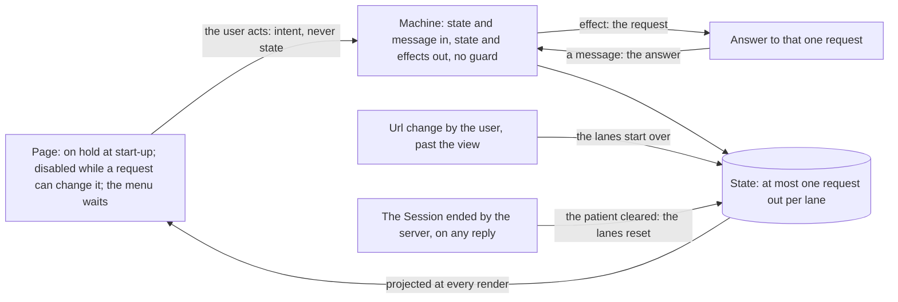

# Implementation plan for issue #1224: the order machines simplified

Plan B ([the client sends commands only](1224-the-client-sends-commands-only.md)) left both order
machines sending commands only, one request at a time, each over the last answer. The structure the
machines had for waiting and replayed commands stayed, and beside it a second line of defence: a
machine drops or replaces what reaches it while a request runs, although the page is already
greyed. This plan takes both out. The machines exist so that two actions that conflict cannot be
under way at the same time; once the views the machines project make that so, nothing in a
machine has to catch it.

It is a refactor with visible changes, each decided below:

- the application opens only when everything the page load asked for has answered;
- then three rules on the pages: the user can switch page only when nothing is out; a page is
  disabled as a whole while a request out can change it; the title bar and the patient panel
  wait for every request;
- the formulary and parenteralia pages follow the workbench when its answer lands;
- a prescription clears the workbench and opens the OrderPlan page at the click;
- a url with a patient or a medication means anonymous mode: it ends an open Session and starts
  the order lanes over, after the question about unsigned work; any other url change touches no
  lane;
- the one Refresh becomes two;
- the patient of an accepted data notice reaches the panel after the signature, not during it;
- without a signed order plan the held dialog offers remove alone and the OrderPlan page has no
  refresh;
- a launch url opened in a tab where the app already runs asks about unsigned work and ends the
  open Session before the new launch, where today it presents over whatever is there;
- the order dialog's argumentation is kept when the dialog closes itself and discarded when
  something else closes it;
- the switch to the continuous medication page no longer empties the workbench;
- a step being counted holds its page and the menu until it is sent.

The principle, which every decision below follows: a page sends what the user wants, a machine
turns that and its state into a new state and the effects to run, and the page that started a
request is disabled until its answer lands, so the user always sees what their action did.

The work hangs under [#1224](https://github.com/informedica/GenPRES/issues/1224).

- [Problem description](#problem-description)
- [Decisions](#decisions)
- [Steps](#steps)
- [As built](#as-built)
- [Verification, per step](#verification-per-step)
- [Out of scope](#out-of-scope)

## Problem description

The machines barely shrank over plan B: `OrderContextMachine.fs` went from 579 to 623 lines,
`OrderPlanMachine.fs` from 685 to 594. What went was the request logic for a command that waits
(`Pending`, `carries`, `replay`, `replaced`) and the argumentation writes. What stayed:

- **Five layers per message.** A message passes:
  1. `step` (the workbench or the cart), which returns intents;
  2. `apply`, which folds the intents into the request under way and the effects;
  3. `run`, which sets the selection and the refusal per message;
  4. `move`, which takes the cases that bypass `step`;
  5. `transition`, which takes the reopen and the restore.

  The intents existed so that a command could wait and go out over another context. With one
  request at a time and every command over the last answer, almost every intent is "put the
  request in flight and send it": `Open`, `Clear`, `SeedFilter` and `Call` all send a view
  command; `PatientChanged` and the plan's `UpdatePatient` send the other request.
- **Guards for what the pages already prevent.** Each of these catches a second action during a
  request:
  - `admitted` and `transitionWhile` drop a page's command during a patient change or a signature;
  - `apply` drops a `Call` while a request runs;
  - the Session's token guards drop an answer to a request since replaced. `landing`, the check
    of the request id, is not among them: it stays as the one check (decision 1).

  The pages grey their controls for the same cases, so in the normal flow none of these fires
  ([#1327](https://github.com/informedica/GenPRES/issues/1327)). Where a control is not greyed,
  the guard decides what happens, and it decides differently per place: a dropped command, a
  replaced request, a dropped answer. `viewWhile` and `dialogWhile` are not guards: they are how
  the pages grey during a patient change. They return the last answer unchanged, labelled
  `Changing` while the patient machine has a request out, and App applies them once for the nine
  views that read the order views.
- **A context the client computed, sent to the server.** In `OrderContextState.move`, a patient
  change and a seed that arrive while a request runs go out over `OrderContextWorkbench.shown`, the
  client's preview of the command under way, and replace it; the answer to that command is
  dropped. The server never answers the command the preview stands for, and evaluates the next one
  over a context it did not make. For a pick of an order value the preview sets the variable
  without solving the order. The reset after a prescription (`Reset`) replaces the request under
  way the same way, through the `Clear` intent, which `apply` does not guard.
- **A prescription reaches into the workbench from the plan.** The plan's answer to
  `AddOrderContext` emits `GoToPlanPage` and `ResetWorkbench`, and `App` turns the second into a
  workbench `Reset`. While the plan answers, the Prescribe page's filter is not greyed (it greys on
  a workbench request only), so a pick made in that second goes out as a workbench request, and
  the reset arriving with the plan's answer replaces it: the pick is lost.
- **The pages follow the preview, not the answer.** A filter command puts the filter of its
  preview on the formulary and parenteralia pages as it goes out (`evaluate`), a failure puts the
  held filter back (`restore`), and an answer puts nothing. A choice the server makes itself, such
  as a route picked because it is the only one, never reaches the pages. Two more things:
  - each sync starts a fetch of both pages (`LoadFormulary Started`, `LoadParenteralia Started` in
    `App.fs`), which is dropped while a fetch of that page runs, so the synced filter is then
    overwritten by the fetch's answer
    ([#1326](https://github.com/informedica/GenPRES/issues/1326), item 6);
  - the pages' selects are greyed while the workbench changes, not while their own fetch runs, so
    a pick during that fetch is dropped.
- **A patient change drops a plan command under way.** The plan's `UpdatePatient` replaces the
  request in flight; a prescription (`AddOrderContext`) or a removal under way is lost without a
  word (#1326, item 1). A patient change during an open sends the version's contexts again for the
  new patient, as given, nothing evaluated.
- **One Refresh does two things.** The held dialog's "Ververs uit het EPD" (`Views/Patient.fs`)
  reads the patient from the EHR again and reopens the last signed order plan, dropping the new
  and changed orders. Its answer sends the patient to the patient machine and the signed plan to
  the plan machine at once, so the plan opens for the old patient and is opened again for the new
  one.
- **The Session's head stays the version opened.** The signed answer renews the token and the
  patient (`SigningEffect.RenewToken`, `SessionMsg.TokenRenewed`); no message carries the signed
  plan to the Session, so after a signature `session.Head` is the version opened, not the one
  signed. Anything that reads the head for the last signed order plan reads an older one.
- **A signature greys the plan only.** The pages switch by the tab bar, so a workbench request
  sent from the Prescribe page is still out when the user clicks Sign on the OrderPlan page, and the
  sign button reads the plan alone (`signRests`, `SigningPolicy.canSign`). The signed answer's
  patient then lands on a workbench with a request out.
- **The data notice's patient runs a request during the signature.** When the user accepts a data
  notice and the patient context is not held, `SigningMachine.accepted` sends the new patient to
  the panel and asks the new challenge at once, so the patient command and the plan's
  recalculation run during the signature, and the plan marked as signed is the recalculated one
  or the one before it.
- **Without a signed order plan a refresh has nothing to open.** `SessionOpened.Head` is an
  option: a patient with no signed order plan yet has none, and the user can add orders there.
  Today's `refresh` covers it by clearing and setting the patient; an open of the last signed
  order plan has no target.
- **The two modes mix through the url.** With an open Session a url's medication is seeded over
  the launched patient (`UrlChanged`); in anonymous mode a url's patient is applied as a panel
  edit, so the plan keeps its orders for a patient the url replaced, without a question; and a
  page load on a url with a patient resumes the cookie's Session, which then shows the launched
  patient under the url's medication. A launch url arriving by navigation is presented over
  whatever state there is: `PresentLaunch` replaces an open Session, and the outcome's patient and
  head reach lanes that may have a request out.
- **Plan commands carry a plan the machine throws away.** The pages build
  `AddOrderContext(tp, ctx)`, `NewOrderContext(tp, category)` and `RemoveOrderContexts(tp, ids)`
  over the plan they show; `OrderPlanCart.rebase` replaces that plan with the one held. Its
  `UpdatePatient` and `FilterRows` branches are never reached, since the machine builds those
  commands itself. `OrderPlanMsg.Filter` and `OrderPlanCartMsg.Filter` are two paths for one
  command. The prescribe button narrows the workbench it reads from `OrderContextView.Settled` to
  the chosen scenario and its form, and sends it: the last page that hands a context it got from
  the server back to a machine.
- **The start-up has no end.** `init` starts twelve requests at once, the Session's resume or
  launch, the server check, nine data loads and the url's patient, and the application is usable
  from the first render. So the language can be chosen before the settings land
  (`LanguagePolicy.onServerDefault` exists for that race), the hospital menu is empty until the
  bolus medication sheet lands (its options are read from it), a patient can be typed before the
  normal values, and the url's medication is seeded while the resume is out.
- **Loads that no rule covers.** The formulary, parenteralia and interactions pages, the drug
  names, the admin's log listing, analysis and resource reload each load data with a call of
  their own. Their results depend on the hospital, the language and the patient, which the
  title bar and the panel change at any time; the page loads after a workbench answer and the
  interaction check after a plan answer start one message after the answer, so for one dispatch
  nothing is out; and the drug-name retry starts on its own three seconds after a failure.
- **Messages that come from no click.** Six senders reach a machine without the user clicking a
  control that could be greyed, so no greying can stop them:
  - the switch to the continuous medication page resets the workbench when it holds a generic
    (`App.fs`, `UpdatePage`), and the page menu is never greyed;
  - a field with one option picks it from a React effect, not from a click
    (`Components/PickField.fs`); every answer of the server already picks such a field, so the
    effect sends only where no answer picks: the patient panel's department, and a nutrition
    context whose lists the server narrows to its category after the evaluation, without a
    pick (decision 13);
  - the order dialog sends its unsent argumentation when it unmounts (`Views/Order.fs`), and it
    unmounts for a patient change, a seed, a reset or a url change as well as for its own close;
  - the nutrition slot sends the move to a full intake from an effect once the TPN is composed
    (`Views/NutritionSlot.fs`, `startIntake`);
  - the OrderPlan page's cells count step clicks for 700 ms in the same field as the order dialog
    (`Views/ViewHelpers.fs`), and only the other cells and the sign button wait for the count;
  - closing the Session, continuing anonymously after a refusal and the server ending the
    Session all send `SetPatient None` (`SessionMachine.fs`, `Closed`, `OpenAnonymous`), which
    reaches the workbench and the plan whatever they are doing, and `App` sets the signing lane
    idle as soon as the Session is not open, a submission out included.
- **Smaller things.**
  - `OrderPlanMachine.Dialog` holds only `shown`, and the order context machine depends on the
    plan machine for it.
  - The refusal is a field of its own, set and cleared per message in `run`, beside a workbench
    that could carry it.
  - `context` and `view` repeat one match.
  - A reopen while a request runs goes through `move` only to be dropped by `apply`.
  - `OrderContextEffect.CallContext` and `CallPatientChanged` are two effects for one wire
    command, where the plan's `CallPlan` carries its wire command whole.
  - The seed that waits for a patient has a slot of its own, `NoPatient of awaiting: FilterSeed
    option`.

What can start a request, and what each depends on:

- **The patient** changes from the panel, and from the Session's answers: a launch, a resume, a
  refresh, a renewed token after a signature, which also carries the patient of an accepted data
  notice (decision 3).
- **The workbench** depends on the patient. It changes from the Prescribe page, the order dialog,
  the medication lists, the formulary and parenteralia pages, the url's medication, the reload of
  the resources, and the reset after a prescription.
- **The plan** depends on the patient, on the workbench for a prescription, and on the Session for
  the open of a signed version. It changes from the OrderPlan page, the nutrition pages, the order
  dialog, the held dialog's remove, and the prescribe button.
- **The signature** depends on the plan; its answer changes the patient, which every page
  depends on, so every page is disabled while it is out (decision 1).
- **The patient cleared** reaches every lane: from the Session's close (the title bar's menu
  item), from continuing anonymously after a refusal, and from the server ending the Session,
  which can ride on any reply. It can arrive while a lane has a request out, and it resets the
  lane (decision 11).
- **The page switch** to the continuous medication page resets the workbench today; after
  step 1 a page switch sends nothing to a machine, and the switch itself waits for every
  request (decision 1, rule 1).
- **A field with one option** is picked by the server in its answer; the client picks nothing
  but the patient panel's department (decision 13).
- **The order dialog's argumentation draft** goes out on blur and when the dialog closes itself
  (decision 12).
- **The nutrition slot** sends the move to a full intake after the answer that composes the
  TPN, over an idle plan, since it reads its page's busy value.
- **The OrderPlan page's cells** count step clicks as the dialog's fields do (decision 10).
- **The formulary and parenteralia pages** depend on the workbench's filter and load for
  themselves; the Interactions page depends on the plan and loads the drug names for itself;
  the Settings page loads the log listing, an analysis and the resource reload for the admin.
- **Every page** depends on the language, and the two medication lists on the hospital and the
  patient: computed in the client today, a server load keyed on both with #1213 and #1214.
- **The url** changes from the browser: a navigation, back or forward.

## Decisions

1. **No two conflicting actions at the same time; a start-up on hold and three rules on the
   pages make it so, the machines do not catch it.** Decided (user, 2026-10-08), replacing the
   greying per machine decided earlier the same day. A transition returns the new state and the
   effects the app runs once; which controls may be clicked is true for as long as the state
   holds and is asked at every render, so it is part of the state, not an effect, and the
   answer is projected from the lanes and the loads by one policy in Client.Core, where Expecto
   reaches it.
   - **Start-up: the whole application is on hold until everything the page load asked for has
     answered.** Decided (user, 2026-10-08). `init` starts the Session's resume or launch, the
     server check, the settings, five required loads, the localization, the normal values, the
     bolus medication, the continuous medication and the products, named here by what they
     load and not by where it comes from, since the sheets are temporary storage and the same
     five become server calls later, then the formulary, parenteralia and drug-name loads, and
     the url's patient and medication. The gate stays over the application until the first
     moment nothing is out and the five required loads have loaded; the drug names never hold
     it. A required load that fails keeps the gate up and says which load failed and that a
     reload of the page tries again; before, such a failure went to the log only and the
     application opened with an empty list in its place. No time limit and no Retry
     (decided by the user, 2026-10-08): a reload of the page does what Retry would, losing
     nothing at start-up, and a stalled load, which nobody has seen, leaves the gate up with
     its spinner until the page is reloaded; both can be added when a stall is seen. The
     settings keep the client's own defaults when they fail, as today, and a failed server
     check shows the error banner. No click is possible before, so the language cannot be
     chosen before the settings land, the hospital menu has its options when it opens, no
     patient is typed before the normal values, and the url's seed meets no resume. The url
     change the router fires on mount applies during the start-up, as the page load itself
     (decision 2). `LanguagePolicy.onServerDefault` loses the case of a choice made while the
     settings are in flight.
   - **Rule 1: after the start-up, the user can switch page only when nothing is out.** Every
     request counts: the patient's, the workbench's, the plan's, the signing lane's, the
     Session's launch, resume, PIN supply, refresh, open and close, a step being counted
     (decision 10), and every data load: the formulary, parenteralia and interactions pages'
     loads, and on the Settings page the log listing, the analysis and the resource reload with
     the seed that follows it. Not counted: the server check, which reads nothing a page shows,
     and the drug names after the start-up (below).
   - **A load that follows an answer is out from that same update.** The two page loads after a
     workbench answer, the interaction check after a plan answer, the seed after a reload, the
     workbench, the plan and the two page loads after a patient answer, and the patient and the
     orders after a Session answer are marked out in the update that lands the answer, not one
     message later, so the chain has no gap in which the menu could open, or the start-up end,
     between an answer and its follow-up.
   - **Rule 2: a page is disabled as a whole while a request out can change anything on it.**
     Which request changes which page is the policy's one table: a request that changes the
     patient, the panel's edit, every Session request and the signature, changes every page; a
     workbench request changes the Prescribe page, the two medication lists and the formulary
     and parenteralia pages; a plan request changes the OrderPlan, Nutrition and Interactions
     pages; a page's own data load changes that page. Beside the lanes, every page depends on
     the language, and the two medication lists on the hospital and the patient; those three
     change only from the title bar and the panel, which wait for every request (rule 3), so no
     load is ever answered for a hospital, language or patient that changed meanwhile, and the
     server-side lists of #1213 and #1214 join the table as one more load keyed on both.
     Disabled means every control on the page, the field being counted excepted (decision 10);
     the page stays visible with its last answer.
   - **Rule 3: the title bar and the patient panel wait for every request, the loads
     included.** They are on every page, and what they change is what every load reads: the
     hospital and language menus, the admin login and logout, the close item, the panel's
     fields and its Refresh, and the newer-version notice's action.
   - **A load that starts without a click holds its page alone.** After the start-up, every
     load that holds the menu is in the chain of the user's own action: the page loads after a
     workbench answer, the interaction check after a plan answer, a page's load on entering
     it, the reload's seed. The one load that starts on its own is the drug names: three
     seconds after a failure, when the server check succeeds after an outage, and on a page
     switch while they are missing. Whatever starts it, it holds the Interactions page only,
     not the menu, the title bar or the panel: the names depend on nothing those change, and
     a server that stays unreachable must never freeze the client nor be mistaken for a hang.
     So no field is ever disabled under a user halfway through an edit: the panel is disabled
     from the user's own click until the chain ends, and never by itself. A load added later
     that starts on its own follows the drug names.
   - **Why this is enough.** A request is always started on the page the user is on, and its
     answer always changes that page: a filter pick changes the Prescribe page, a list item its
     list page, a step the OrderPlan page or the dialog, a prescription switches to the
     OrderPlan page at the click. So the user is on a disabled page until the answer lands,
     sees the old state greyed and then the answer, and can reach no page before it has
     settled. No reasoning per request about which machine reads which is needed, and the
     user always views the consequences of their own actions. The two exceptions are not the
     user's clicks: a url with a patient, a medication or a launch (decision 2) and the Session
     ended by the server (decision 11). A url that changes only the page is a page switch past
     the menu and waits as the menu does (decision 2); Escape and the backdrop on the order
     dialog wait as its controls do (decision 12).
   - **The machines keep their own view; the greying lives in the policy.** `viewWhile`,
     `dialogWhile` and every policy that composed several views, the sign button over the
     workbench, the panel's busy over three lanes, the close item over the lanes, go. What
     stays in Client.Core: the busy policy, `Busy.page` and `Busy.any` over the lanes, the
     counted field and the data loads; `SigningPolicy.canSign` over the Session and the plan's
     orders; whether the patient context is held and the held dialog's actions, which
     `Views/Patient.fs` composes itself today (step 5). A page reads one value, its own busy;
     the menu, the title bar and the panel read `Busy.any`; and no page combines anything
     itself (confirmed by the user, 2026-10-08).
   - Two changes can reach a machine with a request out: the answer, which lands by its request
     id, and the patient cleared, which resets the machine (decision 11). Every other change
     not from the user is the answer to the one request out, so it reaches machines that are
     idle.
   - Nothing then reaches a machine while it waits, and a machine holds no second guard for it:
     `admitted`, `transitionWhile`, a dropped `Call`, a replaced request, a context sent over the
     preview, all go.
   - A transition is written for the states that can be reached; one closing arm leaves the state
     as it is, and the trail, which records every message, is where an unreachable one would show.
   - The request id stays as the one check that an answer is the one awaited (decided by the user,
     2026-10-08): it is the invariant the tests prove, not a second guard.
   - Greying is visible: a disabled page, as the formulary's selects are today. A click is never
     swallowed in silence.
2. **Two modes, never mixed: a launched Session takes no patient and no medication from the
   url, and a url with either is anonymous mode.** Decided (user, 2026-10-08).
   - **A url without patient or medication is a page switch past the menu.** With an open
     Session a url can carry only the page, the language and the disclaimer, which touch no
     lane. While anything is out it is put back as a no is (below), so that Back cannot put the
     user on a page whose data is still changing while the menu would have made them wait;
     after the answer Back works again. With nothing out it is applied and nothing starts over.
   - **A url with a patient or a medication ends the Session and applies as at launch.** With
     an open Session the client first asks about unsigned work (below); on yes the Session lane
     goes to anonymous with the close out, marked as moved on (`CallCloseSession`, so that the
     next page load does not resume it), the patient, the workbench, the plan and the signing
     lane go to their initial state, and the url's patient and medication apply as in anonymous
     mode. The close's answer, success or failure, leaves the lane anonymous and sends nothing,
     so it clears no patient and a failed close reopens nothing; `SessionMsg.Close`, which
     clears the patient on its answer, stays the user's own close. What is kept: the fetched
     resources
     (settings, localization, normal values, the medication lists, products, drug names), the
     admin login and the rest of the UI state. A Back press does not log the admin out or fetch
     every resource again.
   - **A page load on a url with a patient or a medication does not resume.** `init` resumes on
     the cookie only for a url without them; with them it closes whatever Session the cookie
     holds and opens anonymous with the url's patient and medication, as the launch itself
     opens with the Session's. A launch url is a launch, never a seed.
   - **A launch url arriving by navigation ends what is there and presents the launch.** Decided
     (user, 2026-10-08). The EHR can open the app in a tab where it already runs; today
     `UrlChanged` presents the launch over whatever state there is, `PresentLaunch` replaces an open
     Session, and the outcome's patient and head reach lanes that may have a request out. Under
     the two modes a launch url is handled as a seed url is, with the launch in place of the
     url's patient: the question about unsigned work first; then an open Session goes anonymous
     and is closed, the order lanes go to their initial state, and the launch is presented, as
     `init` presents it. The lanes wait for its outcome as at launch.
     - **The launch is presented only once the close has answered.** The server's close deletes
       the session cookie in its response, and the launch's response sets that same cookie; a
       close that answers after the launch would delete the new Session's cookie, and the next
       page load could not resume it. So the Session lane holds the close out with the launch
       as what follows, and presents it when the close's answer, success or failure, has landed.
       The lane is anonymous meanwhile and nothing of the old Session reaches the lanes.
   - **A Session request out when such a url arrives is ignored, and the url proceeds.** Decided
     (user, 2026-10-08): when a launch url becomes a url with a patient or a medication, the
     url's patient and medication apply at once and the launch is ignored. A resume, a refresh
     or an open of a signed version out: the Session lane goes to anonymous with the close out,
     marked as moved on, and sends the close, which carries the cookie; the request's answer
     finds no request and is dropped, and the close's answer, success or
     failure, leaves the lane anonymous and sends nothing, as for an open Session. A launch out
     is different, and a PIN supply out with it, because the server sets the session cookie in
     the response that opens the Session, and a PIN supply opens it as a launch does: a close
     sent before that response returns carries no session cookie and closes nothing, and the
     next page load would resume the Session the launch or the PIN
     opened. So the Session lane keeps the presentation or the PIN supply out and marks that
     the url moved on (decided (a), user, 2026-10-08): an outcome or a PIN answer that opens
     the Session sends the close at once and nothing to the lanes, a redirect is not followed,
     and a refusal or a wrong PIN leaves the lane anonymous. A marked lane with nothing to
     follow is viewed as anonymous, so the "opening
     session" gate does not show over the url's patient; a marked lane with a launch to follow
     is viewed as launching and gated, as a launch at page load is, so that no patient can be
     typed and no request started before the launch's outcome reaches the lanes, and the screen
     says what is happening. The order lanes do not wait for any of this. So the Session needs
     no request id, and no answer of its reaches the lanes the url started.
     - **One rule for what follows.** The mark carries what the lane does once nothing is out
       any more: nothing, for a seed url, or the next launch, for a launch url. So a launch url
       that meets a launch out does not need a second presentation slot: the old presentation
       lands as moved on, its Session is closed if it opened one, and the new launch is
       presented when the close has answered, as after an open Session. In every case the
       launch is presented only when the Session lane has nothing out. The mark holds one thing
       to follow and the newest url wins: a seed url arriving while a launch waits clears it,
       and a newer launch replaces an older one waiting, so nothing is presented over lanes
       a later url started.
   - An answer to a request of a restarted lane finds no request under its id and is dropped,
     which is the one use the request ids have beyond the tests.
   - **A signature under way puts the url back without asking.** Decided (user, 2026-10-08). A
     submission stores a version: the user must see whether the plan was signed or refused
     before leaving, and a dropped answer would leave that unknown. The signature is short, the
     sign dialog is modal, so Back is the only way in; the client puts the url back as a no does
     and the user waits the moment the answer takes. After it lands, Back asks as with any
     unsigned work. A refresh or an open of a signed version needs no such care (confirmed by
     the user, 2026-10-08): the Session is closed anyway, so its renewed token is of no use, and
     the lane is dropped and closed as for a resume. A url that changes the page alone needs
     none of this: it starts nothing over.
   - **The Session's head follows the signature.** Today the signed answer renews the token and
     the patient only, so after a signature the Session's head is the version it opened with.
     The signed plan reaches the Session with the token renewal and becomes its head, so that
     the head is the last signed order plan the client knows of, which the plan refresh opens
     (decision 9).
   - The one exception is the url change the router fires on mount, which is the page load
     itself and may arrive while the resume or the launch is out: it applies the url as today
     and starts nothing over.
   - A url change is the one change from the user that does not come through the view, so no
     greying can stop it, and this is why a url with a patient or a medication starts the order
     lanes over instead of reaching a running machine; without a Session it is today applied at
     once, which after step 8 would meet a request with nothing to catch it.
   - **With unsigned work, the client asks first, in both modes.** Decided (user, 2026-10-08,
     (a) of three) for the launched Session; anonymous mode follows (confirmed by the user,
     2026-10-08), since the browser's leave-page guard already asks there too. Starting over
     drops the plan and the workbench, so the orders and the medication under way would go; on a
     page load the browser asks about them through the leave-page guard
     (`UnsignedWorkPolicy.hasUnsignedWork`, which counts an
     anonymous plan's orders and a medication on the workbench), but a change of the url's hash
     fires no `beforeunload`, so the client asks the same question itself, on the same policy.
     - Yes ends the Session, when there is one, and starts over.
     - No puts the previous url back and changes nothing, and that restore is marked so that the
       `UrlChanged` it fires is not taken as a change.
     - Ignoring the url while there is unsigned work would swallow a navigation in silence;
       starting over without asking would lose orders on a Back press.
3. **No waiting change.** The patient and the seed that the machines hold today while a request
   runs (`move` over the preview), and the slot an earlier draft of this plan proposed for them,
   are not needed under decision 1:
   - a patient change not from the user is the answer to a Session request, during which every
     page is disabled (decision 1, rule 2);
   - a seed not from the user is the answer to a reload, during which the workbench is idle; the
     url's seed is from the user and starts the order lanes over (decision 2);
   - the one wait that stays is at launch and resume, where the signed plan arrives before the
     patient and waits for it (`NoPatient of awaiting`): an initial state, not a guard beside a
     request. The seed that waits for the first patient stays with it, for the url's medication
     on an anonymous page load, whose patient arrives a message later.
   - **Two of these rest on a greying of their own.** Neither may be removed without one in its
     place.
     - A token renewal comes only from a signature's answer and reaches an idle workbench and plan
       because every page is disabled and the menu waits from the sign click on (decision 4).
     - The reload seed reaches an idle workbench because the Settings page shows a full-screen
       backdrop while the resources reload (`Views/Settings.fs`). The backdrop lifting on any
       workbench answer (#1326, item 8) goes with step 4, since it lifts the one thing that keeps
       the workbench idle.
   - **The data notice's patient reaches the panel after the signature.** Decided (user,
     2026-10-08, (a) of two). Today, when the user accepts a data notice and the patient context
     is not held, `SigningMachine.accepted` sends the new patient to the panel and asks the new
     challenge at once, so the patient command and then the plan's recalculation run during the
     signature: a request the signature starts itself, which no greying stops, and the plan
     marked as signed is then the recalculated one or the one before it. The held case already
     keeps the new data until the signed answer brings it with the token renewal. That becomes the
     rule for both: `accepted` asks the challenge only, over the plan with the new data when not
     held, and the patient follows the signature. The alternative, a wait in the signing machine
     until the recalculation lands, was dropped.
     - The plan the challenge carries then has the new patient data with totals calculated for
       the old; the server's commit does not recalculate (`ServerApi.Adapters.fs`). This is as
       today, since the recalculation beside the challenge never reached the signature, and every
       open recalculates, so the user never sees the stored totals. Step 8 checks whether a stored
       version's totals are read anywhere else.
4. **The plan holds no patient change, and no version replaces a request.**
   - A patient change during a plan request cannot happen under decision 1, so the plan's
     `UpdatePatient` neither replaces nor waits; the special case of a patient change during an
     open goes with it.
   - A signed version arrives when nothing is out, so `Version` opens, it does not replace.
   - #1326 item 1 and item 2 (a patient change during a signature) are closed by the greying, not
     by the machine; the one patient change a signature starts itself, the accepted data notice,
     is closed by decision 3, which moves it after the signature.
   - **A signature under way disables every page.** Today only the OrderPlan page's cells read
     the signature (`cellsRest`); the rest of the page, the prescribe button and the nutrition
     pages grey only behind the modal sign dialog, which opens once the challenge is answered.
     While the challenge request is out (`SigningView.Requesting`) a plan command can still go,
     and the pages switch by the tab bar, so a workbench request sent from the Prescribe page
     can still be out when Sign is clicked on the OrderPlan page, and the signed answer's
     patient then lands on it. Under decision 1 the challenge and the submission are requests
     like any other: they change the patient, so every page is disabled and the menu waits
     from the sign click to the answer, and no page can be left with a request out. That is
     what lets step 8 remove the signing half of `admitted`, and `canSign` no longer needs to
     read the workbench.
   - **The two buttons that open a signed version wait like every control.** The
     newer-version notice's action and the OrderPlan page's refresh (decision 9) send
     `OpenVersion`; `Components.Notice` has no disabled on its action today. The notice's
     action waits for every request (rule 3), the page's button while its page is busy
     (rule 2), so a signed version never lands on a busy plan.
5. **The pages follow the answer.** Decided (user, 2026-10-06): the formulary and parenteralia
   pages take the filter of the answer when it lands, and no longer the filter of the preview when
   the request goes out. The pages are greyed while the request runs, so the user sees the old
   choices greyed and then the answer; a choice the server made itself now reaches them. A failure
   leaves them as they were, so the re-sync in `restore` goes.
   - **Not every answer.** A sync starts a fetch of both pages. Synced on every answer, every step
     of a dose in the dialog would fetch both pages again. The machine syncs on the answer to a
     command that changes the filter, and on the answer to a patient update: `changesFilter` moves
     from the send to the landing, where the request sent is still in `InFlight`.
   - **The patient update syncs.** Decided (user, 2026-10-06). A patient change empties the pages'
     filter (`setPatient`), and it cannot keep it, since the filter's options depend on the
     patient. The answer to the workbench's patient update is its filter evaluated for the new
     patient, which the pages take. Today they get the filter from before the change, as the
     update goes out.
   - **The first evaluation for a patient syncs as well.** It sends `ClearAllFilterProperty`, as a
     reset does, so the landing cannot tell the two apart without a marker. Its answer is the empty
     filter for the patient, which the pages already show, so the sync changes nothing the user
     sees and costs one fetch of each page per new patient; no marker.
   - **The pages' own data load counts as a request.** The page is disabled as a whole while it
     runs, and the menu and the title bar wait for it (decision 1, rules 1 and 3), so the user
     sees its answer before acting on that page again. One ask can still meet a load that runs,
     and the user does not start it on that page: the Prescribe page is not disabled by the
     formulary and parenteralia loads its filter answer starts, so a second filter pick there
     syncs the pages while the first load runs. That ask is not dropped (#1326, item 6): the
     running load lands and its answer is shown, and then the pages are asked again with the
     filter of the second answer. No answer is passed over, and nothing is kept to replace one.
     Decided (user, 2026-10-06, the second half; the first follows decision 1).
6. **One layer per message.**
   - Each machine gets one `transition` over the message and the state; the intents, `apply`,
     `run` and the stage modules (`OrderContextWorkbench.step`, `OrderPlanCart.step`) go.
   - Each machine keeps a local helper that puts a command in flight and emits its call, since
     every sending arm does the same.
   - The state stays private, the views stay as they are, and the test constructors (`opening`,
     `held`, `changing`, ...) stay.
   - No shared request module: plan B step 9 weighed that and dropped it.
7. **A page sends what it wants, never what it got.** The plan machine builds every wire command
   over the plan it holds. The prescribe button names the order chosen: `Add of orderId`
   (decided by the user, 2026-10-06). `App` narrows the workbench the order context machine holds
   to the scenario with that order and its form, as the prescribe button did, and hands it to
   the plan machine as an `Add` change, so no page passes a context or a plan to a machine any
   more.
8. **A prescription clears the workbench and opens the OrderPlan page at the click.** Decided (user,
   2026-10-06).
   - The prescribe click sends `Add` to the plan, the reset to the workbench and opens the plan
     page, at once; the plan's answer to `AddOrderContext` no longer emits `GoToPlanPage` and
     `ResetWorkbench`.
   - The reset goes out over an idle workbench, since the Prescribe page is disabled while a
     workbench request runs, and the OrderPlan page is then disabled until the order lands, so
     no pick can come between the prescription and the reset.
   - The OrderPlan page shows the plan greyed until the order lands.
   - Accepted: a prescription that fails, a server error or a Session problem, leaves an empty
     workbench with the error told, where today the workbench stays.
   - **The Session's refresh, open of a signed version and close count as requests.** Decided
     (user, 2026-10-08). All three change the patient or the plan, so every page is disabled
     and the menu waits while one runs (decision 1, step 4). The close is already tracked
     (`SessionRequest.Closing`, shown as `SessionView.Closing`), so it needs no new field. Its
     answer clears the patient, which resets the lanes (decision 11); the close item itself
     waits for every request (rule 3), a signature included, as the url is put back then
     (decision 2).
     The Session machine does not track them today (#1326, item 7): `Refresh` and `OpenVersion` set
     no `InFlight`. They cannot go into `InFlight`, which also hides the session and its token,
     gates every command and `TokenRenewed`, and is matched by the two answers. So a field of its
     own, `Reopening`:
     - set by the two commands;
     - cleared by their answers, by a failed answer and when the Session leaves the open phase;
     - with one query the views read; `session`, `token` and `view` untouched.
9. **Two refreshes.** Decided (user, 2026-10-08).
   - The patient panel's Refresh reads the patient from the EHR again and nothing else: a fresh
     opened token, the standing challenge spent, the data notice dropped, the patient to the
     panel, which the plan and the workbench follow with `UpdatePatient` as after any edit. While
     the patient context is held, an identified patient with a new or changed order, it asks as
     the panel's fields do: the click opens the held dialog instead of refreshing (confirmed by
     the user, 2026-10-08).
   - The OrderPlan page's refresh opens the last signed order plan and nothing else:
     `OpenVersion` on the Session's head, which follows the signature (decision 2); the new and
     changed orders go
     with it. The held dialog's second way out becomes that open.
   - A patient with no signed order plan yet has no head (`SessionOpened.Head` is an option), and
     the user can add orders there. Then the OrderPlan page's refresh is not shown (confirmed by the
     user, 2026-10-08), since there is nothing to open, and the held dialog shows the remove
     button alone: removing the new orders
     is what the refresh would have done. Today's `refresh` covers this case by clearing the
     patient and setting it again, so the plan opens empty; that goes with the head reopen.
   - The server's `refresh` keeps its name and loses the head reopen; no new command.
   - The use case records the two buttons.
10. **A step being counted counts as a request.** Decided (user, 2026-10-08). A step button
    collects clicks for 700 ms and then sends one command; the field shows the stepped value
    meanwhile. During those 700 ms nothing is greyed, so another field's pick can go out first,
    and the collected clicks then find the field disabled and are dropped: the value snaps back
    (#1326, item 5). Under decision 1 a step being counted counts as a request: its page is
    disabled but the field counting, and the menu and the title bar wait, so the command that
    follows is the only one, and the check at the moment the timer fires (`QuantityField.fs`,
    `disabledRef`) goes. The OrderPlan page's cells step in the same field with the same count
    (`Views/ViewHelpers.fs`), and today only the other cells and the sign button wait for it:
    the row filter, the remove button and, after a tab switch, the nutrition pages can start a
    plan request meanwhile, and the count then fires into a busy plan. So the field being
    counted is App state that the dialog and the OrderPlan page set from their timer, and the
    busy policy reads it like a request out.
11. **The patient cleared resets every machine.** Decided (user, 2026-10-08). The
    patient goes when the Session closes, when the user continues anonymously after a refusal,
    and when the server ends the Session, which it can say on any reply. The last cannot be
    greyed away, so "no patient" is a change that can reach a machine with a request out. It
    is not a guard but an event: each machine takes `PatientChanged None` in every state, goes
    to its no-patient state and drops its request, whose answer then finds no request. The
    order dialog closes with it. The close item waits for every request (rule 3), so no close
    can start during a signature; but an ending from the server can ride on the reply of a
    page's data load, which can be out during a submission, since a load disables its own page
    only (rule 2) and the OrderPlan page stays usable while the interaction check runs. Today
    `App` sets the signing lane idle the moment the Session is not open, and the submission's
    answer is then dropped: whether the plan was signed is unknown, which decision 2 rules out
    for a url change. So `Lanes` (step 13) leaves the signing lane alone while a submission is
    out, and the signing machine ends itself when the submission's answer lands on a Session
    that has ended meanwhile.
12. **The argumentation draft is sent before the dialog's own close, and discarded by a close
    from outside.** Decided (user, 2026-10-08). The dialog sends the text once,
    as it closes itself, on Ok, Escape or the backdrop, so a command never goes out from an
    unmount. A blur sends nothing (as built): the press on Ok blurs the field, and a draft sent
    then would keep the page busy when the click lands, so Ok would refuse. A close from outside is the patient cleared (decision 11) or a url
    start-over, since no reset closes the dialog any more (step 1, decision 8); the first takes
    the order context with it, and the url asks about unsigned work first, so the draft is
    discarded with the rest and nothing is sent into a machine that just changed. Both pages
    that open the dialog, the Prescribe page and the OrderPlan page, hand their close to it.
    Escape and a click on the backdrop are not controls, so rule 2 does not disable them: the
    dialog ignores both while its page is busy, and its own close waits like every control.
13. **The server picks a field's single option.** Decided (user, 2026-10-08). Every answer
    that offers options picks each field left with one option before it answers: the order
    context's evaluation for the five filter fields (`OrderContext.getRules`), with the diluent
    taken from a single scenario, and so for the workbench and the plan's contexts alike; the
    formulary for its six fields (`FormularyService`, `selectIfOne`); the parenteralia for its
    three. An answer never leaves two fields with one option each unpicked, so the effect in
    `Components/PickField.fs` that picked them on the client goes, and no policy replaces it.
    A context made afresh for a patient without weight or height offers options and picks
    none, and a client pick changes nothing there, since the next evaluation makes it afresh
    again. A nutrition context's lists are narrowed to its category after the evaluation,
    which can leave one option unpicked; `NutritionRuleSet.settle` then evaluates the context
    again while a choice is open (`OrderContext.choicesOpen`), so the answer holds that pick
    too, and stops when an evaluation changes nothing; `NutritionRuleSet.discover` and the
    plan's `navigate` both settle. The patient panel's department field is picked by no
    answer, and keeps a local pick of its one option.
14. **The wiring between the machines is pure, in Client.Core.** Decided (user, 2026-10-08).
    - Each machine is pure, but what one machine's effect means for another is decided in
      `App`, where no test reaches it:
      - a patient answer goes on to the workbench, the plan and the two page loads
        (`setPatient`);
      - a Session's patient and saved orders go to the patient and plan machines;
      - a signature's renewed token, ended Session and refusal for a newer version go to the
        Session, its patient to the patient machine and its success to the plan;
      - the plan's `ResetWorkbench` goes to the workbench;
      - the prescribe click narrows the workbench to the order and sends `Add` to the plan
        (step 3);
      - a reply's notice goes to the Session, with the answer to its machine;
      - the signing lane is set idle when the Session is no longer open.
    - Part of it was queued as a message for the next update, which left a moment with nothing
      out: the start-up gate lifted in such a moment, fixed for the patient and the Session in
      `App` by #1358, while `ResetWorkbench` and the signature's `SetPatient` still queue.
      Closing those two in `App` takes three lines, but proves nothing, and steps 5, 7 and 8 add
      more wiring with no test; so the wiring moves instead.
    - `Lanes` in Client.Core takes it over, as a table of routes and one pass over it, nothing
      more, so that it does not become a sixth machine:
      - `LanesState`, the five machines' states as one record, the one in `App` today, and
        `Lanes.initial`, for `init`, for the start-over of step 7 and for every test fixture;
      - `LanesMsg`, what reaches the lanes: a message for one machine; an answer that carries
        a notice, the patient's, the workbench's or the plan's, so that the answer reaches its
        machine and the notice the Session in one transition; a patient given from outside,
        by the url or a signature; the start-over of step 7; the prescribe click;
      - `LanesEffect`, the machines' own effects wrapped, one case per machine
        (`Patient of PatientEffect`, `Workbench of OrderContextEffect`, ...). Every effect comes
        out, the routed ones too: the transition has done what a routed effect means for another
        machine, and `App` does the rest of it, the client part. `SetPatient` from the patient
        machine still resets the formulary and parenteralia pages to the patient, clears the
        lists' filters and starts the two page loads; `TellSigned` and `TellRefused` for a newer
        version still show their message. A routed effect with no client part, the Session's
        `SetPatient` and `LoadCart`, `RenewToken`, `EndSession`, `ResetWorkbench`, falls to
        `App`'s closing case;
      - `Lanes.transition`, which runs the machine the message is for and passes each routed
        effect on to its machine in the same transition.
    - The routes run one way: the signing lane to the Session, the Session to the patient, the
      patient to the plan and the workbench, the plan to the workbench; the signing lane is set
      idle right after the Session's step. One pass in that order ends by construction: no
      machine routes back to one before it.
    - `App` carries out what comes out, in the update that ran the transition, and queues no
      message for a machine: the answers that carry a notice come into `Lanes` as they are.
      The five `apply...Effect` functions in `App` stay nearly as they are: of a routed effect
      they do the client part only, never the machine part, and the routed effects without one
      fall to one closing case. The answers of the formulary, the parenteralia and the
      interactions stay in `App`, with the loads.
    - The request ids of the follow-ups come from a function `App` passes in, as the dependency
      rule asks of entropy; the tests pass a counter.
    - What stays in `App`: the server calls and their answers, the loads and their `Deferred`
      state, the snackbar, the router, the clock of the trail, the error banner, which the plan
      answer's arm clears before it runs the transition, and the start-up latch, which reads
      `Busy.out` over the lanes and the loads; `StartupPolicy` decides it, as now.
    - The transition returns the steps it took, each a machine's message, state and effects, or
      the signing lane set idle, a step without a message; `App` records each in the trail, so
      the trail shows the lines it shows today.
    - The machines do not change: the transition calls each one's `transition`, or
      `transitionWhile` until step 8 takes that out.
    - When: after step 4 and before step 5. Steps 5, 7 and 8 then change `Lanes.fs` and
      `Trail.fs` as well as the machines, but their wiring has tests from the start; landing
      after step 12 would be one move of the final wiring, with no test on the way.

## Steps

One pull request per step, one open at a time. The client is an alpha and not in production, so
the order of the steps protects the work between pull requests, not patients; it still holds.

- Every step in `Client.Core` or on the server starts as a script with its tests, unless the user
  asks for source; step 1 is client view and App code alone.
- Steps 1 to 4, 6 to 9 and 12 fit the 200-line limit; step 13 may exceed it, since `App`'s
  wiring moves to Client.Core as a whole; step 5 may exceed it, since it changes the
  server's refresh, the Session's head, two projections and two views, and steps 10 and 11
  rewrite one file each and exceed it by nature; in each case the pull request says so.
- Every step that changes a message or an effect changes `Trail.fs` and its tests in the same pull
  request.

1. **The medication lists are disabled while the workbench changes.** `Components/Disabled.fs`
   is the one way a page is disabled as a whole: the page box gets `inert`, so it takes no click,
   no key and no focus, and a MUI `Backdrop` beside it, clipped to the page, shows a small spinner
   without dimming and without a fade. It wraps the page box in `Pages/GenPres.fs` and lies around
   the page's scroll, so the spinner stays in view; the patient panel, the title bar, the menu and
   the dialogs are outside it. In this step it is fed one case: the emergency list and the
   continuous medication page while the workbench is `Changing`. A control that has the focus
   loses it when its page is disabled and does not get it back. The switch to the continuous
   medication page no longer resets the workbench (`App.fs`, `UpdatePage`): a list item's seed
   clears the whole filter on the server already (`SeedSource.MedicationList`), so the reset did
   nothing the seed does not. A page switch then sends nothing to a machine. Decision 1.
2. **The pages follow the answer and are disabled during their own load.** Decisions 5 and 13,
   in two pull requests: 2a the first three bullets and the tests, 2b the field's own pick.
   - The order context machine syncs the formulary and parenteralia pages from the context
     answered, evaluated or refused, when the request sent changes the filter or updates the
     patient; `evaluate`, the `Sync` intent and the re-sync in `restore` go, `changesFilter` moves
     to the landing, and `SyncFormulary` and `SyncParenteralia` become one effect.
   - In `App.fs`, a page sync from a workbench answer that meets a load of that page under way
     is asked again once that load has landed and its answer is shown (decision 5).
   - The formulary and parenteralia pages are disabled as a whole while their own load runs,
     through `Components.Disabled` from step 1 (`Pages/GenPres.fs`); the views do not change.
   - The effect in `Components/PickField.fs` that picks a field's one option goes, since the
     server's answer picks it; the patient panel's department field keeps a local pick
     (decision 13).
   - Tests: a filter command syncs on its answer and not before; a patient update syncs on its
     answer with the filter answered; a value pick syncs nothing; a failure syncs nothing.
3. **Plan commands from the pages without the plan.** Decision 7.
   - `OrderPlanChange` names what a page wants: `Add` of a narrowed workbench, `New` of a
     category, `Remove`, `Filter` and `Navigate` of ids and a command; `OrderPlanChange.command`
     builds the wire command over the plan the machine holds, none for a context gone.
   - `OrderPlanMsg.Change of OrderPlanChange` is the one page message, replacing `Command`,
     `Filter` and `Navigate`; a reopen goes on as a `Navigate` change. The page sends `Add of
     orderId` through `AppEnv.IOrderPlan`; `App` narrows the workbench to the order's scenario
     with `OrderContextState.narrowedTo` and sends the `Add` change with that context.
   - The `Command` case, `OrderPlanCart.rebase` and the cart's own `Filter` go.
   - `AppEnv.IOrderPlan` follows, and the five views that build plan commands: `OrderPlan.fs`,
     `Prescribe.fs`, `Patient.fs`, `EnteralNutrition.fs`, `ParenteralNutrition.fs`.
4. **The three rules, and the Session's refresh and open count as requests** (a fix under #1326
   item 7). Decisions 1, 4 and 8, in three pull requests: 4a the Session's refresh and open, the
   busy policy, every reader of it and the follow-up loads, with their tests; 4b the pages' own
   greying, `viewWhile` and `dialogWhile` out, and the Settings page; 4c the start-up gate,
   `Ui.Started` and `StartupPolicy`. The page type moves to Client.Core in 4a, so the busy table
   can name the pages. Until 4c, a start-up load that fails is no longer out, so it holds
   nothing; 4c keeps the gate up for it instead.
   - `SessionState` gets `Reopening`, an option of a refresh or an open, beside `InFlight`;
     `Refresh` and `OpenVersion` set it; `Refreshed` and `Reopened` clear it, on any answer, `Ok
     None` and `Error` included; a second `Refresh` or `OpenVersion` while it is set is dropped,
     and leaving the open phase clears it.
   - `SessionState.reopening` is the query; `SessionRequest`, `SessionView`, `session` and `token`
     do not change.
   - `Busy` in Client.Core, the policy of decision 1: `Busy.any` over the five lanes, the counted
     field (step 9) and every data load in `FetchesState` and `AdminState` but the server
     check, and `Busy.page` over the same with the table of which request changes which page;
     the drug names count for the Interactions page only, whatever started them, and never for
     the start-up gate. `App` passes the lanes, the
     counted field and the state of the loads; `AppEnv` exposes both, and nothing else about
     greying.
   - `App` marks a follow-up load out in the update that lands the answer it follows: the
     formulary and parenteralia loads on a workbench answer, the interaction check on a plan
     answer, the seed on a reload's answer, by setting the load's state in that update before
     its `Started` message.
   - `Ui.Started` in `App`, false from `init` until the first update in which the start-up is
     done, and never false again; the gate shows the start-up until then. The mount's
     `UrlChanged` applies as today meanwhile.
   - `StartupPolicy` in Client.Core, over what is out and the five required loads, the
     localization, the normal values, the bolus medication, the continuous medication and the
     products: starting, started once nothing is out and all five have loaded, or failed with
     the failed loads named; the gate's text, the session's gate going first; and whether the
     gate covers the application, the session's or the start-up's. The five failure handlers
     in `App` record the failure in `Fetches.Failed` for the policy. The texts are new terms
     with English of their own, since the localization may be the load that failed.
   - The page menu (`Pages/GenPres.fs`), `Components/TitleBar.fs`, the patient panel and
     `Components.Notice`, which gets a disabled on its action, read `Busy.any`; every page reads
     `Busy.page` for itself through `Components.Disabled` from step 1, which then takes
     `Busy.page` instead of its one case. The panel's own busy, the title bar's `closing`, the
     pages' `isRecalculating` and `isAnythingLoading`, the selects greyed per page and the token
     check on the admin's log answers after a logout go. A page disabled as a whole takes no
     typing ahead into its next field while a request is out.
   - `OrderContextState.viewWhile`, `dialogWhile` and `OrderPlanState.viewWhile` go; `App`
     exposes `view` and `dialog`. `SigningPolicy.canSign` reads the Session and whether the
     plan has orders, nothing else; the sign button is disabled with its page.
   - `Views/Settings.fs`: the resource reload counts as the page's data load; the backdrop
     stays and no longer lifts on a workbench answer.
   - Tests: `Busy.any` is set for each of its inputs, every load included, and clear with
     nothing out and during a retry's pause; `Busy.page` is set for every page by a patient
     request, a Session request and the signature, for the Prescribe, list, formulary and
     parenteralia pages by a workbench request, for the OrderPlan, Nutrition and Interactions
     pages by a plan request, for a page by its own load, for the Interactions page alone by a
     retry, and clear otherwise; the drug names after the start-up set `Busy.page` for the
     Interactions page alone and not `Busy.any`; the gate is shown until the first update with
     nothing out and every required load loaded, and stays with the failed loads named when
     one fails; the drug names never hold it; a workbench answer leaves the
     two page loads
     out in the same state; a workbench request during a refresh carries the token; a second
     `Refresh` during the first is dropped; a failed `Reopened` clears it.
5. **Two refreshes.** Decision 9.
   - Server: `refresh` no longer reopens the head, as a script first.
   - `SessionMachine.Refreshed` emits `SetPatient` only.
   - `SigningEffect.RenewToken` and `SessionMsg.TokenRenewed` carry the signed plan, and the
     Session sets its head to it, so the head is the last signed order plan the client knows of.
   - Whether the patient context is held, an identified patient with a new or changed order,
     which `Views/Patient.fs` computes itself today, and the held dialog's actions, remove and
     open the last signed order plan when the Session has one, become a policy beside
     `HeldContextPolicy`; `Views/Patient.fs` renders them.
   - `Views/Patient.fs` moves Refresh out of the held dialog onto the panel, waiting with the
     panel for every request (`Busy.any`) and asking through the held dialog while the context
     is held, as the fields do, both read from Client.Core, and gives the dialog "open the last
     signed order plan" through `OpenVersion` on the Session's head.
   - `Views/OrderPlan.fs` gets the same button, shown while the Session has a signed order plan
     and disabled with its page.
   - Tests: a refresh answered sends the patient and nothing to the plan; the plan follows the
     patient answer with `UpdatePatient`; after a signature the Session's head is the signed
     plan; the context is held for an identified patient with a new or changed order and not
     otherwise; the held dialog's actions are remove alone without a signed order plan.
6. **The prescription at the click.** Decision 8. The prescribe click sends `Add`, resets the
   workbench and opens the OrderPlan page in one transition of `Lanes`, which `App` runs in one
   update; `GoToPlanPage` and
   `ResetWorkbench` leave `OrderPlanEffect` and the plan's `answered`. Tests: an answer to
   `AddOrderContext` emits
   only the interaction check; the trail shows the three at the click.
7. **Two modes, never mixed.** Decision 2.
   - `UrlChanged` with a patient or a medication in the url, but the one the router fires on
     mount: the leave-page question first when `hasUnsignedWork`; then, with an open Session or
     a resume, a refresh or an open out, the Session lane to anonymous with the close out,
     marked as moved on, and `CallCloseSession`, not `SessionMsg.Close`, whose
     answer would clear the patient the url applied and whose failure would reopen the Session;
     `Closed` and `CloseFailed` on a marked close leave the lane anonymous and send nothing. The
     patient, the workbench, the plan and the signing lane go to their initial state, through
     the start-over message of `Lanes` and `Lanes.initial`, and the url applies as `init`
     applies it without a Session. A launch or a PIN supply out stays out
     with the mark, since its answer sets the session cookie: `PinAnswered` with a Session
     opened sends `CallCloseSession` and nothing else, and a refused PIN goes to anonymous;
     `SessionMsg.Outcome` with `Opened` then sends `CallCloseSession` and no `SetPatient` or
     `LoadCart`, `RedirectTo` sends no `GoTo`, a refusal goes to anonymous, and
     `SessionState.view` shows a marked lane with nothing to follow as `Anonymous`, so
     `SessionGatePolicy` does not gate the app, and a marked lane with a launch to follow as
     `Launching`, gated. A later url replaces what follows: a seed url clears a waiting launch,
     a launch url replaces one. The url seed and the url patient during a running request go
     with it.
   - `UrlChanged` with a launch url: the same, with the launch kept in the mark as what follows;
     the lane presents it (`CallPresentLaunch`) when `Closed`, `CloseFailed` or the moved-on
     outcome has landed and nothing is out, and the order lanes wait for its outcome as at
     launch. With nothing out at all, it is presented at once. `PresentLaunch` no longer replaces an
     open phase or a presentation out: over an open Session or a request out it is the same as
     `UrlMovedOn` with that launch. So the `App` starts the lanes over on a launch url as on a
     url with a patient, and the launch's `PresentLaunch`, sent once its key is made, lands on a lane
     that presents it when nothing is out.
   - `UrlChanged` without them: while `Busy.any` is set it is put back through the marked
     `Router.navigate` as after a no; otherwise it applies the page, the language and the
     disclaimer and nothing else, and no lane changes.
   - The url tells the Session lane that it moved on with one new message,
     `SessionMsg.MovedOn of next: Launch option`; the transition on it returns the lane marked
     and, by what is out: with an open Session, a resume, a refresh or an open, anonymous with
     the close out and `CallCloseSession`; with a launch or a PIN supply, unchanged but marked;
     with nothing out and a launch to follow, `CallPresentLaunch` at once. `App` emits no
     Session effect itself.
   - `init` with a patient or a medication in the url sends `MovedOn None` instead of `Resume`,
     which on the anonymous lane with nothing out returns the close, and applies the url;
     without them it resumes as today.
   - While a signature is under way the url is put back as after a no, without a question. A
     launch url put back is gone, since Back does not bring it again as it does a patient url,
     so the client tells the user to open the patient again from the EHR.
   - With a launched Session open the client always asks first, unsigned work or not, since the
     url ends the Session (decided, user, 2026-10-09). Without a Session it asks only with
     unsigned work.
   - With unsigned work, in both modes, the client asks the leave-page question first. No puts the
     previous url back through `Router.navigate`, which fires `UrlChanged`. That `UrlChanged`
     is not a change: the app keeps the url it shows, and a url equal to it is ignored, so the
     restore needs no mark. A url change while the question is open closes it and is decided
     anew. `Router.navigate` pushes a new history entry:
     after no, the url the user left is the newest entry, what was forward of it is gone, and
     another Back asks again. `history.replaceState` would fire nothing, but
     after Back it would overwrite the entry the user went back to, so it is not used.
   - Tests: a url with a medication during a workbench request drops that request's answer and
     the four lanes after it equal the lanes after `init` with that url; with an open Session
     the same url asks, and yes closes the Session; a url with the page alone is put back while
     anything is out, and with nothing out changes the page and leaves every lane as it was;
     `init` on a url with a patient closes and does not resume; a
     url with a patient during a resume leaves the Session anonymous with the close out,
     closes, drops that answer and applies the url's patient; the same url during a launch or a
     PIN supply applies the url's patient at once, and the outcome or the PIN answer that then
     opens the Session, delayed past the navigation,
     closes it without reaching the lanes, a redirect is not followed and a refusal leaves the
     lane anonymous; a launch url with an open Session asks, and yes leaves the lanes as after
     `init` and the Session closing, and presents the launch only when the close has answered,
     success or failure, and the view is `Launching` meanwhile; a launch url during a launch
     presents the new one only when the old outcome has landed and its Session, if it opened
     one, is closed; a seed url while a launch waits clears it, and a newer launch url replaces
     it; the fetches and the admin login are as before in every case; the mount's url change
     starts nothing over;
     with unsigned work nothing starts over until yes, in anonymous mode too; with a signature
     under way the url is put back; with a refresh or an open of a signed version out the lane
     goes anonymous, closes and drops that answer.
8. **The guards out of the order machines.** Decisions 1, 3 and 4. After step 9: until the count
   and the dialog's close wait as every control does, a step's clicks or a draft sent from the
   unmount can still reach a busy machine, and only the guards catch them.
   - `admitted` and `transitionWhile` go from both machines, with their tests, the signing half of
     the plan's included, since step 4 disables every page from the sign click on.
   - The two cases of `move` that send over `OrderContextWorkbench.shown` go, and the unguarded
     `Clear`; `NoPatient of awaiting` keeps the seed for the anonymous page load only. As built:
     a seed, a command, a reset and a patient set reach the workbench with nothing out; with a
     request out they fall to the closing arm, as the plan's do.
   - The plan's `UpdatePatient` sends over the plan held with nothing out, the patient-during-open
     case goes, `Version` opens without replacing; a `Call` with a request out falls to the
     closing arm.
   - `Lanes.transition` calls each machine's `transition`.
   - `PatientChanged None` is taken in every state of both machines: the no-patient state, the
     request dropped, the selection cleared (decision 11). `Lanes` sets the signing lane idle
     when the Session is not open, unless a submission is out; `SigningMachine` goes idle
     itself when the submission's answer lands and the Session has ended meanwhile, telling the
     outcome. As built: `Lanes` sends the signing machine `SigningMsg.SessionEnded`, which
     ends the signature or, with a submission out, marks it; the trail shows it as a signing
     step, and the reset step `LanesStep.SigningReset` goes. The answer then tells only the
     outcome: signed, refused or lost, with no token renewed and no Session ended. The Session's
     gate waits for that answer (`StartupPolicy.isGated` reads the signing view), so the
     outcome is told before the gate covers the application.
   - `SigningMachine.accepted` no longer emits `SetPatient`: the new data reaches the panel with
     the signed answer, as when the patient context is held (decision 3). The step checks whether
     a stored version's totals are read anywhere, since the plan signed carries totals for the
     patient before the notice. Checked: they are not. The server stores a signed plan with
     empty totals (`ofSigned` in `ServerApi.Mappers.Session.fs`), the comparison with the head
     leaves each order's intake out (`contextContent`), and every open recalculates.
   - #1327 is closed as removed.
   - Tests: an accepted notice with new data emits the challenge alone, over the plan with the new
     data when not held; a submission answered after the Session ended goes idle and tells the
     outcome. Every test that sent a second message during a request and asserted it was
     dropped is replaced by a test on `Busy` in `Client.Core`, where the greying lives (step 4).
     There is no view test project (#598), so the wiring from `Busy` to a disabled page is
     checked in the browser list below, not under Expecto. The pull request names each test it
     replaces.
9. **The order dialog's and the OrderPlan page's own senders.** Decisions 10 and 12. Before step
   8, after step 4.
   - The field being counted becomes App state (`Ui.Counting`, set and cleared by one message
     the field itself sends through a React context, on its first click and when it sends),
     which `Busy` reads like a request out: the page is disabled but the field counting, and the
     menu and the title bar wait. Every other field reads the context and is disabled meanwhile.
     The Nutrition page is the exception: its fields are on the page, which an inert page would
     freeze, so the page stays enabled and its controls that send (remove, add, reset, the
     intake) wait for the count themselves. The `disabledRef` check in `QuantityField.fs` and the
     OrderPlan page's own `counting` go.
   - The field drops its predicted value when the answer to its clicks has landed, told by its
     own disabled going on and off again, instead of by a revision the views bumped on every new
     view object; that bump also followed re-renders and lost a first click (#1345).
   - The order dialog's argumentation draft: the unmount send in `Views/Order.fs` goes; the
     dialog sends the draft once, at its own close (Ok, Escape, a click beside it), not on blur.
     For that the dialog frames itself: it renders the modal, and `Views/Prescribe.fs` and
     `Views/OrderPlan.fs` mount it only while an order is selected; a close from outside, the
     selection gone, discards the draft. While its page is busy (`Busy.page`, a field counting
     included) the dialog's own close does nothing and Ok rests, so Escape and a click beside
     it leave it open.
   - Tests: `Busy.any` and `Busy.page` for the dialog's page and the OrderPlan page are set
     while a field is counted.
10. **One layer: the order context machine.** Decision 6, over the machine steps 2 and 8 left. The
    refusal becomes a case of the workbench, `CallContext` and `CallPatientChanged` become one
    effect over the wire command, `context` and `view` share one match. Tests: the machine tests
    through `transition` only, every case kept. As built (#1372): the refusal case is held only with nothing out,
    since a command from it sends over `Evaluated`; the closing arm leaves the state as it is,
    a reopen's look included; `OrderContextState.landing` goes, unused; the machine went from
    563 to 443 lines.
11. **One layer: the order plan machine.** Decision 6, over the machine steps 3, 6 and 8 left. As
    built (#1373): `send`, `change` and `opening` are the local helpers, `change` the one place
    a command counts as a change to the plan; `landing` goes and `awaits` reads the request out
    itself; a reopen for an order the plan no longer holds keeps nothing; the machine went from
    526 to 449 lines.
12. **The smaller things.** `Dialog.shown` leaves `OrderPlanMachine` for a module of its own in
    `Client.Core`, so the order context machine no longer depends on the plan machine for it.
    `LanguagePolicy.onServerDefault` loses the case of a choice made while the settings are in
    flight, which the start-up on hold rules out. This plan's As built, with the line counts
    before and after.
13. **The wiring between the machines in Client.Core.** Decision 14. Lands after step 4 and
    before step 5, so that the steps after it put their wiring in `Lanes`, not in `App`.
    - `Lanes.fs` in Client.Core, after the machines: `LanesState` moves there from `App`, with
      `Lanes.initial`; `LanesMsg`, `LanesEffect` and `Lanes.transition` as decision 14 has
      them, with every route it lists, `ResetWorkbench`, the signature's `SetPatient` and the
      prescribe narrowing included.
    - `App`: one arm for a lanes message runs `Lanes.transition` and carries out what comes
      out; the arms of the three answers that carry a notice hand them to `Lanes` as they are;
      `changePatient`, `changeOrderContext`, `changeOrderPlan`, the routing in `setPatient` and
      the two functions `applySessionEffect` takes go; each `apply...Effect` keeps the effects
      that leave the client and the client part of the routed ones, the routed ones without a
      client part in one closing case.
    - `Trail.fs` writes the lines of the steps a transition returns, the signing lane set idle
      included.
    - Tests in `LanesTests.fs`, use cases played by code over `Lanes.initial` and the machines'
      own test constructors: a page load with a url patient, its answer, then the workbench and
      plan answers in either order: after every message `Busy.out` over the lanes holds a
      request until the last answer, and the patient machine's `SetPatient`, with its page
      loads, comes out of the transition that lands the patient; a Session resumed with saved
      orders: the patient and the version reach their machines in the transition that lands the
      answer; a signature answered: the token, the patient and the signed plan reach the
      Session, the patient and the plan in the same transition, and `TellSigned` comes out for
      its message; a signature refused for a newer version: the Session keeps the version and
      `TellRefused` comes out; a prescription answered: the workbench reset in the same
      transition; an answer with a newer-version notice: the answer and `Told` in one
      transition; the Session ended: the signing lane idle, and the step without a message
      returned. Whether the start-up ends only then needs the loads, which stay in `App`; that
      is checked in the browser.

Step 5 and step 13 may exceed the limit and steps 10 and 11, the rewrites, do; step 12 is the
last. Step 13 lands after step 4 and before step 5. Step 9 lands before step 8, and its
browser checks are run before the guards go; it can land anywhere after step 4, which gives it
the busy value.

Line counts:

- Before: `OrderContextMachine.fs` 623, `OrderPlanMachine.fs` 594.
- The five layers are some 250 lines of the first and some 200 of the second, the guards some 30
  of each; one transition is expected to take back about 150 and 120.
- Expected after: around 470 and 460.
- Steps 10 and 11 must each leave their file shorter, and the plan as a whole must leave both
  shorter than before (decided by the user, 2026-10-06).
- The Session machine grows by three things, each closing a gap and none a guard: the
  `Reopening` field (step 4), the head following the signature (step 5) and the mark that the
  url moved on, with what follows once nothing is out (step 7). Client.Core gains the `Busy`
  policy and the start-up input of the gate (step 4), in place of `viewWhile`, `dialogWhile`
  and the composed policies they replace.
  Accepted (user, 2026-10-08); the target above is for the two order machines.

## As built

Every step is merged. The order the steps landed in: 1, 2a, 2b, 3, 4a to 4c, 13a and 13b, 5, 6,
7a to 7c, 9a and 9b, 8, 10, 11, 12. Two renames between 7c and 9a gave the machines' cases names
that say which aspect they belong to; they belong to no step.

| Step | Pull request |
| ---- | ------------ |
| Plan | #1351 |
| 1 | #1352 |
| 2a, 2b | #1353, #1354 |
| 3 | #1355 |
| 4a, 4b, 4c | #1356, #1357, #1358 |
| 13 (plan, a, b) | #1359, #1360, #1361 |
| 5 | #1362 |
| 6 | #1363 |
| 7a, 7b, 7c | #1364, #1365, #1366 |
| Renames | #1367, #1368 |
| 9a, 9b | #1369, #1370 |
| 8 | #1371 |
| 10 | #1372 |
| 11 | #1373 |
| 12 | #1374 |

Line counts of the client's machines and of the App, before the plan (d0887a25) and after step
12:

| File | Before | After |
| ---- | -----: | ----: |
| `OrderContextMachine.fs` | 623 | 443 |
| `OrderPlanMachine.fs` | 594 | 436 |
| `CommandPreview.fs` | 0 | 11 |
| `SigningMachine.fs` | 312 | 344 |
| `SessionMachine.fs` | 591 | 729 |
| `PatientMachine.fs` | 137 | 137 |
| `Lanes.fs` | 0 | 209 |
| `Busy.fs` | 0 | 113 |
| `StartupPolicy.fs` | 0 | 110 |
| `UrlPolicy.fs` | 0 | 95 |
| `App.fs` | 2426 | 2742 |

The two order machines lost 338 lines between them, their guards, stages and waiting changes
gone. What grew is new behaviour, not a second line of defence: the Session's url moves, the
two refreshes and the signed plan as its head; the signing machine's end with the Session; the
wiring between the machines, the busy policy, the start-up gate and the url policy in
Client.Core, where Expecto reaches them. App.fs grew with the start-up loads, the url handling
and the counting, and lost the wiring that moved to `Lanes`.

Step 12 as built: `Dialog.shown` became `CommandPreview.shown`, used by the order context
machine alone, with its test in a file of its own. The seed's slot of its own,
`NoPatient of awaiting`, stays, as decision 3 decides: a seed that arrives before the patient
has nowhere else to wait. `LanguagePolicy.onServerDefault` kept its code, since a url language can still
arrive before the settings during the start-up, and lost the test of a choice made while the
settings were in flight. The stepping-flow document (`docs/domain/dose-quantity-stepping-flow.md`)
no longer describes a command pending, a revision or an evaluating case.

## Verification, per step

- **Every code step:** `dotnet test tests/Informedica.GenPRES.Client.Core.Tests/`,
  `dotnet run servertests`, `scripts/CheckDependencyRule.fsx`, Fable and `npx vite build`.
- **Every code step, in the browser with the trail.** This list is where the wiring from `Busy`
  to a disabled page is checked, since the views have no tests (#598). In each of these, the
  page is disabled until the answer, the menu and the title bar wait, and the trail shows no
  message dropped by a machine:
  - a filter pick, a scenario choice, picks and clears with the picks kept, a reopen closed without
    a pick;
  - a patient edit followed at once by the next field;
  - a formulary and a parenteralia page change, an emergency and a continuous list item;
  - a resource reload;
  - a prescription, a removal, a row filter, the plan dialog, the nutrition slot;
  - a signature, the patient refresh, the plan refresh;
  - a url change during a request.
- **Step 2a:** a filter whose answer picks a choice itself (a single route) shows that choice on
  the formulary page; a patient change with a filter set ends both pages on the filter evaluated
  for the new patient; a dose step in the dialog fetches neither page; the formulary page is
  disabled while it loads; a second filter pick on the Prescribe page while the first page load
  runs: the trail shows the first answer land, then one more load of each page with the second
  filter, never two loads of a page at once.
- **Step 2b:** a filter pick whose answer narrows route and form to one option each shows both
  picked, with no further command in the trail; a department list of one shows that department
  picked.
- **Step 3:** a prescription, a new nutrition context, a removal and a row filter each show one
  `CallPlan` over the plan held in the trail; a navigate into a removed context shows nothing
  sent.
- **Step 4a:** a filter pick, then the menu
  at once: the menu waits until the filter and the two page loads it starts have answered, and
  so do the title bar and the panel, with no moment in between where the menu opens; the held
  dialog's refresh: every page is disabled until it answers; after the sign click: every page
  is disabled and the menu waits until the challenge answers, and again during the submission;
  the newer-version notice's button waits with the title bar; a patient refresh on the
  parenteral nutrition page: the slot's controls are greyed until it answers, and no intake
  move goes out meanwhile; a formulary page load: the page is disabled and the menu waits until
  it lands, while the panel waits too; the Interactions page with the server's drug names
  failing: the page retries on its own and the menu, the title bar and the panel stay usable,
  also when the server check brings the names back after an outage.
- **Step 4b:** every page greys in one way only, through its Disabled wrapper; the Settings
  page's reload greys the page and does not lift on a workbench answer.
- **Step 4c:** a page load: the gate shows until every load and the resume have answered, and
  the hospital menu has its options when the application opens; a page load with the products
  unreachable: the gate names the products and says to reload the page.
- **Step 13:** the browser list for every code step passes unchanged and the trail shows the
  same lines as before; a page load with a patient in the url, and one with a Session that
  resumes with saved orders: the gate stays until the plan has answered.
- **Step 5:** the patient refresh after the weight changed in the EHR: the plan shows the orders
  for the new weight, the orders kept; the plan refresh: the last signed orders, the new and
  changed ones gone; a patient with no signed order plan: the plan refresh is absent and the
  held dialog offers remove alone; the patient refresh with a new order: the held dialog opens.
- **Step 6:** a prescription empties the workbench and shows the OrderPlan page at once, greyed
  until the order lands; a prescription that fails leaves an empty workbench and tells the error.
- **Step 7:** in anonymous mode, a url with another medication during a filter request: the
  order lanes start over on that url and the first request's answer is nowhere; with a launched
  Session, the same url asks, and yes shows the url's patient with no Session; a url with the
  page alone during a request is put back, and after the answer Back changes the page and
  nothing else; a reload
  on a url with a patient does not resume the Session; a url with a patient while a launch is
  presented: the launch is ignored and the url's patient shows; a launch url opened in the tab
  with a Session and a new order: the question, and yes shows the launched patient of the new
  launch over an empty plan; Back with unsigned work asks,
  and no leaves the page as it was, in anonymous mode too; Back during a signature puts the url
  back; Back to a url with a patient during a patient refresh shows the url's patient with no
  Session; Back after a
  signature shows the signed plan as the last signed order plan.
- **Step 8:** a data notice accepted with the patient context not held: the plan stays as it is
  until the signature lands, then the panel takes the new data and the plan recalculates; the
  Session closed during a filter request: the workbench and the plan show no patient, the
  answer lands nowhere, and the trail shows the reset; the close item waits from the sign
  click to the answer; the Session ended by the server while a submission is out: the outcome
  of the submission is told, then the gate.
- **Step 9:** a step on a plan cell: every other control on the OrderPlan page, the menu and the
  title bar wait until the step lands; Escape on the order dialog with an unsent argumentation,
  opened from the Prescribe page and from the OrderPlan page: the text is in the order; Escape
  and a backdrop click while a dose step is out: the dialog stays open until the answer.

## Out of scope

- The picks and the dialog's tab in a machine, so that the dialog keeps no state of its own: the
  picks stay in the client by plan B's decision.
- The reopen's `Kept` and `Restore`: a client-side undo that puts an earlier answer back and drops
  the answer to the clear. It is neither a command nor an answer, but what it puts back is an
  answer, so the model holds. Kept as plan B decided.
- The Session machine's answer checks: the token guards (`when current.OpenedToken = from` on
  `Reopened`, `Refreshed`, `Told`) and the arms that drop `Resumed`, `PinAnswered`, `Closed`
  and `Outcome` while no such request is out. They are the Session's check that an answer is
  the one awaited, as the request ids are for the order lanes, and decision 2 relies on them
  to drop the answers of a Session request the url left behind. They stay; the Session machine
  is not rewritten by this plan.
- Two guards of the kind decision 1 removes, in machines this plan does not rewrite: the signing
  machine refuses `Cancel` while a submission is out (`SigningMachine.fs`, "a submission in
  flight cannot be cancelled"), and the patient machine replaces a request out on a second
  `Changed`. Neither can fire: `Views/SignDialog.fs` disables the cancel while submitting, and
  the panel is greyed while a patient change is out. They stay as closing arms until those
  machines are rewritten.
- The views' own Elmish programs (the order dialog, the nutrition slot, the interactions page, the
  page menu), and machines for what `App.update` still decides itself after step 13: the loads,
  the admin and the router.
- Replay of a trail back into the machines.
