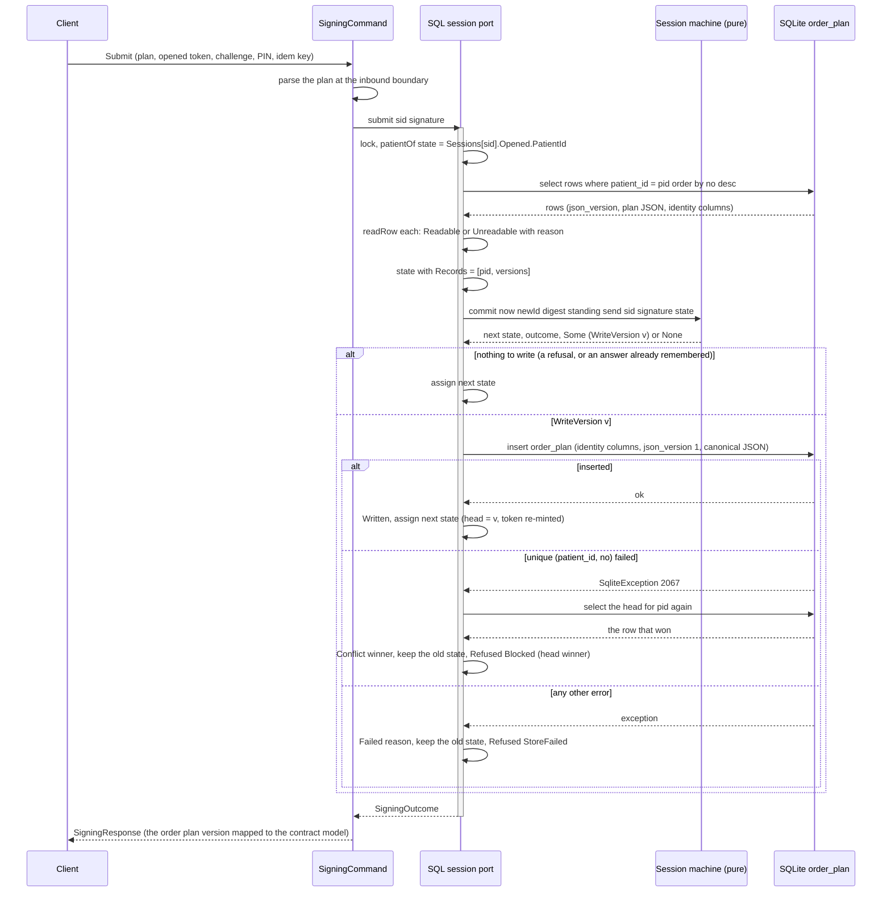
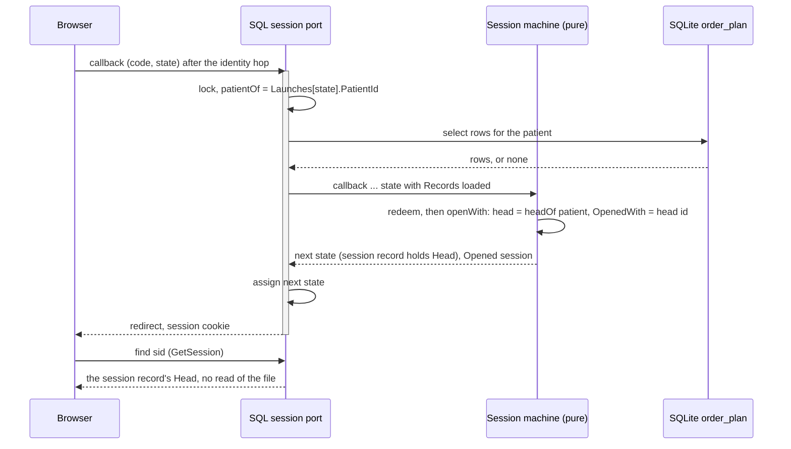

# Implementation plan for issue 516: GenPRES SessionRecord Store

## Problem description

GenPRES Server keeps no Session state between requests (Rule 32). A Session's identity and
standing live in its SessionRecord in the GenPRES Database, which is what lets more than one
server run and an upgrade drain the old instances instead of dropping their Sessions (Rule 36).
The Database is also the referee for the races the launch turns on: one open Session per User
and per browser (Rule 8), a Launch spent once (Rule 2), an ended Session that never reopens
(Rule 40).

Today the Database is a stand-in. The pure `Session` machine in
`src/Informedica.GenPRES.Server/ServerApi.Session.fs` runs the launch, the enrolment, the signing
and the session-bound compute over one `State` value, and `StubDatabase.makeSessionPort`
(`ServerApi.StubAdapters.fs`) runs it behind one lock, in memory, forgotten at restart. Plan 725
gave the machine what a store needs: the signed order plan versions as domain values
(`StoredVersion`, readable or unreadable), the write of a commit as a value (`Persist`,
`StoreOutcome`, `StubDatabase.submitWith`), the opened Session as a record (`OpenedSession`),
the ending for a row the release cannot read (`SessionEnding.Unreadable`), and the digest over
the canonical serialization of `OrderPlan.Dto`. This plan gives that machine a store.

The design is in `docs/scenarios/integration/`: [uc-01](../scenarios/integration/uc-01-launch.md)
leads the launch sequence, and the V8 document holds the rules cited here (Actor 5, Concept 9,
Rules 2, 8 to 12, 19 to 21, 32, 36, 40 to 46). For the store, this plan leads: where the V8
document or a use case disagrees with it, the plan wins and that document is aligned in step 0.

The decisions this plan rests on are in [ADR-0007](../adr/0007-session-persistence.md), as
amended in step 0, and [ADR-0008](../adr/0008-contract-model-dto-mapping-boundary.md) § 6.

## Scope

In scope:

- A table for everything in `Session.State`: launches, sessions with what they opened with and
  their heartbeats, endings and acknowledgements, credentials, confirmation codes, enrolments,
  the order plan versions, data notices, challenges, answered Submissions. The order plan
  versions are in because `commit` appends the order plan version in the same act that verifies
  the PIN and re-mints the OpenedToken; credentials, codes and enrolments are in because
  `supplyPin` sets the PIN and opens the Session in one act. Splitting any of these across a
  store and memory would split a transaction the code keeps whole. The working state (what a
  Session opened with, its notice, its challenge) is in because a restart must end nothing and
  a second server must find it (Rules 32 and 36); on the in-memory stub it stays in memory, as
  ADR-0008 § 6 says.
- Every stored order plan and patient (a challenge's reading included) as a domain Dto under
  a JSON structure version, upgraded on load (ADR-0008 invariant 5; "Stored Dtos and their
  structure version" below).
- The audit table and its writer (Rule 46), inside the same transaction as each act.
- A SQL implementation of `SessionPort` on SQLite, the test and development database.
- Versioned schema scripts, each with a migration number, and the small runner that applies
  them.
- The composition switch on `GENPRES_DB_CONNECTION`, and the rule that production refuses it.
- An integration suite against a real file, in the normal CI matrix.

Out of scope, each a follow-up issue filed in step 10:

- The production engine, the access library and the migration tooling: the ADR-0007 amendment.
- The idle and absolute lifetimes and the sweep (Rules 10, 41). `Session.touch` refreshes
  `Seen` and nothing acts on it yet.
- Anonymous opens and the Rule 14 bound. No anonymous open exists: a browser without a cookie
  has no Session.
- The audit reader.
- The signed request of uc-01 step 7.
- What production exposes (#580). Production keeps `Adapters.sessionDisabled`, the session port
  that refuses everything, until then.
- A session domain free of the contract types, so that it could move to Core.

## Approaches considered

### The engine

1. Choose the production engine now and develop on it.
2. Develop and test on SQLite, in-process; choose the production engine when production needs
   it.

Approach 2, per ADR-0007 Decision 4 as amended in step 0: SQLite is the test and development
database and stays in that role; it never serves production. Nothing in this plan depends on
the production engine, and the operations question is open. SQLite is one file, one server
process: it proves the append-only shape and the machine over it, and nothing about the
production engine's isolation.

### The port

1. Load the whole `State`, run the pure function, commit under an optimistic-concurrency
   check. Exact and simple, but every request reads every patient's record.
2. Rewrite each `Session.*` function into read, decide, write against tables. The pure machine
   and its tests (`SessionMachineTests.fs`, `StubAdapterTests.fs`) go with it.
3. The slice. Load the rows a request can touch, keyed by what the request carries, into a
   `State`; run the pure function unchanged; append what changed, in one transaction. The stub
   and the SQL adapter run the same machine, and `SessionPort` does not change shape.

Approach 3.

### The storage shape

1. Current-state rows, updated in place, with locks to decide the races.
2. Append-only rows; per key only the newest row can be open, and it is unless an ending names
   it; the ordering decides the races.

Actor 5 and Rule 40 as amended on 2026-09-09 say 2. An earlier draft of this plan said 1 and
argued that Rule 8's two keys and the first open with no predecessor needed locks; the amended
rule answers both: newest by id per key, a first opening needs no predecessor.

### The order of building

1. The earlier order of this plan: the launch and session tables and their slice first, the
   record's write last.
2. Record first: the `order_plan` table and the write behind `submitWith` first, the identity
   tables and the session slice after.

Approach 2, decided 2026-09-17:

- The write path exists and is tested: `Session.commit` returns the write as a value,
  `StubDatabase.submitWith` maps `Written | Conflict | Failed`, and `SessionStoreTests.fs`
  covers Failed, Conflict, the unreadable head and crash-after-write with a fake `persist`. The
  SQL record is a real `persist` plus a loader for one table.
- The session slice carries the one question the record did not, the keying of `callback`
  (decision 1, `callback` split into redeem and open). Record first meets it after the
  migration runner, the store, the fixture, the temp-file test discipline and the composition
  switch exist.
- A visible result early: with the key set, a restart of `dotnet run` keeps the record and a
  relaunch opens on the stored head.

Limit until step 6: sessions, launches, credentials, codes, enrolments, notices and challenges
stay in memory as on the stub; a restart still ends every Session. Rule 32 (a server restart
ends nothing) holds for the record only.

## Chosen approach

The slice over append-only tables, on SQLite, in the Server project next to the stub, the record
first.

### What a request loads and what it appends

Each `SessionPort` member loads a `State` holding only the rows its request can touch, keyed by
what the request carries: the nonce or the `state` of a Launch, the session id from the cookie
and that Session's login, the user id of a credential, the patient id of a record, the
idempotency key of a Submission. The pure function runs over that `State` as it runs over the
stub's, and returns, next to the new `State` and its answer, the writes it decided as values:
one `Persist` case per fact, as `commit` already returns `WriteVersion` for an order plan
version. The adapter runs those writes and nothing else; it never derives rows by comparing the
`State` before and after. The stub runs no writes, since its `State` in memory already holds
them. From step 6, one transaction per member; SQLite serializes writers by construction, and the production engine
runs the write serializable with one retry (Rule 42). Before step 6 there is no transaction
around a request: the load and the insert are separate calls on separate connections, ordered
by the port's lock.

| `State` field | Tables | The slice reads | An append is |
| ------------- | ------ | --------------- | ------------ |
| `Launches` | `launch_record`, `launch_outcome` | the record by nonce or by `state`, with its outcome | the record at the first presentation; the outcome once, at the callback |
| `Sessions` | `session`, `session_opened_with`, `session_seen` | the row by session id, the newest row for its login, the newest opened-with (its patient a `Patient.Dto` upgraded and parsed at load), the newest heartbeat | a session at an open; an opened-with at an open, at `openVersion` and at a commit; a heartbeat at every `touch` |
| `Endings` | `session_ending`, `session_acknowledged`, and `session` itself | a session row whose login has a newer session row is `SupersededByLaunch` at that row's `opened_at`, whatever became of the newer row; the newest row for the login is open unless an ending names it; `wrong-pin-limit` is a row; an acknowledged ending is hidden; a `closed` row loads as no Session at all | `wrong-pin-limit` at the third wrong PIN; `closed` at `close`, with the acknowledgement; `unreadable` when the Session's opened-with or notice row cannot be read |
| `Credentials` | `credential_event` | the newest event for the user id | an event at every change: PIN set, wrong entry, lock, right entry |
| `Codes` | `confirmation_code`, `code_try`, `code_spent` | the newest code for the user id, with its tries counted; absent when that code is spent or expired, never an older code in its place | a code when mailed; a try per wrong code; spent when the PIN is set, the tries run out, or the last attempt is dropped |
| `Enrolments` | `enrolment`, `enrolment_dropped` | the attempt by id, then the user id it names, then every undropped attempt and the code of that user | an attempt when the launch suspends; dropped at `dropEnrolment`; all of a user's attempts dropped when the PIN is set or the code is void |
| `Records` | `order_plan` | every order plan version for the patient id, newest first by `no`, each upgraded from its `json_version` and parsed with `fromDto` as it loads; an unreadable row is kept as an unreadable entry (ADR-0008 § 6) | an order plan version at a commit, through `Persist` only, in the request's transaction from step 6; a violated `unique (patient_id, no)` is another server's sign, answered as a stale sign, the head changed |
| `Notices`, `Challenges` | `data_notice`, `challenge`, `challenge_spent` | the newest row for the session id; absent when that row is expired or spent, never an older row in its place; a notice's patient is a `Patient.Dto` upgraded and parsed at load, a challenge holds the digest, not the order plan | a row when issued; a newer row replaces; spent at a commit or an `openVersion` |
| `Answered` | `submission_answer` | the row for the session id and the idempotency key | the answer, once, refusals included (Rule 45) |
| the audit | `audit_entry` | nothing | one entry per act, in the same transaction |

Until step 6 only the `Records` row of this table is live: `SqlDatabase.store` loads the
patient's `order_plan` rows into `Records` before the pure function runs and writes the one row
`commit` asks for; everything else stays in the in-memory `State` behind the lock, as on the
stub. From step 6 the loader takes over the other rows one field at a time, each step naming
which.

Supersession is the one ending with no row of its own. That is Rule 40 as the design states it:
the ordering of the `session` table decides which Session of a login stands, and the loser is
told at its next request because the loader reads its ending off the newer row. The order of the
two reads matters: the loader takes the newest row for the login first and only then asks
whether an ending names it. It never filters ended rows before choosing the newest, since that
would surface a superseded row again once the newer one is closed. A row with a newer row for
its login is superseded whatever became of that newer row. The stub's `close`, which removes
both the Session and its ending, becomes two rows the loader hides.

The slice of an enrolment is wider than its attempt. `dropEnrolment` spends the shared code only
when no other attempt of the user stands, and `supplyPin` drops every attempt bound to the code,
so both load the attempt, then every undropped attempt and the code of the user it names. Two
suspended launches of one User therefore behave as they do on the stub: dropping one leaves the
code to the other, and setting the PIN in one ends both.

Nothing is deleted. Every table is append-only, the short-lived rows included: a launch record
and its outcome, heartbeats, data notices, challenges, answered Submissions, codes and their
tries stay after their lifetime. A lifetime is read at load, never enforced by removing rows: a
launch record past its Launch's expiry, a notice or a challenge past two minutes, an answer past
the challenge lifetime, a spent code, load as absent; only the newest heartbeat of a Session is
read. The order is the one the session rows follow: the loader takes the newest row for its key
first and only then reads its lifetime or its spent mark. It never filters expired or spent rows
before choosing the newest, since that would bring back an older notice, challenge or code the
newest one replaced, as the in-memory machine never does. The tables grow with use, which a test and development database accepts; a developer
starts fresh by deleting the database file, which the next start creates again.

### Writes as values

Each `Session` member returns `State * 'answer * Persist list`. `Persist` is the one type of
write, extended per step with one case per fact the tables record:

| Step | `Persist` cases added | Tables |
|---|---|---|
| 3 | `WriteVersion` (exists) | `order_plan` |
| 6 | `RecordLaunch`, `RecordLaunchOutcome`, `OpenSession`, `RecordOpenedWith`, `RecordSeen`, `EndSession`, `AcknowledgeEnding` | the launch and session tables |
| 7 | `AppendCredentialEvent`, `IssueCode`, `RecordCodeTry`, `SpendCode`, `StartEnrolment`, `DropEnrolment` | the credential, code and enrolment tables |
| 8 | `IssueNotice`, `IssueChallenge`, `SpendChallenge`, `RememberAnswer` | the notice, challenge and answer tables |
| 9 | `AppendAudit` | `audit_entry` |

`commit` returns `Persist option` today; step 6 turns it into `Persist list` for every member,
and `StubDatabase.submitWith` into a runner for a list. The whole list runs in one transaction,
and the new `State` is assigned only when every write and the commit of the transaction
succeeded. Any failure rolls the transaction back, keeps the old `State`, and answers the member's
store failure: for `submit`, a violated `unique (patient_id, no)` is `Conflict` and answered as a
stale sign, any other failure `StoreFailed`; for `challenge`, `StoreFailed`; for a member with no
refusal to give, the call fails (decision 6). A list without an order plan version follows
the same rule. A member writes exactly what it returns: a test per member
asserts the rows a request appends equal the writes it returned, and a sign appends exactly one
`order_plan` row. The machine's own `dropExpired` keeps pruning the in-memory `State`; that is
memory, not the store.

### Config and wiring

`GENPRES_DB_CONNECTION` is the one switch. Set, `Adapters.makeAppEnvWith` receives it as a
parameter (`store: string option`, next to `demo`), applies the migrations and wires the SQL
adapter with the same arguments it gives the stub: the ten dependencies of
`StubDatabase.makeSessionPort` (the clock, the id, code and salt generators, the code mac, the
seal verification, the IdentityProvider, UserRegistry, PatientDataPlatform and MailService
ports) and the initial state. Unset, it wires `StubDatabase` as today.
`Adapters.makeAppEnv`, which tests and the MCP host build, passes `None`: no production caller
other than `Server.fs` opens the database; the SQL tests open temporary files of their own.

The value is a SQLite connection string. A relative `Data Source` is rooted at
`AppPath.rootPath ()`, the root the server already resolves for `data/cache`: `GENPRES_ROOT`
when set (`/app` in the image, set by the Dockerfile), else the folder holding `.env` (the repo
root in a checkout); the `.env.example` line says so. The default file is
`data/db/genpres.db`, in the folder the container mounts (step 4b), which the opt-in
`.gitignore` leaves untracked; nothing is added for it.

Production refuses SQLite. With `GENPRES_PROD=1` and `GENPRES_DB_CONNECTION` set, the server
refuses to start with a message naming the setting, in `Config.validateStartup`, the way a short
production password is refused. The guard refuses the key itself, not SQLite as such, and is
temporary: it stands until #580, when the production engine, which will likely read the same
key, replaces it with that engine's rule. Until then production keeps
`Adapters.sessionDisabled`; what production's store is, and the fail-closed rule that production
requires one, land with #580.

`StubCredentials.seed` gives four logins a credential so that the walkthrough in DEVELOPMENT.md
works: `prescriber`, `prescriber-b` and `prescriber-other-patient` with the PIN 1234, and
`no-pin` with none, so that it enrols; a Reader has no credential. The SQL store gets the same
seed when `GENPRES_PROD=0` (decided 2026-09-17), so a demo on SQLite behaves as the demo on the
stub, with Sessions that survive a restart once step 6 is in. Credentials are append-only
events, so the seed writes a login's credential only when that login has no credential event
yet: a restart adds no rows and never resets a PIN the user changed.

### Placement

The adapter is `ServerApi.SqlAdapters.fs` next to `ServerApi.StubAdapters.fs`, in the
Presentation ring, which may read the setting and may reference the contract. The `.sql` scripts
are embedded resources of the Server project under `Sql/`. No new project: see ADR-0007
Decision 3.

### Connections and files

One `SqliteConnection` per call, `use`d; Microsoft.Data.Sqlite pools connections, and the port's
lock already serializes writers in the one server process. The default rollback journal, not
WAL: one server process, one lock, and no `-wal`/`-shm` files to clean on three OSes. Tests
append `Pooling=False` so a temporary file can be deleted on Windows. The SQLite native library
package (`SQLitePCLRaw.bundle_e_sqlite3`, transitive) ships in the Docker image, since the test
and development engine stays; production never opens it.

### Prototypes

New F# is prototyped in `src/Informedica.GenPRES.Server/Scripts/` first, in the shape of
`Scripts/Signing.fsx`: `#I __SOURCE_DIRECTORY__`, `#r "nuget: Expecto, 10.2.3"`,
`#load "load.fsx"`, modules shadowing the source, Expecto tests inline. `Scripts/load.fsx`
`#load`s every server source file in compile order, so once `ServerApi.SqlAdapters.fs` exists
`load.fsx` itself carries `#r "nuget: Microsoft.Data.Sqlite"`; otherwise every existing script
(`Signing.fsx`, `Launch.fsx`, `Enrolment.fsx` and the rest) stops compiling.
`scripts/load-dependencies.fsx` stays as it is.

## This plan leads the other documents

Step 0 amends ADR-0007 § 4; this plan follows the amended ADR and leads every other document
that describes the store, the integration design included. Where the V8 document, a use case,
plan 725, the roadmap documents or a code comment say something else about the store, the plan
wins and that document is aligned in step 0, the first PR.

| Document | Aligned in step 0 |
|---|---|
| `docs/scenarios/integration/GenPRES-MainEHR-Integration-V8.md` | Actor 5's "what may be forgotten (an old idle heartbeat) is dropped whole" removed: nothing is dropped; every rule and concept on the store (Actor 5, Concept 9, Rules 2, 8 to 12, 19 to 21, 32, 36, 40 to 46) checked against this plan; where a rule says otherwise (the store's engine, the order of building, what survives a restart before step 6), the rule is aligned to the plan |
| `docs/scenarios/integration/uc-01-launch.md`, `uc-03-prescribe-and-sign.md`, `uc-04-two-users.md` | the steps and extensions on the store aligned to this plan (uc-01: after the lifetime the LaunchRecord loads as absent instead of being dropped); the stand-ins table and the "Not built" lists, which describe running behaviour, change with the step that makes them false (4b, 6, 8, 9) |
| `docs/adr/0007-session-persistence.md` | § 2 amended: nothing is dropped, lifetimes are read at load; § 4 amended: SQLite is the test and development database, not an interim; the acceptance schedule in the status line (§ 1 and § 4 at step 4b, § 2 at step 6, § 3 accepted already); every "plan 516 step N" on this plan's numbering |
| `docs/adr/0008-contract-model-dto-mapping-boundary.md` | § 6 "dropped whole after their lifetime" becomes "kept, loading as absent after their lifetime"; the plan 516 references checked against this plan's steps and the `order_plan` schema; the vocabulary table gains the **migration number** next to the order plan version and the JSON structure version |
| `docs/implementation-plans/725-contract-model-dto-domain-flow.md` | the gate sentences on this plan's numbering: `order_plan` and the first fixture are steps 2–3, `session_opened_with` is step 6, `challenge` and `data_notice` are step 8; the vocabulary table gains the migration number |
| `docs/roadmap/mvpap2019-gap-overview.md` | decision D2 and the rows that cite #516: the test and development database, not an interim; the rows point at this plan's steps |
| `docs/roadmap/feature-patient-persistence.md` § 5, `docs/roadmap/backlog.md` (storage backends) | "left open" becomes: decided by ADR-0007 and this plan for test and development; the production engine remains open |
| `scripts/CheckDependencyRule.fsx` | the two `contractAllowances` reasons for `ServerApi.Adapters.fs` and `ServerApi.StubAdapters.fs`, which still say "until plan 725 Phase 5": the session identity types (`UserContext`, `OpenedToken`, the refusals and endings) stay contract by ADR-0008 R6 and ADR-0007 § 3; a contract-free session domain is its own issue |
| comments in `GenORDER.Lib/OrderPlan.fs` (`OrderPlanVersion.Dto`), `ServerApi.Session.fs`, `ServerApi.Ports.fs` | checked: "the database keeps the structure version beside the row", nothing about an interim |
| `DEVELOPMENT.md` | **not** in step 0: it describes running behaviour and changes with the step that makes it false (4b, 6, 8, 9) |

## Schema

SQLite, kept to the portable core: an integer id the engine generates, `TEXT` for JSON, Unix
milliseconds for time. The production engine's amendment reviews what its script differs in
(id generation, a JSON type, timestamps). The runner creates `schema_version` before it reads
it, so no migration contains that table. Migration 1 is `order_plan` (step 2); migration 2 the launch and session tables (step 6); migration 3 the credential, code
and enrolment tables (step 7); migration 4 the notice, challenge and answer tables (step 8);
migration 5 `audit_entry` (step 9). The tables named in the loader table above and not listed
here follow the same rules, with the keys the table names.

```sql
-- Created by the runner, not by a migration. The migrations applied, one row each, in order.
create table if not exists schema_version (
    migration  integer primary key,       -- the migration number
    applied_at integer not null           -- unix ms
);

-- Concept 12. The clinical store: every order plan version, never changed. The identity
-- columns are authoritative and let an unreadable row keep its place (ADR-0008 section 6);
-- the order plan itself, the patient it was signed on included, is the JSON Dto of the
-- domain's OrderPlanVersion, under the structure version it was written with. signed_at
-- holds Unix milliseconds; the JSON holds the DateTime's full ticks. A readable entry takes
-- every value from the JSON, the columns serve the unreadable entry. Loading orders by no.
create table order_plan (
    id                     integer primary key,
    version_id             text not null unique,
    no                     integer not null,
    patient_id             text not null,
    base                   text null,     -- the version_id it was built on
    signed_by_user_id      text not null,
    signed_by_display_name text not null,
    signed_at              integer not null,
    verified               integer not null, -- 0 | 1: the platform's reading at the challenge
    json_version           integer not null, -- the JSON structure version of plan
    plan                   text not null,    -- json: OrderPlanVersion.Dto (GenORDER)
    unique (patient_id, no)                  -- also the index for loading by patient
);

-- Rule 2, uc-01 steps 4.2 and 5.7. One row per Launch, written before the identity hop;
-- the outcome is a second row, written once. Both stay; past the expiry they load as absent.
create table launch_record (
    nonce       text primary key,
    state       text not null unique,   -- the callback finds the record by it
    patient_id  text not null,
    public_key  text not null,          -- the browser's JWK; a repeat with it is a replay
    expiry      integer not null        -- the Launch's own
);

create table launch_outcome (
    nonce       text primary key references launch_record (nonce),
    outcome     text not null,          -- opened | refused:<word> | enrolling
    session_id  text null,
    attempt     text null,
    at          integer not null
);

-- Concept 9. One row per open, never changed. Only the newest row for a login can be its
-- open Session, and it is unless an ending names it (Rule 40): newest by id, never by a
-- clock, chosen before the ending is read.
create table session (
    id             integer primary key,  -- the engine's monotonic id
    session_id     text not null unique,
    login          text null,
    user_id        text null,
    user_display   text null,
    user_role      text null,
    patient_id     text null,
    key_thumbprint text null,            -- uc-01 step 5.7; step 7 verifies against it
    opened_at      integer not null
);
create index ix_session_login on session (login, id);

-- What the Session opened with (Rule 19) and the token that names it (Rule 34): written at
-- the open, at openVersion and at a commit. The newest row counts. version_id is what the
-- Session opened with, a readable order plan version only; head_id is the head it saw,
-- whatever its case: an open on an unreadable head opens from nothing (version_id null)
-- and still holds that head (head_id set). Both name order_plan rows, from which the
-- loader rebuilds OpenedSession.Head. The patient is the JSON Dto of the GenFORM Patient
-- under its structure version, null when the Session opened on no data; a row the release
-- cannot read ends the Session at its next request.
create table session_opened_with (
    id           integer primary key,
    session_id   text not null references session (session_id),
    version_id   text null,              -- null: from nothing
    head_id      text null,              -- null: the patient had no order plan version
    opened_token text null,              -- null: a Session without one
    json_version integer null,           -- the JSON structure version of patient
    patient      text null,              -- json: Patient.Dto, the data the Session shows
    at           integer not null,
    check ((patient is null) = (json_version is null))
);

-- Rule 9. Heartbeats, one row per request. All stay; the loader reads the newest.
create table session_seen (
    id         integer primary key,
    session_id text not null references session (session_id),
    at         integer not null
);

-- Rule 10. The endings that are acts. Supersession is not a row: it is read off a newer
-- session row for the same login.
create table session_ending (
    session_id text primary key references session (session_id),
    ending     text not null,            -- closed | wrong-pin-limit | unreadable
    at         integer not null
);

-- Rule 11. The User acknowledged the ending (CloseSession); it is never told again.
create table session_acknowledged (
    session_id text primary key references session (session_id),
    at         integer not null
);

-- Rule 46. What was done, by whom, to which Session, in the same transaction as the act.
create table audit_entry (
    id         integer primary key,
    at         integer not null,
    session_id text null,
    actor      text null,                -- user_id; null when unknown
    action     text not null,            -- launched | opened | refused | signed | pin-set | ...
    outcome    text not null,            -- ok | refused
    detail     text null                 -- json
);
```

No updatable state column, no partial unique index, no lock table, no `UPDATE` anywhere.

## Stored Dtos and their structure version

What ADR-0008 invariant 5 and § 6 decide, as this plan applies it to `order_plan`:

- **What a row holds.** `plan` is the JSON of `OrderPlanVersion.Dto`, `toDto` of the domain
  value `commit` returns, never the contract model the client sent; the patient travels inside
  it. `json_version` is the JSON structure version it was written under and never changes.
  `OrderPlanVersion.Dto` itself carries no structure version: the column beside the row does.
- **The serializer** and its settings are part of the JSON structure. `Canonical.serialize`
  produces the canonical form the signing digest is computed over: fields in declared order,
  arrays as the Dto holds them, `BigRational` as `numerator/denominator` in lowest terms, an
  option as its value or null, no whitespace; two order plans equal as domain values serialize
  equal. The digest is SHA-256 over the UTF-8 bytes of the canonical serialization of
  `OrderPlan.Dto`, the plan alone, never over the stored `OrderPlanVersion.Dto` around it, whose
  id, number, signer and time are minted at the commit and cannot be part of what the challenge
  was issued over; `StubDatabase.digest` computes it, and the SQL adapter uses the same function.
- **Loading.** A request loads the rows of its patient, never every row at startup: a second
  server would not see an order plan version signed after it started. The adapter upgrades
  `plan` from `json_version` to the current structure with one pure function per step, on raw
  JSON, and parses it with `fromDto`; `Session.State.Records` holds the result as domain values.
  A row it cannot load, because `json_version` is newer than the release knows, an upgrade step
  fails, `fromDto` refuses it, or the JSON's identity disagrees with the columns, is kept as an
  unreadable entry built from the identity columns and the reason, and logged. The head of a
  patient is the newest entry whatever its case; a sign is refused while the head is unreadable.
- **Writing.** `commit` returns the write as a value; `StubDatabase.submitWith` runs it through
  the store's `persist`, which inserts the row with the current `json_version`, and assigns the
  new state only if the insert succeeded. Until step 6 the load and the insert are two calls on
  two connections under the port's lock, not one transaction; from step 6 each member runs in
  one transaction. A `SqliteException` with extended code 2067 whose message names
  `order_plan.patient_id, order_plan.no` is another server's sign of the same number: the head
  is re-read and the sign is answered as a stale sign (`SigningRefusal.Blocked` naming the
  head), not as `StoreFailed`. Any other exception, other constraint failures included, is
  `StoreFailed`, with the state unchanged so that the next Submission is the retry.
- **Where the constraint is reached.** Only when two server processes interleave: both load
  the same head, both sign, the second insert fails. Within one process, and for a retry after
  a crash between the insert and the reply, the load already holds the newer row, so
  `commit`'s `blockedBy` refuses the sign as stale before anything is written (the existing
  test "after a crash between the write and the reply the row is the head" in
  `SessionStoreTests.fs`). A load that throws (a locked or missing file) leaves the state as it
  was, since the lock's body assigns nothing, and is logged. `challenge` and `submit` answer
  `SigningRefusal.StoreFailed`, as a failed write does, so the prescriber can retry; every other
  member that loads (`callback`, `supplyPin`, `openVersion`, `seen`) fails the call, so no
  Session opens or switches without the head (decision 6).
- **The working state** follows the same rule in its own tables: `session_opened_with.patient`
  and `data_notice`'s patient are `Patient.Dto` JSON under a `json_version`, upgraded and parsed
  at load; a challenge stores the digest, the nonce, the expiry and its reading, never the order
  plan. These rows matter for minutes to a Session's length and then load as absent, so a row
  the release cannot read is not kept as an unreadable entry: an opened-with or a notice it cannot
  read ends the Session with `SessionEnding.Unreadable`, appended as a `session_ending` row
  (`unreadable`) and told at the next request; a challenge it cannot read is refused.
- **Every JSON structure change.**
  - It comes with four artefacts: a new `json_version`, an upgrade step, a downgrade step, and a
    stored fixture at the new structure version. A stored fixture is never regenerated: it is
    what a release wrote under its structure version, and every later release must still read
    it; the old files stay. Rows are never rewritten.
  - It ships as expand, then contract, because a release cannot read a row written under a
    newer `json_version` and an upgrade drains the old servers (Rule 36). Release N+1 reads the
    new structure but still writes the old: it serializes the current Dto and applies the
    raw-JSON downgrade step before the insert under `json_version` N. Release N+2 writes the new
    once no release N server is left, and drops the downgrade step. A value the old structure
    cannot hold is not written before N+2. The adapter holds the two as build constants,
    `jsonVersionRead` and `jsonVersionWritten`.
  - The tests, one per build constant, so that release N+1 passes them. L5, for every stored
    fixture: upgraded to `jsonVersionRead` it parses (law L5 of plan 725). The read snapshot,
    on the fixture for `jsonVersionRead`: deserialize, `fromDto`, `toDto`, serialize gives the
    fixture text back. The write snapshot, on the fixture for `jsonVersionWritten`: upgraded
    and parsed, then written as the release writes (`toDto`, serialize, the downgrade steps down
    to `jsonVersionWritten`), gives the fixture text back. Until the first structure change the
    two fixtures are the same file. And `upgrade (downgrade (toDto x))` parses back to `x` for
    what the release writes.
  - Rollback: no server meets a row it cannot read during a drain, and a rollback by one release
    is safe; by more than one it is not supported once rows of the newer structure exist.

## The storage flow

One request under the port's lock, after step 4b: the record slice loaded, the pure machine run,
the write applied, the state assigned only when the write landed.





## The races, walked through

Each race is proven on SQLite for the logic of the slice and the appends. The production engine
re-proves it for its own isolation, with the same tests.

**Two launches of the same User, two Launches (uc-01 ext 8b).** Both nonces are unspent, so
both run the whole pipeline. Each loads the newest session row for the login, finds either
nothing or the other's row, and appends its own. Whichever row has the higher id stands. Both
browsers are told a Session opened; the loser learns at its next request, because the loader
reads its ending off the newer row. No lock decided this and no row was rewritten. Two first
launches resolve the same way: neither has a predecessor and neither needs one.

**The same Launch presented twice.** The first presentation appends the `launch_record`. A
repeat from the same public key within the lifetime is answered from the record and its outcome,
exactly as the first time (Rule 2's replay clause, Rule 45). A presentation with another key, or
none, is refused as spent. A reloaded callback within the lifetime is answered from
`launch_outcome`. After the expiry both rows are gone and the Launch is expired.

**A commit against a superseding open (Rule 42).** The commit loads the Session, the credential,
the challenge and the record; a concurrent open for the same login appends a newer session row.
On the production engine the two run serializable and one is retried once; the retried commit
reloads, reads its ending off the newer row, and refuses with `NoSession`. On SQLite the writer
lock orders them and the outcome is the same.

**Two signs of the same number.** Two server processes load the same head for a patient and
both sign: the second insert violates `unique (patient_id, no)`, the adapter re-reads the head
and refuses the sign as stale, naming the head; `openVersion` then opens the row that won. The
mapping is proven on the file in step 3, the race through two port instances, made certain by a
barrier before the insert, in step 4a. A crash between the insert and the reply is a
different case: the retry's load already holds the written row, so `commit` refuses the sign
as stale before any insert; proven through the port in step 4a.

**An ended Session cannot reopen.** There is no row whose insertion makes an ended Session open
again: `session` is written once per open, and an ending, a newer row for the login or a
`wrong-pin-limit` row, is never removed. Closing the newest Session of a login does not hand the
login back to an older one either: the older row still has a newer row above it, so it stays
superseded, and the login has no open Session until the next open appends a row.

## Steps

Each step is one PR of 200 changed source lines or fewer, counted as CONTRIBUTING.md counts
them: the shipped code under `src/` (F#, SQL, project files); tests, prototype scripts,
documentation and lock files do not count. A step with new F# source is a
prototype-script PR (`chore(server)`; the review bot, Greptile, is not run on script-only PRs)
followed by a "migrate" PR from master that lands the source and removes the script
(`feat(server)`, with a changelog block in the commit body). A docs, build or test-only step is
one PR, no prototype first. Step 4b is wiring only, a parameter threaded from `Config` to
`makeAppEnvWith`, and goes as one PR without a prototype. Every PR gets an As-built row here and
an entry in `.claude/docs/session-log.md`; every step runs `dotnet run Build`,
`dotnet test tests/Informedica.GenPRES.Server.Tests/`,
`dotnet fsi scripts/CheckDependencyRule.fsx` and Fantomas on the touched files.

### Step 0 — docs: this plan and the aligned documents

`docs`. This text as `docs/implementation-plans/516-sessionrecord-store.md`; ADR-0007 § 4
amended and its status line; the other documents of the table under "This plan leads the other
documents"; as 0a (the plan and the ADR) and 0b (the rest), to keep each review to one kind of
change; documentation does not count toward the source line limit. Closed by a
grep over `docs/` and the server comments for "interim", "516 step", "plan 516", "schema
version" and "SQLite".

### Step 1 — build: Paket, the key, the opt-in entries

`build`, no source lines apart from the Server's `paket.references`.

- `paket.dependencies` Main group: `nuget Microsoft.Data.Sqlite` (10.x for net10.0);
  `paket.lock`; `src/Informedica.GenPRES.Server/paket.references`. The test project gets it
  through its project reference and names `SqliteConnection` and `SqliteException` from there,
  as it already names `Unquote` and `IcedTasks` from the libraries. It is not added to the test
  project's `paket.references`: that file lists the `Test` group only, and a package listed in
  two groups is emitted twice and warns NU1504/NU1506 (DEVELOPMENT.md, "Paket groups"). The step
  proves the transitive reference by compiling one test that opens a connection.
- `.env.example`: `# GENPRES_DB_CONNECTION=Data Source=data/db/genpres.db`, commented, with the
  root sentence of "Config and wiring", marked as not read yet: nothing reads the key before
  step 4b. The same path serves `dotnet run` and the container mount of step 4b.
- `.gitignore`: `!/src/Informedica.GenPRES.Server/Sql/`,
  `!/src/Informedica.GenPRES.Server/Sql/*.sql`,
  `!/tests/Informedica.GenPRES.Server.Tests/fixtures/`,
  `!/tests/Informedica.GenPRES.Server.Tests/fixtures/*.json`.

Proves: restore and build on the three CI OSes with the native library package.

### Step 2 — feat(server): the migration runner and migration 1

Prototype `Scripts/SqlSchema.fsx`.

- Source: new `ServerApi.SqlAdapters.fs`, module `SqlSchema` (~50 lines), compile item between
  `ServerApi.StubAdapters.fs` and `ServerApi.Adapters.fs`; `Sql/001-order-plan.sql`
  (`order_plan` as in the schema); fsproj
  `<EmbeddedResource Include="Sql\*.sql" LogicalName="Sql/%(Filename)%(Extension)" />`;
  `Scripts/load.fsx` gains `#r "nuget: Microsoft.Data.Sqlite"` and the `#load` of the new file.
- `SqlSchema.apply cs`: the manifest resource names with the `Sql/` prefix, sorted ordinal, the
  leading integer as the migration number; `create table if not exists schema_version`; `select
  max(migration)`; for each script above it one transaction: the script as one `SqliteCommand`
  (Microsoft.Data.Sqlite runs every statement of a `CommandText`), then the `schema_version`
  row. Replaceable by a tool at the production engine's amendment without touching the scripts.
- Tests, new `SqlSchemaTests.fs` (compile item after `SessionStoreTests.fs`, before
  `AgreementTests.fs`), which also holds the `withDb` helper the later SQL test files use: a
  temporary file `Path.Combine(Path.GetTempPath(), $"genpres-{Guid.NewGuid()}.db")` with
  `Pooling=False`, `SqlSchema.apply` on it, deleted in `finally`. A fresh file gets
  migration number 1 and the table; a second `apply` applies nothing; a duplicate `(patient_id,
  no)` raises `SqliteException` with `SqliteErrorCode = 19`, `SqliteExtendedErrorCode = 2067` and
  a message naming `order_plan.patient_id, order_plan.no`; the file is deleted after.
- No `Shared.` in the new file, so no fitness-test allowance; `GENPRES_DB_CONNECTION` may be
  named in the Server, which is in the DMZ.

### Step 3 — feat(server): the record and the first stored fixture

Prototype `Scripts/SqlRecord.fsx`. The migrate PR stays within the source line limit (about 90
source lines); the fixture and the tests do not count.

- Source: `SqlAdapters.fs`, module `SqlDatabase` (~90 lines): `jsonVersionWritten = 1`,
  `jsonVersionRead = 1`; `upgrade : int -> string -> Result<string, string>` (identity at 1;
  above `jsonVersionRead`, `Error "JSON structure version n is newer than this release knows"`);
  `readRow` (columns and JSON → `StoredVersion`); `loadRecords : string -> string ->
  StoredVersion list` (connection string, patient id, `order by no desc`); `persist : string ->
  Session.Persist -> Session.StoreOutcome` as "Writing" above (`base` as `DBNull` for `None`,
  `signed_at` via `DateTimeOffset(v.SignedAt, TimeSpan.Zero).ToUnixTimeMilliseconds()`, `plan`
  = `Canonical.serialize (OrderPlanVersion.Dto.toDto v)`).
- Fixture `tests/Informedica.GenPRES.Server.Tests/fixtures/order_plan_v1.json`: the canonical
  JSON of `OrderPlanVersion.Dto.toDto` of `versionOf 1 prescriber t0 domainPlan.Value` (the
  builders of `SessionStoreTests.fs`), produced once by the prototype, committed, fsproj
  `Content` copied to output, read from `AppContext.BaseDirectory`. The fixture tests never
  compare against a value built from those builders or from `Scenarios.fs`: a change to a test
  scenario is not a change of the JSON structure and must not break them.
- Tests, `SqlRecordTests.fs`:
  - `loadRecords` after `persist v` = `[Readable v]` on the real file;
  - a second `persist` with the same `no` → `Conflict` of the row that won, re-read;
  - a second `persist` with the same `version_id` and a new `no` → `Failed`, not `Conflict`
    (pins the message match);
  - `persist` against `Mode=ReadOnly` → `Failed` with the reason;
  - three unreadable rows inserted by SQL (`json_version` 9; JSON `Id` ≠ `version_id`; a plan
    `fromDto` refuses, the bogus unit of the existing unreadable tests) each load as
    `Unreadable`, and the newest stays the head;
  - L5: `text |> upgrade 1 |> Result.map (Canonical.deserialize<OrderPlanVersion.Dto.Dto> >>
    OrderPlanVersion.Dto.fromDto)` is `Ok (Ok _)`, with the id `plan-1` and the number 1;
  - the read snapshot and the write snapshot of "Every JSON structure change", both over
    `order_plan_v1.json`, since `jsonVersionRead` and `jsonVersionWritten` are both 1: a field
    added, removed or renamed in the Dto fails them while the structure version stays 1.

### Step 4a — feat(server): the port over the store, the stub generalised

Prototype `Scripts/SqlPort.fsx`.

- Source, `StubAdapters.fs` (~35 changed lines): `type RecordStore = { load: string ->
  Session.State -> Session.State; persist: Session.Persist -> Session.StoreOutcome }`;
  `inMemory = { load = fun _ s -> s; persist = persistNothing }`; `makeSessionPortWith (store:
  RecordStore) now newId ... initial` = today's body with `update` taking a `patientOf:
  Session.State -> string option` and running `store.load pid` before the step, and `submit`
  passing `store.persist` to `submitWith`; `makeSessionPort = makeSessionPortWith inMemory`, so
  the existing call sites (`Adapters.makeAppEnvWith`, the two in `StubAdapterTests.fs`) do not
  change.
- Which members load the record:

  | Member | Patient id from | Loads |
  |---|---|---|
  | `callback` (opens through `openWith`, reads `headOf`) | the launch record found by `cb.State` in `state.Launches` | yes |
  | `supplyPin` (opens too) | `state.Enrolments[attempt].PatientId` | yes |
  | `openVersion`, `seen`, `challenge`, `submit` (`headOf`, `blockedBy`, `unreadableHead`) | `state.Sessions[sid].Opened.PatientId` | yes |
  | `find` (answers the head held on the session record since the open), `present`, `close`, `findEnrolment`, `dropEnrolment` | none | no |

  `Records` holds the patient of the last request that loaded, replaced on every load; a
  request that loads nothing leaves it unchanged.
- A load that throws (decision 6): `challenge` and `submit` catch it inside the lock and answer
  `SigningOutcome.Refused SigningRefusal.StoreFailed`, the state unchanged; `callback`,
  `supplyPin`, `openVersion` and `seen` let it propagate, so the call fails. `SqlDatabase.store`
  takes `warn: string -> unit`, which `makeAppEnvWith` builds from the server's logger (step
  4b), and warns once per failed load, then rethrows, and once per unreadable row it loads.
- Source, `SqlAdapters.fs`: `SqlDatabase.store (warn: string -> unit) cs = { load = fun pid s ->
  { s with Records = Map.ofList [ pid, loadRecords cs pid ] }; persist = persist cs }`, the
  load wrapped to warn on a throw and on every unreadable entry;
  `SqlDatabase.makeSessionPort warn cs = StubDatabase.makeSessionPortWith (store warn cs)`;
  `SqlDatabase.connectionString` rooting a relative `DataSource` at `AppPath.rootPath ()`
  through `SqliteConnectionStringBuilder`, and creating the file's parent directory when it is
  missing (`Directory.CreateDirectory`), since the repository has no `data/db` and SQLite does
  not create folders. The migration runner receives the resulting connection string, so the
  first `dotnet run` with the key set creates `data/db/genpres.db` from nothing. Test: a
  connection string pointing into a directory that does not exist yet opens, and the directory
  exists after.
- Tests, `SqlAdapterTests.fs` (compile item after `SqlRecordTests.fs`), with the `withDb` helper
  of step 2: sign through the port; a second port over the same file (the restart); relaunch →
  `OpenedSession.Head = Some (Readable v)`, the next sign is `No 2`; a retry from the old base
  after the row was written (the crash between the insert and the reply) is refused as stale
  with `SigningRefusal.Blocked` naming the head, nothing written, and `openVersion` opens the
  row; `StoreFailed` through the port on a read-only file. A load that throws, through a port
  whose store's `load` raises once the Session or the enrolment stands, one test per loading
  member: `challenge` and `submit` answer `StoreFailed` and leave the state unchanged;
  `callback` (patient from the launch record), `supplyPin` (patient from the enrolment),
  `openVersion` and `seen` (patient from the Session) each fail the call, and the next `find`
  shows the state they found. `seen` is tested on its own although it shares `openVersion`'s
  path, so that a member moved to another path is caught. `SqlDatabase.store` with a recording
  `warn`: one warning per failed load, one per unreadable row.
- The two-signs race on the file, through two complete port instances over one file, standing
  for two server processes. One port cannot produce it, since its lock orders the two requests.
  Two instances have two locks, so their calls can interleave, but only by chance; the test
  makes the interleaving certain with a barrier. Each instance gets a `RecordStore` wrapping
  `SqlDatabase.store ignore cs` whose `persist` waits on one shared `System.Threading.Barrier` of two
  (with a timeout, so a refusal that never reaches `persist` fails the test instead of hanging
  it). Both Sessions open on the same empty record and are challenged; then both `submit` calls
  start on their own threads. Each loads, commits and reaches `persist` before either inserts.
  One insert lands, order plan version 1; the other violates `unique (patient_id, no)` and is
  answered `SigningRefusal.Blocked` naming the row that landed, its port's state unchanged.
  The test asserts one `Submitted` and one `Blocked`, whichever port wins, one `order_plan` row,
  and that the losing Session's `openVersion` then opens the winning row.

### Step 4b — feat(server): the composition switch and the production guard

One PR, no prototype.

- Source: `Server.fs`, `Config.Settings.DbConnection: string option`, `fromEnv`, the banner
  ("set (file)" or "unset"), `validateStartup` refusing `GENPRES_PROD=1` with the key set;
  `Host.build` passes the key. `Adapters.fs`, `makeAppEnvWith` gains `store: string option`:
  `Some cs` → `SqlSchema.apply cs` then `SqlDatabase.makeSessionPort warn cs`, `warn` built
  from the server's logger, with the arguments the stub gets; `None` → the stub. Its two callers change: `Server.fs` passes the key, and
  `makeAppEnv` passes `None`, so its callers in `TotalsTests.fs` and `ResourceErrorTests.fs`
  stay as they are.
- Tests: `ConfigTests.fs`, `fromEnv` reads the key, and `validateStartup` refuses production
  with it and accepts demo with it; `SqlAdapterTests.fs`, `makeAppEnvWith` with `Some` of a
  temp-file connection string applies migration 1 and returns an environment whose session port
  writes one `order_plan` row on a sign, and with `None` returns the stub.
- Docs: `DEVELOPMENT.md`, a subsection after the signing walkthrough (set the key, restart,
  relaunch opens on the signed order plan version, delete the file to reset; production refuses
  the key); the "restart the server" bullet and the stand-ins paragraph qualified ("on the stub";
  "the record survives on SQLite"); `.env.example` drops its "not read yet" sentence. ADR-0007
  § 1 and § 4 to Accepted, dated.
- Docker: `compose.yaml` forwards the key, `GENPRES_DB_CONNECTION: ${GENPRES_DB_CONNECTION:-}`,
  empty meaning the stub as today, and mounts `./data/db:/app/data/db`, so the file survives a
  recreated container (`docker compose up -d` after a pull, `down` then `up`). With the key set
  to `Data Source=data/db/genpres.db`, the relative path is rooted at `GENPRES_ROOT=/app` and
  lands in the mounted folder. `.env.example` and the `data/` folder name use the same path, and
  the opt-in `.gitignore` leaves `data/db/` untracked. DEVELOPMENT.md, in the Docker section:
  set the key in `.env`, and reset by stopping the container and deleting the file in
  `./data/db` on the host. The image itself needs nothing: the runtime stage is Debian-based,
  so the native library loads, and it runs as root, so `/app/data/db` is writable.

### Step 5 — test(server): the composition suites over both ports

Tests only, no source lines. `StubAdapterTests.fs`: `makePortWith (newStore: unit -> StubDatabase.RecordStore)
outbox`, `envWithStubMail newStore ()`, `envWithStub newStore ()`, a fresh store per port, since
the suites run in parallel and sign for the same patient; the four composition suites
(`compositionTests`, `enrolmentCompositionTests`, `signingCompositionTests`,
`computeCompositionTests`) take `newStore`, and `SessionStubTests.tests` composes them with
`fun () -> inMemory`. `SqlAdapterTests.fs`: "the composition suites over SQLite", a store
factory minting a temp file per port, in a
`testSequenced` list whose last test deletes the files the factory minted, sequenced so that
the deletion runs after every suite that opened them. Proves: the stub and the SQL port cannot
drift on the record; the harness for step 6 exists.

### Step 6 — feat(server): the identity tables and the session slice

Two or three PRs. Migration 2 (`launch_record`, `launch_outcome`, `session`,
`session_opened_with`, `session_seen`, `session_ending`, `session_acknowledged`); the slice
loader for `Launches`, `Sessions`, `Endings`; the writes as values of "Writes as values": the
members return `Persist list`, the step 6 cases added, `submitWith` generalised to a list, and
the SQL runner that appends them in one transaction; the tests that each member appends exactly
the writes it returned and that a sign appends exactly one `order_plan` row; the
`Unreadable` ending; a JSON
structure version and fixture for `Patient.Dto`; the race tests "two launches of the same
User", "the same Launch presented twice", "an ended Session cannot reopen". `callback` split
as decision 1 says, `Session.redeem` and `Session.openAfterRedeem` in the machine and the port
loading before and between them, with the machine tests that the two halves answer as
`callback` did (a reloaded callback included, `Opened` and `Superseded`), a test that the
IdentityProvider's code is redeemed once, and a test that a load failing after the redeem
records no outcome and a re-presentation of the Launch then opens. ADR-0007 § 2 to Accepted. DEVELOPMENT.md, the uc-01 stand-ins table and the "Not built" lists updated where
Sessions now survive a restart.

### Step 7 — feat(server): credentials, codes, enrolments, the demo seed

Migration 3 (`credential_event`, `confirmation_code`, `code_try`, `code_spent`, `enrolment`,
`enrolment_dropped`); the members `findEnrolment`, `supplyPin`, `dropEnrolment` on the slice,
with their `Persist` cases;
the seed for `GENPRES_PROD=0` with the credentials of `StubCredentials.seed`: the three
Prescribers with the PIN 1234, `no-pin` without a PIN, each written only when its login has no
credential event yet. Tests: a second start adds no row, and a PIN set by enrolment survives a
restart.

### Step 8 — feat(server): notices, challenges, answered Submissions

Migration 4 (`data_notice`, `challenge`, `challenge_spent`, `submission_answer`); the members
`challenge` and `submit` fully on the slice, with their `Persist` cases; the Rule 42 race test. The "Not built" list of
uc-03 updated.

### Step 9 — feat(server): audit, docs

Migration 5 (`audit_entry`) and the `AppendAudit` write inside every member's transaction;
DEVELOPMENT.md and the uc documents in their final wording (uc-04's "a store that
decides this race across more than one server" stays until the production engine).

### Step 10 — the follow-up issues

No commit. The issues of "out of scope", the production engine's amendment first; and the
plan 725 follow-ups still unfiled: its trailing phases O1–O5, the formulary, interaction and
admin ports on domain values, the LogAnalyzer record, the contract-free session domain.

## Verification

- Step 2: the schema tests on a temporary file, on the developer machine and in the three-OS
  CI matrix (`dotnet run ServerTests`; nothing to add to CI).
- Step 3: the record tests, the L5 test and the JSON-shape snapshot over the committed fixture.
- Step 4b walkthrough (`GENPRES_PROD=0`, `GENPRES_DB_CONNECTION` set): launch as `prescriber`,
  prescribe paracetamol, sign as order plan version 1; stop and start the server; launch again:
  the relaunch's callback loads the head from the file, the Order Plan page shows the order and
  the sign button; sign again: order plan version 2; delete the file and restart: the next sign
  is order plan version 1 again. Key unset: the stub, as today. `GENPRES_PROD=1` with the key:
  the server refuses to start and names the setting.
- Step 4b in Docker (a locally built image, `.env` with `GENPRES_PROD=0` and the key set): sign
  order plan version 1; `docker compose down` and `docker compose up -d`; relaunch: the order
  plan opens on version 1 from `./data/db/genpres.db`; delete that file with the container
  stopped: the next sign is order plan version 1 again.
- Step 5: the four composition suites pass over `inMemory` and over SQLite.
- Step 6: the three race tests on the file; the composition suites still pass over both ports.

## Open decisions

Numbered as they were raised; a decided one keeps its number under "Decided".

- **2.** The production engine's amendment: who asks the hospital's operations, and by when
  relative to #580.
- **3.** The clock. `now` stays the server clock passed in as a parameter; the order of events
  is the id column, never a timestamp. When more than one server runs, a bound on clock skew needs
  stating for the lifetimes that compare `now` with an expiry.
- **4.** The legal basis for keeping every row. Nothing is deleted, and `audit_entry` and the
  credential and code tables name mail addresses (Rule 27); whether that holds for production
  is part of the production engine's amendment.
- **5.** The three Dutch rows of the localization workbook for the contract terms plan 725
  added (`Signing Refusal Store Failed`, `Signing Refusal Plan Unreadable`, `Session Ending
  Unreadable`); the maintainer's.

Decided:

- The demo seed on SQLite is the seed of the stub, `StubCredentials.seed` (2026-09-17).
- Decision 1, the keying of `callback` (2026-09-17). `Session.callback` learns the login only
  after the IdentityProvider's code is redeemed, while the open decides supersession from the
  login's newest `session` row, so a slice keyed by what the request carries cannot load that
  row up front. `callback` is split in two pure halves, run in one request under the port's
  lock (and from step 6 in its one transaction):
  - The port first loads what the callback names before any identity: the launch record found
    by the callback's `state`, its outcome, and, when the outcome names a Session, that
    Session's row with the login's newest `session` row, so that its ending is known.
  - `Session.redeem`, over that slice: the answers from the record's outcome (a reload of the
    callback: `Opened` while the Session it names still stands, `Superseded` once a newer row
    for its login exists), the refusals before an identity (no browser identity), and
    otherwise the one call to the IdentityProvider's `redeem` and to the UserRegistry's
    `standing`. It answers either a finished `State * CallbackResult` or the record, the
    identity and the standing.
  - The port then loads by the login and the patient: the login's newest `session` row, the
    user's credential, and the patient's record.
  - `Session.openAfterRedeem`, over that slice: the wrong active patient, the suspension into
    enrolment, or the open, with its writes as values.

  The code is redeemed once, and each half loads only what it can name.

  A failure between the redeem and the commit (the second load throws, or the transaction
  rolls back) records nothing: no outcome, no Session, and the call fails (decision 6). The
  IdentityProvider's code is spent by then, and no redemption result is stored to reuse it:
  storing the identity a code bought before the open is decided would be a second, half-done
  outcome of the launch. Recovery is a new hop. The launch record has no outcome, so a
  presentation of the same Launch from the same browser key within its lifetime is answered
  with the redirect to the IdentityProvider again, which issues a fresh code; after the
  lifetime, or when the browser no longer holds the Launch, a relaunch from MainEHR. A reload of
  the failed callback URL itself carries the spent code and is refused `no-identity`, which is
  recorded as the launch's outcome, so that Launch then answers the refusal and only a relaunch
  opens. Step 6 tests it: a store whose second load throws leaves the launch record without an
  outcome, and a re-presentation of the Launch then opens. Rejected: running
  `callback` whole, loading by the login it found and running it again, since a one-time code
  cannot be redeemed twice without a cache that hides the repeat. `supplyPin` needs no split:
  its enrolment already names the login. The split is also the command side's usual shape:
  load, decide purely, append what was decided.
- Decision 6, a load that fails (2026-09-17). `SqlDatabase.loadRecords` throwing (a locked or
  missing file) leaves the port's state unchanged and is logged. `challenge` and `submit`
  answer `SigningRefusal.StoreFailed`, the refusal a failed write already gets, so the
  prescriber sees that the store failed and can retry. `callback`, `supplyPin`, `openVersion`
  and `seen` fail the call, which the client sees as a failed request: a launch, an enrolment
  or a reopen that cannot read the record does not open or switch a Session without its head.

## Confidence

Medium. The append-only shape is the design's own, the machine exists, and the record's write
path is tested; the session slice is the part that is new, met in step 6 with the store, the
runner and the shared suites in place. How much of the SQL survives the production engine's
choice is unknown, which is why it stays within the portable core.

## As-built

| Step | PR | Essentials |
|---|---|---|
| 0a, the plan revised | #785 | this plan replaces the plan of 2026-09-13; ADR-0007 § 2 amended (append-only, nothing deleted, writes returned as values) and § 4 amended (SQLite for development and tests, production refuses the key until #580) and the acceptance schedule in its status line |
| 0b, the documents aligned | #787 | nothing dropped in V8 Actor 5, uc-01 step 4.5, the model script, plan 409 and ADR-0008 § 6 (amended); ADR-0008 and plan 725 on this plan's numbering, `OrderPlanVersion.Dto` and the migration number; D2 and the #516 rows of the gap overview; the persistence request and the backlog decided for test and development; the allowance reasons of the fitness script |
| 1, the package | #788 | `Microsoft.Data.Sqlite` 10.0.12 in Main with SQLitePCLRaw pinned `~> 2.1.12` (Paket would otherwise take the breaking 3.x); the test project reaches it through the Server, proven by one in-memory connection test in `SqlSchemaTests.fs`; the `.env.example` key; the `.gitignore` opt-ins |
| 2, prototype | #789 | `Scripts/SqlSchema.fsx`: `SqlSchema.ofScripts` (ordinal by name, leading number, strictly rising, else raised), `embedded`, `applyAll` (the highest number read inside each migration's transaction, so a concurrent apply skips instead of repeating), `apply`; `Sql/001-order-plan.sql`; six tests: fresh file, second apply, 19/2067 on `(patient_id, no)`, rollback of a failing migration, `withDb` deletes the file, name ordering and malformed names |
| 2, migrate | #790 | `ServerApi.SqlAdapters.fs`, module `SqlSchema` as prototyped, `apply` over `typeof<Migration>.Assembly`; `Sql/*.sql` embedded as `Sql/<file>`; `load.fsx` references the package and loads the file; `SqlSchemaTests.fs` holds the six tests over the embedded migrations and `withDb`; the script removed |
| 3, prototype | #792 | `Scripts/SqlRecord.fsx` over the built server and test assemblies (to share the builders of `SessionStoreTests.fs` and `withDb`): `SqlDatabase.jsonVersionRead`/`jsonVersionWritten` 1, `upgrade`, `toJson`, `Row` and `readRow` (upgrade, deserialize, `fromDto`, identity against the columns, else unreadable from the columns), `loadRecords`, `persist` (2067 on `patient_id, no` → `Conflict` of the head re-read, anything else `Failed`); `fixtures/order_plan_v1.json` written once; eight tests |
| 3, migrate | #793 | module `SqlDatabase` in `ServerApi.SqlAdapters.fs` as prototyped (187 source lines); `SqlRecordTests.fs` with the eight tests, the fixture read from `AppContext.BaseDirectory` and copied by a `Content` item; the script removed |
| 4a, prototype | #796 | `Scripts/SqlPort.fsx` over the built assemblies: `StubDatabase.RecordStore`, `inMemory`, `makeSessionPortWith` (the patient of a callback, an attempt or a Session loaded under the lock; `challenge` and `submit` answer a throwing load `StoreFailed`, the others fail), `makeSessionPort = makeSessionPortWith inMemory`; `SqlDatabase.store warn cs`, `makeSessionPort warn cs`, `connectionString root value` (the root a parameter, `AppPath.rootPath ()` at the composition in step 4b); twelve tests: restart and relaunch, crash retry, read-only write, six load failures, warnings, rooting, the two-signs race with a barrier |
| 4a, migrate | #797 | `StubDatabase.RecordStore`, `inMemory`, `patientOf…`, `makeSessionPortWith` and `makeSessionPort = makeSessionPortWith inMemory` in `ServerApi.StubAdapters.fs`; `SqlDatabase.store`, `makeSessionPort`, `connectionString` in `ServerApi.SqlAdapters.fs`; `SqlAdapterTests.fs` with the twelve tests; the script removed |
| 4b, the switch | #798 | `Config.Settings.DbConnection`, `validateStore` first in `validateStartup`, the banner line; `makeAppEnvWith demo store`: `connectionString (AppPath.rootPath ())`, `SqlSchema.apply`, `SqlDatabase.makeSessionPort` with `warn` to the console warning writer (the order logger is silent without `GENPRES_LOG`); compose key and `./data/db` mount; `.env.example`, DEVELOPMENT.md, ADR-0007 § 1 and § 4 Accepted; five tests |
| 5, the suites over both stores | #799 | `makePortWith newStore`, `envWithStub newStore`, the four composition suites on `newStore`, `compositionSuites`; over `inMemory` as before and over SQLite in a sequenced list that deletes its temporary files last; 409 tests |
| 6a, prototype | #801 | `Scripts/SqlWrites.fsx`: `Persist` gains the step 6 cases and `StoredEnding`; every member returns `State * answer * Persist list`; `touch` returns the heartbeat, `close` takes `now`; `callback` split into `Session.redeem` and `Session.openAfterRedeem` and composed from them; the port's `runWith`, `submitWith`, `challengeWith` and `failWith` over a list; nine tests. Differences noted: `openVersion` keeps its heartbeat, and `redeem` also answers the no-role refusal |

## Changes from the plan this replaces

Written 2026-09-13, before plan 725. The step map, new to old:

| New | Old | Content |
|---|---|---|
| 0 | 1, revisited | the plan, ADR-0007 amended and its acceptance schedule, the aligned documents |
| 1 | 2 | Paket, the key, the opt-in entries |
| 2 | 3, the runner and `order_plan` only | the migration runner, migration 1 |
| 3 | the fixture of 6 | the record: load, persist, the first stored fixture |
| 4a | new | the port over the store, the stub generalised |
| 4b | the switch of 7 | the composition switch, the production guard, docs, ADR-0007 § 1 and § 4 |
| 5 | the shared port test suites line of Testing | the composition suites over both ports |
| 6 | 3, the identity tables, and 4 | the launch and session tables, the session slice, ADR-0007 § 2 |
| 7 | 5, plus the seed of 7 | credentials, codes, enrolments, the demo seed |
| 8 | 6 | notices, challenges, answered Submissions, the Rule 42 test |
| 9 | 7, the rest, without the purge | audit, docs |
| 10 | 8 | the follow-up issues |

And in the text: SQLite is the test and development database, not an interim (ADR-0007 § 4
amended); the types plan 725 built are named instead of described as to-build; the database
file stays untracked (the old step 2 said "allow-listed under `data/`", which under the opt-in
`.gitignore` would track it) and the `.sql` and fixture folders get the opt-in entries; the
`order_plan` index duplicating the unique constraint is dropped, the `signed_at` rule stated,
loading by `no`; `session_opened_with.patient`, `opened_token` and `json_version` nullable, and
a `head_id` column, since an open on an unreadable head holds a head it did not open with;
`schema_version` created by the runner and its column `version` renamed `migration`; nothing is
deleted, the purge removed and lifetimes read at load; writes returned as values by every
member instead of a compare-and-append writer;
`Scripts/load.fsx` carries the SQLite package reference; the fixture tests independent of the
test scenarios; the constraint path and the crash retry told apart, the race tested with two port instances; `Records` written through `Persist` only; the snapshot per build constant; the seed written once per login; the production guard marked temporary; the `session_opened_with` nulls tied by a check; the relative `Data Source` rooted at
`AppPath.rootPath ()`; the production guard added; "commit with a version" reworded "commit
under an optimistic-concurrency check" and "appends the version" "appends the order plan
version"; the two sequence diagrams; the "the plan is wrong about the code" sentence dropped.
