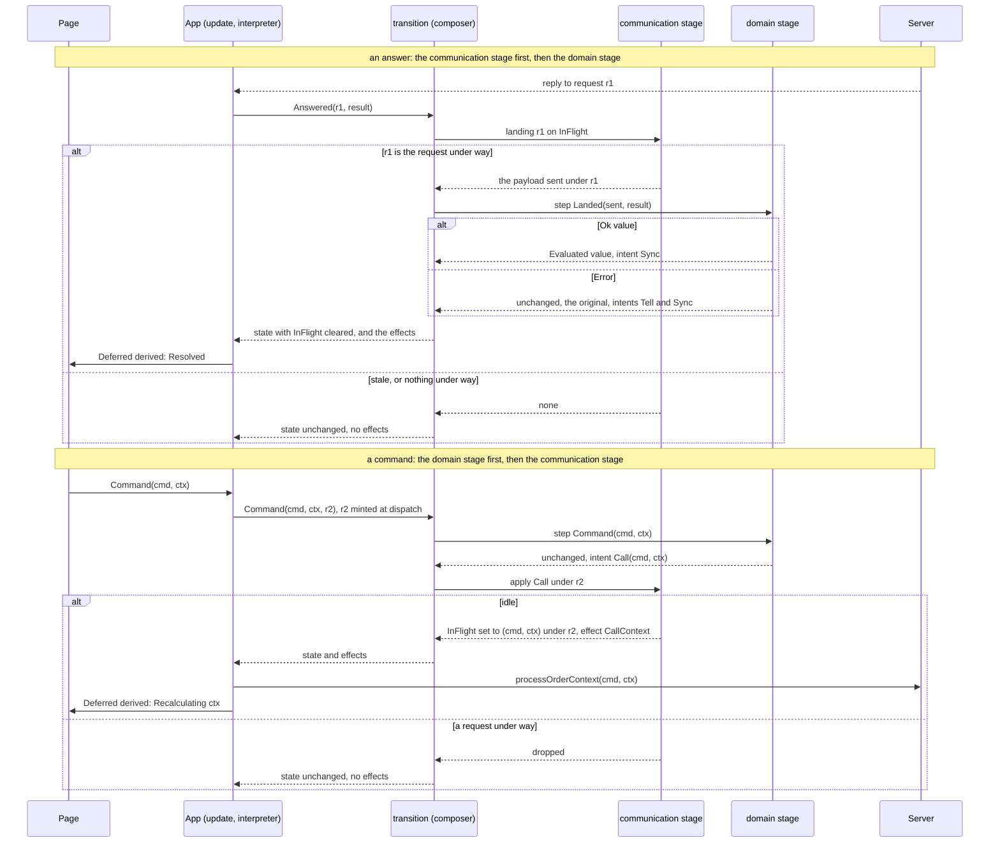

# Implementation plan for issue #691: the order lanes in two stages

> A proposal for review, not a settled plan: the approach, the decisions and the step split are
> put up here to be confirmed, changed or refused in this PR.
> Issue: [#691](https://github.com/informedica/GenPRES/issues/691).

## Problem description

The client holds the prescribing workbench and the order plan in two pure state machines
(`OrderContextMachine.fs`, `OrderPlanMachine.fs`) and publishes them to the pages as
`Deferred<_>` through `AppEnv`. Both machines mix what the clinical model *is* (the patient held,
the context evaluated, the plan, the context the dialog shows) with what the transport is doing
(a request in flight, its id, the command sent, the copy shown meanwhile):

- `OrderContextState.Recalculating` holds two copies of the context, the original and the one
  sent, next to the request id: a failed change goes back to the original while the page shows
  the one sent. `Loading of Patient * request`
  welds a domain fact (a patient held, nothing evaluated yet) to a request id.
- `OrderPlanState.Recalculating of OrderPlan * selected * request * sent` bundles the plan, the
  dialog's selection and the transport in one case; `Loading` likewise.
- `Deferred.Recalculating of 't` is the in-flight phase carrying a stand-in value under a name
  that hides it: `Deferred.inProgress` says true for it and `Deferred.resolved` says false.

Three things are tangled, not two: the domain value, the transport (request id, payload sent),
and the UI (the copy shown meanwhile, the dialog's selection). The split has to place all three.

The review that led to this plan also found that the change is not a refactoring alone. Today's
behaviour is inconsistent in ways the current tests cannot see, and the split forces a decision
on each:

1. A failed workbench command goes back to the original context, the last one evaluated
   (`OrderContextMachine.fs`, the `Answered` arm over `Recalculating`). A failed plan `Filter`
   restores the plan *sent*: the rows stay checked with stale totals (`OrderPlanMachine.fs`, the
   `Filter` and `Answered` arms). The test "a refused change leaves the plan as the request
   found it" has sent = original in its fixture and cannot tell the two rules apart.
2. `Loading` carries no value and projects `InProgress`; a re-evaluation projects
   `Recalculating value`. So a first load shows a bare spinner while a reset of the same
   workbench shows the empty page greyed.
3. A filter seeded from the url or the menu before a patient is set projects as `Resolved`: an
   unevaluated seed looks settled, and a change made then silently replaces the seed.
4. The value shown while in flight is the context *sent* for the workbench, and for the plan the
   plan the command carries for `Recalculate` but the plan held for every other command.
5. `OrderContextState.context` returns the context *sent* while in flight, and five callers in
   `App.fs` (the reload, the url seed, the two filter syncs, the ContinuousMeds page guard)
   depend on that.

Two words used throughout. A change **fails** when the server refuses it (no dose rules for the
filter, a duplicate order, a token no longer valid) or when the call does not complete; the
interpreter turns both into the same `Error` answer, and the machine cannot tell them apart. The
**original** is the value the request started from: the last one the server answered, shown
before the user acted, and what a failed change goes back to.

Untested today: the two projections in `App.fs` (not linked into any test project), every
`Deferred` helper (`Extensions.fs` opens `Browser.Dom`, so it cannot be linked), the accessors
`patient`, `context` and `map`, a seed or a reset arriving while a request is in flight, and a
failed plan change with sent ≠ original.

## Approaches considered

1. **A generic lane type nested in the domain DU**, `ForPatient of Lane<value, command>` with
   `Lane = Settled of value | InFlight of original * sent * request`. Keeps "no patient with a
   request in flight" unrepresentable. Rejected: a DU inside a DU, a third type, and the domain
   value held inside the communication wrapper; hard to read for what it buys.
2. **A generic request type beside the domain DU**, `{ Domain; Request: Request<command> }` with
   `Request = Idle | InFlight of sent * request`. Rejected: the type is an option of a pair with a
   name; a field says the same.
3. **`Deferred` stored beside the domain as the communication state.** Rejected: its `Resolved v`
   would duplicate the domain's `Evaluated v` and the two would have to be kept equal by hand.
4. **A domain DU without request ids, one optional field for the request in flight, and the two
   stages run in order by `transition`**; `Deferred` derived for the pages. Proposed.

## Chosen approach

Proposed: option 4. Per lane, the state is a record of a domain DU and one communication field:

```fsharp
// OrderContextMachine.fs
[<RequireQualifiedAccess>]
type Workbench =
    | NoPatient
    // a filter chosen before a patient is set: evaluated once one is
    | Seeded of OrderContext
    // a patient held, nothing evaluated yet (today's Loading, without the request id)
    | Unevaluated of Patient
    // the context last evaluated for the patient held, the original a failed change goes back to
    | Evaluated of OrderContext

type OrderContextState =
    {
        Workbench: Workbench
        // the one request under way: the command and the context sent (what the page shows
        // meanwhile) and the id the answer must name; none while idle
        InFlight: ((OrderContextCommand * OrderContext) * string) option
    }

// OrderPlanMachine.fs
[<RequireQualifiedAccess>]
type Plan =
    | NoPatient
    // a patient held, no plan answered yet (today's Loading, without the request id)
    | Unopened of Patient
    // the plan as answered
    | Opened of OrderPlan

type OrderPlanState =
    {
        Plan: Plan
        // the one change under way: the command sent and the id the answer must name
        InFlight: (OrderPlanCommand * string) option
        // the context the dialog shows, by id: the client's own, next to whatever is in flight
        Selected: string option
    }
```

**The communication stage** is two functions per lane on `InFlight`: `busy`, and
`landing request`, the payload sent when the id matches and none otherwise.

**The domain stage** is `Workbench.step` and `Plan.step`: a message without request ids to a new
domain value and a list of intents.

```fsharp
[<RequireQualifiedAccess>]
type WorkbenchMsg =
    | PatientChanged of Patient option
    | Seed of OrderContext
    | Command of OrderContextCommand * OrderContext
    // the answer that landed, with what was sent
    | Landed of sent: (OrderContextCommand * OrderContext) * Result<OrderContext, string[]>
    | Reset

[<RequireQualifiedAccess>]
type WorkbenchIntent =
    // supersedes whatever is under way: UpdateOrderContext and the two filter syncs
    | Evaluate of OrderContext
    // one at a time: dropped while a request is under way
    | Call of OrderContextCommand * OrderContext
    | Sync of Filter
    | GoToLifeSupport
    | Tell of string[]
```

The domain changes only on `Landed Ok` and on `PatientChanged`. A `Landed Error` leaves it as it
is and emits `Tell` and `Sync`, which is how a failed change goes back to the original. `Seeded` emits
nothing, which is how the seed waits. `Plan.step` has the same shape, with
`Landed of OrderPlanCommand * Result<OrderPlan, string[]>` and the intents `Open` and `Recalculate`
(both supersede), `Call`, `CheckInteractions`, `GoToPlanPage`, `ResetWorkbench`, `Tell`.

**The two stages in order.** `transition` keeps its signature and runs them:

```text
Answered(request, result):
    stage 1, communication: landing request state.InFlight
        none  -> dropped (a stale answer, or nothing in flight)
        sent  -> stage 2, domain: step (Landed(sent, result)); InFlight cleared; intents applied
any other message:
    stage 2, domain: step msg
    stage 1, communication: the intents applied
        Evaluate / Open / Recalculate -> InFlight replaced, whatever was under way
        Call                          -> InFlight set when idle, dropped when busy
                                         (the domain did not change on dispatch)
        the rest                      -> today's effects, one to one
```

The same, as the messages travel. An answer passes the communication stage first and reaches the
domain stage only when it lands; a command passes the domain stage first and reaches the
communication stage as an intent, which is dropped while a request is under way:




Two arms read the payload in flight: a patient change while busy patches the new patient into it
and re-sends it, so the selection in flight stays visible and is evaluated for the new patient;
a patient change while an `Open` is in flight re-sends `Open` with the version's contexts. A
patient cleared clears `InFlight`.

Newly representable, and guarded, one test each: `NoPatient` or `Seeded` with a request in flight
(never built: a patient cleared clears it, a seed never sends, a landed answer on `NoPatient` is
dropped by the domain); a selection without a plan (`Select` dropped on `NoPatient`, as today).

**What does not change.** `OrderContextMsg`, `OrderPlanMsg`, both effect types, both `transition`
signatures, `State.OrderContext` and `State.OrderPlan` in `App.fs`, `AppEnv`, and the effect
interpreters. The accessors `App.fs` reads keep their names: `patient` is the domain's;
`context` is none for `NoPatient` and `Unevaluated`, as today's `Loading` answers none, and
otherwise the payload in flight if any, else the domain's, so that the ContinuousMeds page
guard and the filter syncs in `App.fs` keep their branches during the first load; `map f`
applies to the domain value and the payload both; `emptyFor`, `plan`, `selected` as today.

**`Deferred`, derived for the pages**, one tested function per lane, in the machine (written in
today's case names; step 9 renames):

```text
OrderContextState.toDeferred
    NoPatient,     _                   -> HasNotStartedYet
    Seeded ctx,    _                   -> Resolved ctx          (as today; decision b deferred)
    Unevaluated _, _                   -> InProgress            (as today; decision c deferred)
    Evaluated ctx, None                -> Resolved ctx
    Evaluated _,   Some((_, sent), _)  -> Recalculating sent

OrderPlanState.toDeferred, with meanwhile original = Recalculate tp -> tp | _ -> original
    NoPatient,    _                    -> HasNotStartedYet
    Unopened _,   _                    -> InProgress            (as today; decision c deferred)
    Opened tp,    None                 -> Resolved tp
    Opened original, Some(sent, _)     -> Recalculating (meanwhile original sent)
```

The mapping is today's, case for case, so the split changes nothing the pages see. Decisions b
and c, which would change it, are deferred to a follow-up proposal.

### Proposed decisions, each named, to confirm in review

| # | Today | Decision | Commit |
|---|---|---|---|
| a | after a failed `Filter` the plan keeps the plan *sent* | go back to the original, as the workbench does | fix |
| a' | both lanes patch a new patient into the original | kept: the plan's patient must stay in step with the panel and the workbench; the stale totals after a refused patient recalculation stay with #672 | – |
| b | a seed before a patient projects `Resolved` | deferred to a follow-up proposal: shown provisional, greyed until evaluated | later |
| c | `Loading` projects `InProgress`, a bare spinner | deferred to a follow-up proposal: `Unevaluated` and `Unopened` deleted, the first load and a cart open a request over the empty value, shown greyed | later |
| d | `Deferred.resolved` contradicts `Deferred.inProgress` | `resolved` and `exists` deleted; no callers | refactor |
| e | `context` returns the context sent | kept: `context` is the value shown, `patient` the domain's | – |
| f | `map` rewrites both copies | kept: the domain value and the payload, both | – |
| g | a "no dose rules" answer re-evaluates under the answered request id | kept; not visible | – |
| h | a patient change during an `Open` in flight sends `Open` with no contexts and drops the version | re-send `Open` with the version's contexts from the payload in flight | fix |
| i | the patient panel and the formulary and parenteralia filters stay enabled while a request is in flight, so the subject of a request can change under it | greyed while a request is in flight: the panel while either lane is busy, the two filter pages while the workbench is, the nutrition delete dialog while the plan is; the machine arms for a patient change in flight stay as guards, since the session can still set the patient | fix |

## Questions for review

The answers change the plan; the rest is mechanics.

1. **The order**: the fixes first on today's machines and the split after, as a refactoring that
   preserves behaviour, as proposed; or the split first with the fixes riding on it?
2. **Decisions b and c**, deferred: leave the first load's spinner and the seed's projection as
   they are, and take them up in a follow-up proposal with a look at the pages; or drop them?
3. **A failed patient recalculation** (decision a'): keep the new patient with stale totals in
   both lanes, as proposed, or blank the totals until #672 decides? Restoring the old patient is
   not on the table: it would put the plan out of step with the panel and the workbench.
4. **The `Deferred` rename** (step 9): `Provisional of 't`, last, as proposed, so the two
   projections are pinned before the sites move; first, so every projection test is written
   against the final name; a better word; or not at all, `Recalculating` kept as debt?
5. **The session and signing machines**: a follow-up issue on this pattern once the order lanes
   have landed, or in scope here?

## Confidence

High for the machines and their tests: the domain steps are today's arms with the request ids
removed, the composer is one function per lane, and every arm has a test on either side of the
change, and the split preserves behaviour, so the existing tests are its oracle. Medium for the
pages: they are not under test, the greying of step 2 and the rename of step 9 are guarded by the
Fable compile alone. That is why each of the two is its own PR with nothing else in it.

## Steps

Proposed as one PR per step against `master`, the client edited directly. The fixes come first,
on today's machines, since none of them needs the split; the split follows as a refactoring that
preserves behaviour, so that every existing test stays green through it. Every step leaves
`dotnet run ServerTests`, the Fable compile, Fantomas and the dependency-rule check green.

1. **This plan.**
2. **The UI while a request is in flight** (`fix(client)`, decision i): `Views/Patient.fs` reads
   `IOrderContext.OrderContext` and `IOrderPlan.OrderPlan` and greys its selects while either is
   in progress; `Views/Formulary.fs` and `Views/Parenteralia.fs` grey their filters while the
   workbench is; the nutrition delete confirmation in `Views/Nutrition.fs` does not dispatch
   while the plan is. `Deferred.inProgress` is the one test; no `AppEnv` change. About 60 lines.
   Once this is in, a patient change while a request is under way can only come from the
   session, and the arms for it in both machines are guards.
3. **A patient change during an open keeps the version** (`fix(client)`, decision h): the
   `PatientChanged` arm of `OrderPlanMachine.fs` over `Loading` re-sends `Open` with the
   contexts of the open under way instead of `Open` with none; `Loading` carries them for that.
   One test. About 30 lines.
4. **A failed filter change goes back to the original** (one PR, two commits, decision a).
   `test(client)`: the failed-change fixtures in `OrderPlanMachineTests.fs` get sent ≠ original
   and assert today's rule, so the fix flips a real assertion. `fix(client)`: the `Filter` arm
   of `OrderPlanMachine.fs` keeps the plan held as what a failed change goes back to; the plan
   with the new filter travels in the command only. About 40 lines.
5. **`Deferred` in its own file** (`refactor(client)`): `src/Informedica.GenPRES.Client/Deferred.fs`
   as the first compile item, `[<AutoOpen>]`, out of `Extensions.fs`; `resolved` and `exists`
   deleted; the type unchanged so the pages compile untouched; linked into
   `tests/Informedica.GenPRES.Shared.Tests` before the machines so the projections can be
   tested. About 60 lines.
6. **The workbench in two stages, behaviour preserved** (`refactor(client)`): `Workbench` with
   `Unevaluated of Patient` for today's `Loading`, `WorkbenchMsg`, `WorkbenchIntent`,
   `Workbench.step`, the record, `landing`, `transition` as the composer, `toDeferred` in the
   machine with today's mapping case for case and the one in `App.fs` deleted; the 13 tests
   rewritten as `Workbench.step` tests without request ids plus composer tests for the four
   invariants and the guards; the projection's five cases pinned. No behaviour change: the
   existing tests' expectations are the oracle. About 200 lines.
7. **The plan in two stages, behaviour preserved** (`refactor(client)`): `Plan` with
   `Unopened of Patient` for today's `Loading`, `PlanMsg`, `PlanIntent`, `Plan.step`, the record
   with `Selected`, the composer, `toDeferred` with `meanwhile`, the one in `App.fs` deleted;
   tests split as in step 6. About 200 lines.
8. **Docs** (`docs`): the case table and the invariant lines in
   `docs/domain/dose-quantity-stepping-flow.md`; this plan's "As built". About 50 lines.
9. **`Deferred.Provisional of 't`** (`refactor(client)`): `Recalculating of 't` renamed, one word at
   64 sites and nothing else in the diff. The case says what every lane has in common: a value
   shown that the server has not confirmed, whether it is the previous one while a plain field
   reloads, the one sent while the workbench waits, or a seed with nothing under way yet. Which
   provisional value a lane shows is the lane's decision, made in its `toDeferred`, and the
   type and its helpers know only confirmed or not. Names weighed and set aside: `Reloading` and
   `Updating` claim the value shown is the previous one, false for the workbench; `Busy` says
   nothing about the value; `Pending` and `Awaiting` read as waiting *for* the value.
   `Deferred.inProgress` stays as the greying test the views use; it is true for a seed too,
   which is what the views want. About 70 lines.

After step 9, decisions b and c are a follow-up proposal of their own: `Unevaluated` and
`Unopened` deleted, the first load and a cart open a request over the empty value shown greyed,
the seed shown provisional. They change what the pages show and deserve a look at the pages
first.

## Acceptance

Against `GENPRES_PROD=0 dotnet run`, launched as `prescriber`:

- Pick a generic: while the spinner shows, the patient panel and the formulary and parenteralia
  filters are greyed; afterwards change the weight: the generic picked stays and is evaluated
  for the new patient. Put an unknown generic in the url: the snackbar says why and the context
  last evaluated returns.
- On the plan page check rows and force a failed change: the rows return to the original.
- A patient change during an open is unreachable from the pages after step 2; step 3 is
  covered by its test.
- Two browsers on one patient: a reopen arriving while a step is in flight wins.
- After steps 6 and 7 every page looks and behaves as before them: the first load's spinner,
  the seed's selects, the greyed page while a request is under way.
- `dotnet run ServerTests`, the Fable compile, Fantomas and the dependency-rule check stay green
  after every step.

## Left open

- Decisions b and c, the first load and the seed shown provisional, as a follow-up proposal.
- `SessionMachine` (`Launching` with its attempt count, `Resuming`, `Closing`) and
  `SigningMachine` (`Requesting`, `Submitting`, `Unsent`) split the same way;
  `SessionGatePolicy`'s busy flag then reads the in-flight field.
- The pages reading the two records directly, and `toDeferred` gone (plan 667 lists it).
- `Deferred.bind` drops the busy flag in the interventions calculation; a failed plan change skips the
  interactions check, so a warning can outlive the plan that caused it; the two lanes format
  the snackbar differently; a reload is settled by any workbench answer, stale ones included;
  the "no dose rules" re-evaluation reuses the answered request id; the stale totals after a
  failed patient recalculation (#672).

## As built

Built in the order proposed, every PR under review before the next started, the client edited
directly. Every step left the build, the shared tests, the Fable compile, Fantomas and the
dependency-rule check green.

| Step | PR | Landed |
|---|---|---|
| plan | #688 | this document; issue #691 |
| 2, the UI while a request is in flight | #692 | the patient panel greyed while either lane is busy, the formulary and parenteralia filters while the workbench is, the nutrition add and remove controls and the delete confirmation while the plan is |
| 3, a patient change during an open keeps the version | #694 | `Loading` carries the contexts being opened; a patient change meanwhile opens them again |
| 4, a failed filter change goes back to the original | #695 | the failed-change fixture sharpened first (sent ≠ original), then the plan held stays the original; `OrderPlanState.meanwhile` gives the pages the plan the command carries; review: a failed page recalculation with the dialog open covered too |
| 5, `Deferred` in its own file | #696 | `Deferred.fs` first, linked into the shared tests; `resolved` and `exists` gone |
| 6, the workbench in two stages | #697 | `Workbench`, `WorkbenchMsg`, `WorkbenchIntent`, `Workbench.step`, the record with `InFlight`, `landing`, `transition` as the composer, `toDeferred` in the machine; 13 tests preserved through fixtures, 5 added |
| 7, the plan in two stages | #698 | `Plan`, `PlanMsg`, `PlanIntent`, `Plan.step`, the record with `InFlight` and `Selected`, the dialog's rules in the composer, `toDeferred` in the machine; 13 tests preserved, 4 added; review: the record's fields private, built through constructors |
| the workbench the same | #699 | `OrderContextState`'s fields private, `noPatient`, `seeded`, `opening`, `held`, `changing`; review: `changing` normalizes the context sent to the patient held |
| 8, docs | this PR | the stepping-flow document's machine section and case table; this section |
| 9, `Provisional` | #701 | `Recalculating` renamed `Provisional`, one word at 40 code sites (the machine cases of that name had gone with steps 6 and 7), the stepping-flow document's references with it |
| the domain tier named after its lane | #702, #703 | `OrderContextWorkbench`, `OrderContextWorkbenchMsg`, `OrderContextWorkbenchIntent`; `OrderPlanCart`, `OrderPlanCartMsg`, `OrderPlanCartIntent`, the field `Cart`; the message case `Cart of SignedOrderPlan` is `Version` on both tiers |

### Deviations from the text above

- **The records are not open to construction.** The text accepted a request or a selection
  without a plan as representable and guarded in the reads. Review on #698 asked for more, and
  the choice fell on private fields with constructors that admit only the combinations that
  occur (`noPatient`, `opening`, `held`, `changing`, the workbench's `seeded` too); the tests
  build their states through them. A DU of only the valid states would have been the old DU
  again, so the two stages stay.
- **The row filter is a `Call`, not a `Recalculate`.** The text listed `Recalculate` among the
  intents that supersede. A filter change while a request is under way is dropped today, so it
  goes out as `OrderPlanCartIntent.Call(Recalculate ...)`, one at a time; only a patient change
  recalculates by superseding.
- **The dialog's rules live in the composer**, keyed on the message: closed by a patient change,
  a reopen and a filter change that goes out, narrowed to the plan answered, kept otherwise.
  The domain step never sees the selection.
- **The domain tier carries its lane's prefix.** The text named the domain DUs `Workbench` and
  `Plan`: one a noun of its own, the other the bare noun of the DTO it holds, so `Plan` read as a
  truncated `OrderPlan` next to `OrderPlanState`. Both tiers now start with the lane's name,
  `OrderContextWorkbench` and `OrderPlanCart`; the cart is the integration model's word for
  the plan the client holds and signs, so the message that brings a signed version is `Version`.
- **`Unopened` carries the contexts being opened**, since step 3 had already put them on
  `Loading`; the plan's text had `Unopened of Patient` alone.
- **Step 6 and 7 tests stayed transition tests.** The text had them rewritten as domain-step
  tests; keeping the thirteen as they were, over fixtures, made them the oracle for "behaviour
  preserved", and the domain step got tests of its own beside them.
