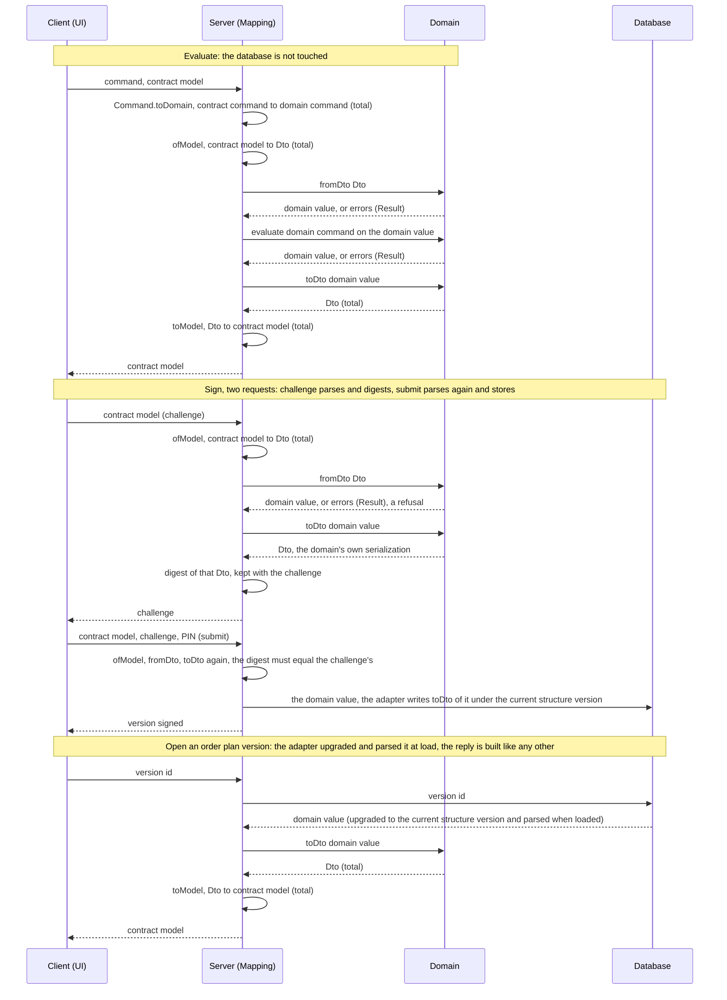

# Implementation plan for issue #725: one data-flow pattern, applied everywhere

> Settled in review (#726): the terms, the invariants, the rules and the decisions are recorded
> in [ADR-0008](../adr/0008-contract-model-dto-mapping-boundary.md), which every later phase
> starts from; this document keeps the analysis, the laws and the migration, and the "As built"
> table at the end records what landed.
> Issue: [#725](https://github.com/informedica/GenPRES/issues/725).

## Problem description

The server follows one data flow, contract model to Dto to domain and back, in two places and
something else everywhere else. Five of the seven aggregates that cross the server boundary have
no Dto and are mapped by hand, three of those mappings drop data silently, `OrderPlan` has no
domain type and its rules run in the server out of the contract library, the reply is merged onto
the request, the session store holds contract model types that plan 516 would freeze into SQL, and
the write path stores what the client sent without the domain parsing it. Part 1 below gives the
evidence at commit `026a0351`.

## Approaches considered

- Ports typed on domain Dtos: saves a parse per load, at the cost of Dtos in every service and
  every port signature.
- One Dto family for contract model and database: rejected by ADR-0001, which keeps Shared out of
  the domain.
- Mapping inside the services: the merge-onto-the-request bug class this plan removes.
- Ports typed on domain values, one Dto per aggregate owned by the domain library, parsing only in
  the adapters, the database holding Dtos under a structure version: the approach taken.

## Chosen approach

The last one: the standard shape of ports and adapters, with the vocabulary, the five Dto
invariants, the ten rules and the six round-trip laws written down once. The Context, Part 1 and
Part 2 below are the analysis and the rules; ADR-0008 §7 records every
question settled while drafting; Part 3 is the migration.

## Confidence

High on the pattern and the rules; the code already contains every mechanism they need. Medium on
the sizes and the phase order, which the "As built" table will correct as steps land.

## Context

Proposed data flow, in one line (the "flow line" the rest of this document refers to):

```text
UI -> Command + Model -> Server -> Mapping -> Command + Dto -> Domain -> Dto -> Database   (and back)
```

A request is a pair: what to do and what to do it to.

- `Command` is the verb: a contract-ring union, `Shared.Api.OrderContextCommand` or
  `OrderPlanCommand`.
- `Model` is the contract model: the records of `Shared.Types`. Not the `Shared.Models` module, which
  section 1.7 is about.
- Both are mapped on the server: the command totally, to the domain's command union; the model
  through `ofModel` and then `fromDto`.
- The domain takes the pair: `evaluate : Command -> OrderContext -> Result`.
- Only the model comes back.

The same flow as a sequence, in three exchanges: evaluate, sign, open an order plan version. Each
message between participants carries one kind of value: a command, a contract model, a Dto, or a domain value.



Three questions:

1. is the pattern sound and what is missing;
2. what has to change for the code to follow it consistently;
3. a migration plan.

Evidence is the code at commit `026a0351` (tree clean). Code was taken as leading, comments
second, docs third.

| Term | Meaning | In the code |
|---|---|---|
| **contract model** | the records the client shows, edits and sends, and the server receives and answers; shared by client and server, not a view model of either | `Shared.Types.*` (`Patient`, `OrderContext`, `OrderPlan`, `SignedOrderPlan`, ...). ADR-0001 calls this the "Contract" ring. |
| **Dto** | a logic-free, serializable data type for exactly one domain aggregate, owned by the domain library | `Order.Dto`, `Variable.Dto`, GenCORE's own `Patient.Dto` (a different type from the GenFORM `Patient.Dto` this document adds; below, `Patient.Dto` always means GenFORM's), and the new ones below |
| **Domain** | the domain types and their rules, making illegal state unrepresentable, and pure business logic; one exception: the GenFORM `Patient` type can hold a patient below the minimum data, so `Patient.validate` is a separate check (L1) | `GenOrder.Lib.Types.Order`, `OrderContext`, GenFORM `Patient`, ... |
| **Order plan version** | a version of an order plan, created by a prescriber signing it | `OrderPlanVersion` with `No` and `Base`; `openVersion`, `Head`, `Records` |
| **JSON structure** | the field names, nesting and value formats (how a `BigRational`, an option or a category is written) of a stored Dto's JSON; the serializer and its settings are part of it | the change table |
| **JSON structure version** ("structure version" below) | the number the database adapter keeps beside a stored JSON Dto (invariant 5); a code change creates one by changing a stored Dto's JSON structure | `order_plan.json_version` in plan 516 |
| **SQL schema** | the tables and columns; changes only by a SQL migration. A Dto change never needs one, except when it adds a new stored root; tables and columns that hold no Dto (identity, launch, audit columns, indexes) migrate as usual | plan 516 |
| **Release** | the deployed server build; changes at a deploy | "an older release cannot read a record written under a newer structure version" |
| **Database** | what the server persists, behind a database adapter | today `Session.State` in `ServerApi.Session.fs`, the session service's state and the in-memory database in one, dying with the process; the SQL tables of plan 516 later, for order plan versions, identity and the working state, loaded into that state by the SQLite adapter per request (Storage, below) |

Two mapping pairs. The domain library owns `toDto` (domain -> Dto) and `fromDto` (Dto -> domain,
a `Result`), nested as `module Dto` under the type. The server owns `ofModel` (contract model -> Dto)
and `toModel` (Dto -> contract model). Those are the names this document uses.

Why the contract model and the Dto stay two things even where they look alike. The contract
model is what client and server share: `Informedica.GenPRES.Shared` compiles as F# on the server and is transpiled to
JavaScript for the client, so it references only `FSharp.Core` (its `paket.references` today)
and Fable-compatible code, and only the client and the server reference it. The Dto is the
domain's serializable data type, produced and read at the domain's boundaries: the server mappers,
the database, the cache adapters, the MCP host. It lives in the domain library under its type
(invariant 1), and in practice it cannot be transpiled: `ValueUnit.Dto` carries `BigRational[]`
from MathNet, `Variable.Dto` and so `Order.Dto` nest it, and the new `Patient.Dto` keeps
`BigRational option`. So the two are kept apart because Shared must stay transpilable, the
domain may not reference Shared, and the two have different owners and change for different
reasons. The server's mappers are the only production code where they meet.

Decisions made while drafting. The decision record is
[ADR-0008](../adr/0008-contract-model-dto-mapping-boundary.md) §7: what the database holds,
where the domain `OrderPlan` lives, the rules out of `Shared.Models`, Dto style, the digest
serializer, what an order plan version stores, the upgrade policy, ports on domain values, the
contract model unversioned, and the follow-ups. This table keeps only the three domain fixes of
the migration, which the ADR leaves to this plan:

| Question | Decision |
|---|---|
| `EnteralTube` access dropped by the mapping | Added to the domain: GenFORM `AccessDevice` gains the case in step 3.0, so the mapping is total and `fromDto` accepts it instead of the mapper dropping it. |
| `Department` defaulted to `"ICK"` by the mapper (`Mappers.fs:347`) | Removed: `ofModel` maps `Department` as sent and an empty one stays empty, so `Department` is not in the set `S` and L3 includes it. |
| Measured vs estimated weight in the domain patient | GenFORM `Patient` gains `WeightMeasured` / `HeightMeasured: bool` in step 1.2a (an estimated weight is a domain fact, possibly a caution). Step 1.2b depends on it: without the flags `Patient.Dto` could not carry "measured" and `fromDto` could not do the minimum-data check. |

---

## Part 1. Is the pattern sound? What is missing?

**Verdict: sound overall, with four gaps.** Hexagonal layering, with the ports typed on domain
values (ADR-0008 §7). Nothing departs from the pattern once `OrderPlan` has a domain type
(1.5), except the session exception of R6.

What matches established practice: a contract model at the edge, a domain model in the middle, a
serializable data type at each boundary, and a mapping step wherever contract model and domain
Dto meet. Parsing at the edge with a total `toDto` and a `Result`-returning `fromDto` is the
"parse, don't validate" discipline; `evaluate : Command -> OrderContext -> Result` is a pure core
with the server as its imperative shell; one mapping home per aggregate is a translation layer
between contract and domain. The contract shared by client and server is not a departure:
hexagonal architecture expects the driving adapter to have its own request and response types,
and a shared contract is how that adapter is built in a SAFE Stack application.

**The port split**, stated here once and referred to from Part 3: a port is defined in domain
terms. `OrderContextPort`, `OrderPlanPort` and `SessionPort` take and return `PlanContext`,
`OrderPlan` and `OrderPlanVersion` (`StoredVersion` where a version may be unreadable, Storage),
and the parse from Dto to domain runs only in the adapters.
The command handler does `ofModel >> fromDto` on the way in, refusing on `Error`, and
`toDto >> toModel` on the way out. The database adapter does `fromDto` when it loads a row and
`toDto` when it writes one, and supplies the digest (`toDto` then the canonical serialization)
the session service compares. No service sees a Dto; `Session.State` holds domain values, so an
order plan version is served back as domain -> Dto -> contract model, like any reply.

Loading a stored order plan version rests on `fromDto`, a structural parse that never consults
the rule base; what can fail on a load, and what happens then, is in Storage (below). ADR-0001
already implies the rest: it calls the contract models the "Contract" ring, seen only by
Presentation and Client, and it requires parsing at every inbound boundary. The four gaps are
the arrows of the flow line where the code departs from it:

| Gap | Arrow | Sections |
|---|---|---|
| Inbound mapping | `Server -> Mapping -> Dto` | 1.1, 1.2, 1.4 |
| Outbound mapping | `Domain -> Dto -> Model` | 1.3 |
| Domain | `Dto -> Domain` | 1.5, 1.7, 1.8 |
| Database | `Dto -> Database` | 1.6, 1.11 |

Sections 1.9 and 1.10 are not gaps: 1.9 fixes what a Dto is at every boundary, 1.10 lists the
boundaries the flow line does not draw. What the flow line leaves out, and where the code goes
wrong as a result:

### 1.1 Five of seven aggregates have no Dto to map to

The flow says `Server -> Mapping -> Dto -> Domain`: the server maps the contract model to the domain
Dto, and `Dto.fromDto` takes it into the domain. Seven aggregates cross the server boundary.
Two have a Dto and follow the pattern:

1. `Order`: `Mappers.Order.mapFromSharedToOrder : Shared.Order -> Order.Dto.Dto`, then
   `Order.Dto.fromDto`.
2. `Variable` (inside an order): `Mappers.Order.mapFromVariable` :54 to `Variable.Dto`, with
   `ValueUnit.Dto` beneath it.

Five have no domain Dto, so the server maps the contract model straight onto domain records by hand:

- `OrderContext`: `Mappers.mapFromShared` :396 in, `mapToShared` :580 out.
- `OrderScenario`: inside `mapFromShared` / `mapToShared`.
- `Filter`: inside `mapFromShared` / `mapToShared`.
- `Totals`: `mapToTotals` :627 out, no inbound mapping.
- GenFORM `Patient`: `mapFromSharedPatient` :345.

The step exists in the flow, but for five aggregates there is no Dto to map to.

### 1.2 Inbound is a total mapping followed by a parse, and neither may drop

ADR-0001 §4: the DMZ parses at every inbound boundary, so that malformed or unavailable input becomes an
`Error` at the edge, never an empty collection inside the core. In the flow that parse is two
steps. `ofModel` (contract model -> Dto) is total: both sides are logic-free serializable data
types, and every contract model value maps to a Dto, so there is nothing to reject. `fromDto` (Dto -> domain) is the
step that validates and returns a `Result`. The composite `ofModel >> fromDto` is the parse the
ADR asks for; its success type is a domain value. Today the code fails this in three ways,
none of them a missing failure path on the mapping:

- `Mappers.mapFromShared` :412 swallows the `Error` of `Order.Dto.fromDto` and discards the
  scenario. The failure is at the parse step; the bug is that it is filtered instead of reported.
- `Mappers.mapFromSharedPatient` :376 drops `EnteralTube` access (`// TODO make proper mapping`)
  because the target type has no case for it. With a string-typed Dto the mapping is total; the
  gap moves to `fromDto`, which must report it until the domain gains the case (step 3.0).
- `Mappers.Order.mapFromVariable` :54 discards Min/Incr/Max/Vals on the non-zero-positive branch.
  A lossy total mapping; law L3 catches it.

`ServerApi.Patient.patient` validates but returns the same contract model type, so nothing downstream can
tell a checked patient from a draft. The pattern needs the rule: *the total step loses nothing,
the parse step reports every failure, and the success type is a domain value, not the contract model
type.*

### 1.3 The way back is built from the domain, not patched onto the request

`Mappers.mapToShared` :580 takes the *request's* `Shared.OrderContext` and overwrites `Filter` and
`Scenarios` only; `Id`, `Category`, `DemoVersion`, `Patient`, `Intake` survive from the request.
Then `OrderContextService.evaluate` :366 adds `Intake` and `DemoVersion` afterwards. A mapper
that depends on the request. The flow needs the rule: *the reply is `Domain -> Dto -> contract model`, a pure function of
the domain result plus the one thing the domain does not own, the demo flag.*

### 1.4 The command half of a request is mapped, but not where the model half is

A request is a command and a model (Context). The command is mapped too: `OrderContextCommand`
(26 cases) and `OrderPlanCommand` go to the domain's `Command` union. That mapping is total, since
the contract commands carry no payload, but it is a mapping, and it is inline in
`ServerApi.Services.fs:388-437`, not in `Mappers.fs`. That is the violation of R3. The three
port answers with no domain Dto behind them, `LaunchResult -> LaunchOutcome`
(`ServerApi.LaunchCommand.fs:34`), `SessionLookup -> SessionResponse`
(`ServerApi.SessionCommand.fs:16`) and `toSharedDrugInteraction` (`ServerApi.Adapters.fs:27`),
stay where they are as the named exceptions of R3.

### 1.5 One aggregate has no domain at all

`OrderPlan` (contexts, categories, the feeding-takes-its-supplements cascade, one-context-per-
category, the five nutrition dose-rule sets, totals over the filtered orders) exists **only** as
`Shared.Types.OrderPlan` plus 400 lines of rules in `ServerApi.Services.fs` (`OrderPlanService`
:658-855, `NutritionPlanService` :456-655) and helpers in `Shared.Models` (`OrderContext.contribution`,
`OrderPlan.orders/filtered`, `nutritionCategory`). The pattern cannot be applied to a thing that
has no domain to map to. Same, less severely, for `OrderContext.Id` and `OrderContext.Category`:
present in the contract model, absent from `GenOrder.Lib.Types.OrderContext`.

### 1.6 The database holds the contract model shape

`Session.State.Records : Map<string, SignedOrderPlan list>` (Shared), `Challenge.OrderContexts :
Shared.OrderContext[]`, `Notice.Data : Shared.Patient option`. ADR-0007 §3 accepts this for now.
The flow says `Domain -> Dto -> Database`; the code says `Model -> Database`. Plan 516 would
freeze that into SQL columns (`scenarios text -- json` in its schema sketch). **Decided: fix the
shape first, then build the database.**

### 1.7 `Shared.Models` plays two roles

`Shared.Models` (2491 lines) is three things: client display helpers and state projections
(fine, that is what Shared is for), the ADR-0003 clinical formulas (accepted exception, moving later under
plan 378 phase 6), and order-plan/context **business rules the server executes**
(`OrderPlanService.contribution = Models.OrderContext.contribution`). The third makes Shared
half a domain. **Decided: server rules move to the domain; the client keeps display projections.**

### 1.8 Domain Dtos are used inside the domain

`Order.Dto.continuous/once/…` are the only public constructors of an `Order`;
`Medication.toOrderDto` (Medication.fs:1735) builds an order by mutating a Dto graph;
`Totals.getTotals` (Totals.fs:107) takes `Order.Dto.Dto[]`; GenSOLVER `Api.createProdEqs` builds
equations through `Equation.Dto`. A Dto is a boundary type; using it as the domain's builder
couples domain logic to the serialization structure. **Decided: rule applies to new code; the
existing cases become a follow-up issue.**

### 1.9 Dto conventions differ in concept, not only style

33 of 34 Dtos are mutable classes, two are records (fine, style). But `fromDto` returns `Option`
(ValueUnit, MinMax, ZForm), `Result` (GenCORE Patient tree, `Order.Dto`), or **throws**
(`Variable.Dto.fromDto`, `Equation.Dto.fromDto`, `Schedule.Dto.fromDto`). A throwing `fromDto`
is a different concept: failure is not a value. **Decided: five invariants, below.**

### 1.10 Other boundaries the flow does not name

- **Google Sheets -> GenFORM**: `string[][]` parsed by `DoseRuleData.parse…` into `Data` records
  (`GenFORM.Lib/Types.fs` `Data` module). Those records *are* inbound Dtos; the pattern already
  holds there in all but name.
- **ZIndex / NKF `.cache` files**: domain records serialized raw with Newtonsoft. The domain type
  is the on-disk schema. Follow-up.
- **MCP host**: `McpTools.GenOrder.fs` defines its own output records straight from
  `GenOrder.Lib.Types.OrderContext`. A second outbound shape over the same domain, not shared with the client; once
  `OrderContext.Dto` exists it should map from that.
- **The client**: no separate client model; Elmish machines hold Shared records. That is correct
  under ADR-0001 ("the client sees nothing but the contract") and stays.
- **The session**: not a domain in this plan. `ServerApi.Session.fs` is a server service, a
  state machine behind `SessionPort`. It holds the clinical records (the order plan versions,
  `OrderPlanVersion`) and its working state (challenges, notices, the patient shown, `Patient`)
  as domain values, with Dtos only in the database adapter, and keeps identity as contract types (`UserContext`,
  `OpenedToken`, `SessionEnding`, the refusals), a mix the flow line and the diagram do not
  show. Its rules (refusing a changed order plan, refusing duplicate orders, counting PIN attempts,
  ending a session) are business rules that run outside any domain, deliberately: the session's
  own concepts (challenge, notice, opened session, PIN attempts) have no domain types; only what
  it holds of the clinical side does (`Signer`, `OrderPlanVersion`, `Patient`). A session domain,
  with the identity types and the signing rules out of the server, is the separate refactor
  named in ADR-0007 §3. Until then R6 names `Session.fs` as its exception.

### 1.11 The write path skips the domain

The sign path today is `RequestSignChallenge(plan, ...)` -> `challenge` stores
`plan.OrderContexts` (`Session.fs:1143`) -> `commit` compares the submission's contexts with the
challenge's (`:1210-1213`) -> the record. No `fromDto` runs on either side, so what is stored
never was a domain value and L1 has nothing to rebuild. **Decided: the write path follows the
same flow as every other inbound path.** The model is parsed to a domain value before anything
is stored, and what is stored is `toDto` of that value. What signing proves beyond that is a
safety question for a separate document.

### The five Dto invariants (decided)

1. A Dto is a logic-free, serializable data type for exactly one domain aggregate, nested as
   `module Dto` under that type, in the library that owns the type.
2. `toDto` is total.
3. `fromDto` validates and returns a failure value (`Result` preferred, `Option` tolerated),
   never throws.
4. Only boundary code (server mapping, database, cache adapter, MCP host) constructs or reads a Dto;
   domain functions take domain types.
5. A Dto persisted across a restart (an order plan version, a cache file) is a stored JSON
   structure, and the database adapter keeps a **structure version** beside each stored root,
   never as a field of the Dto: a `json_version` column in SQL, a header in a cache file. On
   load the adapter upgrades the record to the current structure before `fromDto` sees it; the
   Dtos nested in a root are governed by the root's version, and `fromDto` and `toModel` know
   nothing of versions. Nothing else is versioned: not Dtos on ports, not in-memory state, not
   the contract model. The consequences for storage are in the Storage section below.

An order plan version and a structure version are independent. A prescriber creates an order plan version by
signing; a code change creates a structure version by changing a stored Dto's JSON structure. Each order plan
version is stored under the structure version current at signing and keeps it; an upgrade on load
changes what the server sees, not the stored order plan version or its number. Re-signing from an
older order plan version creates a new order plan version under the current structure version. A new structure
version needs no SQL migration; among Dto changes, only a new stored root does.

Style (class vs record, field naming) is free.

### Reversibility: what holds, what does not

The flow is reversible only if each step has an inverse. Six laws: one per step, one over the
whole way in and back, one for stored records, one for the client's copies of domain rules.
Each names what compares the two sides, since `Order.Dto` and `ValueUnit.Dto` are classes with
reference equality and a `=` on two distinct objects is always false.

| Law | Statement | Compared by | Needed for | Status today |
|---|---|---|---|---|
| L1 | `fromDto (toDto x) = Ok x` for every **valid** domain value `x`; for every aggregate but the patient, valid is any value the type can hold; for the patient it means passing `Patient.validate`, which `fromDto` calls, because the GenFORM `Patient` type can hold a patient below the minimum data | domain `=` | loading a stored order plan version into `Session.State`; the write path (1.11) | Holds where a Dto exists. |
| L2 | `fromDto d \|> Result.map toDto = Ok d` for every Dto `d` that `toDto` **or `ofModel`** produced; `fromDto` does not normalize, it accepts `d` as it is or refuses it (a `Schedule.Dto` with two flags set is refused) | canonical form (the digest serialization) | L4; and the order plan the client sends back digests the same as the order plan the server computed it from, since parsing and re-serializing changes nothing | Holds for `toDto` output where a Dto exists; whether every existing `fromDto` refuses rather than normalizes is checked by this law's tests in Phase 1. |
| L3 | `toModel (ofModel m) =_S m` for every contract model value `m`, equal outside the set `S` of server-computed fields (below) | contract `=` outside `S` | lossless mapping (R4) | **Fails today for orders.** `Mappers.Order.mapFromVariable` (:54) drops Min/Incr/Max/Vals on the non-zero-positive branch; `mapFromShared` (:412) drops scenarios that fail to parse. |
| L4 | `ofModel m \|> fromDto \|> Result.map (toDto >> toModel) = Ok m` outside the same set `S`, for every `m` the domain accepts | contract `=` outside `S` | what the prescriber sees back, in a reply and in an order plan version | Not tested today; it is what 1.3 and 1.11 need. |
| L5 | for each stored fixture `f` at structure version `n`: `upgrade f \|> fromDto` is `Ok`, and `toModel (upgrade f)` equals the expected contract model, with the defined absent value for every field added after `n` | contract `=` | reading old records; the "new field" row of the change section | No stored structure version yet; the first fixture comes with plan 516 step 3. |
| L6 | `Models.f p = domain f (parse p)` for each client copy of a domain rule in `Shared.Models` (`orders`, `filtered`, `nutritionContexts`, `contribution`, `mayAdd` against `admits`) | value `=` | client and server agree on a rule (R1) | Not tested today; the agreement test of Phase 6. |

The set `S`, the fields the server computes on the way out and never reads on the way in:

- `DemoVersion`;
- `IsAdditional` and `LargeIncr` on a variable;
- the `TextBlock` markup of a scenario;
- `Weight.Estimated` and `Height.Estimated` on a patient, only when the measured flag is set
  (then the estimate is derived from age; when the flag is clear the entered estimate is the
  domain's `Weight` and goes back as sent).

L3 constrains what a Dto may be: it holds only if the Dto carries every field of the contract
model outside `S`, while invariant 1 says a Dto is the type for one domain aggregate. Where the
contract model has a field the domain lacks, the rule is: **add it to the domain, or put it in
`S` by name; never let the Dto grow a field the domain does not have.** Two cases are settled
that way here. `Intake` on a context and `Totals` on an order plan are added to the domain as ordinary
fields: the domain computes them when a context or order plan is evaluated, and every other path
(`ofModel`, `fromDto`, the write path, `toModel`) copies them as they are, so L2, L3 and L4
include them and an order plan version stores the intake the signer saw. Weight and height: the
domain keeps one value each with a measured flag (step 1.2a). With the flag clear the entered
estimate is that value and goes back as sent; with the flag set the measured value goes back
and the estimate `toModel` derives from age is in `S`.

Consequence for the plan: L1 and L2 are tests per Dto (Phase 1), L3 per mapper pair (Phase 3),
L4 per aggregate once its Dto and mappers exist (Phase 4), L5 per stored fixture (plan 516), L6
in the agreement test (Phase 6); every L3 failure is either turned into an `Error` (R4), added to
the domain, or put in `S`. The way back goes through the domain: the adapter parses every
stored order plan version when it loads it, and a version is served as
domain -> Dto -> contract model like any reply; by 1.11 the parse also runs once before anything
is stored.

### How the database absorbs changes to code and domain models

Each record is stored as a JSON Dto with a structure version beside it (invariant 5). Most code
changes then touch no SQL table; they are handled by the number and an upgrade function. The
kinds of change:

| Kind of change | Stored JSON structure changes? | What to do |
|---|---|---|
| Rule or logic change (dose rules, a new domain function, a value derived on read) | No | Nothing in the database. Order plan versions stay as signed; recalculating uses the new rules. |
| New stored derived value (as `Intake` on a context is) | Yes | A new field: new structure version, and an upgrade that marks it absent for older records. |
| New field | Yes | New structure version. The upgrade fills in an explicit "absent" value; the domain decides what "absent" means. |
| Change in a nested Dto owned by another library (`Order.Dto`, `Variable.Dto`, `ValueUnit.Dto` inside an order plan version) | Yes | The same as a field change on the root, made under another implementation plan: the whole-graph snapshot (principle 5) catches it, and the root's version goes up. |
| Serializer or its settings (how `BigRational`, options and field names are written) | Yes | The serializer is part of the JSON structure: new structure version and an upgrade, or the setting is never changed. The digest serializer is this same serializer (ADR-0008 §7). |
| Renamed or restructured field (split, merged, another unit format) | Yes | New structure version. The upgrade converts the old JSON structure to the new with a fixed transformation. |
| Same field, new meaning | Yes | Never reuse the field. Treat it as a new field and drop the old one in the upgrade. |
| Removed field | Yes | New structure version. The upgrade drops the field on load; the stored original keeps it. |
| Stricter domain rule | No | Old records may fail `fromDto` at load; the adapter marks them unreadable (Storage) and recalculating reports "cannot recalculate under current rules" instead of failing silently. |
| New or split aggregate | Yes | New stored root, possibly a new table, with its own structure version. The only Dto change that needs a SQL migration. |
| JSON structure of working state (what a Session opened with, a notice, a challenge) | Yes, in the store | Stored like any root: new structure version and an upgrade step. A row the release cannot read ends the Session or refuses the challenge (Storage). On the stub it is in memory and carries no structure version. |

Principles:

1. **Stored order plan versions are never rewritten.** The `order_plan` table is append-only:
   signing inserts a row, and no `UPDATE` or `DELETE` ever runs on it; plan 516 adds a unique
   constraint on `(patient_id, no)` so the database itself rejects a second version with the same
   number. Upgrades run when a record is loaded and are pure functions
   (structure 1 -> structure 2 -> ... -> current structure). Rows stay as written, which protects the audit trail.
2. **Upgrades work on raw JSON, not on old F# types.** Only the current Dto type exists in the
   code; each upgrade step is a JSON transformation, so no historical Dto type is kept.
3. **Every stored root gets upgrade steps,** the working state included, since a drain on
   upgrade (Rule 36) has the new release read rows the old one wrote; the difference is what
   an unreadable row means (Storage).
4. **Each JSON structure change comes with four things:** a new structure version, an upgrade
   step, a downgrade step for the release that reads the new structure and still writes the old
   (principle 6), and a stored fixture at the old structure version with an L5 test.
5. **A test detects a JSON structure change without a new structure version:** a stored
   snapshot of the whole serialized graph of each root per structure version, nested Dtos from
   other libraries and the serializer's output included, failing when the shape changes and the
   number does not.
6. **A structure change ships as expand, then contract, in two releases.** An upgrade drains
   the old servers (Rule 36), so for a while release N and its successor run side by side on
   one database, and an older release cannot read a row written under a newer structure
   version: there is no minor number that would let it read an additive change. So release
   N+1 reads structure vN+1 but still writes vN; release N+2 writes vN+1, once no release N
   server is left. Only the current Dto type exists (principle 2), so N+1 writes vN through a
   downgrade step: the adapter serializes the current Dto, applies the raw-JSON step
   vN+1 -> vN, and stores it under `json_version` N. The adapter carries two numbers, the
   structure it reads up to and the one it writes, both build constants of the release: N+1
   has read N+1 and write N, N+2 has both N+1 and drops the downgrade step; the upgrade step
   stays for the rows N+1 wrote. The downgrade must lose nothing N+1 writes, so a value the
   old structure cannot hold (a new field's data) is not written before N+2, which is when the
   feature behind it goes live. Test: for every `x` the release writes, `downgrade (toDto x)`
   matches the vN snapshot of principle 5, which is release N's reader as far as N+1 can still
   test it, since release N's Dto type no longer exists; and `upgrade (downgrade (toDto x))`
   parses back to `x`. During a drain no server meets a row it cannot read, no Session ends for an upgrade,
   and a rollback by one release is safe. A rollback by more than one release is not supported
   once rows exist under the newer structure; a row from the future is then unreadable
   (Storage), the defensive case, never the routine one.

**Hypothetical example, the "new field" row.** Suppose `Patient` gained a clinical decision,
say "treated as an adult", entered by the prescriber. One new structure version on the order plan version root,
the only long-lived one; one upgrade step that sets the field to "not recorded" for records
written before it existed, since neither `false` nor a value computed from age was ever decided
by the prescriber; and the domain, not the upgrade, deciding what "not recorded" means when
such a record is recalculated. The example decides nothing about adulthood; it shows the shape
of the work.

### Storage

How the store behaves, beyond invariant 5 and the change table.

- **What is stored.** Plan 516 stores the order plan versions, the only long-lived root,
  whatever identity or audit data must survive a restart, and the working state of a Session:
  what it opened with, its notice, its challenge. The working state is stored like any other
  root, as Dtos under a structure version (the patient a Session shows and a notice's reading
  as `Patient.Dto`; a challenge holds the digest, never the order plan), and its rows are
  dropped whole after their lifetime. It is stored because a restart must end nothing and a
  second server must find it (ADR-0007, Rules 32 and 36). On the in-memory stub it lives in
  memory, carries no structure version and is gone at every startup.
- **What a restart means.** On the store, nothing: a Session continues from its rows at its
  next request. On the stub every restart ends all sessions and open challenges, so users
  launch again and restart any signing.
- **Loading.** The adapter loads a patient's order plan versions when a request needs them,
  in the per-request slice of plan 516, never once at startup: a second server would not see
  an order plan version signed after it started. It upgrades each to the current structure and
  parses it with `fromDto` as it loads, so the state holds domain values. A row it cannot load,
  because its structure version is newer than the release knows, an upgrade step fails on it, or `fromDto` refuses it, does not
  stop the server and does not vanish: the identity of every version (`id`, `no`,
  `patient_id`, `base`, `signed_by_user_id`, `signed_by_display_name`, `signed_at`) is stored
  in plain columns beside the JSON, so the adapter can always build the entry
  `StoredVersion.Unreadable` with those fields and the reason, and logs it. The columns are
  authoritative: the JSON carries the same identity inside `OrderPlanVersion.Dto`, and a row
  whose JSON disagrees with its columns is unreadable too, with that as the reason.
  `StoredVersion` is a type of the session service (`ServerApi.Session.fs`), not of GenORDER:
  `Readable of OrderPlanVersion | Unreadable of { Id; No; PatientId; Base; SignedBy; SignedAt;
  Reason }`. `Records` holds `StoredVersion` values ordered by `no`; the head is the newest
  whatever its case, so a newer unreadable row is never overtaken by an older readable one.
  The patient's history shows "this version cannot be shown" in the unreadable entry's place
  rather than a gap; `openVersion` on it answers that it cannot be shown; and a sign is refused
  while the head is unreadable, whatever base the client names, since a sign is only ever
  accepted against the head (a sign from an older base is refused as stale today already).
  That is the one rule for unreadable rows; principle 6 and the change table refer to it.
- **The cost.** Every request that needs a patient's order plan versions loads, upgrades and
  parses them. It is paid per request, measured once the Dtos exist, and bounded by one
  patient's history; a cache is an optimisation for later, never a startup load.
- **Writing.** `commit` validates first, against `Session.State`: the challenge, the PIN
  attempts, the head unchanged. It stays a pure function and does not write; it returns the
  write as a value. Its shape becomes `State -> State * SigningResponse * Persist option`, with
  `Persist = WriteVersion of OrderPlanVersion` (a session-service type next to `StoredVersion`):
  on a refusal the third value is `None` and the state is unchanged; on an accepted sign it is
  `Some`, and the returned state already holds the new head. The adapter's state-replacing
  helper `update` (an in-memory step, not a database operation; the table stays append-only,
  principle 1), which today applies a pure step under `lock gate` and assigns the state
  (`StubDatabase.makeSessionPort`, `ServerApi.StubAdapters.fs:366-375`), gains the persistence
  phase between the two: run the step, run the `Persist` value if there is one (the SQLite
  adapter writes the row with its structure version; the stub does nothing), and only if that
  succeeded assign the returned state and return the response. A failed write assigns nothing
  and returns a refusal, `SigningRefusal.StoreFailed`, so the database and the state never
  disagree. Within one process all of it runs under the one lock that already serialises every
  session command, so nothing advances the head between validation and write. Across servers
  the transaction (Rule 42) and the unique constraint on `(patient_id, no)` decide: a violated
  constraint means another server signed first, and is answered as a stale sign, the head
  changed, not as `StoreFailed`. A crash after the write and before the reply is recoverable,
  not lost: the prescriber received no confirmation; at their next request the written row
  loads as the head, so a second sign from the same base is refused as stale, and reopening the
  order plan shows the order plan version they signed.
- **The stub.** The in-memory stub of `StubAdapters.fs` keeps nothing across a restart and no
  structure version; the `json_version` column, the upgrade on load and the first fixture arrive
  with the SQLite adapter in plan 516 step 3.
- **The contract model** is not versioned: client and server are built and deployed together
  from the same Shared project, so a contract change never meets an older peer.

---

## Part 2. What has to be true for the design to be consistent

Stated as rules, each with what violates it today.

| # | Rule | Violations today |
|---|---|---|
| R1 | `Shared.Types` holds contract model records only; `Shared.Models` holds pure client-side projections and the ADR-0003 formulas, nothing the server executes as a rule. | `Models.OrderContext.contribution/nutritionCategory/sync*`, `Models.OrderPlan.orders/filtered` called from `OrderPlanService`, `Session.fs`. |
| R2 | Every domain aggregate that crosses a boundary has a Dto meeting the five invariants. | No Dto: `OrderContext`, `OrderScenario`, `Filter`, `Totals` (GenORDER), `Patient` (GenFORM), `OrderPlan` (no type); `TextBlock` is not an aggregate, it travels inside `OrderScenario.Dto`. Throwing `fromDto`: `Variable`, `Equation`, `Schedule`. |
| R3 | All contract model <-> Dto mapping on the server lives in `ServerApi.Mappers*.fs`; one function per aggregate per direction; commands included. Named exceptions, port answers with no domain Dto behind them: `Adapters.toSharedDrugInteraction`, `LaunchResult -> LaunchOutcome`, `SessionLookup -> SessionResponse`; they stay where they are and the fitness test names the files. | Inline: `toServerCmd` (Services.fs:388). |
| R4 | Inbound is `ofModel` (contract model -> Dto, total, loses nothing) followed by `fromDto` (Dto -> domain, `Result`, reports every failure); no filtering of failed items; the success type is a domain value, not the contract model type. | `mapFromShared` swallows `fromDto` errors and drops scenarios; `mapFromSharedPatient` drops `EnteralTube`; `mapFromVariable` drops constraints; `ServerApi.Patient.patient` returns the contract model type. |
| R5 | Outbound mapping (Dto -> reply) is a pure function `Dto -> contract model` (plus explicit non-domain inputs such as the demo flag); never a merge onto the request. | `mapToShared` :580, `updateIntake`, `setDemoVersion`. |
| R6 | Services and ports are typed on domain types, never on Dtos and never on Shared; Dtos appear only in the adapters (invariant 4). Named exception: the session service in `ServerApi.Session.fs` and the identity half of `SessionPort` keep identity as contract types (`UserContext`, `OpenedToken`, `SessionEnding`, the refusals) and run the signing rules in the server, until the session domain of ADR-0007 §3 exists (1.10). | All of `ServerApi.Ports.fs`; `OrderPlanService`; `NutritionPlanService`; `OrderService.getTotals`; `ParenteraliaService` alias `type Parenteralia = Shared.Types.Parenteralia`. |
| R7 | The database holds domain Dtos; a stored record is `Domain -> Dto` on write, and on load the adapter upgrades it to the current structure version and parses it with `fromDto`, so the state behind the ports holds domain values (the port split, Part 1). | `Session.State.Records/Challenges/Notices` hold contract model types. ADR-0007 §3 text. |
| R8 | Domain code never constructs or reads a Dto (invariant 4). New code only; existing cases are a follow-up. | `Medication.toOrderDto`, `Totals.getTotals`, GenSOLVER `Api`, `Order.Dto.continuous…` as sole constructors. |
| R9 | A fitness test enforces mechanically what can be: the contract model stays in the edge files (T5), "no domain library references Shared" (T6), and "Shared references nothing but `FSharp.Core` and an explicit list of Fable-compatible packages" (T7). R1, R2, R3 and R6 are review rules: which aggregates cross a boundary is a judgement no script makes, T5 cannot tell a mapping in `Session.fs` from one in `Mappers*.fs`, it must allow-list `Ports.fs` while the Formulary, Interaction and identity ports are still typed on contract models, and R1's server half is covered only by the agreement test. | `scripts/CheckDependencyRule.fsx` checks rings only: T1 already keeps every project but Client and Server off Shared, nothing checks what Shared itself pulls in. |
| R10 | The write path is an inbound path: the signing command handler parses the model to a domain value with `ofModel >> fromDto` for both `challenge` and `commit`, and what the database adapter writes for `commit` is `toDto` of the domain value it is handed. A stored record is kept under a structure version beside its root (invariant 5). | `Session.challenge` :1143 keeps the client's contexts unparsed; `commit` :1210-1213 compares them with the submission's, also unparsed, and stores the submission's; no structure version anywhere. |

Not changed by this plan: the client holds Shared records (correct); the ADR-0003 formulas in
Shared (separate plan); the `Data` inbound records in GenFORM (already conform); ZIndex/NKF cache
serialization (follow-up); MCP output records (follow-up, after `OrderContext.Dto` exists).

---

## Steps (Part 3, the migration plan)

### Target shape

One thing in the contract model changes: `SessionEnding` gains the case `Unreadable` (Storage,
step 5.2), and the client shows that ending. Nothing else does. The client keeps sending and
receiving `Shared.Types` records. On the server a request is translated contract model -> Dto
(total), parsed Dto -> domain (`Result`), run, and the answer is built domain -> Dto -> contract
model. Ports
carry domain values, with the split stated in Part 1. The session service holds domain values
and compares order plans by the digest the database adapter supplies. Order plan rules move to
`Informedica.GenORDER.Lib`; `Shared.Models` keeps display projections with an agreement test.

Two costs follow, accepted:

- **Two inbound steps.** A request could be parsed straight into the domain in one step. The
  middle Dto has two reasons: the database stores it, and `Order.Dto` is the only way to
  construct an `Order` (1.8), so the code forces the contract -> Dto -> domain route until
  follow-up O2 lands. Without either, the extra step would be unnecessary.
- **The Dto is a stored JSON structure.** The domain library owns the Dtos and the database
  keeps them for years, so a domain refactor that changes a Dto needs a new structure version,
  never a SQL migration (invariant 5, the change table). This lands before plan 516 fixes the
  SQL schema.

### Domain shape (GenORDER `Types.fs`, after `OrderContext` :567)

```fsharp
[<RequireQualifiedAccess>]
type NutritionCategory = EnteralFeeding | EnteralSupplement | TPN | Lipid | ElectrolyteGlucose
[<RequireQualifiedAccess>]
type OrderCategory = Drug | Nutrition of NutritionCategory
/// An order context as held in an order plan: its id there, its category, the context, its intake.
type PlanContext = { Id: string; Category: OrderCategory; Context: OrderContext; Intake: Totals }
type OrderPlan = { Patient: Patient; Filtered: string[]; Contexts: PlanContext[]; Totals: Totals }
/// What a nutrition category draws from: data passed in, never a constant in this library.
type NutritionRuleSet = { Category: NutritionCategory; Label: string; Indications: string[]; Generics: string[] }
type Signer = { UserId: string; DisplayName: string }
/// An order plan version: the order plan as the prescriber signed it, as the record holds it.
type OrderPlanVersion =
    { Id: string; No: int; PatientId: string; Base: string option
      SignedBy: Signer; SignedAt: DateTime; Plan: OrderPlan; Verified: bool }
```

**Wrap `OrderContext`, do not extend it.** `Id` and `Category` are order-plan bookkeeping that
`OrderContext.evaluate` (Api.fs:920) and the 26-case `Command` union never read. Wrapping leaves
the dosing path, the MCP host and every GenORDER test untouched. `DemoVersion` on the contract
model does not become a domain field: the demo flag is a server setting the mapper writes (set
`S` of L3). `Intake` does: `PlanContext.Intake` is an ordinary field, computed by the domain
(`OrderContext.intake totalsData ctx`, today's `updateIntake` body) when the context is
evaluated and copied unchanged everywhere else, exactly as `OrderPlan.Totals` is, so an order plan
version stores the intake the signer saw. `OrderPlanVersion` stores the whole order plan (`Filtered`, `Totals`, each context's `Intake`
included): what the signer saw.

The five nutrition dose-rule sets (`Services.fs:469-599`) become `NutritionRuleSet[]` supplied by
the composition root, first as a constant in new `ServerApi.NutritionRuleSets.fs` (the DMZ owns
configuration), later from a sheet via a `ResourceKey` (one-line follow-up).

### Dto modules to add (all records; `Order.Dto` stays a class inside them)

| Module | File | Notes |
|---|---|---|
| `Filter.Dto` | new `GenORDER.Lib/OrderPlan.fs` (fsproj: after `Totals.fs`) | `DoseTypes: string[]` via GenFORM `DoseType.toString/fromString` (`DoseType.fs:70-73`) |
| `OrderScenario.Dto` | same | `Order: Order.Dto.Dto`; text blocks as `{ Kind; Text }[][]`, where the kind is domain data and the markup `parseTextItem` adds around it on the way out is the server-computed part in `S`; `fromDto` fails on `Order.Dto.fromDto` error or unknown kind |
| `OrderContext.Dto`, `PlanContext.Dto`, `OrderPlan.Dto`, `OrderPlanVersion.Dto` | same | category as string; inner parse failures propagate. No version field on any Dto (invariant 5) |
| `Totals.Dto` | `Totals.fs` | a record with the same `string option` fields as `Totals`, its own type (invariant 1); `toDto`/`fromDto` are field copies and `fromDto` is always `Ok` |
| `Patient.Dto` | GenFORM `Patient.fs` (module `Patient` :416) | primitives + `BigRational option` for age/weight/height/gest/PM days; gender, access, renal as strings (`EGFR` as `"egfr:min:max"`); `WeightMeasured`/`HeightMeasured: bool` from step 1.2a; `fromDto` carries the minimum-data validation of `mapFromSharedPatient` :345 |

No standalone `TextBlock.Dto`; `parseTextItem` (`Mappers.fs:489`) is display markup and stays in
the mapper.

### Server files after the migration

Mappers, each may open `Shared.Types`, fsproj order as listed, then `Ports`:

- `ServerApi.Mappers.Order.fs` = today's `Mappers.Order` (:16-322) + the two DoseType functions, unchanged.
- `ServerApi.Mappers.Patient.fs` replaces `ServerApi.Patient.fs`: retires `patient` and `patientOption` (they validated and returned the contract type; `parse` replaces them), keeps the readers `overAll/over/ofPlan/reading` (they pick which patient a request is evaluated in and validate nothing); adds `ofModel : Shared.Patient -> Patient.Dto` (total; `EnteralTube` mapped; no `Department` default, an empty one stays empty), `toModel : Patient.Dto -> Shared.Patient`, and `parse = ofModel >> Patient.Dto.fromDto`; the validation lives in `fromDto` since step 1.2b, so the patient takes the same two-step route as every other aggregate (R4).
- `ServerApi.Mappers.OrderContext.fs`: `ofModel : Shared.OrderContext -> PlanContext.Dto` (total), `toModel : demo -> PlanContext.Dto -> Shared.OrderContext` (pure, from `mapToShared` :580 + `mapToTotals` :627; intake comes off the Dto), `Command.toDomain` (the table from `Services.fs:388-437`).
- `ServerApi.Mappers.OrderPlan.fs`: `ofModel/toModel` over `OrderPlan.Dto`, categories both ways.
- `ServerApi.Mappers.Session.fs`: `SignedOrderPlan <-> OrderPlanVersion.Dto`, `DataNotice` patient, `SessionOpened` from the session-state record.

Stay where they are (port answers with no domain Dto behind them; fitness test names the files):
`Adapters.toSharedDrugInteraction`, `LaunchResult -> LaunchOutcome`, `SessionLookup -> SessionResponse`.

Ports (`ServerApi.Ports.fs`), typed on domain values per the port split in Part 1. The command verbs arrive as
`Shared.Api.OrderContextCommand` and are mapped totally by `Command.toDomain` in
`Mappers.OrderContext` before the port; the port receives the domain command:

```fsharp
// Command = the GenORDER union that OrderContext.evaluate takes, already mapped by Command.toDomain
type OrderContextPort = { evaluate: Command -> PlanContext -> Async<Result<PlanContext, string[]>> } // the answer carries Intake
type OrderPlanPort =
    { recalculate: OrderPlan -> Async<Result<OrderPlan, string[]>>
      navigate: OrderPlan -> string -> Command -> PlanContext -> Async<Result<OrderPlan, string[]>>
      addOrderContext: OrderPlan -> PlanContext -> ...
      newOrderContext: OrderPlan -> NutritionCategory -> ...
      removeOrderContexts: OrderPlan -> string[] -> ...
      openWith: Patient -> PlanContext[] -> ... }
// SessionPort.challenge/submit take OrderPlan, openVersion returns StoredVersion (Storage); PatientDataPort.read : string -> Patient option
// FormularyPort, InteractionPort, identity half of SessionPort: stay typed on contract models, allow-listed, own issue.
```

Services: `OrderContextService.evaluate cmd` becomes `reconcile >> PlanContext.evaluate totalsData cmd`, about 15 lines, where `PlanContext.evaluate` runs `OrderContext.evaluate` and records `Intake`; `cmd` is already the domain command, mapped by `Command.toDomain` in the command handler before the port (the port split, Part 1). `setDemoVersion` goes; `env.demo` read once in `Server.fs`. `OrderPlanService` and `NutritionPlanService` are deleted; their bodies live in GenORDER `OrderPlan`. `OrderService.getTotals` stays until optional phase O1.

### Session state and the database adapter (`ServerApi.Session.fs`, `StubAdapters.fs`)

```fsharp
Records:    Map<string, StoredVersion list>      // was SignedOrderPlan list; per patient, ordered by No
// StoredVersion = Readable of OrderPlanVersion                       parsed by the adapter at load
//              | Unreadable of { Id; No; PatientId; Base; SignedBy; SignedAt; Reason }   Storage
// the head is the newest entry whatever its case; a sign on an Unreadable head is refused
Notices:    Map<string, Notice>       // Notice.Data: Patient option
Challenges: Map<string, Challenge>    // { Nonce; Digest: string; Reading: Patient option; Expiry }
Sessions:   Map<string, SessionRecord> // SessionRecord.Opened: a session-state record
//   { User: UserContext option; PatientId: string option; Patient: Patient option;
//     OpenedToken: OpenedToken option; KeyThumbprint: string option; Head: StoredVersion option }
```

The signing command handler parses the challenge and the submission alike (the port split, Part
1; 1.11), so `challenge` and `commit` receive domain values. `challenge` keeps only the digest of
the order plan. `commit` digests the submission, compares, and returns the write as a
`Persist` value; the adapter's state-replacing helper `update` runs it under the lock, inserting
`toDto` of the domain value, the domain's own serialization, never the Dto the client's model
was mapped to, before assigning the state (the write order of Storage). `challenge` and `commit` take a `digest : OrderPlan -> string` parameter
next to `newId`, supplied by the database adapter as `toDto` followed by the canonical
serialization; `commit` refuses `ChallengeMismatch` when
`digest submission.Plan <> challenge.Digest` (replaces :1211-1212). `duplicateOrders` reads
`Order.Id` off the domain value. `StubDatabase.makeSessionPort` (`StubAdapters.fs:352`)
supplies `digest` and maps `Opened -> SessionOpened` via `Mappers.Session`. The digest is over
a **canonical form**:
fields in declared order, arrays exactly as the Dto holds them (the order of contexts and
scenarios is part of the order plan the signer saw, so a re-ordering is a different order plan),
`BigRational` written as `numerator/denominator` in lowest terms, no whitespace. Two order plans equal
as domain values must digest equal; the serializer plan 516 picks must produce that form or a
canonicalizing step runs before it (`sprintf "%A"` is unusable: class fields print as type
names). Settled in step 1.3 (ADR-0008 §7); record it in 516.

ADR-0007 §3 second paragraph becomes, in substance: "The session service's clinical records
(`Records`, the order plan versions) and its working state (`Challenges`, `Notices`, the patient
a Session shows, the head it opened with) carry the domain types of GenORDER and GenFORM; their
Dtos appear only in the adapters, the server mappers before `SessionPort` and the database
adapter at load and write. On the stub the working state is in memory; in the store it is
stored as Dtos under a structure version. The identity fields (`UserContext`, `OpenedToken`,
`SessionEnding`, the refusals) stay contract model types for now; a session domain free of them
is still the separate refactor named here." Plan 516: `order_plan.plan` (JSON `OrderPlan.Dto`)
replaces `scenarios`, `order_plan.json_version int not null` names its structure version, the
identity columns (`id`, `no`, `patient_id`, `base`, `signed_by_user_id`,
`signed_by_display_name`, `signed_at`) stay plain columns beside the JSON and are authoritative,
so an unreadable row keeps its identity (Storage), the patient travels inside the
order plan (no `order_plan.patient` column), and the working-state tables hold `Patient.Dto`
under a `json_version` of their own (Storage); 516 steps 3 and 6 wait for Phase 5.

### Client (`Shared.Models`)

- **Stays** (display / UI state, copies no domain rule): `Patient.*`, `OrderContext.empty/setPatient/label/setMedication/*Change`, `TextBlock.*`, `OrderPlan.create/empty`, `Totals.empty`, `DoseType`, `Order.*.create`, `NutritionCategory.label`, `Formulary/Parenteralia.empty`.
- **Moves to the client** (UI-state sync between two contract model records, used only by `App.fs`): the four `sync*` helpers (`Models.fs:2274-2332`).
- **Becomes a client copy of a domain rule**, stays as display projection with a doc comment naming the domain rule it copies: `OrderContext.contribution`, `OrderContext.nutritionCategory`, `OrderPlan.orders/filtered/nutritionContexts`, and the nutrition page button rule (extract to `Shared.Models.OrderPlan.mayAdd`, mirrors domain `admits`).
- **Agreement test** (law L6) `tests/Informedica.GenPRES.Server.Tests/AgreementTests.fs` (that project sees Shared and GenORDER): for contract model order plans built from `Models.OrderPlan.empty` plus contexts with 0/1/2 scenarios across categories (FsCheck over ids and categories), assert `Models.OrderPlan.orders p |> ids = (p |> Mappers.OrderPlan.ofModel |> OrderPlan.Dto.fromDto |> unwrap |> OrderPlan.orders |> ids)`, same for `filtered`, `nutritionContexts`, `contribution`, `mayAdd` vs `admits`.

### Fitness test (`scripts/CheckDependencyRule.fsx`, ~60 lines)

- **T5, the contract model stays at the server's edge**: in `Informedica.GenPRES.Server`, a code line containing token `Shared.` (existing `containsToken`) is allowed only in `ServerApi.Mappers*.fs`, `ServerApi.*Command.fs`, `ServerApi.Ports.fs`, `ServerApi.CompositionRoot.fs`, `ServerApi.Session.fs`, `ServerApi.Compute.fs`, `ServerApi.ApiImpl.fs`, `Server.fs`. Others need a `contractAllowances` entry, ratcheted like `allowances` (:104). Initial entries: `Services.fs` (thinned in Phase 4), `Patient.fs` (becomes Mappers.Patient, Phase 3), `Adapters.fs`/`StubAdapters.fs` (Formulary, Interaction, identity ports still typed on contract models; own issue). Plus the ratchet counterpart "every contract model allowance still matches something".
- **T6, no domain library names the contract model**: add `"Shared."` to `bannedTokens` (:60). First verify no core file declares a local `module Shared`.
- **T7, Shared stays transpilable**: read `src/Informedica.GenPRES.Shared/paket.references` and assert it equals an allow-list, today exactly `FSharp.Core`; assert the project file has no `ProjectReference`. A new Fable-compatible package is added to the list deliberately. The other half, "only Client and Server reference Shared", is T1 already: Shared is the only Contract project and the ring map lets only Presentation and Client reference Contract.

### Phases and steps

Sizes = changed lines incl. tests. **dosing** = can alter the filter, patient values, an order's
values, or nutrition generics offered. Non-UI code is prototyped in scripts first
(`GenORDER.Lib/Scripts/OrderPlan.fsx`, `Server/Scripts/Mappers.fsx`, `Server/Scripts/Session.fsx`)
per AGENTS.md; the user migrates.

**Phase 0, write it down and make the existing documents agree (issue A), docs only, 4 PRs.**
The code waits for this phase: every later phase starts from ADR-0008 as the reference, and a
reviewer must not find it contradicted by the document next to it.
0.1 ADR-0008 "contract model, domain Dto, and the mapping boundary": the term table of the Context (contract model, Dto, order plan version, JSON structure and its version, SQL schema, release), the five invariants, the port split of Part 1, the rules R1-R10 of Part 2, and the decisions table as the decision record; alternatives recorded: Dtos on the ports (rejected: it would save a parse per load at the cost of Dtos in every service and every port signature; the standard shape, domain values on the ports, is taken and the load cost recorded), one Dto family for contract model and database (rejected: ADR-0001 keeps Shared out of the domain), mapping in Services (rejected: `mapToShared` merge is the bug class). Other documents refer to ADR-0008 for these terms and rules instead of restating them. ~160 lines.
0.2 Reconcile the documents that state the same things today, one commit each, checked off in the PR:

- `docs/domain/core-domain.md`: the "Order Context: conceptual vs API payload" section and its "OrderPlan DTO", "OrderContext DTO" and "Filter DTO (transport shape)" subsections call the contract model "DTO"; rename to contract model and point at ADR-0008 for the Dto.
- `docs/adr/0001-system-architecture.md`: §4's sentence on parsing at every inbound boundary gains a pointer to ADR-0008 for the two-step parse and the port split; the Contract ring paragraph names the contract model.
- `docs/adr/0007-session-persistence.md` §3: the amendment of the session section (clinical records and working state as domain types, Dtos only in the adapters, the server mappers and the database adapter, identity as contract types for now).
- `docs/implementation-plans/516-sessionrecord-store.md`: the schema sketch (`order_plan.plan` as `OrderPlan.Dto`, `order_plan.json_version`, no `order_plan.patient`), the working-state tables on `Patient.Dto` under a `json_version`, the per-request load and the write order of Storage, the upgrade-on-load and fixture rules, and the gate on Phase 5.
- the signing and session plans (622, 635, 667) where they describe `Records`, `Challenges` or `Notices` as contract records or the ports as typed on contract models: a note pointing at ADR-0008, no rewrite.
- `docs/domain/genorder-operational-rules-to-orders.md`: `OrderPlan`, `PlanContext` and `OrderPlanVersion` as domain types next to `OrderContext`.

~200 lines across six documents.
0.3 This plan, this PR; an "As built" table like plan 646 is added as steps land, and the decisions table stays here as a pointer to ADR-0008. ~250.
0.4 A docs-consistency check before the phase closes: a grep over the documents ADR-0008 and step 0.2 touch (`docs/adr/`, `docs/domain/`, plans 516, 622, 635, 667 and this one) for "transport shape", "UI model", "layout version" and "signed version" finds nothing outside ADR-0008, the lines here that name the terms as the check's targets, and "signed version" in plans 622, 635 and 667, which keep their wording as built (0.2 adds a note, no rewrite); every document changed in 0.2 links to ADR-0008. The older plans and the scenario documents keep "signed version", the integration design's own wording for what this plan calls an order plan version. Run once and recorded in the "As built" table.

**Phase 0.5, fitness test first (issue B), 1 PR.** T5/T6/T7 with the initial allow-list. Proof: green with allowances; removing one entry fails. Every later phase removes entries: the measure of progress.

**Phase 1, domain types and Dtos (issue C), 5 PRs, nothing used yet.**
1.1 Types block above in GenORDER `Types.fs`. ~70. Test: compiles, `TypeTests`.
1.2a GenFORM `Patient` gains `WeightMeasured: bool` / `HeightMeasured: bool` (decisions table). ~40. Test: existing `PatientTests` unchanged with both flags set; the flags round-trip through `Patient.patient`. No dosing: no rule reads them yet.
1.2b GenFORM `Patient.validate` (the minimum-data check of `mapFromSharedPatient` :345, reading the flags) and `Patient.Dto`, whose `fromDto` calls it; L1 is stated for patients that pass it. ~100. Test: round trip on `Patient.patient` and a premature; unknown gender string is `Error`; a draft with no age and no measured weight/height is `Error`. **dosing** (age/weight/height units), moved, adapted to read the new flags.
1.3 `Filter.Dto`, `OrderScenario.Dto` in new `OrderPlan.fs`, and the canonical serializer (ADR-0008 §7, first use here, for L2). ~180. Test: L1 `fromDto (toDto x) = Ok x` and L2 `fromDto d |> Result.map toDto = Ok d` in canonical form, over the orders `tests/Informedica.GenORDER.Tests/Scenarios.fs` builds; a scenario whose `Order.Dto` fails is `Error`, not dropped.
1.4 `OrderContext.Dto`, `PlanContext.Dto`, `OrderPlan.Dto`, `OrderPlanVersion.Dto`, `Totals.Dto`. ~150. Same L1 and L2 tests at order plan level.

**Phase 2, domain OrderPlan rules (issue D), 3 PRs, depends on 1.**
2.1 `OrderPlan` module: `contribution`, `orders`, `filtered`, `nutritionContexts`, `nutritionCategory`, `create`, `holds`, `admits`, `removeOrderContexts` (cascade), `addOrderContext newId`, `updateContext ruleSets id`, moved from `Services.fs:664-808` and `Models.fs:2162-2170, 2414-2431`, retyped on `PlanContext`. ~130 + ~90 test. Test: new `tests/Informedica.GenORDER.Tests/OrderPlanTests.fs` with the cases from `ModelsTests.fs:55-80` and the order-plan cases of `StubAdapterTests` (feeding cascade, orphan supplement, duplicate refused). No dosing.
2.2 `OrderContext.reconcile logger provider ctx` (the `setFilter` narrowing from `Mappers.mapFromShared :400-476`, verbatim), `OrderContext.intake totalsData ctx` (from `updateIntake :317-324`), `PlanContext.evaluate totalsData cmd pc` (runs `OrderContext.evaluate` on `pc.Context` and records `Intake`; the function the service pipeline calls), `NutritionRuleSet.narrow` (from `filterByDoseRuleSet :634-652`), `NutritionRuleSet.discover evaluate ctx` (from `discoverFilterOptions :605-628`, `evaluate` as parameter). ~110. Test: stale selection resets, live one stays, `Diluents`/`SelectedComponents` pass through; narrowing keeps only the set's generics. **dosing**, pure move, golden test pins it.
2.3 `ServerApi.NutritionRuleSets.fs`: the five constants as `NutritionRuleSet[]`. ~125, additive; old copy is deleted in 4.3.

**Phase 3, mappers split and parse inbound (issue E), 4 PRs + 1 micro, depends on 1, independent of 2.**
3.0 Micro-PR: GenFORM `AccessDevice` gains `EnteralTube` (~10; compiler shows every match, expect `VenousAccess.check` only). **dosing**: test that a PVL patient's rules are unchanged.
3.1 `git mv ServerApi.Patient.fs ServerApi.Mappers.Patient.fs`; add `ofModel`, `toModel`, `parse`. ~90. Test: `parse` round-trips the stub patient; `toModel (ofModel p) = p` (L3); `EnteralTube` survives; an empty `Department` stays empty. The validation moved in 1.2b. **dosing**: today an empty department becomes `"ICK"` before the dose rules are filtered; after this step such a patient reaches the domain without one. A golden test pins which rules a patient without a department gets before and after, and any difference is reviewed as a rule change, not a mapping detail.
3.2 `ServerApi.Mappers.OrderContext.fs`: `ofModel`, `toModel`, `Command.toDomain`. ~140. Test: `toModel demo (ofModel ctx) =_S ctx` (L3) for a context with one `Scenarios.fs` order mapped through `Mappers.Order`, the set `S` named in the test. **dosing** (order round trip), reuses `Mappers.Order` unchanged.
3.3 `ServerApi.Mappers.OrderPlan.fs`, `ServerApi.Mappers.Session.fs`. ~130. Test: order-plan and order-plan-version round trips; category strings both ways.
3.4 `git mv ServerApi.Mappers.fs ServerApi.Mappers.Order.fs`, delete the now-duplicated non-Order parts (~300 deleted). Fsproj order as above.

**Phase 4, ports on domain values, services thinned (issue F), 5 PRs, depends on 2 and 3.** The port split of Part 1 applies.
4.0 Test prep: `tests/Informedica.GenPRES.Server.Tests/StubAdapterTests.fs` routes every hand-built `OrderContext`/`OrderPlan` through builders (`ctxOf`, `planOf`, `signedBy` exists at :1940) so the type swap touches builders only. ~150, tests only.
4.1 `OrderContextPort` on `PlanContext` (intake on it); `OrderContextService.evaluate` as the pipeline above; `OrderContextCommand.processCmd` does `Command.toDomain`, `ofModel >> fromDto` (refusing on `Error`) and `toDto >> toModel`; `env.demo` in `AppEnv` replaces `setDemoVersion`. ~180. Test: existing `StubAdapterTests` context cases green through builders; `HttpTests` unchanged. **dosing**, the switch-over PR; contract model unchanged, so the client suite plus a manual walkthrough (prescribe, step a dose) is the acceptance. Review slowly.
4.2 `OrderPlanPort` on domain values; `makeOrderPlanPort` calls GenORDER `OrderPlan.*` with `NutritionRuleSets.all` and the provider's totals; `OrderPlanCommand.processCmd` does `ofModel >> fromDto` and `toDto >> toModel`. ~190. Test: `StubAdapterTests` order-plan cases; `TotalsTests` retargeted. **dosing** (nutrition generics offered).
4.3 Delete `OrderPlanService`, `NutritionPlanService`, old `evaluate` body (~-330). Fitness: remove the `Services.fs` allowance.
4.4 `Ports.fs`/`Adapters.fs` cleanup; allowances re-worded to name only the ports still typed on contract models.

**Phase 5, the database holds Dtos (issue G), 4 PRs, depends on 1 + 3.1 + 3.3, not on 2 or 4. Must merge before plan 516 step 3.** `Session.fs` is the session service behind `SessionPort`, not the database adapter; the port split of Part 1 and the Storage section apply.
5.0 Test prep in `StubAdapterTests`: every `Challenge`/`Notice`/`Records` literal through builders. ~120, tests only. (4.0 and 5.0 both edit that file: land 4.0 first, or both preps in one PR.)
5.1 `Records` on `StoredVersion` (readable or unreadable, Storage), `Challenges`/`Notices` on domain values; `Challenge.Digest` over the canonical form; `SigningCommand` parses the challenge and the submission with `ofModel >> OrderPlan.Dto.fromDto` and refuses on `Error`; `challenge` keeps the digest, `commit` validates against the state and returns `State * SigningResponse * Persist option`; the adapter's state-replacing helper `update` runs the `Persist` (the SQLite adapter inserts `toDto` of the version, the stub does nothing) under the lock and assigns the state only if the insert succeeded, else answers `SigningRefusal.StoreFailed` (R10, the write order of Storage); `digest : OrderPlan -> string` supplied by `makeSessionPort` as a parameter of `challenge`/`commit`; `SessionPort.challenge/submit` on `OrderPlan`, `openVersion` on `StoredVersion`; `StoredVersion` in `Session.fs`; the stub keeps no structure version (Storage). ~260, tight. Test: signing suites in `StubAdapterTests` (:2860-3160: "as challenged", "twice", changed context refused) pass with the digest; an order plan re-ordered by the client is a mismatch; an order plan whose order fails `fromDto` is refused at challenge and at commit, never stored; two order plans equal as domain values digest equal whatever the client's JSON field order or whitespace; a failed write leaves the state unchanged and answers `StoreFailed` (a stub `Persist` that fails on demand); a violated `(patient_id, no)` constraint is answered as a stale sign, not `StoreFailed`; an unreadable row loads as an `Unreadable` entry and a newer unreadable row stays the head; a sign while the head is unreadable is refused; after a simulated crash between the write and the reply, the next load has the row as the head, a retry from the same base is refused as stale, and `openVersion` shows it. Signing path, no dosing. Review slowly.
5.2 `SessionRecord.Opened` session-state record on domain values; `Mappers.Session.toOpened`; `find/present/callback/supplyPin/openVersion` map in the command handlers; `PatientDataPort.read` on `Patient`; the stub patient adapter parses its own reading with `Patient.Dto.fromDto`.; `SessionEnding.Unreadable` added to `Shared.Types` and its gate message in the client, the ending the SQL adapter appends when a Session's opened-with or notice row cannot be read (Storage). ~200. Test: open/openVersion/Head cases; `ConfigTests`. The `Unreadable` ending is shown by the client suite.
5.3 ADR-0007 §3 amendment to Accepted; plan 516 SQL schema lines, including `order_plan.json_version` and the upgrade-on-load rule (ADR-0008 §7); changelog block in the commit body. ~40.

**Phase 6, client (issue H), 3 PRs, depends on 2 and 4.**
6.1 Move the four `sync*` helpers to the client (`App.fs` or new `Client/FilterSync.fs`). ~80. Fable compile.
6.2 `Shared.Models.OrderPlan.mayAdd` extracted from `Views/Nutrition.fs`; doc comments naming the domain rule each client copy mirrors. ~40.
6.3 `AgreementTests.fs`. ~130.

**Optional trailing phases, each its own issue, droppable (decided: follow-ups).**
O1 `Totals.getTotals` takes `Order[]`; parse once in `OrderService.getTotals`/`OrderPlan.recalculate`. ~60. **dosing**: `TotalsTests` + a golden nutrition order plan.
O2 `Medication.toOrder : Medication -> Result<Order,_>` replacing `toOrderDto >> Order.Dto.fromDto` at `Api.fs:430,451`, `Nutrition.fs:40`; then `OrderDtoHelpers` on domain types. **dosing**: `Scenarios.fs` golden outputs must not change.
O3 GenSOLVER `Api` builds equations without `Equation.Dto`. Note only.
O4 ZIndex/NKF caches on Dtos. Independent of the contract model. Note only.
O5 MCP host output records map from `OrderContext.Dto`. After 1.4.

### Ordering, gates, parallelism

- Workflow: every step is a branch on the fork, cut from upstream `master`, and reaches upstream only as a PR accepted there; nothing is committed to `master` on the fork or on upstream. "Merged" and "land" in this plan mean accepted upstream. A step whose dependency is not yet accepted either waits for it, or is stacked on the dependency's fork branch and rebased onto `master` once that PR is accepted. The two worktrees below are two such fork branches; worktree A starts Phase 4 only after Phase 3 from worktree B has been accepted upstream and pulled into A's base.
- Sequence: 0 -> 0.5 -> 1 -> {2 ‖ 3} -> 4 -> 6, with 5 branching after 1 + 3.1 + 3.3. Gate: Phase 0 is merged before 0.5 or 1 starts, so that every code PR reviews against ADR-0008 and documents that agree with it. Every step leaves `dotnet run ServerTests`, the Fable compile and the fitness script green. The contract model changes in one case only, `SessionEnding.Unreadable` (step 5.2), which the client shows like any ending; no feature flag.
- Gate for plan 516: 5.1 and 5.3 merged before 516 step 3 (`order_plan` migration), and 5.2 as well for its `session_opened_with` table; 5.1 before 516 step 6 (`challenge`, `data_notice` tables), whose patient rows are `Patient.Dto`. 516 steps 2 (Paket) and the identity part of step 4 (launch tables) may proceed in parallel.
- Worktrees (siblings of the checkout): A = 1 -> 2 -> 4 -> 6; B = 1 -> 3 -> 5. 3.1 and 2.x touch different files.
- Size: about 3,000-3,500 changed lines over ~27 code PRs, roughly half tests and docs, plus the 4 docs PRs of Phase 0. Solo at 3-4 PRs a week: 7-9 weeks; two worktrees: 5-6 weeks. Slow-review PRs: 4.1 and 5.1.

### Open decisions

None. Every question raised while drafting is settled in ADR-0008 §7 or, for the three domain fixes, the decisions table in the Context.

### Verification, end to end

- Per step: `dotnet run ServerTests`; `dotnet fsi scripts/CheckDependencyRule.fsx` (allow-list shrinks, never grows); `dotnet run ClientBuild` for Phase 6.
- The six laws in tests: L1 `fromDto (toDto x) = Ok x` and L2 `fromDto d |> Result.map toDto = Ok d` (compared in canonical form, for `d` from `toDto` and from `ofModel`) for every new Dto; L3 `toModel (ofModel m) =_S m` for every mapper pair, with the set `S` named in the test; L4 `ofModel m |> fromDto |> Result.map (toDto >> toModel) = Ok m` outside `S`, per aggregate once its Dto and mappers exist; L5 per stored fixture once plan 516 stores one; L6 in the agreement test.
- Phase 4.1 acceptance: `GENPRES_PROD=0 dotnet run`, launch `prescriber`, prescribe paracetamol oral tablet, step the dose up and down, add to the order plan, sign with `1234`. Compare the scenario text with a pre-refactor run of the same steps.
- Phase 5.1 acceptance: the DEVELOPMENT.md "Signing an order plan" walkthrough, including three wrong PINs, two browsers on one patient, and the `no-data` patient.
- MCP tools (`mcp__genpres__create_order_context`, `get_order_scenarios`) return the same scenarios before and after Phase 4 for the same input.

## As built

Built in the order proposed, one PR at a time, each reviewed before the next started. Every
step is documentation only; each left the markdown linter green and no relative link dangling.

| Step | PR | Landed |
|---|---|---|
| plan | #726 | this document; review: parsing at the boundary as `ofModel` then `fromDto`, commands in the flow, domain-typed ports, the four version terms, working state, unreadable rows keep identity, the write as a `Persist` value, the table append-only |
| 0.1, ADR-0008 | #727 | `docs/adr/0008-contract-model-dto-mapping-boundary.md`, Proposed: vocabulary, five invariants, the port split, R1 to R10 with what checks each, what the database holds, the settled questions, alternatives; review: R2 named a review rule, the sequence diagram, `StoredVersion` and the signing sequence defined once |
| 0.2, the documents | #728 | core-domain.md on the contract model; ADR-0001's Contract ring and inbound-parsing sentence; ADR-0007 §3 amended; plan 516's schema on `OrderPlanVersion.Dto` and `json_version`; notes in plans 622, 635, 667; GenORDER §4.1. Three decisions changed in review and carried into this plan: the working state is stored once the store exists and in memory on the stub only; a patient's order plan versions load per request, a unique-constraint clash answered as a stale sign; a structure change ships expand then contract with a downgrade step. `SessionEnding.Unreadable` is the one contract model change (step 5.2) |
| 0.3, this table | this PR | the decisions table cut to the three domain fixes, ADR-0008 §7 the record for the rest; the header settled |
| 0.4, the check | this PR | run on the documents of 0.2: no "transport shape", "UI model" or "layout version" outside ADR-0008 and the lines of this plan that name them; "signed version" gone from this plan, kept as built in plans 622, 635 and 667 and left in the other older plans and the scenario documents as the integration design's term; every document of 0.2 links to ADR-0008 |
| 0.5, the fitness test | #731 | issue #730; `scripts/CheckDependencyRule.fsx`: T5 with the edge-file globs and five contract allowances (Services, Patient, Adapters, StubAdapters, LogAnalyzer) and its ratchet, T6 as `Shared.` among the banned tokens, T7 on Shared's `paket.references` and project references; twelve tests green, four temporary breaks each failing one test |
| 1.1, the order plan types | #734 | issue #733; `GenORDER.Lib/Scripts/OrderPlanTypes.fsx`: the types block for `Types.fs` after `OrderContext` and five tests for `TypeTests`; migrated to source in #737, one annotation in `Api.fs` (`getRules` names its parameter's type, since `OrderPlan` also has a `Patient` field) |
