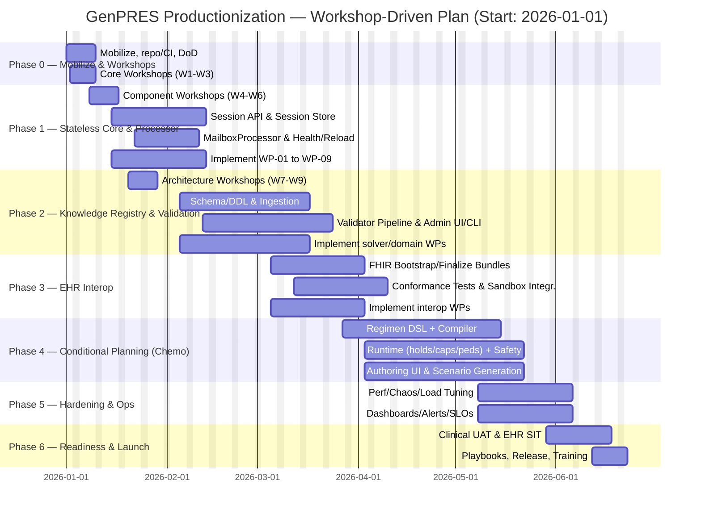

# GenPRES — Productionization Plan (Detailed) — F# Distributed Server–Client

## Version 4: With Technical Workshops & Work Package Definition

- [GenPRES — Productionization Plan (Detailed) — F# Distributed Server–Client](#genpres--productionization-plan-detailed--f-distributed-serverclient)
  - [Version 4: With Technical Workshops \& Work Package Definition](#version-4-with-technical-workshops--work-package-definition)
  - [1. Current State \& Gaps](#1-current-state--gaps)
  - [2. Technical Workshops \& Work Package Definition](#2-technical-workshops--work-package-definition)
    - [Purpose](#purpose)
    - [Workshop Schedule (Weeks 1-3 of Phase 0/1)](#workshop-schedule-weeks-1-3-of-phase-01)
      - [Core Technical Workshops](#core-technical-workshops)
        - [W1: Project Structure \& Governance (Day 2-3)](#w1-project-structure--governance-day-2-3)
        - [W2: GenSolver Optimization \& Performance (Day 4-5)](#w2-gensolver-optimization--performance-day-4-5)
        - [W3: Domain Modeling Extension (Day 8-9)](#w3-domain-modeling-extension-day-8-9)
      - [Specialized Component Workshops](#specialized-component-workshops)
        - [W4: GenPRES Emergency List Integration (Week 2)](#w4-genpres-emergency-list-integration-week-2)
        - [W5: Solver Deep Dive (Week 2)](#w5-solver-deep-dive-week-2)
        - [W6: Units Library Refactoring (Week 2)](#w6-units-library-refactoring-week-2)
        - [W7: UI Architecture \& Bindings (Week 3)](#w7-ui-architecture--bindings-week-3)
        - [W8: Server Architecture \& MCP Integration (Week 3)](#w8-server-architecture--mcp-integration-week-3)
        - [W9: Interoperability \& Standards (Week 3)](#w9-interoperability--standards-week-3)
    - [Workshop Outputs → Work Package Distribution](#workshop-outputs--work-package-distribution)
    - [Integration with Development Phases](#integration-with-development-phases)
  - [3. Scope — Missing Requirements to Implement (with acceptance criteria)](#3-scope--missing-requirements-to-implement-with-acceptance-criteria)
    - [3.1 Stateless Session Management (Server + Client)](#31-stateless-session-management-server--client)
    - [3.2 MailboxProcessor around GenOrder.Lib](#32-mailboxprocessor-around-genorderlib)
    - [3.3 Knowledge Registry (replace Google Sheets) + Formal Validation](#33-knowledge-registry-replace-google-sheets--formal-validation)
    - [3.4 EHR Interoperability (FHIR/IHE)](#34-ehr-interoperability-fhirihe)
    - [3.5 Conditional Planning Engine (Chemotherapy)](#35-conditional-planning-engine-chemotherapy)
    - [3.6 Feeding Prescribing Views (Enteral \& Parenteral)](#36-feeding-prescribing-views-enteral--parenteral)
    - [3.7 UI — Settings \& Planning](#37-ui--settings--planning)
    - [3.8 Quality, Security \& Compliance](#38-quality-security--compliance)
  - [4. Architecture (F#)](#4-architecture-f)
  - [5. Revised Plan \& Timeline](#5-revised-plan--timeline)
  - [6. Team — based on required expertise](#6-team--based-on-required-expertise)
    - [Core Development Team](#core-development-team)
    - [Workshop Contributors](#workshop-contributors)
    - [Support Roles](#support-roles)
  - [7. Milestones \& Exit Criteria (Workshop-Enhanced)](#7-milestones--exit-criteria-workshop-enhanced)
  - [8. Deliverables (Enhanced)](#8-deliverables-enhanced)
    - [Workshop Deliverables (New)](#workshop-deliverables-new)
    - [Core Deliverables](#core-deliverables)
  - [9. Risk Mitigation Through Workshops](#9-risk-mitigation-through-workshops)
    - [Technical Risks Addressed](#technical-risks-addressed)
    - [Process Risks Addressed](#process-risks-addressed)
  - [Appendix A — Work Package Template](#appendix-a--work-package-template)
  - [Appendix B — Validation Rules (excerpt)](#appendix-b--validation-rules-excerpt)
  - [Appendix C — Safety Controls (excerpt)](#appendix-c--safety-controls-excerpt)
  - [Appendix D — Expanded Chemotherapy Acceptance Pack](#appendix-d--expanded-chemotherapy-acceptance-pack)
    - [A. Regimen Authoring \& Compiler](#a-regimen-authoring--compiler)
    - [B. Runtime Evaluator — Dose Calculation \& Holds](#b-runtime-evaluator--dose-calculation--holds)
    - [C. Safety Hard‑stops \& Never Events](#c-safety-hardstops--never-events)
    - [D. Workflow Controls](#d-workflow-controls)
    - [E. Device Integration Hooks](#e-device-integration-hooks)
    - [F. Pediatric / Neonatal Specifics](#f-pediatric--neonatal-specifics)
    - [G. Reporting \& Audit](#g-reporting--audit)

**Start date:** 2026-01-01 · **Duration:** ~26 weeks · **Stack:** F# end‑to‑end (Server: Giraffe/Saturn; Client: SAFE/Fable/Elmish)

> **Note**: This document uses role-based placeholders (e.g., "F# Performance Expert", "Fable/UI Lead") instead of specific individual names to focus on required expertise rather than particular persons. Organizations can map these roles to available team members based on skills and availability.

## 1. Current State & Gaps

- **Core calculation engine** (order math with `OrderVariable` semantics) exists and supports "enter in any order" solving with precise units and BigRationals; selection flow hinges on `hasValues` vs `isSolved` distinctions and name‑based exclusions in some prescription types.
- **Data sources** are currently **Google Spreadsheets** configured via `GENPRES_URL_ID` with sheets for **Routes, Units, ShapeRoute, ValidShapes, Reconstitution, Enteral feeding (EntFeeding), Parenterals (ParentMeds)** and rule sets (**DoseRules, SolutionRules, RenalRules**). This creates governance and validation gaps for production.
- **Sessioning** is not yet stateless w.r.t. PHI; the **stateless proposal** defines clear EHR/GenPRES boundaries, required session lifecycle, and ops properties; needs implementation.
- **Processor**: a **MailboxProcessor** wrapper around `GenOrder.Lib` is proposed to centralize resource access, health, and reload; not yet implemented.
- **Chemo workflows** (conditional planning, safety, BCMA/pumps/compounding steps) are specified and require a dedicated regimen engine + UI.

> **Implication:** Move from demo/prototype data + ad‑hoc validation to a governed **Knowledge Registry** with formal validation and versioning; implement **stateless session** boundaries and an **EHR adapter**; add **chemo regimen planning** and **feeding** views.

## 2. Technical Workshops & Work Package Definition

### Purpose

Organize focused workshops to gather expertise, discuss architecture/implementation approaches, and produce clearly delimited work packages that can be distributed to developers with specific expertise.

### Workshop Schedule (Weeks 1-3 of Phase 0/1)

#### Core Technical Workshops

##### W1: [Project Structure & Governance](w1-project-structure-and-governance.md) (Day 2-3)

- **Participants**: F# API Expert, F# Backend Expert, Interop Specialist, PM
- **Objectives**:
  - Establish common GenPRES project structure for open source collaboration
  - Automated checks (pre-commit hooks, CI pipelines for formatting, testing, commit conventions)
  - Define CI/CD pipelines, documentation standards
  - Set up PR review processes, issue tracking, contribution guidelines
  - Setup semantic versioning and release management
  - Align with F# OSS best practices (FAKE, Paket/NuGet, Fantomas)
- **Deliverables**:
  - Monorepo vs multi-repo decision
  - CI/CD templates (GitHub Actions/Azure DevOps)
  - CONTRIBUTING.md, code review checklist
  - Work packages: WP-01 (Repo setup), WP-02 (CI/CD), WP-03 (Doc framework)

##### W2: GenSolver Optimization & Performance (Day 4-5)

- **Participants**: Domain Lead, F# Performance Expert, Optimization Specialist (optional)
- **Objectives**:
  - Profile current solver bottlenecks (BigRational ops, constraint propagation)
  - Explore optimization techniques (memoization, parallel solving, incremental computation)
  - Define performance benchmarks and targets
- **Deliverables**:
  - Performance baseline metrics
  - Optimization roadmap with specific techniques
  - Work packages: WP-04 (Profiling harness), WP-05 (Algorithm optimizations), WP-06 (Caching layer)

##### W3: Domain Modeling Extension (Day 8-9)

- **Participants**: DDD/Architecture Expert, F# Domain Modeling Expert (if available), Clinical Pharmacist
- **Objectives**:
  - Review GenForm/GenOrder domain models
  - Identify gaps for complex medication scenarios (tapers, alternating doses, PRN, ranges)
  - Design type-safe extensions maintaining composability
- **Deliverables**:
  - Extended domain model specifications
  - Migration strategy from current model
  - Work packages: WP-07 (Core type extensions), WP-08 (Scenario validators), WP-09 (Domain tests)

#### Specialized Component Workshops

##### W4: GenPRES Emergency List Integration (Week 2)

- **Participants**: Clinical Pharmacist, Backend team
- **Objectives**:
  - Define emergency medication workflows and constraints
  - Design solver integration for stat/urgent orders
  - Establish override patterns with audit
- **Deliverables**:
  - Emergency order specifications
  - Work packages: WP-10 (Emergency rules), WP-11 (Override framework)

##### W5: Solver Deep Dive (Week 2)

- **Participants**: F# Performance Expert, Domain Lead, F# API Expert
- **Objectives**:
  - Implement comprehensive logging and telemetry
  - Design error recovery strategies
  - Establish solver state inspection tools
- **Deliverables**:
  - Logging specification (structured, levels, correlation)
  - Error taxonomy and handling patterns
  - Work packages: WP-12 (Telemetry), WP-13 (Error handling), WP-14 (Debugger tools)

##### W6: Units Library Refactoring (Week 2)

- **Participants**: F# Performance Expert, QA/Testing Expert
- **Objectives**:
  - Review current units implementation pain points
  - Design improved API (builder pattern, conversions, composite units)
  - Plan backwards compatibility strategy
- **Deliverables**:
  - Units v2 API specification
  - Migration guide
  - Work packages: WP-15 (Core units refactor), WP-16 (Unit tests), WP-17 (Migration tooling)

##### W7: UI Architecture & Bindings (Week 3)

- **Participants**: Fable/UI Lead, Senior UI Developer, F# Backend Expert
- **Objectives**:
  - Evaluate JSX template approach vs alternatives
  - Design component library for medical UI patterns
  - Plan Fable 4 migration if applicable
- **Deliverables**:
  - UI component catalog
  - JSX binding improvements
  - Work packages: WP-18 (Component lib), WP-19 (Template engine), WP-20 (UI state management)

##### W8: Server Architecture & MCP Integration (Week 3)

- **Participants**: Interop Specialist, F# Backend Expert, AI/ML Integration Expert
- **Objectives**:
  - Design GenPRES server as Model Context Protocol (MCP) provider
  - Define AI-friendly API surface
  - Establish WebSocket/SSE patterns for real-time updates
- **Deliverables**:
  - MCP interface specification
  - AI integration patterns
  - Work packages: WP-21 (MCP server), WP-22 (AI adapters), WP-23 (Real-time layer)

##### W9: Interoperability & Standards (Week 3)

- **Participants**: Interop Specialist, Clinical team, EHR vendor reps
- **Objectives**:
  - Map GenPRES concepts to FHIR R4/R5 resources
  - Design IHE Pharmacy workflow integration points
  - Plan HL7v2 fallback for legacy systems
- **Deliverables**:
  - FHIR mapping specifications
  - IHE conformance profile
  - Work packages: WP-24 (FHIR adapters), WP-25 (IHE profiles), WP-26 (Legacy bridges)

### Workshop Outputs → Work Package Distribution

Each workshop produces 2-4 focused work packages with:

- Clear acceptance criteria
- Estimated effort (story points or hours)
- Required expertise tags (e.g., #performance, #domain, #ui, #interop)
- Dependencies on other packages
- Assignable to specific developers based on expertise match

### Integration with Development Phases

- **Phase 0**: Execute workshops W1-W3 (foundational)
- **Phase 1**: Execute workshops W4-W6 while implementing WP-01 through WP-09
- **Phase 2**: Execute workshops W7-W9 while implementing solver and domain packages
- **Phases 3-6**: Implement remaining work packages based on workshop outputs

## 3. Scope — Missing Requirements to Implement (with acceptance criteria)

### 3.1 Stateless Session Management (Server + Client)

**Implement:**

- `InitializeSession`(POST) → returns `SessionId`, pins resource versions, accepts EHR context (user roles, patient snapshot).  
- `Process`(POST) → pure commands against session state via `MailboxProcessor`; no PHI persisted.  
- `FinalizeSession`(POST) → returns order/lab deltas (FHIR bundle) and discards session.  
- In‑mem **SessionStore** with TTL, LRU eviction, metrics; concurrent clinician handling and idempotent replay.

**Acceptance:**

- Killing a pod during an active session and re‑issuing `Process` after `InitializeSession`+context replay resumes reliably; no PHI in storage or logs.  
- Session TTL expiry triggers EHR notification hook; metrics show cleanup and max‑concurrency thresholds.

### 3.2 MailboxProcessor around GenOrder.Lib

**Implement:**

- `OrderProcessor` with commands for order context, treatment plan, formulary, parenteralia; single‑threaded resource access, **/health** and **/reload** endpoints, back‑pressure (bounded queue).

**Acceptance:**

- Hot reload of Dose/Solution/Renal/Product rules with no request failures; /health exposes `IsLoaded`, `LastReloaded`, queue depth.

### 3.3 Knowledge Registry (replace Google Sheets) + Formal Validation

**Implement:**

- **Schema/DDL** mirroring existing sheets: `Routes, Units, ShapeRoute, ValidShapes, Reconstitution, EntFeeding, ParentMeds, DoseRules, SolutionRules, RenalRules`.  
- **Versioning** (semver + effective dates), **ownership**, four‑eyes approval for chemo regimens.  
- **Ingestion service** with deterministic loader building arrays for `IResourceProvider`.  
- **Validator pipeline**: schema → referential integrity → **clinical invariants** (dose bounds, route/shape rules, pediatric caps, renal applicability ≥28 days).

**Acceptance:**

- Any missing column or invalid value blocks publish with a precise error (sheet, row, column, rule).  
- A snapshot publish produces identical results to Sheets for a golden set of orders.

### 3.4 EHR Interoperability (FHIR/IHE)

**Implement:**

- **FHIR** R4 bundles for bootstrap (Patient, Practitioner, Observation, Medication, MedicationRequest, ServiceRequest) and finalize (MedicationRequest changes, worklist).  
- **IHE Pharmacy** mapping points for Medication Treatment Plan & Hospital Medication Workflow; durable IDs handled by EHR; **no PHI stored**.

**Acceptance:**

- Conformance tests pass for bootstrap/finalize; rate‑limit & burst tests ≥100 req/s pass.

### 3.5 Conditional Planning Engine (Chemotherapy)

**Implement:**

- **Regimen DSL** → compiler to Registry (cycles/days, premeds, hydration, monitoring).  
- **Runtime evaluator**: lab‑gated **holds**, dose‑modification rules, pediatric mg/kg & mg/m², max caps, cumulative dose tracking, contraindicated route **hard‑stops** (e.g., vinca minibag only).  
- **Safety controls**: two‑person verify, BCMA, smart‑pump auto‑programming hooks, gravimetric checks, intrathecal segregation.

**Acceptance (samples):**

- Attempted **vincristine syringe** order blocks with minibag policy; cannot sign.  
- **Carboplatin AUC** dose matches Calvert; changes to weight/SCr force re‑approval.  
- Gravimetric out‑of‑tolerance blocks label printing until remediated.

### 3.6 Feeding Prescribing Views (Enteral & Parenteral)

**Implement (UI+calc):**

- **Enteral**: kcal/kg targets, formula picker (from `EntFeeding`), rate titration, interruptions; totals by kcal/protein/carbs/fat and electrolytes.  
- **Parenteral**: macro/micro nutrients (ParentMeds) with constraints, osmolarity warnings, glucose infusion rate, central vs peripheral line rules, compounding labels.  
- Reuse `OrderVariable`/`hasValues` selection flow; add guardrails via `ShapeRoute` + reconstitution rules.

**Acceptance:**

- For a neonatal PN example, osmolarity limit violation prompts dilution or central‑line requirement; labels show composition and BUD.

### 3.7 UI — Settings & Planning

**Settings**: institution profile (units/routes), version pins, TTLs, alert thresholds (gravimetric %, cumulative dose caps), integration toggles (BCMA/pumps/robots).  
**Planning**: regimen timeline (cycles/days), chair/bed capacity, lab‑gated readiness, pause/hold logic visualization; pediatric recalc prompts.

### 3.8 Quality, Security & Compliance

- **Test strategy**: unit/integration/contract tests, golden data, chaos tests on session expiry/restart.  
- **Security**: OWASP ASVS L2, NEN 7510/7513 logging & audit; GDPR data minimization (no PHI storage).

## 4. Architecture (F#)

- **Server**: .NET 9 F# (Giraffe/Saturn), `MailboxProcessor` for resource isolation, `IServerApi` implementation exposing session/EHR endpoints.
- **Client**: SAFE/Elmish SPA; session‑aware containers; Settings/Planning/Feeding views.  
- **Registry**: PostgreSQL (or equivalent), ingestion service, validator lib; snapshots feed the processor via `IResourceProvider`.

## 5. Revised Plan & Timeline



## 6. Team — based on required expertise

### Core Development Team

- **Fable/UI Lead** - W7 lead, UI work packages
- **Senior UI Developer** - W7, UI components  
- **F# Backend Expert** - W1, W7, W8, integration
- **QA/Testing Expert** - W6, testing work packages
- **F# API Expert** - W1, W5, code standards
- **DDD/Architecture Expert** - W3 lead, domain modeling
- **F# Performance Expert** - W2, W5, W6 lead
- **Interop Specialist** - W1, W8, W9 lead

### Workshop Contributors

- **Optimization Specialist** (optional) - W2, optimization expertise
- **F# Domain Modeling Expert** (if available) - W3, domain modeling
- **AI/ML Integration Expert** (optional) - W8, AI/MCP integration
- **Clinical Pharmacist** - W3, W4, validation

### Support Roles

- **Project Manager** - Workshop coordination, WP tracking
- **DevOps/SRE** - W1, infrastructure work packages
- **Security Reviewer** - Security work packages


## 7. Milestones & Exit Criteria (Workshop-Enhanced)

- **M0 (Workshops)**: All 9 workshops completed; 26 work packages defined with clear owners.
- **M1 (P1)**: Stateless sessions + MailboxProcessor online; E2E calc via Session API; WP-01 to WP-09 complete.
- **M2 (P2)**: Knowledge Registry live; ingestion + validators; solver/domain WPs complete.
- **M3 (P3)**: FHIR bootstrap/finalize round‑trip; interop WPs complete.
- **M4 (P4)**: Regimen DSL+engine with holds/caps; UI WPs integrated.
- **M5 (P5)**: Perf/chaos tests, dashboards/alerts; all WPs complete.
- **M6 (P6)**: Clinical UAT with oncology pharmacist; go‑live playbooks.

## 8. Deliverables (Enhanced)

### Workshop Deliverables (New)

- 26 detailed work packages with acceptance criteria
- Architecture decision records (ADRs) from each workshop
- Technical specifications for each component
- Expertise mapping matrix (developer → work package)

### Core Deliverables

- F# server & SAFE client, Docker images, Helm charts
- Registry DDL/migrations, ingestion & validator libs
- MCP-enabled server for AI integration
- Refactored units library with improved API
- Component library for medical UI patterns
- Comprehensive test suites and conformance packs
- Emergency medication integration framework
- Complete documentation and runbooks

## 9. Risk Mitigation Through Workshops

### Technical Risks Addressed

- **Performance bottlenecks**: W2 establishes baseline and optimization path
- **Domain complexity**: W3 with F# Domain Modeling Expert ensures proper modeling
- **Integration challenges**: W9 maps standards early
- **UI consistency**: W7 establishes component patterns upfront

### Process Risks Addressed

- **Coordination overhead**: W1 establishes clear governance
- **Expertise gaps**: Workshops identify and fill knowledge gaps
- **Scope creep**: Work packages have fixed boundaries
- **Quality issues**: W5 establishes logging/monitoring early

---

## Appendix A — Work Package Template

Each work package from workshops includes:

```yaml
WP-ID: WP-XX
Title: [Descriptive title]
Workshop: W[1-9]
Owner: [Primary developer]
Expertise: [#tags]
Dependencies: [WP-YY, WP-ZZ]
Effort: [Story points or hours]
Phase: [P0-P6]

Description: |
  Clear description of what needs to be built

Acceptance Criteria:
  - [ ] Specific measurable outcome 1
  - [ ] Specific measurable outcome 2
  - [ ] Test coverage ≥ 90%
  - [ ] Documentation complete

Technical Notes:
  - Key decisions from workshop
  - Preferred approaches/patterns
  - Integration points
```

## Appendix B — Validation Rules (excerpt)

- **Routes/Units** must exist and be mapped (no free‑text); **ShapeRoute** must define dose/timed/reconstitution flags per route/form.  
- **RenalRules** only apply for age ≥28 days; enforce nephrology guidelines; rejection on out‑of‑range GFR.  
- **Reconstitution** must list acceptable diluents; reject unknown diluent names.  
- **EntFeeding/ParentMeds** numeric composition required; units normalized; osmolarity/line rules enforced at runtime.

## Appendix C — Safety Controls (excerpt)

- Vinca minibag enforcement, BCMA everywhere, gravimetric tolerances, two‑person checks, pump auto‑programming ACKs, intrathecal segregation.

## Appendix D — Expanded Chemotherapy Acceptance Pack

### A. Regimen Authoring & Compiler

- **Acceptance**: Authoring UI allows definition of cycles (e.g., 21‑day CHOP), days (Day 1: cyclophosphamide, doxorubicin, vincristine; Day 5: prednisone taper), with support for pre‑medications, hydration, monitoring steps.
- **Validation**: Attempt to save regimen missing hydration pre‑med step yields error. Attempt to assign drug not in formulary is blocked.

### B. Runtime Evaluator — Dose Calculation & Holds

- **Carboplatin AUC**: Dose = AUC × (GFR + 25). Acceptance if computed dose matches Calvert formula ±0.1%. Change in SCr triggers recalculation and flags "re‑approval required".
- **Pediatric mg/m²**: For a child (BSA 0.6 m², protocol 75 mg/m²), correct dose 45 mg ± rounding. Max cap of 2 mg/kg enforced where specified.
- **Renal hold**: If GFR < 30 mL/min/1.73 m², flagged "do not proceed", order cannot be signed until override documented.

### C. Safety Hard‑stops & Never Events

- **Vinca alkaloids**: Order in "syringe" form factor is blocked; minibag enforced. Attempt yields error "Vinca must be minibag — safety stop".
- **Intrathecal segregation**: Any vinca marked contraindicated for intrathecal; cannot co‑sign with intrathecal cytarabine/methotrexate in same session.
- **Anthracycline cumulative dose**: If cumulative doxorubicin > 550 mg/m², further cycles require cardiology override. Runtime evaluator enforces block.

### D. Workflow Controls

- **Two‑person verify**: At both prescription and compounding, system requires independent second sign‑off. Acceptance: one user cannot satisfy both roles.
- **Gravimetric checks**: For compounding step, if measured ± system‑calc weight deviates by >10%, block label print and require supervisor override.

### E. Device Integration Hooks

- **Smart pump programming**: Export of infusion parameters (drug, rate, volume) as pump‑ready profile; acceptance when external pump simulator loads file with no manual edits.
- **BCMA scanning**: Simulated nurse scan of patient wristband + drug vial must match system order; mismatch blocks administration.

### F. Pediatric / Neonatal Specifics

- **Neonatal PN**: For a 3 kg neonate, parenteral osmolarity > 900 mOsm/L flagged as "central line required" before sign‑off.
- **Cumulative lifetime anthracycline tracking**: Across multiple protocols, totals roll up per patient, enforced at runtime.

### G. Reporting & Audit

- **Audit log**: Every regimen publish, override, hold, and block event logged with user, timestamp, clinical justification.
- **Regimen versioning**: Attempt to start a cycle with outdated regimen version triggers warning and requires confirmation.

---

*End of Updated Production Plan v4*

