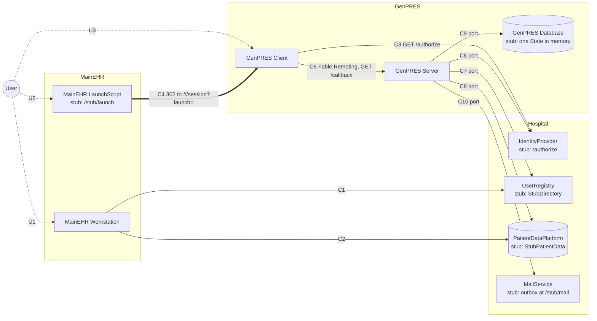

# Who may reach whom

The ten communication edges of the design, and what each one is in the code today. A pair
with no edge here cannot exchange data at all, and edges do not compose: nothing relays on
another's behalf.

**Solid arrows** are request and reply on one connection, in that direction only.
**The double arrow** (C4) is a launch: one way, no reply, no error path back.
**Dotted arrows** are a person reading a screen and acting on it.

## What each edge is today

| Edge | In the code | Where |
|------|-------------|-------|
| C4 | `POST /stub/launch` answers a `302` to `/#/session?launch=…`; the Launch travels in the URL hash and never reaches the Server as a request | `Server.fs`, `StubLaunch` in `ServerApi.StubAdapters.fs` |
| C5 | the members of `IServerApi` under `/api/…` (`processLaunch`, `processSession`, `processSigning`, and the five computing members), plus `GET /callback` | `Shared/Api.fs`, `Server.fs` |
| C3 | `GET /authorize` on the same host: the stub IdentityProvider issues a one-time code for the identity chosen on the stub page and redirects to `/callback` | `Server.fs` |
| C6 | `IdentityProviderPort.redeem`, called inside the callback; the stub answers from its code store | `ServerApi.Ports.fs`, `StubDirectory` |
| C7 | `UserRegistryPort.standing`, asked at the callback, again when a PIN is supplied, and again at every signature | `ServerApi.Ports.fs`, `StubDirectory` |
| C8 | `PatientDataPort.read`, at the open and again at every challenge | `ServerApi.Ports.fs`, `StubPatientData` |
| C9 | `SessionPort`: every transition is a pure function over one `Session.State`, run under one lock, forgotten at a restart | `ServerApi.Session.fs`, `StubDatabase` |
| C10 | `MailPort.send`, fire and forget; the stub appends to an outbox the tester reads at `/stub/mail` | `ServerApi.Ports.fs`, `StubMail` |
| C1, C2 | MainEHR's own; nothing in this repository | — |

In production (`GENPRES_PROD=1`) the stub routes are not mounted, `/callback` redirects to
`/#/session?refused=invalid`, and the session port is `Adapters.sessionDisabled`, which refuses
every launch, session and signing member; the computing members work as before. What
production exposes is [#580](https://github.com/informedica/GenPRES/issues/580).

## What the shape says

**The Server is the hub, and nothing reaches back into it.** Every GenPRES edge points out of
the Server except C5, which points in from its own Client. There is no arrow from the Server to
a Client, so a Client learns its Session ended only at its next request; until then it shows a
live-looking screen. The code keeps this: an ending is carried on the reply to the next request
(`Reply.Notice`) or answered to the next `GetSession`, never pushed.

**One thing crosses, and a key is all that seals it.** The LaunchScript reaches exactly one
thing: the browser it opens. The only thing that crosses from one side to the other is the
Launch itself, carried by the browser and presented by it, and the key that seals it is all
that authenticates it (`LaunchSeal` in `ServerApi.Session.fs`: an HMAC under a key the demo
server makes at start). Both sides reach the `PatientDataPlatform` and the `UserRegistry`, but
those are the hospital's, not each other's: no channel runs between MainEHR and GenPRES.

**Nothing can be sent back to the LaunchScript.** C4 is one-way by construction: the stub page
answers a redirect and is done. The script exits at the launch, and no later failure can reach
it.

**Two boxes are asked, not told.** The IdentityProvider says who is at a browser; the
UserRegistry says what that person may do and which Patient they have active. Neither answers
the other's question, and the Server asks both at every launch.

**No Client-to-Client edge.** The design's carry-over of unsigned work from an old tab to a new
one (UC-8 step 3) would be a read inside the browser, not a message; it is not built
([#518](https://github.com/informedica/GenPRES/issues/518)).

---

Read off `ServerApi.Ports.fs` (the ports), `ServerApi.StubAdapters.fs` (the stand-ins) and
`Server.fs` (the routes and cookies) in `src/Informedica.GenPRES.Server/`. The design's edge
table is the `Edges` module in [`Integration.fsx`](Integration.fsx).
