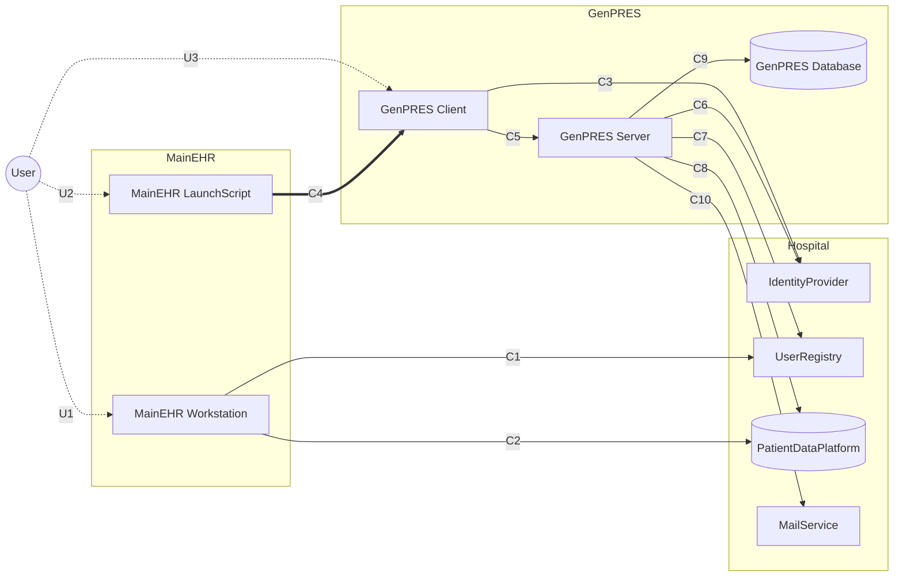

# Who may reach whom

The ten communication edges, exactly as [`Integration.fsx`](Integration.fsx) declares them in
its edge table. A pair with no edge here cannot exchange data at all, and edges do not
compose — nothing relays on another's behalf.

**Solid arrows** are request and reply on one connection, in that direction only.
**The double arrow** (C4) is a launch: one way, no reply, no error path back.
**Dotted arrows** are a person reading a screen and acting on it.

## What the shape says

**The Server is the hub, and nothing reaches back into it.** Every GenPRES edge points
out of the Server except C5, which points in from its own Client. There is no arrow
from the Server to a Client, so a Client only learns its Session ended at its next
request — until then it shows a live-looking screen.

**One thing crosses, and a key is all that seals it.** The LaunchScript reaches exactly
one thing: the browser it opens. The only thing that crosses from one side to the other
is the Launch itself, carried by the browser and presented by it — and the key that seals
it is all that authenticates it. Both sides do reach `PatientDataPlatform` and
`UserRegistry`, but those are the hospital's, not each other's: no channel runs between
MainEHR and GenPRES themselves.

**Nothing can be sent back to the LaunchScript.** C4 is one-way, so this is true by
construction rather than by discipline: the wire does not exist. The script exits at
the launch, and no later failure can reach it.

**Two boxes are asked, not told.** The IdentityProvider says who is at a browser; the
UserRegistry says what that person may do. Neither answers the other's question, and
the Server asks both at every launch.

---

The model checks this table before delivering anything, so an envelope no edge permits
never reaches its recipient — see the `Edges` module in
[`Integration.fsx`](Integration.fsx).
