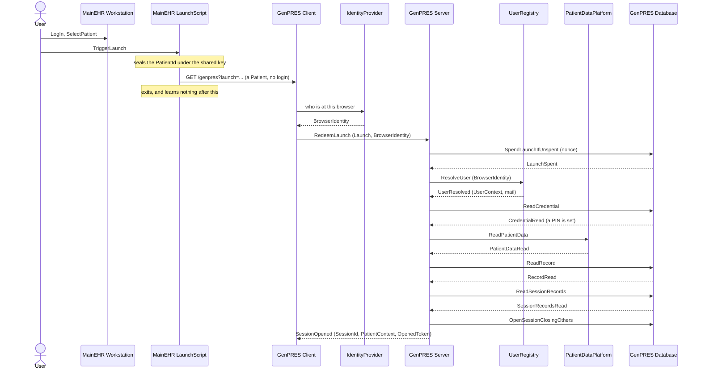

# The launch flow

How a User gets from a patient open in MainEHR to a GenPRES Session for that patient
— UC-1's main path, as [`Session.fsx`](Session.fsx) actually runs it. The messages
below are the ones in its trace, not a sketch of them.

## Reading it

Three things the shape is meant to make obvious.

**The Launch names a Patient and nothing else.** It carries no login, so nothing the
LaunchScript says decides who the Session belongs to. That comes from the browser, and
only from there.

**Two different questions, two different actors.** *Who is this* is the
IdentityProvider's answer; *what may they do* is the UserRegistry's. Neither answers
the other's question, and the Server asks both at every launch.

**The LaunchScript is gone after the third message.** It opens the browser and exits,
so no failure after that point can reach it — every error from there on is the
Client's to show, except a Server that is down, which leaves no Client to show
anything.

## What it leaves out

- **The refusals.** A launch can fail at each step — no identity, no Role, no PIN set,
  a Launch that is forged, expired or already spent. All of them end the same way: no
  Session opens, and at most the Client offers an anonymous open instead.
- **The identity round trip is drawn as the design specifies it, not as the model runs
  it.** `Session.fsx` carries the BrowserIdentity as a value the browser presents
  rather than as a sign-on exchange; what it enforces is the rule, not the protocol.
- **Everything after the launch** — prescribing, saving, signing, discarding — and the
  thirteen other use cases.

---

Generated from the run of [`Session.fsx`](Session.fsx); the full trace of all fourteen
use cases is written to `Session.run.txt` beside it when the script runs.
