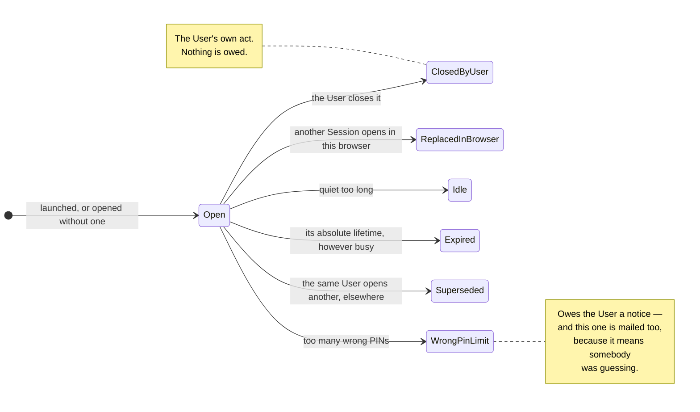
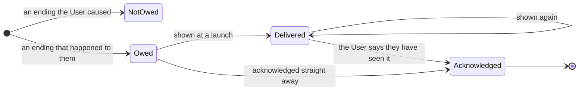

# How a Session ends, and who gets told

Six ways, and they are not equivalent: two are the User's own doing and owe them
nothing, four happen *to* them and owe an explanation.

A Server restart is **not** among them. There is no Session state in the Server to
lose: a Session's standing lives in its record and its work lives in the Client, so a
restart ends nothing and the next request carries on.

## The two that owe nothing

**`ClosedByUser`** and **`ReplacedInBrowser`** are the same idea twice. The User closed
this Session, or they opened another one in this browser — either way they did it, so
there is nothing to tell them. Opening a Session where one already stands is not an
accident to be reported; it is what the User asked for.

## The four that owe

**`Idle`**, **`Expired`**, **`Superseded`** and **`WrongPinLimit`** all happened *to*
the User. They may have unsaved work on a screen that still looks alive — the Server
cannot reach a Client, so nothing warned them — and they are owed an account of it.

`Superseded` is the interesting one: the User did open another Session, but somewhere
else. The Session that ends is the one they walked away from, possibly with work in it,
so it is not the same as replacing one in front of them.

## What "owed" means

An obligation with three steps, and only the last of them ends it.

**Delivery is not the end of it.** The Server cannot see a screen, so it can never know
a Client showed anything — which is why `Delivered` loops. Better twice than never.
What discharges the obligation is the User saying they have seen it, and after that it
never returns.

**It is discharged at a launch, and nowhere else.** A Client still holding the ended
SessionId is refused and told what ended, but that discharges nothing: whoever is
holding it need not be the User — it may be whoever sat down at the workstation next.
Only a live, launched Session of that same User can acknowledge, because a fresh login
stands behind it.

**An anonymous Session owes nothing, whatever ends it.** The obligation is to the
Session's User, and an anonymous Session has none. There is nobody an ending could
reach.

---

Drawn from `EndMark`, `SessionNotice` and `owesNotice` in [`Integration.fsx`](Integration.fsx),
with Rules 10 and 11.
