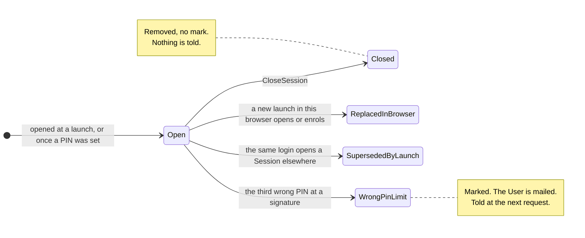
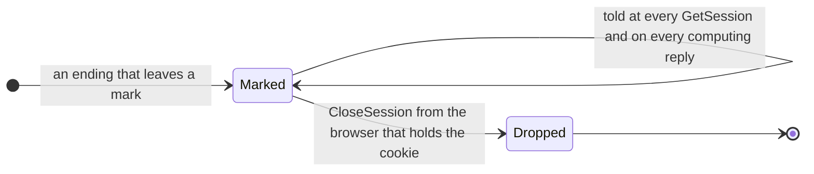
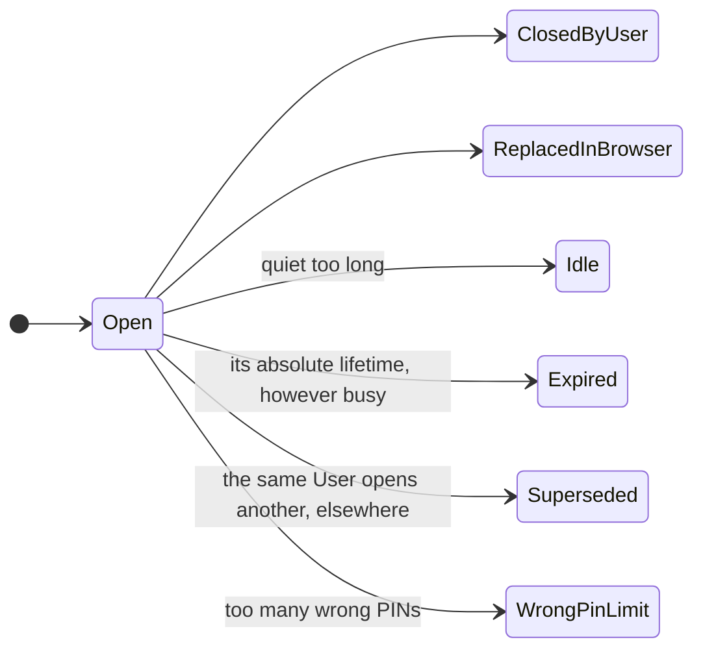

# How a Session ends, and who gets told

The code has two endings that leave a mark, and two ways a Session goes without one. The
design asks for six endings and an obligation that only the User can discharge; that is the
last section.

`SessionEnding` in `src/Informedica.GenPRES.Shared/Types.fs` has exactly the two marked cases,
`SupersededByLaunch` and `WrongPinLimit`. There is no idle clock and no absolute lifetime: the
Session record keeps a `Seen` timestamp that every request refreshes, and nothing reads it.

## The two that leave no mark

**Closed.** `CloseSession` removes the Session from the state, removes any mark it had, and
deletes the cookie. The User did this, so nothing is told, now or later
([uc-10](uc-10-close.md)).

**Replaced in its browser.** A new launch in the same browser writes a new session cookie over
the old one when it opens, and closes the old Session outright when it suspends into enrolment.
Either way the old Session is not marked: the User asked for the new one. A Session of another
login that was merely overwritten stays in memory, unreachable, until the login it belongs to
opens elsewhere.

## The two that leave a mark

**Superseded by a launch.** A User has at most one open Session. The open of a new one
(`Session.openWith`) removes every other Session of the same login and marks each
`SupersededByLaunch`, in the same act ([uc-08](uc-08-session-ends.md)).

**The wrong-PIN limit.** The third wrong PIN at a signature removes the Session, marks it
`WrongPinLimit`, drops its challenge and mails the User at the address the registry gave
([uc-05](uc-05-workstation-takeover.md)). The lock on signing belongs to the credential, not to
the Session, and outlives it.

## How a mark is told, and dropped

A browser that still sends the ended Session's cookie is told at every `GetSession`
(`SessionResponse.SessionEnded`) and on every computing reply (`Reply.Notice` =
`RecordNotice.Ended`), until it answers `CloseSession`, which drops the mark with the Session.
Better twice than never: a notice lost in transit is repeated, not lost.

What the design asks for beyond that, the code does not do:

- **The Client acknowledges by itself.** On being told, the Client shows the gate and sends
  `CloseSession` at once. So whoever holds the screen discharges the mark, which in
  [uc-05](uc-05-workstation-takeover.md) is the person who was guessing.
- **Nothing is told at a launch.** Neither the presentation nor the callback reads the marks.
  A User who launches again learns nothing of the Session that ended; for the PIN limit the
  mail is the only notice.
- **A restart forgets the marks**, and the Sessions with them. The next request from a browser
  finds no Session under its cookie, and the Client opens anonymously without a notice. The
  design's "a restart ends nothing" waits on the store of
  [#516](https://github.com/informedica/GenPRES/issues/516).

## Designed, not built

The design ([Rules 10 and 11](GenPRES-MainEHR-Integration-V8.md)) names six endings, and
divides them by who caused them: two are the User's own doing and owe them nothing, four happen
*to* them and owe an explanation.

An ending that is owed goes through three states, and only the last of them ends it: *owed*,
then *delivered* (shown at a launch, and shown again until acknowledged), then *acknowledged*
by the User, from a live, launched Session of their own, because a fresh login stands behind
that and nothing else. A Client that merely holds the ended SessionId is refused and told, but
discharges nothing: whoever holds it need not be the User. An anonymous Session owes nothing,
whatever ends it.

Of this the code has `Superseded` (as `SupersededByLaunch`) and `WrongPinLimit`, told at the
next request rather than at the next launch, and acknowledged by the Client rather than by the
User. `Idle` and `Expired` are not built, and neither is the acknowledgement as the design
means it. The MVP overview lists both as issues to file
([mvpap2019-gap-overview.md](../../roadmap/mvpap2019-gap-overview.md), rows 2.1.5 and 2.1.6).

---

Read off `SessionEnding` in `src/Informedica.GenPRES.Shared/Types.fs` and `openWith`, `find`,
`seen`, `close` and `commit` in `src/Informedica.GenPRES.Server/ServerApi.Session.fs`; the
Client's side is `SessionMachine.fs` in `src/Informedica.GenPRES.Client/`. The design's
endings are `EndMark`, `SessionNotice` and `owesNotice` in [`Integration.fsx`](Integration.fsx).
