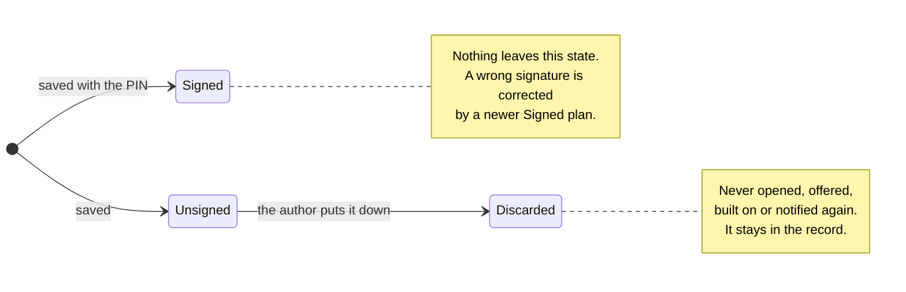

# What becomes of a TreatmentPlan

Three states, and almost no movement between them. A plan's content never changes; the
state is the one thing about it that ever does, and it moves at most once.

## Reading it

**There is no arrow into `Signed`.** A plan is born signed or it is never signed at
all: signing is saving while supplying a PIN, and a plan that was saved without one
can only be superseded by a new plan whose base is the old. Nothing is ever edited.

**There is no arrow out of `Signed`.** What a signature attested, it attested. A plan
signed on the wrong patient is not withdrawn; a newer signed plan corrects it, and both
stay in the record.

**`Discarded` is a dead end reachable from one place.** Only the author, only their own
most recent unsigned plan, and it needs no PIN — putting your own draft down attests to
nothing and builds on nothing, so a signature that landed meanwhile does not block it.

**Nothing is ever deleted.** All three states stay in the patient's record, which is
append-only. Discarding changes which plan the next session starts from; it removes
nothing.

## Why a state and not a flag

The alternative was to keep two states and filter discarded plans out wherever they
would be a nuisance. Four rules ask questions of a patient's record — what counts
clinically, what a session starts from, what may be opened, whose unsigned work must be
disclosed — and a filter would have to be remembered in all four.

As a state, a discarded plan is neither `Signed` nor `Unsigned`, so it falls out of all
four without any of them mentioning it. That is checked directly: no discarded plan is
ever returned by any of them, and none reaches the clinical store.

---

Drawn from the `PlanState` type and Rules 15 and 47 in [`Session.fsx`](Session.fsx).
