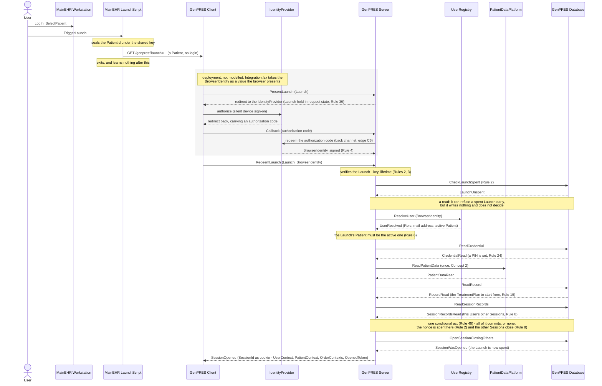
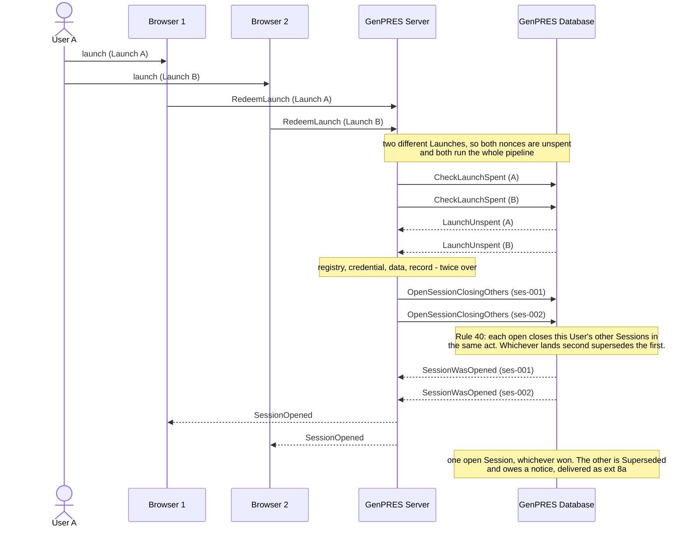

# The launch flow

How a User gets from a patient open in MainEHR to a GenPRES Session for that patient
— UC-1's main path as the model specifies it. The messages below are the ones in
its trace, not a sketch of them.

## Reading it

Four things the shape is meant to make obvious.

**The Launch names a Patient and nothing else.** It carries no login, so nothing the
LaunchScript says decides who the Session belongs to. Who is at the browser only the
IdentityProvider can say, and its answer reaches the Server signed, on the Server's
own connection — never through the Client's hands.

**Two different questions, two different actors.** *Who is this* is the
IdentityProvider's answer; *what may they do, and on which Patient* is the
UserRegistry's. Neither answers the other's question, and the Server asks both at
every launch.

**The check and the spend are two different things.** `CheckLaunchSpent` is a read
near the top: it refuses a Launch that was plainly spent before the Server fetches
anything for it. It does not decide, and by the time the open runs its answer may be
out of date. What decides is `OpenSessionClosingOthers`, which spends the nonce in the
same act that writes the record — so a launch cannot spend a nonce and then fail to
open, and two presentations that both passed the check cannot both open.

**The LaunchScript is gone after the third message.** It opens the browser and exits,
so no failure after that point can reach it — every error from there on is the
Client's to show, except a Server that is down, which leaves no Client to show
anything.

## What it leaves out

- **The refusals.** A launch can fail at each step — no identity, no Role, another
  active Patient, a Launch that is forged, expired or already spent. All of them end
  the same way: no Session opens, and at most the Client offers an anonymous open
  instead (Rule 7).
- **The PIN detour.** A Prescriber with no PIN is not refused: the launch suspends
  into UC-2 — a confirmation code is mailed, the PIN is set, and the launch continues
  at the data fetch. Only an enrolment abandoned or failed leaves no Session (Rule 7),
  and the cure is a relaunch.
- **The audit.** Every launch, honoured or refused, is appended to the audit
  (Rule 46); drawing each append would double the diagram.
- **Everything after the launch** — prescribing and signing, and the ten other use
  cases.
- **The second code.** UC-2 and UC-6 mail a *confirmation code* to set or replace a
  PIN. It is a different thing from the authorization code above, which belongs to the
  identity round trip and never leaves the browser and the two servers.

## Two launches at once (ext 8b)

Rule 8 is a count, and a count read and then written back is a race. Two launches of
User A — two Launches, two browsers — run through to the open together.

Both browsers are told a Session opened, and only one of them still has it. That is not a
lost update: the Database decided, and the loser's Client learns at its next request that
the Session it holds has ended (Rule 11). Rule 8's limit is per User, so this is the same
mechanism as ext 8a — an earlier Session closed by a later launch — arriving at once
rather than in sequence.

This is a different race from the one over a single Launch, where two presentations of the
*same* nonce contend. There the spend inside the open decides and exactly one Session
opens; here there are two Launches and two nonces, and what contends is the per-User
limit.

---

Drawn from UC-1 in [`Integration.fsx`](Integration.fsx), which carries this revision. The
full trace of all eleven use cases is written to `Integration.run.txt` beside it when
the script runs.
