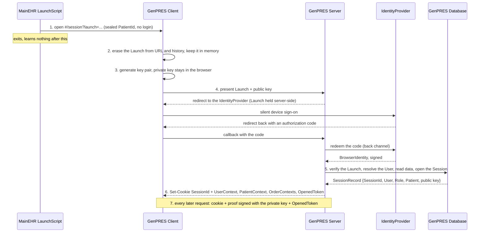
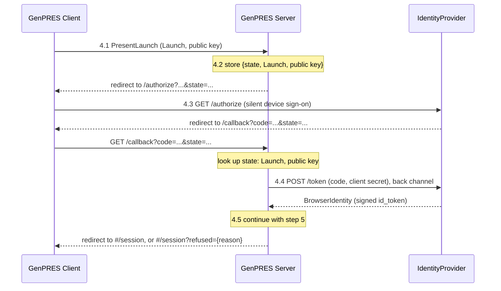
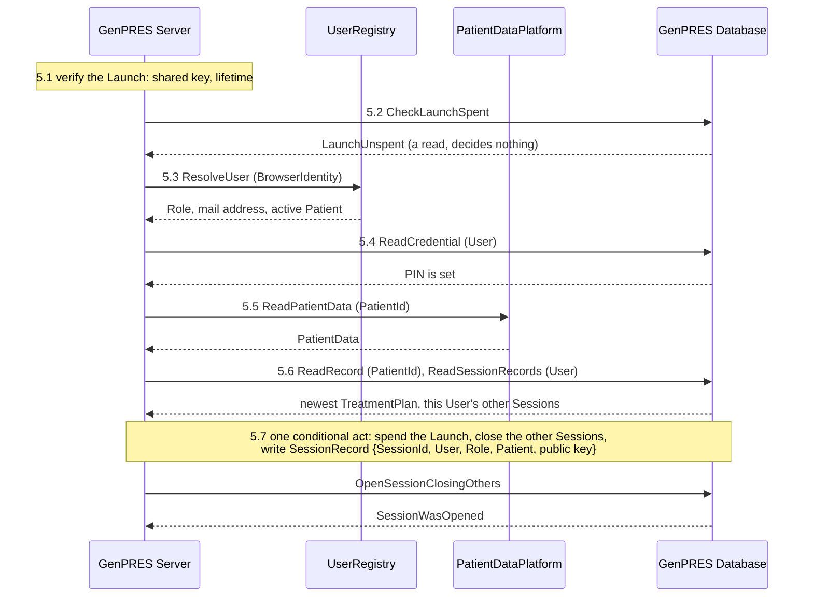
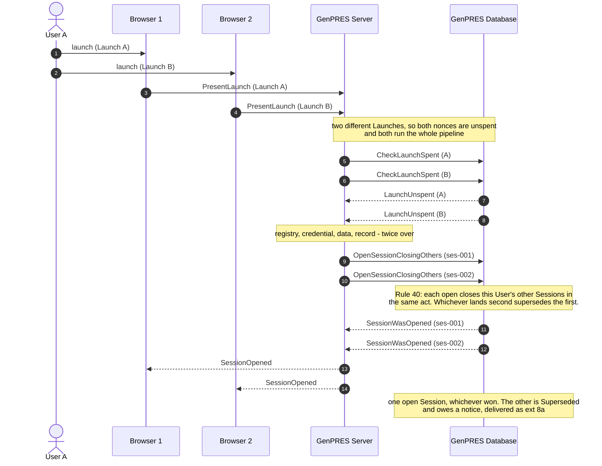

# The launch sequence

How a User gets from a patient open in MainEHR to a GenPRES Session for that patient: UC-1's
main path. The overview numbers the steps; the sections after it zoom in on the steps that
have sub-steps. Rule and Concept numbers cite
[GenPRES-MainEHR-Integration-V8.md](GenPRES-MainEHR-Integration-V8.md).

This page goes one step beyond the trace in [`Integration.fsx`](Integration.fsx): the browser
key pair of step 3 and the signed request of step 7 are not in the script yet.

## Overview

| # | Step | What happens |
|---|------|--------------|
| 1 | Launch | The LaunchScript seals the PatientId under the key it shares with the Server, opens the browser on `#/session?launch={token}`, and exits. The Launch is single use and short-lived (Rules 2, 3, 29) and carries no login (Rule 4). |
| 2 | Erase | The Client removes the Launch from the URL and the browser history and keeps it only in memory, for retries within its lifetime (Rule 39). |
| 3 | Key pair | The Client generates a key pair with WebCrypto. The private key is not extractable and is stored in IndexedDB under the public key's thumbprint, next to keys of earlier launches in this browser. The public key goes with the Launch. |
| 4 | Identity | The Client presents the Launch and the public key. The Server sends the browser to the IdentityProvider and gets it back with a signed BrowserIdentity over its own connection, never through the Client's hands. See [Step 4](#step-4-the-identity-round-trip). |
| 5 | Verify and open | The Server verifies the Launch, asks the UserRegistry for the Role and the active Patient, reads the patient data and the record, and opens the Session in one act that stores the public key in the SessionRecord. See [Step 5](#step-5-verify-and-open). |
| 6 | Session open | The response sets the SessionId as an HttpOnly, Secure, SameSite=Strict cookie (Rule 12) and returns UserContext, PatientContext, the OrderContexts to start from, the OpenedToken (Rule 34) and the thumbprint of the Session's public key. The Client deletes the private keys of other launches; the Session they belonged to is closed by this open (Rule 8). The Client keeps these in memory and shows the patient. |
| 7 | Every later request | The cookie says which Session, a proof signed with the private key says which browser, the OpenedToken says which TreatmentPlan was opened. See [Step 7](#step-7-a-signed-request). |

Two questions, two answers: *who is this* is the IdentityProvider's answer (step 4), *what may
they do, and on which Patient* is the UserRegistry's (step 5). The Server asks both at every
launch, and nothing the Launch says decides either.

## Step 4: the identity round trip

- **4.1** The Client presents the Launch and the public key.
- **4.2** The Server generates a random `state`, stores the Launch and the public key under
  it (a server-side record, or an encrypted cookie), and redirects the browser to the
  IdentityProvider with that `state`.
- **4.3** The IdentityProvider signs the device on silently and redirects the browser to the
  Server's callback with an authorization code and the `state`.
- **4.4** The Server looks up the `state`, redeems the code on its own connection to the
  IdentityProvider (edge C6), and receives the signed BrowserIdentity (Rule 4).
- **4.5** The Server continues with step 5 and answers the callback with a redirect to
  `#/session`. On refusal it opens nothing and redirects to `#/session?refused={reason}`.
  A reason is not a secret; the Launch never appears in that URL. The Server keeps the
  outcome under `state` for the Launch's lifetime: a browser that reloads the callback URL,
  whose code the IdentityProvider has already redeemed, is answered as the first time
  (Rule 45).

The redirect in 4.2 unloads the Client, so the Client cannot keep the Launch across the hop.
It does not need to: the Launch stays on the Server from 4.2 to 4.5, and the Client only runs
again when the launch is finished. For the same reason a refusal at 4.4 cannot be retried by
the Client; it asks for a relaunch. The Server could offer the retry itself, since it still
holds the Launch under `state`, by putting a link on the refusal that restarts 4.2. That is an
option for the identity hop's own plan, not part of this page's sequence.

## Step 5: verify and open

- **5.1** Verify the Launch: sealed under the shared key, within its lifetime (Rules 2, 3).
- **5.2** Check whether the Launch is already spent. This is a read: it refuses a plainly spent
  Launch before the Server fetches anything, but it decides nothing.
- **5.3** Ask the UserRegistry for the Role (Rule 5), the mail address, and the Patient this
  User has active in MainEHR. That Patient must be the Launch's (Rule 6).
- **5.4** Check that a PIN is set (Rule 24). A Prescriber without one goes through UC-2 and
  the launch continues at 5.5 afterwards.
- **5.5** Read the patient data from the PatientDataPlatform, once (Concept 2).
- **5.6** Read the newest TreatmentPlan to start from (Rule 19) and this User's other open
  Sessions (Rule 8).
- **5.7** Open the Session in one conditional act (Rule 40): spend the Launch, close the other
  Sessions, write the SessionRecord with the public key. All of it commits, or none.

The check in 5.2 and the spend in 5.7 are two different things. By the time the open runs the
check may be out of date. What decides is the open, which spends the Launch in the same act
that writes the record. So a launch cannot spend a Launch and then fail to open, and two
presentations that both passed the check cannot both open.

## Step 7: a signed request

Every request after the launch carries two things:

- the SessionId cookie, which names the Session;
- a proof signed with the private key from step 3, which names the browser. It covers the
  HTTP method, the URL, a hash of the body, the time, a unique id, and the OpenedToken, which
  names the TreatmentPlan the Session opened with (Rule 34). This is the DPoP pattern
  ([RFC 9449](https://www.rfc-editor.org/rfc/rfc9449)).

The Server reads the SessionRecord by SessionId, verifies the signature against the stored
public key, checks method, URL, body hash, time and uniqueness, and compares the OpenedToken
with the head of the record. If a newer TreatmentPlan exists, the response says so (Rule 21).

Implementing the signed proof is a later plan. The key pair is generated at the launch so
that the SessionRecord already holds the public key when that plan lands. Keys are kept per
thumbprint so that a second launch in another tab, if refused, cannot take the first tab's
key away.

## Retries

A presentation can be repeated within the Launch's lifetime: after a lost response, or after
a transient refusal such as an unreachable IdentityProvider. The public key correlates the
repeat. A second presentation with the same public key is answered as the first was and gets
the same cookie; nothing opens twice (Rule 2, same browser). A presentation with another public
key, or with none, is refused as spent: the Server cannot tell it from another browser. After
the lifetime the Launch is expired.

Rule 2 names the BrowserIdentity as the same-browser test. This page uses the public key,
because the Server has it at every presentation, before the identity is known; the
BrowserIdentity is a second test once the hop is done. Naming both in Rule 2 is a follow-up
on V8.

## Refusals

Every refusal ends the same way: no Session opens (Rule 7), and the Client shows the reason.

| Refusal | Fails at | The Client offers | V8 |
|---------|----------|-------------------|----|
| Launch expired, spent, or not sealed under the key | 5.1, 5.2 | a relaunch from MainEHR | ext 4a |
| No BrowserIdentity | 4.4 | a relaunch; the Client has no Launch left after the redirect | ext 3c |
| No Role | 5.3 | a fresh anonymous open that carries nothing over (UC-7) | ext 5a |
| Another active Patient, or none | 5.3 | a relaunch after activating the right Patient | ext 5b |
| No PIN | 5.4 | enrolment (UC-2); abandoned enrolment leaves no Session | ext 5d |
| Server unreachable after the page was served | 4 | automatic retries from memory, then a Retry button | ext 3a |

## Two launches at once (ext 8b)

Rule 8 is a count, and a count read and then written back is a race. Two launches of User A,
two Launches in two browsers, run through to the open together.

Both browsers are told a Session opened, and only one still has it. The Database decided, and
the loser's Client learns at its next request that its Session has ended (Rule 11). This is a
different race from two presentations of the *same* Launch: there the spend inside the open
(5.7) settles it and exactly one Session opens; here two Launches contend for the per-User
limit.

## Left out

- **The PIN detour.** A Prescriber with no PIN is not refused: the launch suspends into UC-2
  and continues at 5.5 once the PIN is set.
- **The audit.** Every launch, honored or refused, is appended to the audit (Rule 46).
- **Everything after the launch**: prescribing and signing, and the ten other use cases.
- **The confirmation code.** UC-2 and UC-6 mail a code to set or replace a PIN. It is not the
  authorization code of step 4, which never leaves the browser and the two servers.

---

The trace in [`Integration.fsx`](Integration.fsx) carries UC-1 without the key pair and the
signed request. Bringing the script, and the README's rule that the trace is right, in line
with this page is a follow-up.
