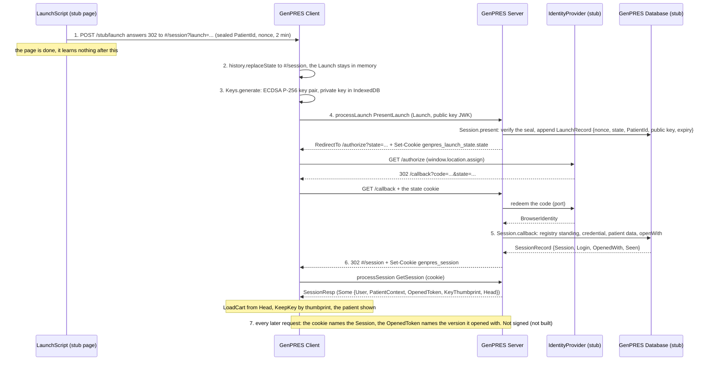
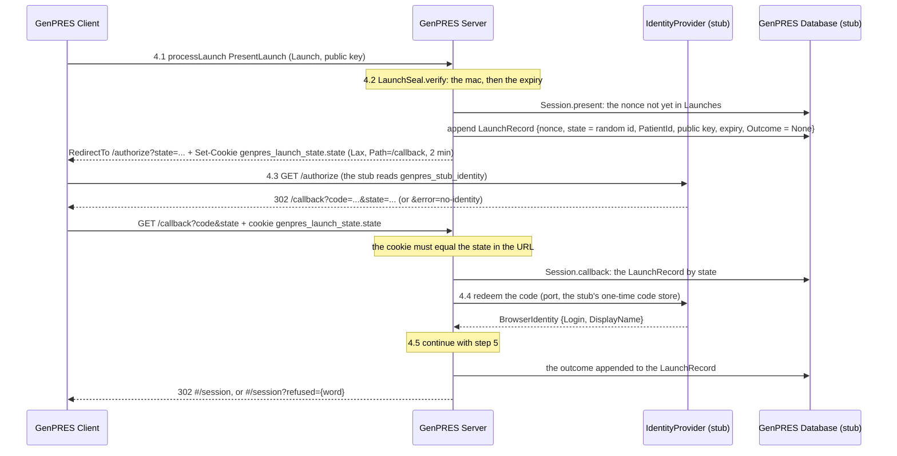
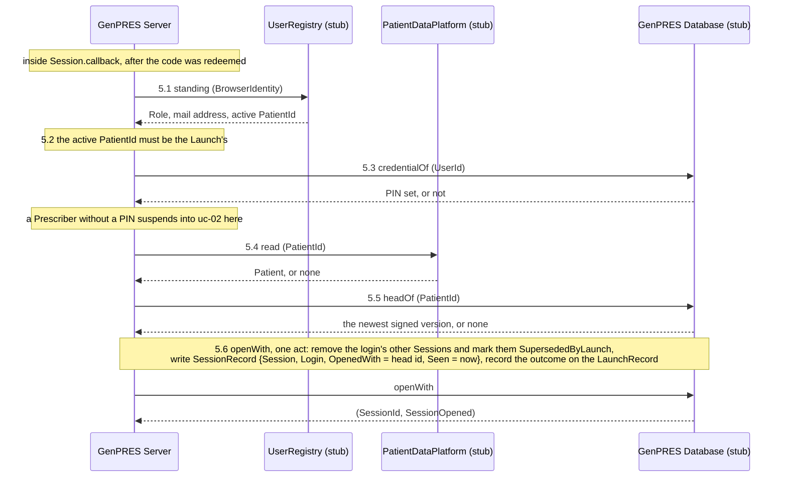
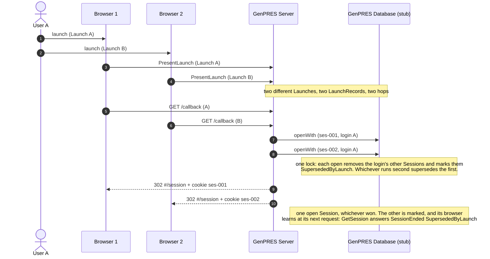

# The launch sequence

How a User gets from a patient open in MainEHR to a GenPRES Session for that patient: UC-1's
main path, as the demo server builds it. The overview numbers the steps; the sections after it
zoom in on the two that have sub-steps. Rule and Concept numbers cite
[GenPRES-MainEHR-Integration-V8.md](GenPRES-MainEHR-Integration-V8.md).

Steps 1 to 6 run end to end. What crosses the browser goes over HTTP as it will with MainEHR
and the IdentityProvider; what the Server does on its own side is an in-process call through a
port, answered by a stand-in mounted when `GENPRES_PROD=0`. Step 7, the signed request, is not
built; its section is kept at the end as the design this page leads.

## Overview

| # | Step | What happens |
|---|------|--------------|
| 1 | Launch | The stub page (`/stub/launch`, standing in for MainEHR's LaunchScript) seals the PatientId, a fresh nonce and a two-minute expiry under a key the demo server made at start (`LaunchSeal.mint`), and answers a `302` to `/#/session?launch={token}`. The identity chosen on the page travels in a `genpres_stub_identity` cookie to the stub IdentityProvider. The Launch carries no login. |
| 2 | Erase | The Client rewrites the address to `#/session` through the History API (`eraseLaunch`) at start-up and on every URL change, and keeps the Launch in memory for retries within its lifetime. The token still lands in the browser's history ([#599](https://github.com/informedica/GenPRES/issues/599)). |
| 3 | Key pair | The Client generates a non-extractable ECDSA P-256 key pair with WebCrypto (`Keys.generate`) and stores the private key in IndexedDB under the public key's RFC 7638 thumbprint, next to keys of earlier launches. The public JWK goes with the Launch. |
| 4 | Identity | `processLaunch (PresentLaunch (launch, key))`. The Server verifies the seal and the lifetime, appends a LaunchRecord and answers `RedirectTo` the IdentityProvider with a fresh `state`, setting one state cookie for this hop. The browser goes there and comes back to `/callback` with a code, which the Server redeems on its own side. See [Step 4](#step-4-the-identity-round-trip). |
| 5 | Check and open | Inside the callback the Server asks the UserRegistry for the Role and the active Patient, reads the credential, reads the patient data and the head of the record, and opens the Session in one act that closes the login's other Sessions and stores the key's thumbprint. See [Step 5](#step-5-check-and-open). |
| 6 | Session open | The callback answers `302 /#/session` and sets `genpres_session`: HttpOnly, Secure over HTTPS, SameSite=Strict, Path=/. The Client, back at `#/session` without a launch parameter, asks `GetSession` and gets `SessionResp (Some session)`: the User and Role, the PatientContext, the OpenedToken, the key thumbprint and the head of the record. It loads the head's orders into the cart, prunes the other private keys (`Keys.keep`, with a ten-minute grace for keys of a launch still in flight) and shows the patient. |
| 7 | Every later request | The cookie says which Session; the OpenedToken, sent as `Request.Opened` with every computing command, says which version of the record the Session opened with. A proof signed with the private key is not built; see [Designed, not built](#designed-not-built). |

Two questions, two answers: *who is this* is the IdentityProvider's answer (step 4), *what may
they do, and on which Patient* is the UserRegistry's (step 5). The Server asks both at every
launch, and nothing the Launch says decides either.

## Step 4: the identity round trip

- **4.1** The Client presents the Launch and the public key (`SessionMsg.Present`). A transport
  failure is retried from memory, three attempts, then the gate offers a Retry.
- **4.2** `LaunchSeal.verify` checks the mac in constant time, then the expiry; a Launch from an
  earlier server run fails the mac, since the key is new at every start, and is refused
  `invalid`. `Session.present` then looks the nonce up: unknown, so a LaunchRecord is appended
  with a random `state`, the nonce, the PatientId, the public key and the expiry. The sealed
  Launch itself is not stored. The answer is `RedirectTo` with the `state`, and the same
  response sets the cookie `genpres_launch_state.<state>`: HttpOnly, Secure over HTTPS,
  SameSite=Lax (the callback is a cross-site top-level GET, on which Strict is not sent),
  Path=/callback, Max-Age the Launch's two minutes. One cookie per hop, named by its state, so
  that two tabs launching at once do not overwrite each other's proof. The Client follows the
  redirect with `window.location.assign`, which unloads it.
- **4.3** The stub IdentityProvider at `/authorize` reads the identity chosen on the stub page
  from `genpres_stub_identity`, issues a one-time code for it (or reports `no-identity` for the
  choice `none`), and redirects the browser to `/callback` with the code and the `state`.
- **4.4** The Server compares the `state` in the URL with the cookie of that name; without a
  match the callback is refused `invalid` before anything is redeemed. That is what proves the
  callback comes from the browser that started the hop. The Server finds the LaunchRecord by
  `state`, redeems the code through the port, and gets the BrowserIdentity. The cookie is not
  deleted; it expires with the Launch.
- **4.5** The Server continues with step 5 and answers the callback with a redirect to
  `#/session`. On refusal it opens nothing and redirects to `#/session?refused={word}`; a word
  is not a secret, and the Launch never appears in that URL. The outcome is appended to the
  LaunchRecord, so a reload of the callback within the Launch's lifetime is answered as the
  first time: the same Session, the same refusal, or the same enrolment. A reload whose Session
  has since been superseded is redirected to `#/session` all the same, and the next `GetSession`
  tells the ending. After the lifetime the record stays and loads as absent, and the callback is refused
  `invalid`.

## Step 5: check and open

- **5.1** The UserRegistry is asked for the standing of this identity: the Role, the mail
  address, and the Patient the User has active in MainEHR. No standing at all is refused
  `no-role`.
- **5.2** The active Patient must be the Launch's; otherwise `wrong-patient`.
- **5.3** A Prescriber whose credential has no PIN is not refused: the launch suspends into
  [uc-02](uc-02-enrolment.md) and continues from 5.4 once the PIN is set. A Reader is never
  asked for a PIN; the credential is not read.
- **5.4** The patient data is read from the platform, once. Nothing found is not a refusal: the
  Session opens on the patient data of the head of the record, the last seen, or on no patient
  data where there is no record, so that a data outage does not block prescribing: the User
  enters the data, and nothing is evaluated until it is a patient. A reading that is no patient
  (no age, and no measured weight and height) counts as nothing found.
- **5.5** The newest signed version of the patient's record is the head the Session starts
  from; `OpenedWith` remembers its id, and the OpenedToken is minted over it.
- **5.6** `openWith` is one act over the one state: the login's other Sessions are removed and
  marked, the SessionRecord is written with the key's thumbprint, and the outcome is recorded
  on the LaunchRecord. All of it lands, or none: every transition of the stand-in is a pure
  function run under one lock.

The spent-mark of the design is the LaunchRecord's outcome: a second presentation of the same
nonce is answered from it (with the same key) or refused as spent (with another).

## Retries

A presentation can be repeated within the Launch's lifetime: after a lost response, or after
a transient refusal such as an unreachable Server. The public key correlates the repeat: a
second presentation with the same public key is answered as the first was, the same redirect
or the same outcome, and nothing opens twice. A presentation with another public key, or with
none, is refused as spent: the Server cannot tell it from another browser. After the lifetime
the Launch is expired.

## Refusals

Every refusal ends the same way: no Session opens, and the Client shows the gate with the
reason.

| Word | Fails at | Produced by | The gate offers |
|------|----------|-------------|-----------------|
| `expired` | 4.2 | a Launch past its two minutes | a relaunch from MainEHR |
| `spent` | 4.2 | the same Launch presented from another browser, or with another key | a relaunch |
| `invalid` | 4.2, 4.4 | a Launch sealed under another key (an earlier server run), a callback without a matching state cookie or after the lifetime, any launch in production | a relaunch |
| `no-identity` | 4.3 | the identity `none`; the IdentityProvider reported no one signed on | a relaunch; the refusal arrives through the callback, after the redirect unloaded the Client, so no Launch is left to retry with |
| `no-role` | 5.1 | the identity `unknown` | a relaunch, or *continue without launch*: an anonymous open that carries nothing over ([uc-11](uc-11-authority-withdrawn.md)) |
| `wrong-patient` | 5.2 | the identity `prescriber-other-patient` | a relaunch after activating the right Patient |
| `enrolment` | callback reload | a reload of the callback after the enrolment attempt it started is gone | a relaunch |

Every refusal is a value on the wire (`LaunchRefusal`), never an exception; a server exception
is answered 500 and the Client's transport path retries.

## Two launches at once

A User has at most one open Session, and the open is what enforces it. Two launches of User A,
two Launches in two browsers, run through to the open together.

Both browsers are told a Session opened, and only one still has it. The loser's Client learns
at its next request, shows the gate, and acknowledges by closing
([session-endings](session-endings.md)). This is a different race from two presentations of
the *same* Launch: there the LaunchRecord settles it and exactly one Session opens; here two
Launches contend for the per-User limit.

## The stand-ins

| Party | Stand-in | What it does |
|-------|----------|--------------|
| MainEHR LaunchScript (step 1) | the `/stub/launch` page | mints a Launch sealed under a key made at server start, two minutes, and answers a redirect to `#/session?launch=…`; the identity choice travels in a cookie to the stub IdentityProvider |
| IdentityProvider (4.3, 4.4) | `/authorize` and an in-memory code store | issues a one-time code for the chosen identity, or reports `no-identity`; the code is redeemed on the Server's side of the callback and pruned after the Launch lifetime |
| UserRegistry (5.1, 5.2) | `StubDirectory` | answers Role, active Patient and mail address per identity choice: `prescriber`, `prescriber-b`, `reader`, `prescriber-other-patient`, `no-pin`, `unknown`; the seeded Prescribers have the PIN `1234` |
| PatientDataPlatform (5.4) | `StubPatientData` | answers one fixed patient (ten years, 32 kg, 140 cm) for every PatientId, none for `no-data` |
| GenPRES Database | a SQLite file when `GENPRES_DB_CONNECTION` is set, else one `Session.State` per server start | LaunchRecords by nonce, SessionRecords, endings, credentials, codes, enrolments, the signed record, notices, challenges, remembered answers, and an audit entry per act; every transition a pure function under one lock. On the file all of it outlives a restart and a second server reads it, and nothing is ever deleted: a row past its lifetime loads as absent. The in-memory store forgets all of it |

The walkthrough is in [DEVELOPMENT.md](../../../DEVELOPMENT.md#simulating-the-launch-sequence).

## Designed, not built

**Step 7, the signed request.** The design has every request after the launch carry two
things: the SessionId cookie, which names the Session, and a proof signed with the private key
of step 3, which names the browser. The proof covers the HTTP method, the URL, a hash of the
body, the time, a unique id, and the OpenedToken. This is the DPoP pattern
([RFC 9449](https://www.rfc-editor.org/rfc/rfc9449)). The Server would read the SessionRecord
by SessionId, verify the signature against the stored public key, check method, URL, body
hash, time and uniqueness, and compare the OpenedToken with the head of the record.

The key pair is generated at the launch and its thumbprint stored in the SessionRecord so that
this can land without changing the launch. Keys are kept per thumbprint so that a second
launch in another tab, if refused, cannot take the first tab's key away. Today the public key
is used for one thing only: telling a retry of the same Launch from a replay by another
browser.

Also not built: the idle and absolute lifetimes of a Session (Rule 10; nothing acts on `Seen`);
the erasure of the token from the browser history
([#599](https://github.com/informedica/GenPRES/issues/599)). The audit of every launch,
honoured or refused (Rule 46), is written on the SQLite store and nowhere else: the in-memory
store audits nothing, and no one can read the table back yet
([#516](https://github.com/informedica/GenPRES/issues/516)).

---

Read off `Session.present`, `Session.callback` and `Session.openWith` in
`src/Informedica.GenPRES.Server/ServerApi.Session.fs`, the dispatch in
`ServerApi.LaunchCommand.fs`, the routes and cookies in `Server.fs`, the stand-ins in
`ServerApi.StubAdapters.fs`, and `SessionMachine.fs`, `Keys.fs` and `App.fs` in
`src/Informedica.GenPRES.Client/`. The design's launch is UC-1 in
[`Integration.fsx`](Integration.fsx), which models neither the key pair nor the LaunchRecord.
