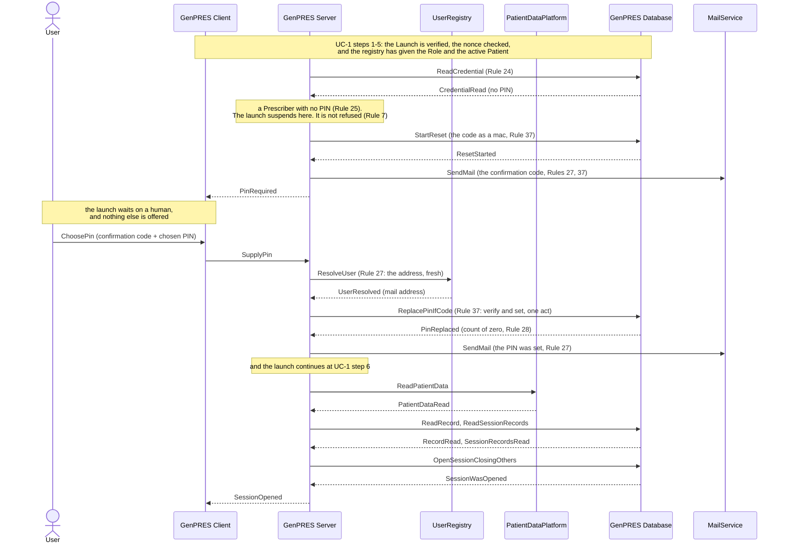

# First launch as a Prescriber: no PIN yet

UC-2. A Prescriber who has never signed before has no PIN, and cannot get one without
proving they are the person the registry names. The launch does not refuse them: it
suspends at the PIN question, mails a confirmation code, and continues once the code
comes back with a PIN of their choosing.

The launch reaches this point at UC-1 step 5, where the credential is read.

## Reading it

**Two mails, not one.** The first carries the confirmation code; the second says the PIN
was set. Rule 27 asks for both, and the second is what tells User A if somebody else
enrolled in their name.

**The confirmation code goes where the registry says, not where the browser says.** That
is the whole of what Rule 37 rests on: whoever is at this workstation does not control
User A's mailbox. An unrecognized login never reaches this branch at all — the registry
is asked first (Rule 25) — and a Reader is never asked for a PIN (Rule 26).

**The address is asked for twice.** Once when the code is mailed, and again when the PIN
is set, because the second mail may go out much later — the launch waits on a human in
between. Rule 27 wants a fresh answer on the request that sends each mail.

## What it leaves out

- **The abandoned enrolment** (ext 2a). No code comes back, so no PIN is set and no
  Session opens (Rule 7). The code expires and the next launch mails a fresh one — but
  not while the first still stands, which would void the one User A is about to read.
- **The wrong code** (ext 2b). A few tries, then the code is void; a fresh launch mails a
  fresh one.
- **Somebody else at the workstation** (ext 2c). The code went to User A's mail, which
  the other hands do not control. Nothing is set, and the mail tells User A someone
  tried.
- **A registry that cannot answer when the PIN is set.** The confirmation code has
  already been sent and answered, so Rule 37 is settled and only the notice is left: the
  PIN is set and the notice falls back on the address this launch already had, which the
  audit records.

---

Drawn from UC-2 in [`Integration.fsx`](Integration.fsx). The full trace of all eleven use
cases is written to `Integration.run.txt` beside it when the script runs.
