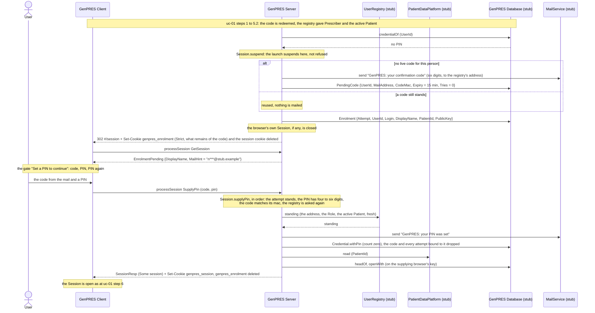

# First launch as a Prescriber: no PIN yet

UC-2. A Prescriber who has never signed before has no PIN, and cannot get one without
proving they are the person the registry names. The launch does not refuse them: it
suspends at the PIN question, mails a confirmation code, and continues once the code
comes back with a PIN of their choosing.

The launch reaches this point inside the callback of [uc-01](uc-01-launch.md), at step 5.3,
where the credential is read. In the demo the identity `no-pin` gets here.

## Reading it

**Two records, not one.** The confirmation code belongs to the person: one live code per
credential, kept as an HMAC under the server's key, never as the digits, with the address it
went to, its expiry and its wrong tries. The attempt belongs to the launch: which browser
(its public key), which Patient, whom to greet. A second launch while the code stands gets an
attempt of its own, bound to the same code, and mails nothing. Whichever browser supplies the
code opens the Session on its own key; setting the PIN drops the code and every attempt bound
to it, so the other browser's attempt is gone at its next `GetSession`.

**The suspension is a cookie and a `GetSession`.** The redirect of the identity hop unloaded
the Client, so the suspension cannot be answered in a response body: the callback sets
`genpres_enrolment` naming the attempt, deletes the session cookie (and closes the Session it
named: left in place, it would hide the enrolment at the next `GetSession`), and sends the
browser to `#/session`. `GetSession` answers `EnrolmentPending` while the attempt stands, and
`SupplyPin` works on the attempt in that cookie, never on one the Client names.

**The address is asked for twice.** Once when the code is mailed, and again when the PIN is
set, because the second mail may go out much later. The registry's fresh answer is taken
whole: the Role as it stands now, and the Session opens only if the launch's Patient is still
the active one. When the registry cannot answer, the code has already proved the mailbox, so
the PIN is set and the notice goes to the address the code went to.

**The wait is bounded.** A code lives fifteen minutes, a mail round trip, and takes its
attempts with it; the enrolment cookie's Max-Age is what remains. A launch near the end of
the window gets a short-lived attempt.

**The Client's form** does the cheap checks first (six digits, four to six digits, the repeat
agrees) and sends nothing until they pass; the server's answer is shown as the field's error
until the User edits it. The form is cleared whenever the launch leaves the enrolment, so a
later enrolment never shows what an earlier one typed. While enrolling there is no person
button and no *Close session*; a relaunch replaces the attempt, and closing the tab abandons
it.

## What a supplied PIN can be refused with

| `PinRefusal` | When | Costs a try | What the gate does |
|--------------|------|-------------|--------------------|
| `PinFormat` | not four to six digits | no | keeps the form, says so |
| `WrongCode n` | the code does not match; `n` tries left | yes | keeps the form, says the tries left |
| `CodeVoid` | the third wrong code; the code and every attempt bound to it are dropped | — | ends the enrolment: relaunch, a fresh code is mailed |
| `AttemptExpired` | the attempt is gone: the code expired, or another browser set the PIN | — | ends the enrolment: relaunch |
| `WrongActivePatient` | the registry no longer has the launch's Patient active; **the PIN is set** and told | — | ends the enrolment: relaunch after activating the right Patient |

The terminal three also delete the enrolment cookie. `CloseSession` while enrolling drops
the attempt and, when it was the last on that code, the code too, so the next launch mails a
fresh one.

## Not built

The audit of an enrolment and of a code mailed or entered wrongly (Rule 46) is written on the
SQLite store and nowhere else: the in-memory store audits nothing, and no one can read the table
back yet ([#516](https://github.com/informedica/GenPRES/issues/516)); what the MailService sent
is audited by neither. The wrong-PIN limit at signing is
[uc-03](uc-03-prescribe-and-sign.md); a forgotten PIN is [uc-06](uc-06-forgotten-pin.md),
which is not built.

The walkthrough is in
[DEVELOPMENT.md](../../../DEVELOPMENT.md#enrolment-the-first-launch-of-a-prescriber-without-a-pin).

---

Read off `Session.suspend`, `Session.findEnrolment`, `Session.supplyPin` and
`Session.dropEnrolment` in `src/Informedica.GenPRES.Server/ServerApi.Session.fs`, the dispatch
in `ServerApi.SessionCommand.fs` and `ServerApi.LaunchCommand.fs`, the cookie in `Server.fs`,
and `SessionMachine.fs`, `SessionGatePolicy.fs` and `Views/SessionGate.fs` in
`src/Informedica.GenPRES.Client/`. The design is UC-2 in [`Integration.fsx`](Integration.fsx).
