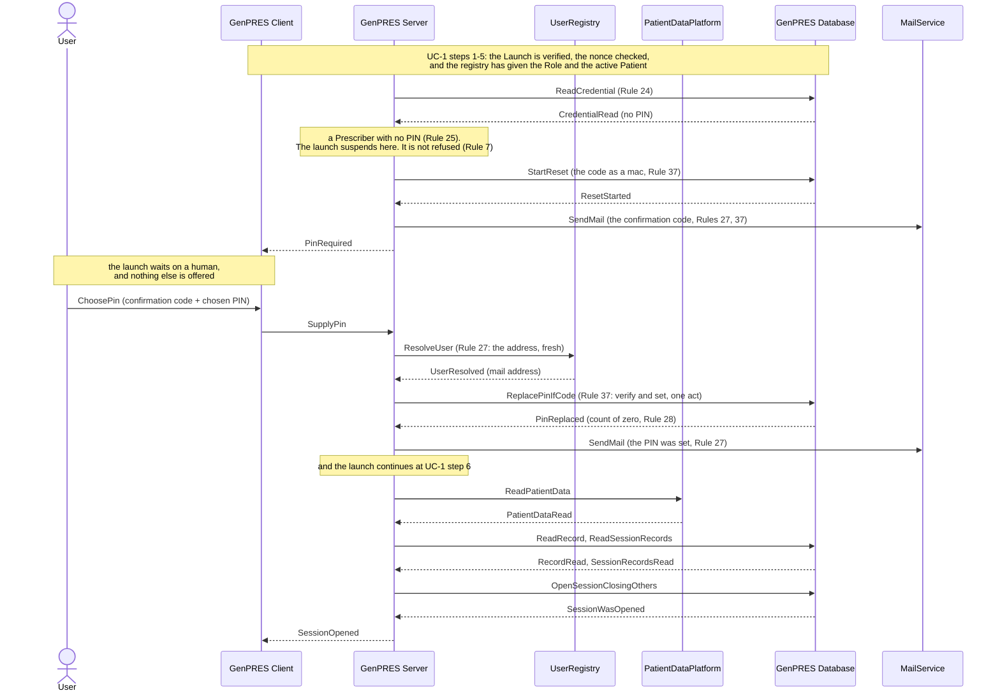

# First launch as a Prescriber: no PIN yet

UC-2. A Prescriber who has never signed before has no PIN, and cannot get one without
proving they are the person the registry names. The launch does not refuse them: it
suspends at the PIN question, mails a confirmation code, and continues once the code
comes back with a PIN of their choosing.

The launch reaches this point at UC-1 step 5, where the credential is read.

## Reading it

**Two mails, not one.** The first carries the confirmation code; the second says the PIN
was set. Rule 27 asks for both, and the second is what tells User A if somebody else
enrolled in their name.

**The confirmation code goes where the registry says, not where the browser says.** That
is the whole of what Rule 37 rests on: whoever is at this workstation does not control
User A's mailbox. An unrecognized login never reaches this branch at all — the registry
is asked first (Rule 25) — and a Reader is never asked for a PIN (Rule 26).

**The address is asked for twice.** Once when the code is mailed, and again when the PIN
is set, because the second mail may go out much later — the launch waits on a human in
between. Rule 27 wants a fresh answer on the request that sends each mail.

## What it leaves out

- **The abandoned enrolment** (ext 2a). No code comes back, so no PIN is set and no
  Session opens (Rule 7). The code expires and the next launch mails a fresh one — but
  not while the first still stands, which would void the one User A is about to read.
- **The wrong code** (ext 2b). A few tries, then the code is void; a fresh launch mails a
  fresh one.
- **Somebody else at the workstation** (ext 2c). The code went to User A's mail, which
  the other hands do not control. Nothing is set, and the mail tells User A someone
  tried.
- **A registry that cannot answer when the PIN is set.** The confirmation code has
  already been sent and answered, so Rule 37 is settled and only the notice is left: the
  PIN is set and the notice falls back on the address this launch already had, which the
  audit records.

## As built against stubs

The sequence above runs in the demo server since
[plan 615](../../implementation-plans/615-enrolment-with-server-stubs.md), on the stand-ins of
[uc-01](uc-01-launch.md#as-built-against-stubs) plus one more: the MailService is an outbox in
memory with a page, `/stub/mail`, where the tester reads what a User would read in their mail.
The credential (Concept 7) lives in the same in-memory state as the Sessions: a PBKDF2-SHA256
hash under a salt of its own, and the wrong-count of Rule 28. The walkthrough is in
[DEVELOPMENT.md](../../../DEVELOPMENT.md#enrolment-the-first-launch-of-a-prescriber-without-a-pin).

Where the code departs from the text above, on purpose:

- **Two records, not one.** The confirmation code belongs to the credential (one live code per
  person, Rule 37) and the launch to the browser: `StartReset` writes a pending code keyed by
  the person, and an enrolment attempt keyed by the launch, holding the public key of the
  browser that made it. A second launch while the code stands gets an attempt of its own, bound
  to the same code, and mails nothing (ext 2a); whichever browser supplies the code opens the
  Session on its own key; setting the PIN drops the code and every attempt bound to it.
- **`PinRequired` is a cookie and a GetSession.** The redirect of 4.2 unloads the Client, so
  the suspension cannot be answered in a response body: the callback sets a `genpres_enrolment`
  cookie naming the attempt and sends the browser to `#/session`, and `GetSession` answers
  `EnrolmentPending` while the attempt stands. `SupplyPin` works on the attempt in that cookie,
  never on one the Client names.
- **The code as a mac.** Six digits from the CSPRNG, kept as an HMAC under the server's key;
  the mail carries the digits, the state never does.
- **The wait is bounded.** A code lives fifteen minutes, a mail round trip, and takes its
  attempts along; the model's `AwaitingPinChoice` is never collected. A launch near the end of
  the window gets a short-lived attempt, and the cookie's `Max-Age` is what remains.
- **Ext 2b is three tries.** The third wrong code voids the code for every attempt bound to it,
  a terminal answer; a fresh launch mails a fresh one. A PIN outside four to six digits (V8 names
  no format; the assumption of plan 615) spends no try.
- **The registry is asked again at the supply**, as the diagram shows for the address (Rule
  27), and its answer is taken whole: the Role as it stands now, and the Session opens only if
  the launch's Patient is still the active one (Rule 6); otherwise the PIN is set and told, no
  Session opens, and the Client asks for a relaunch. When the registry cannot answer, the code
  settles the PIN and the notice goes to the address the code went to (the last bullet above).
- **A Session this browser still held** is closed by the enrolling callback, as an open would
  replace it; left in place, its cookie would hide the enrolment.
- **The Client's form** does the cheap checks first (six digits, four to six digits, the repeat
  agrees) and shows the server's answer as the field's error until the User edits it.

Not built: the audit (Rule 46), and the wrong-PIN limit at signing (Rule 28's count is kept and
reset, nothing reads it yet).

---

Drawn from UC-2 in [`Integration.fsx`](Integration.fsx). The full trace of all eleven use
cases is written to `Integration.run.txt` beside it when the script runs.
