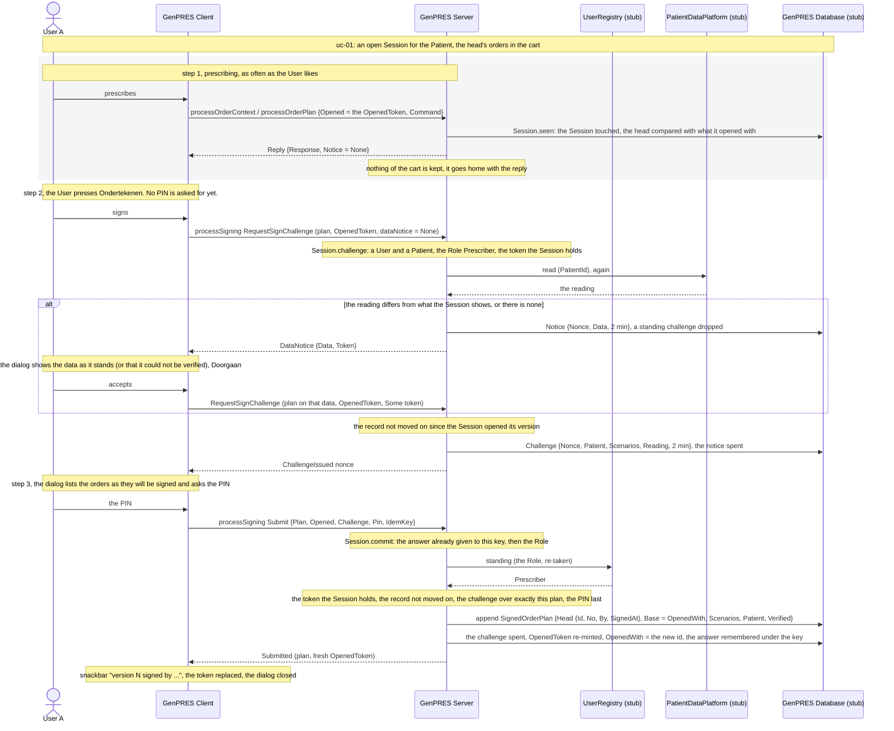
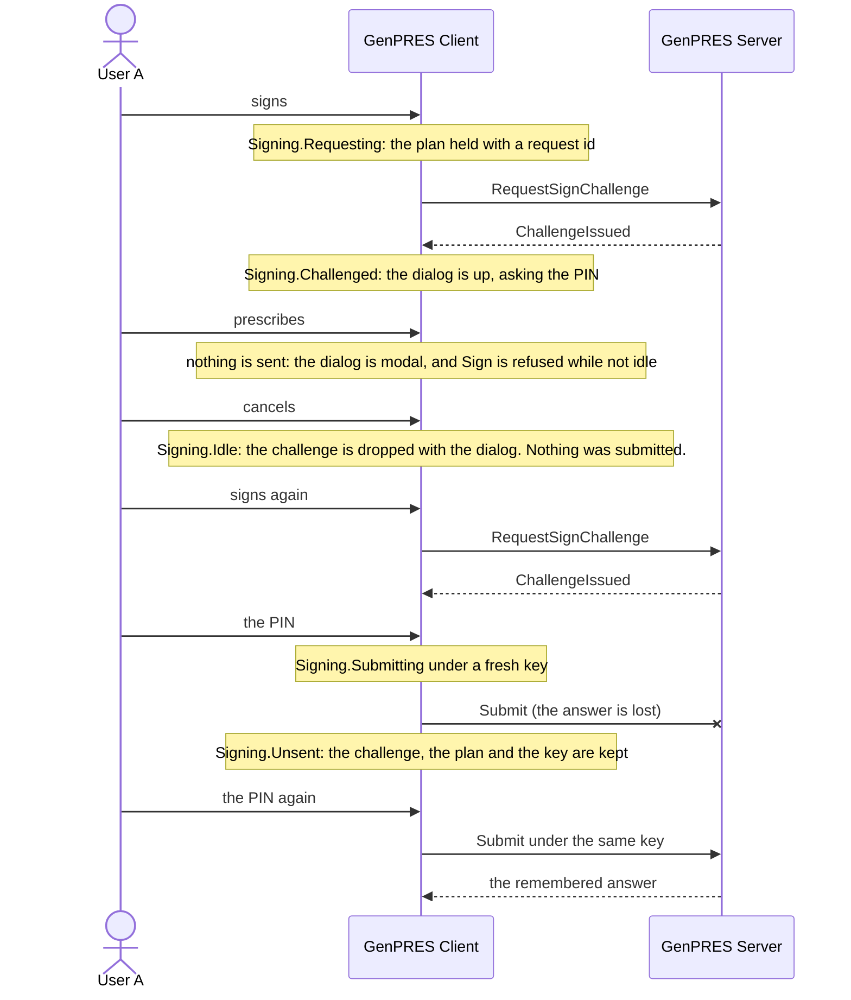

# Prescribe and sign

UC-3. User A records orders for a Patient and takes responsibility for them. Signing is the
only way anything reaches the record; there is no saving. So this page is the whole of how a
signed version of an OrderPlan comes into being. The code uses the design's name: `OrderPlan`
is the cart, and a signed version of it a `SignedOrderPlan`.

Precondition: [uc-01](uc-01-launch.md) has left an open Session for the Patient, started from
the head of its record, with the Prescriber Role.

## Reading it

**Signing is two requests, not one.** The first asks for a challenge; the second returns it
with the PIN. Nothing is submitted in between, and while the dialog is up the cart cannot
change: the Client refuses a new `Sign` unless the signing is idle, and the dialog holds the
plan the challenge was issued over, never the live cart. Splitting it this way also means the
block on a stale baseline is settled before the dialog asks for a PIN the User was never going
to spend.

**The challenge is kept, not sealed.** One per Session in the server's state, two minutes,
replaced by a re-request and dropped by a data notice; a Submission must name its nonce and
carry exactly the plan it was issued over, the orders and the patient data compared as values,
and no order twice. The OpenedToken is opaque in the same way: the Session holds one, a
Submission must present it, and the commit re-mints it over the new head.

**The data notice has no token type of its own.** When the platform reads other data than the
Session shows, or none, the answer is a `DataNotice` with the data as it stands and a token.
The Client shows it and the User proceeds by returning the token; the challenge then records
whether the data was the platform's reading (`Verified`), and the version is signed as
unverified when it was not. What the User entered or was shown is what the signed version
records; the Patient is the Session's, and nothing compares the plan's data with the Session's.

**The Role is taken twice.** Once at the launch, and again at every commit, from the registry.
A registry that answers no standing, or a Role other than Prescriber, refuses the signature
`NotPrescriber`; a registry that cannot answer refuses it too. It fails closed.

**The commit re-establishes everything.** The Server checked the Session, the token and the
data on the way in, but the commit trusts none of it: it re-checks the Session, the Role, the
token, the head and the challenge in one act over the one state, and looks at the PIN last, so
that a Submission that was never going to land costs the User no attempt.

**The PIN is the credential's, not the Session's.** Wrong entries count per credential, across
Sessions: two are told with the tries left and the dialog stays open; the third ends the
Session (`PinLimit`), mails the User, and locks signing for one minute, doubling with every
further wrong entry up to a day. A right PIN while locked is refused `Locked until` and
counts nothing.

**Every answer lands once.** The Client sends a key of its own with every Submission; the
answer, a refusal too, is remembered under the Session and that key for two minutes, so a
Submission whose answer was lost is retried under the same key and answered the same way.

## What a signature can be refused with

| `SigningRefusal` | At | Means |
|------------------|----|-------|
| `NoSession` | both | no cookie, or none the state knows |
| `NoPatient` | both | a Session without a Patient |
| `NotPrescriber` | both | no User, a Reader, or the registry does not answer Prescriber at the commit |
| `StaleToken` | both | not the OpenedToken the Session holds |
| `Blocked head` | both | a newer version than the one the Session opened with exists; whose, and when ([uc-04](uc-04-two-users.md)) |
| `ChallengeMismatch` | both | no challenge, another plan than the challenge was issued over, or an order named twice |
| `ChallengeExpired` | Submit | the two minutes passed |
| `PinWrong n` | Submit | `n` tries left; the dialog stays |
| `Locked until` | Submit | the credential is locked; the dialog stays |
| `PinLimit` | Submit | the third wrong PIN; the Session ended |

The dialog keeps open on `PinWrong` and `Locked`, the PIN limit ends the Session and the gate
says why, and every other refusal is told once in a snackbar.

## The dialog, drawn out

Between the two requests the User is looking at exactly what they are about to attest to,
and nothing has left the Client.

An answer lands only on the request it answers: a challenge on its request id, a Submission on
its key. A late answer to an earlier request is dropped.

## Not built

The audit of every Submission, committed or refused (Rule 46), is written on the SQLite store
and nowhere else: the in-memory store audits nothing, and no one can read the table back yet
([#516](https://github.com/informedica/GenPRES/issues/516)). The KnowledgeRuleSet the plan was
checked under (Concept 18): nothing records which rules computed the orders. The bounded
grace when the registry is down (Rule 38): the commit fails closed at once. The decay of the
wrong-PIN count with time (Rule 28): the cap of a day stands in for it. The MVP overview lists
the last two as issues to file
([mvpap2019-gap-overview.md](../../roadmap/mvpap2019-gap-overview.md), rows 2.1.7 and 2.1.10).

The walkthrough is in [Testing Workflows](../../user-guide/testing-workflows.md#workflow-10--signing-an-order-plan).

---

Read off `Session.seen`, `Session.challenge` and `Session.commit` in
`src/Informedica.GenPRES.Server/ServerApi.Session.fs`, `Credential` in the same file, the
dispatch in `ServerApi.SigningCommand.fs` and `ServerApi.Compute.fs`, and `SigningMachine.fs`,
`SigningPolicy.fs` and `Views/SignDialog.fs` in `src/Informedica.GenPRES.Client/`. The design
is UC-3 in [`Integration.fsx`](Integration.fsx).
