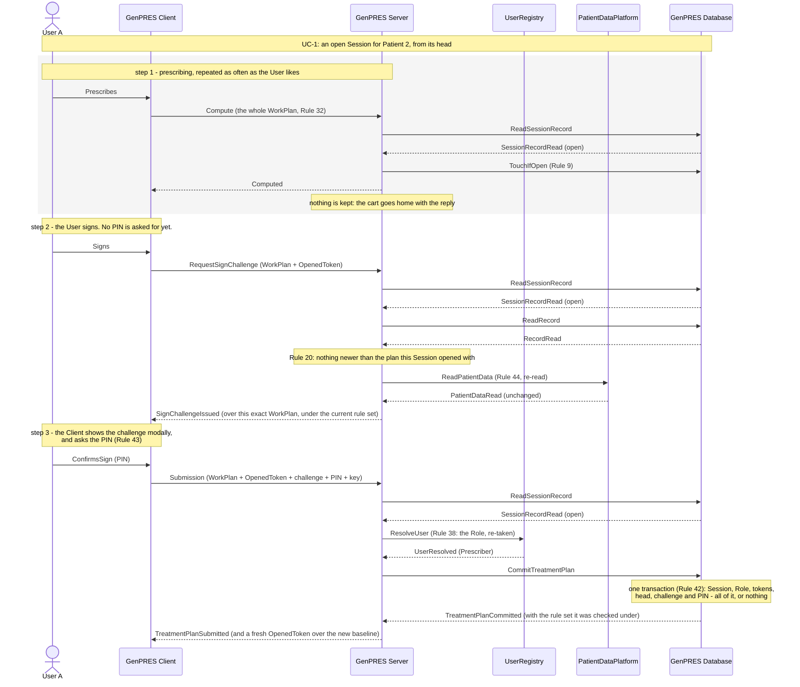
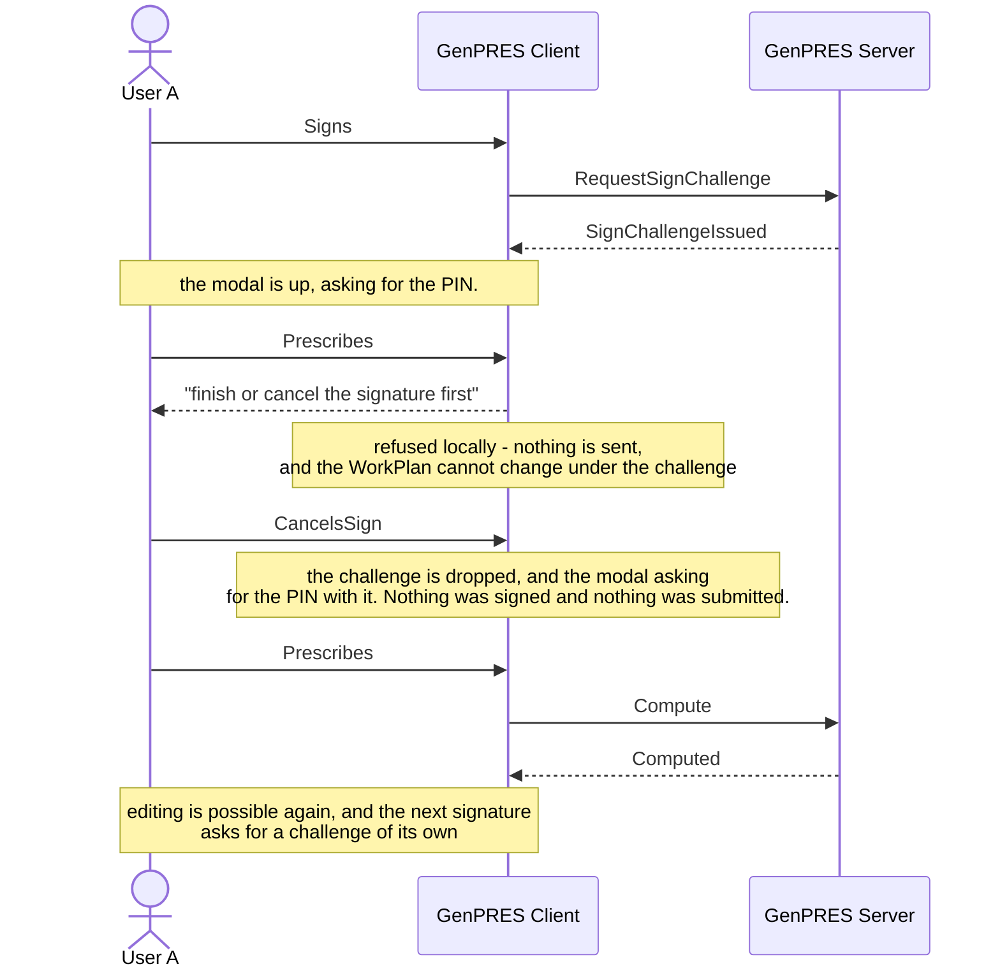

# Prescribe and sign

UC-3. User A records orders for Patient 2 and takes responsibility for them. Signing is
the only way anything reaches the record — there is no saving — so this diagram is the
whole of how a TreatmentPlan comes into being.

Precondition: UC-1 has left an open Session for Patient 2, started from its head, with the
Prescriber Role.

## Reading it

**Signing is two requests, not one.** The first asks for a challenge; the second returns
it with the PIN. Nothing is submitted in between, and while the modal is up the WorkPlan
cannot change — that is what the modal is for. Splitting it this way also means Rule 20's
block is settled before the modal ever asks for a PIN the User was never going to spend.

**The Role is taken twice.** Once at the launch (Rule 5), and again here at the signature
(Rule 38). Authority withdrawn since the launch blocks the signature at its commit, which
is UC-11 ext 1a.

**The commit re-establishes everything.** The Server has checked the Session, the token
and the data on the way in, but none of that is what the commit trusts: Rule 42 makes the
Database re-verify all of it inside one transaction. The checks on the way in exist to
fail early and cheaply, not to decide.

**The PIN is last.** A Submission that was never going to land — blocked, or with a bad
token — is refused before the PIN is looked at, so it costs the User no attempt (Rule 28).

## What it leaves out

- **The record moving on** (ext 1a, 2a). If a newer plan appeared while User A worked,
  any response says so and does not stop them (Rules 21, 22); if nothing told them first,
  the Submission itself is refused, and that refusal is the notice (Rule 20). UC-4 is this
  ground from the other side.
- **A new KnowledgeRuleSet** (ext 1b). Published mid-Session, it reaches the next
  computation, and the challenge is issued under it. The signed plan records which set.
- **The Patient Data changing** (ext 2b). No challenge is issued until the User has seen
  the data as it now stands, or been told it could not be checked, and accepted it. Built as
  a notice with a token (below).
- **The wrong PIN** (ext 3a). No TreatmentPlan is committed and no token is spent. Wrong entries
  count across Sessions; at the limit the Session ends and signing locks for a growing
  delay. Built, with the delay capped (below).
- **Canceling and editing** (ext 3b), **someone else at the keyboard** (ext 3c), **a late
  or repeated Submission** (ext 3d), and **never signing at all** (ext 3e).
- **The audit.** Every Submission, committed or refused, is appended (Rule 46).

## The modal, drawn out (ext 3b)

Why the two requests are worth separating: between them the User is looking at exactly
what they are about to attest to, and nothing has left the Client.

## As built against stubs

Steps 2 and 3 run in the demo server since
[plan 622](../../implementation-plans/622-signing-with-server-stubs.md), on the stand-ins of
[uc-01](uc-01-launch.md#as-built-against-stubs) and [uc-02](uc-02-enrolment.md#as-built-against-stubs)
plus the record half of the Database: the signed versions per patient, in memory, and a
second stub Prescriber, `prescriber-b`, so that the record can move on under a Session. The
stub registry is asked again at every commit (Rule 38). The walkthrough is in
[DEVELOPMENT.md](../../../DEVELOPMENT.md#signing-an-order-plan). In the code the TreatmentPlan
is the `OrderPlan`, and a signed version of it a `SignedOrderPlan`.

Where the code departs from the text above, on purpose:

- **Step 1 is not session-bound.** Compute reads no SessionRecord and touches nothing
  (Rule 9 belongs to the idle lifetime, not built); it keeps working without a launch (UC-7).
  Only steps 2 and 3 need the Session the cookie names.
- **The challenge is kept, not sealed.** One per Session on the server's state, two minutes,
  replaced by a re-request and dropped by a data notice; a Submission must name its nonce and
  carry exactly the plan it was issued over (Rule 43: the orders and the patient data compared
  as values). The OpenedToken is opaque too: a Submission must present the one the Session
  holds, and the commit re-mints it over the new head (Rule 34). Both are sealed when the
  store leaves the process.
- **The data notice has no token type of its own.** When the platform reads other data than
  the Session opened with, or none, the answer is a notice with the data as it stands and a
  token; the User proceeds by returning it, and the challenge records whether the data was the
  platform's reading. The KnowledgeRuleSet (Concept 18) is not built.
- **The plan's data is the User's.** What the User entered or was shown is what the signed
  version records; the Patient is the Session's (Rule 33). Nothing compares the plan's data
  with the Session's.
- **The lock is one minute, doubling, capped at a day.** The model's delay decays with time;
  the cap stands in for the decay.
- **The Role re-take fails closed.** A registry that cannot answer refuses the signature;
  Rule 38's bounded grace is not built.
- **Rule 45 by Session and key.** The remembered answers are looked up under the Session and
  the client's key, refusals too, for two minutes; the Client keeps the key of a Submission
  whose answer was lost and retries under it.
- **The Client's dialog** shows the orders as they will be signed and asks the PIN; a wrong
  PIN or a lock keeps it open, the PIN limit ends the Session and the gate says why, every
  other refusal is told once. An answer lands only on the request it answers.

Not built: the audit (Rule 46), and Rule 21's notice on every response (the record moving on is
told at the challenge and at the commit only).

---

Drawn from UC-3 in [`Integration.fsx`](Integration.fsx). The full trace of all eleven use
cases is written to `Integration.run.txt` beside it when the script runs.
