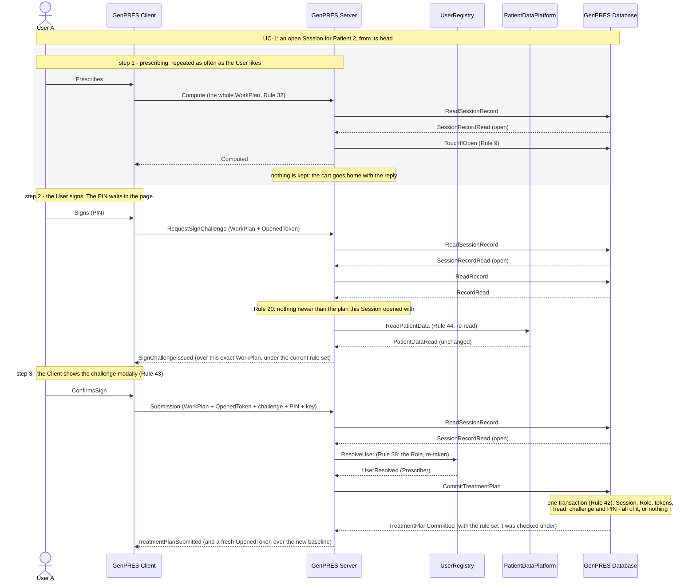
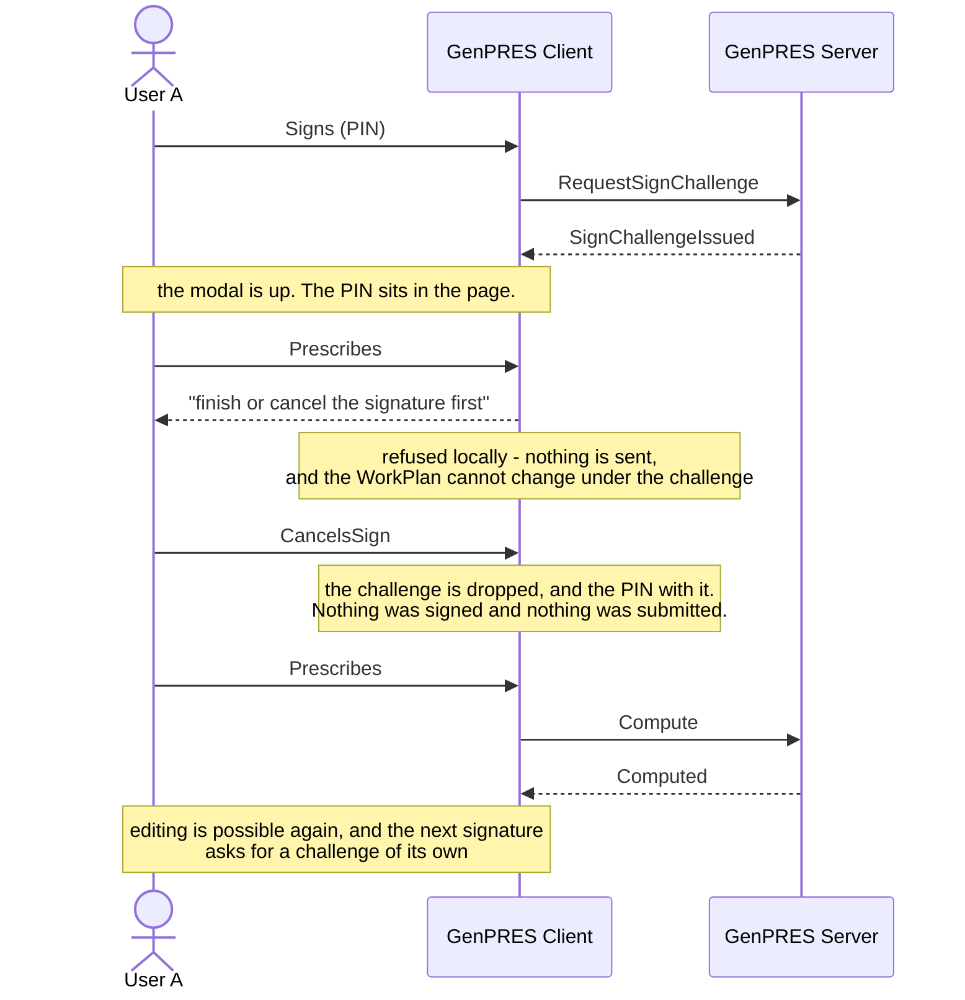

# Prescribe and sign

UC-3. User A records orders for Patient 2 and takes responsibility for them. Signing is
the only way anything reaches the record — there is no saving — so this diagram is the
whole of how a TreatmentPlan comes into being.

Precondition: UC-1 has left an open Session for Patient 2, started from its head, with the
Prescriber Role.

## Reading it

**Signing is two requests, not one.** The first asks for a challenge; the second returns
it with the PIN. Nothing is submitted in between, and while the modal is up the WorkPlan
cannot change — that is what the modal is for. Splitting it this way also means Rule 20's
block is settled before the User is ever asked for a PIN they were never going to spend.

**The Role is taken twice.** Once at the launch (Rule 5), and again here at the signature
(Rule 38). Authority withdrawn since the launch blocks the signature at its commit, which
is UC-11 ext 1a.

**The commit re-establishes everything.** The Server has checked the Session, the token
and the data on the way in, but none of that is what the commit trusts: Rule 42 makes the
Database re-verify all of it inside one transaction. The checks on the way in exist to
fail early and cheaply, not to decide.

**The PIN is last.** A Submission that was never going to land — blocked, or with a bad
token — is refused before the PIN is looked at, so it costs the User no attempt (Rule 28).

## What it leaves out

- **The record moving on** (ext 1a, 2a). If a newer plan appeared while User A worked,
  any response says so and does not stop them (Rules 21, 22); if nothing told them first,
  the Submission itself is refused, and that refusal is the notice (Rule 20). UC-4 is this
  ground from the other side.
- **A new KnowledgeRuleSet** (ext 1b). Published mid-Session, it reaches the next
  computation, and the challenge is issued under it. The signed plan records which set.
- **The Patient Data changing** (ext 2b). No challenge is issued until the User has seen
  the data as it now stands, or been told it could not be checked, and accepted it.
- **The wrong PIN** (ext 3a). Nothing is created and no token is spent. Wrong entries
  count across Sessions; at the limit the Session ends and signing locks for a growing
  delay.
- **Cancelling and editing** (ext 3b), **someone else at the keyboard** (ext 3c), **a late
  or repeated Submission** (ext 3d), and **never signing at all** (ext 3e).
- **The audit.** Every Submission, committed or refused, is appended (Rule 46).

## The modal, drawn out (ext 3b)

Why the two requests are worth separating: between them the User is looking at exactly
what they are about to attest to, and nothing has left the Client.

---

Drawn from UC-3 in [`Integration.fsx`](Integration.fsx). The full trace of all eleven use
cases is written to `Integration.run.txt` beside it when the script runs.
