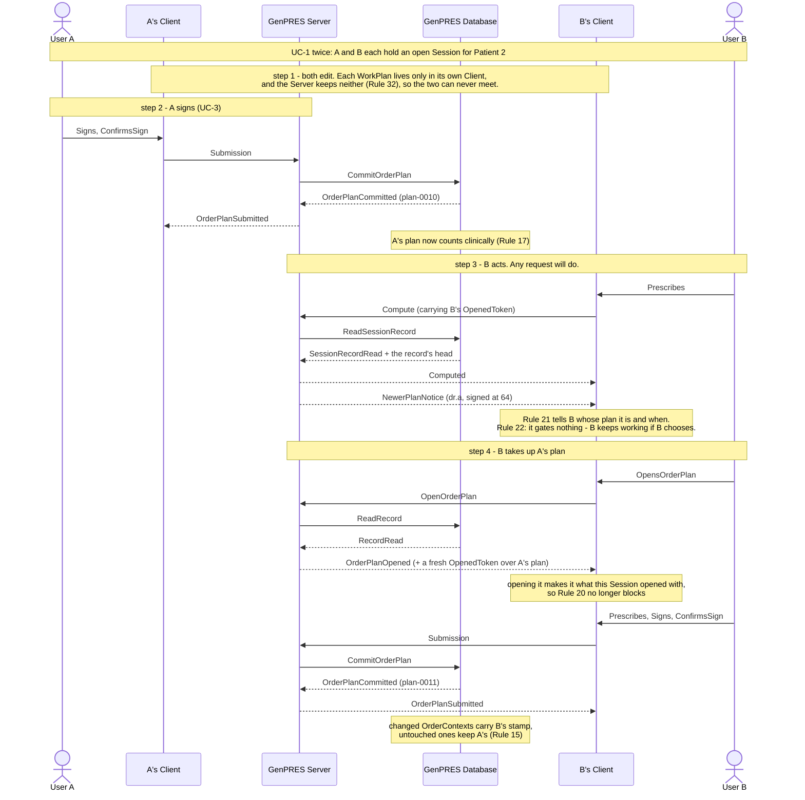
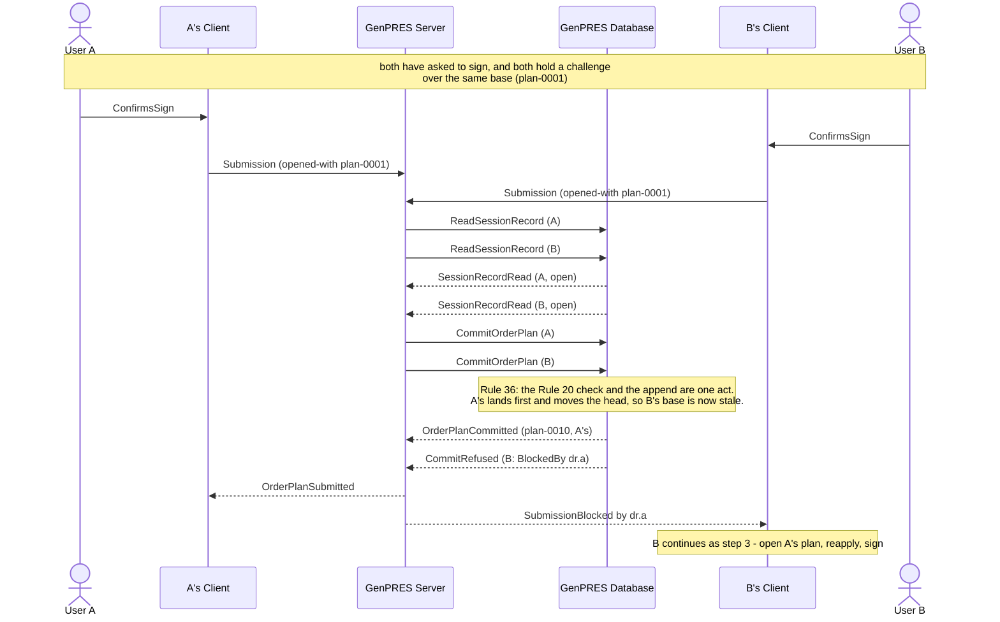

# Two Users, one Patient

UC-4. Two Prescribers work on Patient 2 at the same time. Neither sees the other's work,
the first to sign wins the version, and the other is told the moment they next act.

Precondition: UC-1 twice. Rule 8's limit is per User, so both Sessions are open at once.

## Reading it

**The carts never meet, because there is nowhere for them to meet.** Guarantee 3 holds by
construction, not by discipline: each WorkPlan is in its own browser and the Server keeps
none of it. Two Users' work could only collide in a place the Server does not have.

**Being told and being blocked are different things.** B learns at step 3 and is not
stopped — Rule 22 is explicit that the notice gates nothing. What stops B is Rule 20, at
the Submission, and only if B tries to sign over a stale baseline. If B's next request
*is* the signing, the refusal is the notice (ext 3a).

**Opening A's plan is what unblocks B.** Not a flag, not an acknowledgement: opening it
re-mints the OpenedToken over A's plan, which is what Rule 20 measures from. The block
lifts because the baseline moved, and for no other reason.

**Nothing signed is lost.** The record is append-only and every plan keeps its base
(Concepts 12, 13), so A's plan is still there under B's.

## What it leaves out

- **B's next request being the signature** (ext 3a). Refused under Rule 20, and that
  refusal is the notice. B continues as step 4. Built: the refusal sets the same bar as
  the notice (below).
- **The stamps.** Rule 35 has the Server compute them against the base plan; a stamp
  arriving from a Client is discarded unread.
- **The audit.** Both Submissions are recorded, committed or refused (Rule 46).

## Both sign at once (ext 3b)

The interesting case, because prose cannot carry it: two Submissions in flight over the
same base, interleaved leg by leg. The Database decides.

Both requests pass every check on the way in: both Sessions are open, both Roles hold,
both challenges name their own WorkPlan. Nothing before the commit can tell them apart.
What separates them is that Rule 36 makes the head check and the append the same act, so
the second finds a head the first has already moved. More than one Server may run, and
this is what makes that safe.

## As built against stubs

Steps 1 to 5 run in the demo server since
[plan 635](../../implementation-plans/635-session-bound-compute.md), on the stand-ins of
[uc-01](uc-01-launch.md#as-built-against-stubs) and
[uc-03](uc-03-prescribe-and-sign.md#as-built-against-stubs): two browser profiles, `prescriber`
and `prescriber-b`, on one patient. The walkthrough is in
[DEVELOPMENT.md](../../../DEVELOPMENT.md#signing-an-order-plan).

Where the code departs from the text above, on purpose:

- **Compute is bound to the Session.** Every computing request carries the OpenedToken next to
  the command, the Session the cookie names is marked seen (Rule 9; nothing acts on it yet) and
  the reply carries the notice (Rule 21) or the ending of the Session (Rule 11). Without a
  cookie the request computes as before (UC-7). A token that is not the Session's yields no
  notice, never a refusal.
- **The notice is told once per version.** The wire says it on every reply; the client keeps
  the newest version told, says it once, and shows a bar on the order plan with the offer to
  open that version. Nothing is blocked by it (Rule 22); Rule 20 stays the only guard, at the
  signature, and that refusal sets the same bar.
- **Step 4 opens the version named.** `OpenVersion of id` takes up the version the notice
  named, the model's `OpenOrderPlan`; the token is re-minted over it, a standing challenge is
  dropped, and its orders go into the cart. Any version may be opened (Rule 18); one that is no
  longer the head stays blocked and is told again. A version signed between the notice and the
  button is never taken up unasked.
- **The Session opens on the head's orders** (Rule 19, both halves): at a launch, a resume and
  an enrolment the cart holds the version the Session opened with, and after a signature a
  resume opens on the version just signed.
- **Every answer lands only on the Session that asked.** The notice and the reopened Session
  carry the token their request started from; a Session closed, replaced or re-minted meanwhile
  drops them, and a notice for an older version landing late is not news.

Not built: the stamps of Rule 35, and the audit (Rule 46).

---

Drawn from UC-4 in [`Integration.fsx`](Integration.fsx). The full trace of all eleven use
cases is written to `Integration.run.txt` beside it when the script runs.
