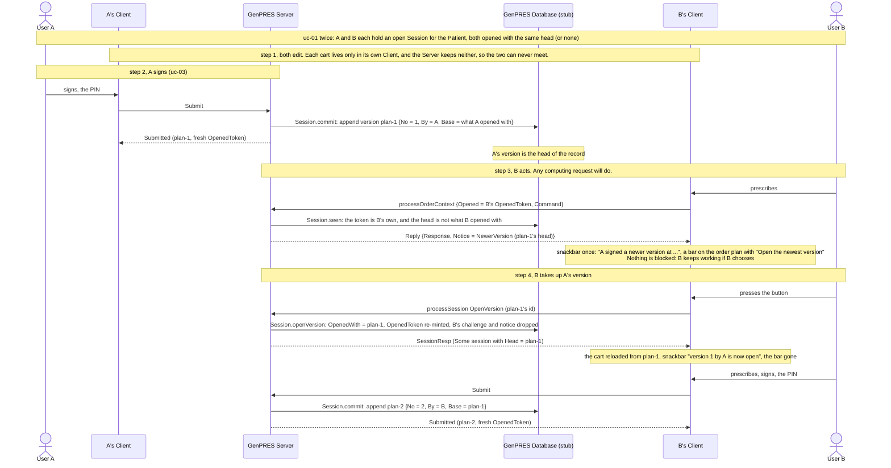
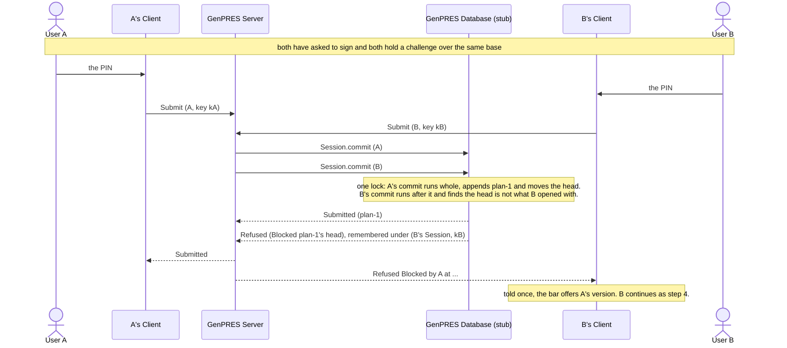

# Two Users, one Patient

UC-4. Two Prescribers work on one Patient at the same time. Neither sees the other's work,
the first to sign wins the version, and the other is told the moment they next act.

Precondition: [uc-01](uc-01-launch.md) twice. The limit of one Session is per User, so both
Sessions are open at once. In the demo: `prescriber` and `prescriber-b`, in two browser
profiles, on one PatientId.

## Reading it

**The carts never meet, because there is nowhere for them to meet.** Each cart is in its own
browser and the Server keeps none of it: a computing request is answered and forgotten. Two
Users' work could only collide in a place the Server does not have.

**Being told and being blocked are different things.** B learns at step 3 and is not stopped:
the notice rides on the reply to any computing request whose token is the Session's own, and
gates nothing. What stops B is the refusal at a Submission, `Blocked`, and only if B tries to
sign over a stale baseline. If B's next request *is* the signing, the refusal is the notice,
and it sets the same bar.

**The notice is told once per version.** The wire says it on every reply; the Client keeps
the newest version told, ordered by its number in the record rather than by arrival, says it
once, and shows the bar until that version is opened. A notice for an older version landing
late is not news.

**Opening A's version is what unblocks B.** Not a flag, not an acknowledgement: `OpenVersion`
makes it what B's Session opened with and re-mints the OpenedToken over it, which is what the
block measures from. Any version may be opened; one that is no longer the head leaves B
blocked and is told again at the next request. A version signed between the notice and the
button is never taken up unasked.

**Every answer lands only on the Session that asked.** The Client tags every computing answer
with the token its request started from and drops a notice whose token is no longer the
Session's; the reopened Session lands only when the token it started from is still the one
held. A Session closed, replaced or re-minted meanwhile drops them.

**Nothing signed is lost.** The record is append-only and every version keeps its base, so
A's version is still there under B's.

## Both sign at once

Two Submissions in flight over the same base. The one state decides.

Both requests pass every check on the way in: both Sessions are open, both Roles hold, both
challenges name their own plan. Nothing before the commit can tell them apart. What separates
them is that the head check and the append are one act under one lock, so the second finds a
head the first has already moved. B's refusal is remembered under B's key, so a retry gets the
same answer.

## Not built

The stamps of Rule 35: the design has the Server mark each OrderContext with whoever last
changed it, against the base version; a signed version today carries its signer and its base,
nothing per order. The audit of both Submissions (Rule 46). A store that decides this race
across more than one server ([#516](https://github.com/informedica/GenPRES/issues/516)):
today the lock is the process's.

The walkthrough is in [Testing Workflows](../../user-guide/testing-workflows.md#workflow-10--signing-an-order-plan).

---

Read off `Session.seen`, `Session.blockedBy`, `Session.openVersion` and `Session.commit` in
`src/Informedica.GenPRES.Server/ServerApi.Session.fs`, `Compute.bound` in
`ServerApi.Compute.fs`, and `MovedOn` in `SessionMachine.fs`, `RecordMovedOn` in `App.fs` and
the bar in `Views/OrderPlan.fs` in `src/Informedica.GenPRES.Client/`. The design is UC-4 in
[`Integration.fsx`](Integration.fsx).
