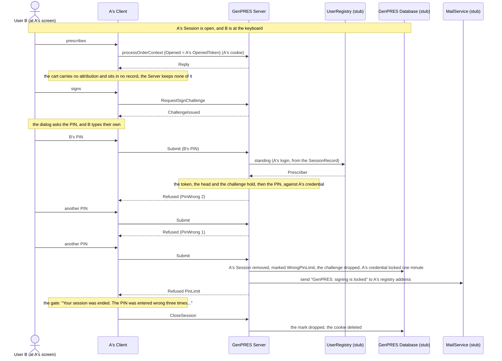

# Someone else takes over the workstation

UC-5. User A walks away leaving their Session open. User B sits down. B can look and
explore, but can attest nothing, in A's name or anyone's. Nothing in this page is code of
its own: it is what [uc-03](uc-03-prescribe-and-sign.md) does when the wrong person types
the PIN.

Precondition: [uc-01](uc-01-launch.md) has left A an open Session, and B is at the keyboard.

## Reading it

**Whose Session it is comes off the record, not off the request.** B is holding A's cookie,
so every request is served as A's Session, the registry is asked about A's login, and the
signature is verified against A's credential. B supplying their own PIN proves nothing,
because nothing ever asks who is typing.

**The wrong entries cost A, not B.** The count is on A's credential and survives across
Sessions; that is also what caps B's guessing. After the third, A's credential is locked for
one minute, doubling with every further wrong entry up to a day, and a right PIN while locked
is refused and counts nothing. A's next launch opens a Session as usual; only signing waits.

**Nothing B did exists anywhere.** The work was only ever in the browser, so when the Session
ends there is nothing of B's in the record to find or tidy away.

**The mail is the only notice A gets.** The design has A told at their next launch, and has
the screen B stands at refused without discharging anything. The code does neither: the
Client, on being told the Session ended, shows the gate and acknowledges with `CloseSession`
at once, which drops the mark; and no launch reads the marks. So the guesser's screen
discharges the very notice that exists to tell A someone was guessing, and what reaches A is
the mail at the address the registry gave, which in the demo is readable at `/stub/mail`.

## Not built

The notice at A's next launch, and an acknowledgement only A can give
([session-endings](session-endings.md)). B signing in as themselves works as the design says:
a launch of B's own opens a Session of B's own, A's untouched, since the limit is per User.
The audit of every failed PIN entry (Rule 46).

---

Read off `Session.commit` and `Credential.verify` in
`src/Informedica.GenPRES.Server/ServerApi.Session.fs`, and `SigningMachine.fs` and
`SessionMachine.fs` in `src/Informedica.GenPRES.Client/`. The design is UC-5 in
[`Integration.fsx`](Integration.fsx).
