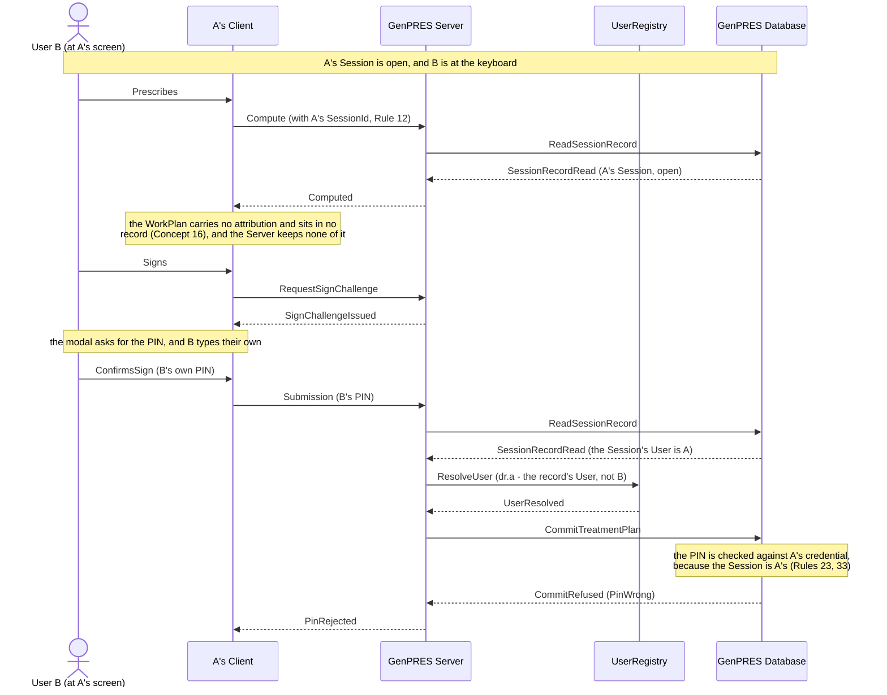

# Someone else takes over the workstation

UC-5. User A walks away leaving their Session open. User B sits down. B can look and
explore, but can attest nothing — in A's name or anyone's.

Precondition: UC-1 has left A an open Session for Patient 1. Possibility 1 says this is
not ours to prevent, only to handle.

## Reading it

**Whose Session it is comes off the record, not off the request.** Rule 33 is what makes
this work: B is holding A's SessionId, so every request is served as A's Session, and the
signature is verified against A's credential. B supplying their own PIN proves nothing,
because nothing ever asks who is typing.

**The wrong entry costs A, not B.** That is the price of the design, and it is deliberate:
it is also what caps B's guessing (ext 3a), because the count is on A's credential and
survives across Sessions.

**Nothing B did exists anywhere.** The work was only ever in the browser, so when the
Session ends there is nothing of B's in the record to find or tidy away.

## What it leaves out

- **B signing in as themselves** (ext 2a). A launch of B's own opens a Session of B's own;
  A's is untouched, because Rule 8's limit is per User. B re-enters the work and signs as
  themselves — which is the honest path, and it works.
- **B guessing** (ext 3a). At the limit A's Session ends and signing locks for a growing
  delay. A is mailed, and told at their next launch. The screen B is standing at is
  refused but discharges nothing — otherwise the guesser could dismiss the very notice
  that exists to tell A someone was guessing.
- **The audit.** Every failed PIN entry is recorded (Rule 46).

---

Drawn from UC-5 in [`Integration.fsx`](Integration.fsx). The full trace of all eleven use
cases is written to `Integration.run.txt` beside it when the script runs.
