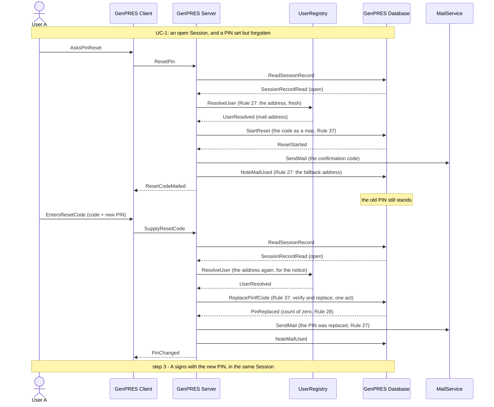

# A User forgets their PIN

UC-6. User A cannot remember their PIN. They get a new one — and learn if somebody else
tried. The old PIN stands until the moment the new one replaces it, so there is never a
window in which A's credential is one that anybody at the workstation could claim.

Precondition: UC-1 has left an open Session, and a PIN is set but forgotten.

## Reading it

**Two mails, and the second is the point.** The first carries the confirmation code; the
second says the PIN changed. If A did not ask for it, the second mail is how A finds out
somebody else did — which is ext 1a.

**Nothing is removed, only replaced.** There is no state in which the credential has no
PIN. Asking for a reset does not clear the old one; it parks a code, and the code plus a
new PIN replace it in one act at the Database.

**The address is asked for on each request that mails.** Not read from anywhere GenPRES
keeps it. A changed address takes effect at once, and no copy goes stale.

**Nothing had to be relaunched.** The reset happens inside the Session A already has, and
A signs with the new PIN without leaving it.

## What it leaves out

- **Somebody else triggering the reset at A's workstation** (ext 1a). The code goes to
  A's mail, which they do not control. The PIN stands, and the mail tells A someone asked.
  A's own reset then waits until that code is void — one code at a time.
- **A never returning the code** (ext 1b). Nothing changes; the code expires.
- **The wrong code** (ext 2a). A few tries, then void. The count is the code's own, not
  the credential's: guessing at a code cannot lock a PIN that is still good.
- **A registry that cannot answer.** A notice may fall back on the address the
  SessionRecord holds, and the audit says it did. A confirmation code never does: no fresh
  answer, no code, and the PIN stands.
- **The audit.** Every PIN change is recorded, naming the address the mail went to
  (Rule 46).

---

Drawn from UC-6 in [`Integration.fsx`](Integration.fsx). The full trace of all eleven use
cases is written to `Integration.run.txt` beside it when the script runs.
