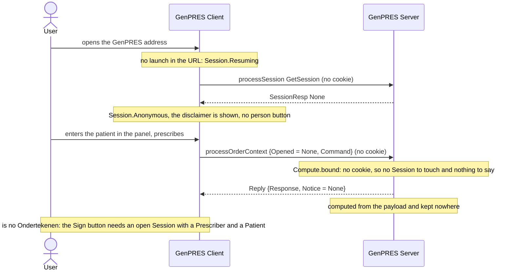

# User opens GenPRES directly

UC-7. GenPRES without MainEHR: prescribe, never sign. Decision support for anyone who can
reach the address; order management only through a launch.

Precondition: a browser that can reach the Server, and no Launch, so no identity is ever
asked for.

## Reading it

**Nothing is opened.** The design has the Server open an anonymous Session; the code opens
none. A browser without a cookie has no Session, the state is not touched, and every computing
member works as it did before Sessions existed. The Client's `Anonymous` phase is a phase of
the Client alone: no User, no Patient from anywhere but the panel or the URL, no OpenedToken,
no head.

**Neither the record nor the platform is touched.** An anonymous User types what they want
computed. That is what makes it safe to hand to anyone who can reach the address.

**Signing cannot be asked for.** The button is not rendered without an open Session whose
User is a Prescriber and which has a Patient. Were `RequestSignChallenge` sent without a
cookie, the Server would answer `Refused NoSession`.

**The only bound is on requests.** With no Session to count, nothing bounds anonymous opens
or ends them; the Server's fixed-window limiter (sixty requests per ten seconds per client
address) is the one rate limit, and it applies to every request alike.

**A launch replaces it.** The same browser launching later sets the session cookie and the
Client loads the head's orders into the cart; what was typed anonymously goes with the page.
A gate that offers *continue without launch* (a refusal `no-role`, an unreachable Server, an
ended Session) lands here too, carrying nothing over.

## Not built

The anonymous Session of the design, its bound on opens and its absolute lifetime (Rule 14);
the audit of opens refused above the bound (Rule 46). Whether production exposes this at all
is [#580](https://github.com/informedica/GenPRES/issues/580): today the computing members work
in production and every session member is refused.

---

Read off `Compute.bound` in `src/Informedica.GenPRES.Server/ServerApi.Compute.fs`, the
`GetSession` arm in `ServerApi.SessionCommand.fs`, and `Session.Anonymous` in
`SessionMachine.fs` and `canSign` in `SigningPolicy.fs` in `src/Informedica.GenPRES.Client/`.
The design is UC-7 in [`Integration.fsx`](Integration.fsx), whose `OpenAnonymous` has no
counterpart in the code.
