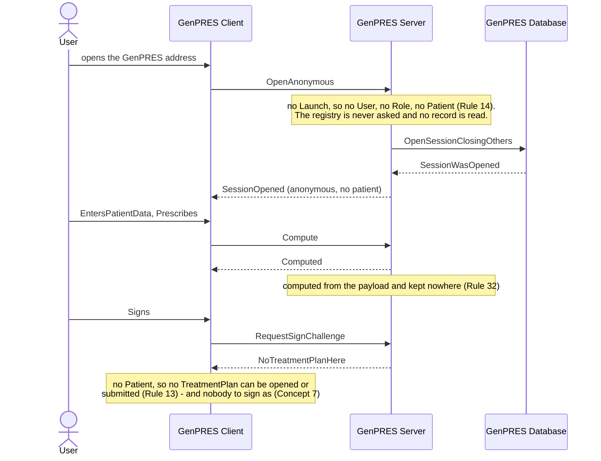

# User opens GenPRES directly

UC-7. GenPRES without MainEHR: prescribe, never sign. Decision support for anyone; order
management only through a launch.

Precondition: a browser that can reach the Server, and no Launch — so no BrowserIdentity
is ever asked for.

## Reading it

**Neither the PatientRecord nor the platform is touched.** An anonymous Session reads no
clinical data at all: the User types what they want computed. That is what makes it safe
to hand to anyone who can reach the address.

**It is bounded twice.** By how many may stand open at once, and by an absolute lifetime
counted from the open. There is no idle clock — nobody is waiting to be told anything —
so the lifetime is the only thing that ends it.

## What it leaves out

- **A browser that does present a Launch** (ext 1a). That is a launch: UC-1 from step 3.
- **The same browser launching properly later** (ext 1b). The launch replaces the
  anonymous Session under Rule 8's per-browser limit, and its WorkPlan goes with the page.
- **The rate limit.** Rule 14 asks for one; the model carries the standing cap and the
  absolute lifetime, not a rate.
- **The audit.** Opens refused above the bound are counted per source rather than logged
  line by line, which would be the same flood by another name (Rule 46).

---

Drawn from UC-7 in [`Integration.fsx`](Integration.fsx). The full trace of all eleven use
cases is written to `Integration.run.txt` beside it when the script runs.
