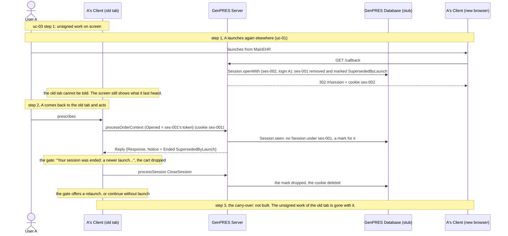

# A Session ends out from under the User

UC-8. The Server cannot reach a Client, so a Session that ends while nobody is looking cannot
be announced. The screen goes on looking alive. User A finds out at their next action.

The code has two endings that happen to a User: the same login opening a Session elsewhere,
and the wrong-PIN limit ([uc-05](uc-05-workstation-takeover.md)). It has no clock: nothing
ends a Session for being idle or for being old. This page draws the first.

Precondition: [uc-03](uc-03-prescribe-and-sign.md) step 1, an open Session with unsigned work
on screen.

A reload of the old tab instead of an action asks `GetSession`, which answers
`SessionEnded SupersededByLaunch` and ends the same way.

## Reading it

**Nothing pushes.** The Client-to-Server edge goes one way, so the Session ends silently and
A learns at their own next request, whichever member it is: the ending rides on the reply of a
computing request as `Reply.Notice`, and on `GetSession` as its answer. The computing request
is still answered; the ending is told next to the result.

**Being told is being acknowledged.** The design keeps the notice owed until A, from a fresh
launched Session, says they have seen it, and has the refused old tab discharge nothing. The
code has the Client acknowledge at once: on `Ended` it shows the gate and sends
`CloseSession`, which drops the mark. Whoever is at the old tab, A or the next person at the
workstation, sees the notice and discharges it.

**Nothing is told at the next launch.** The new browser's launch reads no marks, and by the
time A relaunches from the old tab the mark is gone. The notice is the gate on the old tab, and
nothing else.

**There is no carry-over.** The design has the new tab read the old tab's cart from memory,
same User and same Patient only. The code has no such read; the cart of the superseded Session
is dropped when the gate shows. A User who wants the work keeps the old tab open until it is
signed. This is [#518](https://github.com/informedica/GenPRES/issues/518).

**A restart forgets the Session, unless the store is set.** The design has a Session's standing
live in its record, so that a restart ends nothing (Rule 32). With
`GENPRES_DB_CONNECTION` set this holds: the cookie still names the Session, the server reads it
back from the file with its ending, its credential and what it opened with, and a second server
reads the same. Without the key the record is the process's memory, and after a restart the
cookie names no Session, `GetSession` answers `SessionResp None`, and the Client opens
anonymously, without a notice, the cart of the old Session gone with the page. The production
engine is still to be chosen ([#516](https://github.com/informedica/GenPRES/issues/516)).

## Not built

- The idle clock and the absolute lifetime (Rules 9 and 10). The SessionRecord keeps `Seen`,
  refreshed by every request but a close, and nothing reads it. The MVP overview lists the
  lifetimes as an issue to file
  ([mvpap2019-gap-overview.md](../../roadmap/mvpap2019-gap-overview.md), row 2.1.5).
- The request that ends its own out-of-time Session (Rule 41): there is no time to be out of.
- The notice at the next launch, and the acknowledgement only A can give (Rule 11;
  [session-endings](session-endings.md)).
- The carry-over of unsigned work into a relaunched tab ([#518](https://github.com/informedica/GenPRES/issues/518)).
- The audit of the refusal (Rule 46).
- An upgrade that serves open Sessions by the version they opened on: one version runs.

---

Read off `Session.openWith`, `Session.seen`, `Session.find` and `Session.close` in
`src/Informedica.GenPRES.Server/ServerApi.Session.fs`, `Compute.bound` in
`ServerApi.Compute.fs`, and `EndedByServer` and `Resumed` in `SessionMachine.fs` in
`src/Informedica.GenPRES.Client/`. The design is UC-8 in [`Integration.fsx`](Integration.fsx),
whose `Idle` ending, `PriorSessionNotice` and `AckSessionNotice` have no counterpart in the
code.
