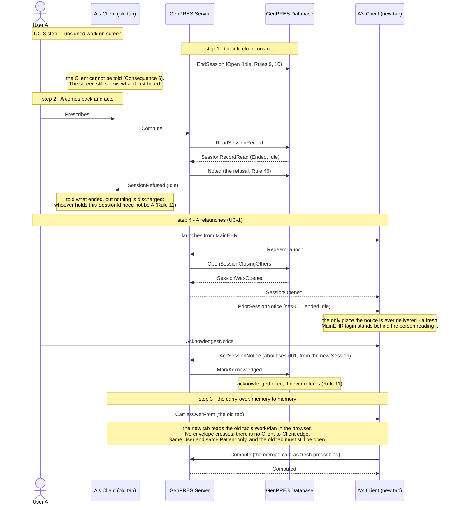
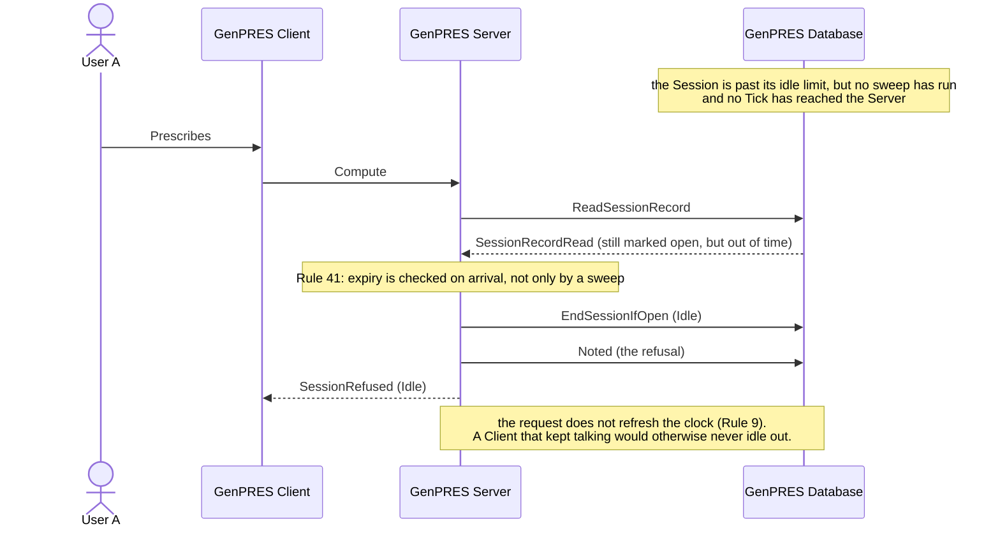

# A Session ends out from under the User

UC-8. The Server cannot reach a Client (Consequence 6), so a Session that ends while
nobody is looking cannot be announced. The screen goes on looking alive. User A finds out
at their next action, and is told properly at their next launch.

Precondition: UC-3 step 1 — an open Session with unsigned work on screen.

## Reading it

**The steps run 1, 2, 4, 3.** Deliberate: the carry-over is step 3 in the document, but it
has nowhere to land until the relaunch of step 4 has created the Session that receives it,
so the drawing follows the order the messages actually occur in.

**Nothing pushes.** Edge C5 goes one way, so the Session ends silently and A learns at
their own next request. Everything in this use case follows from that one fact.

**Being refused is not being told.** The old tab is refused with a reason, and the notice
still stands. Whoever is holding that SessionId need not be A — in UC-5's setting it is
whoever sat down at the workstation — so discharging the obligation on their word would
let a stranger dismiss the very notice that exists to tell A something happened. Only a
launched Session of A's own can acknowledge it.

**The carry-over is inside the browser, not across the wire.** The document describes the
new tab as asking the old one; in the model it is a direct read of the old tab's memory,
because the edge table has no Client-to-Client edge and nothing is stored anywhere to
fetch. What crosses the wire afterwards is an ordinary `Compute` carrying the merged
cart — the work arrives as fresh prescribing, with no claim on the old stamps.

It works only for the same User and the same Patient, and only while the old tab lives.
Rule 33 takes both from the SessionRecord, so a cart cannot walk from one User to another
or from one Patient to another.

## What it leaves out

- **A Server restart** (ext 1a). Nothing ends: the Session's standing is in its
  SessionRecord and its work is in the Client, and the Server held neither (Rules 10, 32).
  The next request continues the Session, the idle clock permitting.
- **An upgrade** (ext 1b). Open Sessions are served by the version they opened on until
  they end. Not modeled: this model has one version.
- **Another Session at another workstation** (ext 1c). The launch ends the old Session and
  delivers the notice with it.
- **The absolute lifetime.** Rule 9's clock forgives a Client that keeps talking; the
  outright limit does not, and bounds a Session at a shift.

## The request that ends its own Session (ext 2a)

No sweep has run, so nothing has noticed the Session is out of time. The arriving request
does — and ends it rather than refreshing it back to life.

---

Drawn from UC-8 in [`Integration.fsx`](Integration.fsx). The full trace of all eleven use
cases is written to `Integration.run.txt` beside it when the script runs.
