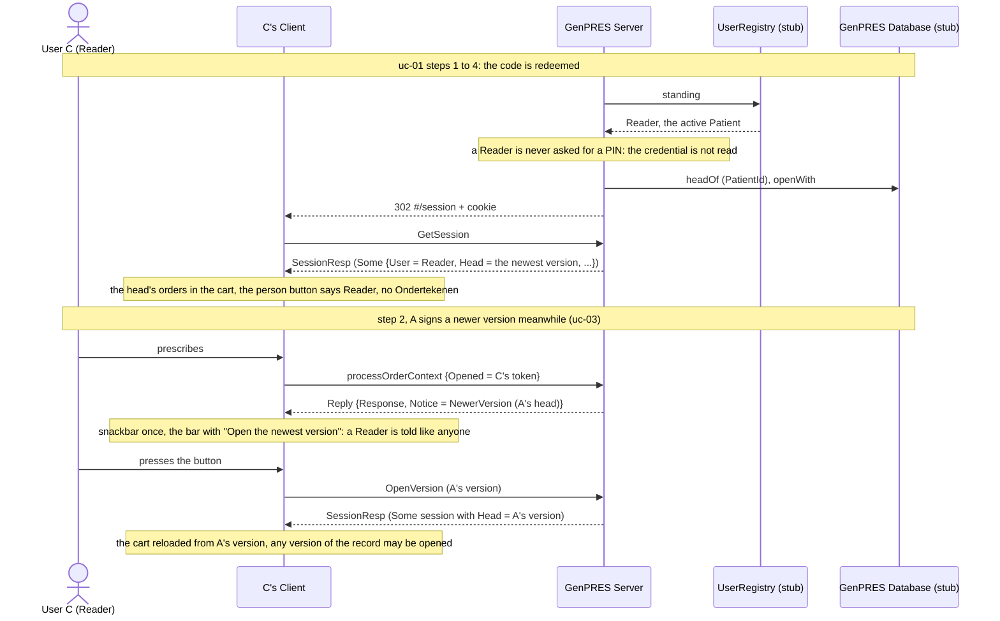

# A Reader consults a Patient

UC-9. User C holds the Reader Role. They see the version that counts, and are told when it
moves on, but nothing they do can ever be signed.

Precondition: the Patient has a head, User A holds an open Prescriber Session for it, and C
launches. In the demo: the identity `reader`.

## Reading it

**A Reader prescribes like anyone.** Computing is not gated by Role: C can explore
alternatives freely, on the head's orders or their own. What is gated is signing, and only
signing.

**No PIN is ever read.** Not asked and ignored: the credential stage is skipped whole at the
launch, because the suspension into enrolment binds Prescribers only. The stub directory
seeds no credential for `reader` at all.

**Signing is refused twice over.** The Client renders no Sign button unless the Session's User
is a Prescriber. Were `RequestSignChallenge` or `Submit` sent all the same, the Server would
answer `Refused NotPrescriber`: at the challenge from the Session's Role, at the commit from the
registry's fresh answer.

**The notice does not discriminate.** C is told a newer version exists on the same terms as a
Prescriber, because it rides on any computing reply whose token is the Session's own and gates
nothing. And C's Session is a full Session in every other way: it supersedes C's other
Sessions, it holds an OpenedToken and a key thumbprint, and `OpenVersion` works.

## Not built

The audit of the refusal (Rule 46).

---

Read off `Session.callback` (the credential check), `Session.challenge` and `Session.commit`
in `src/Informedica.GenPRES.Server/ServerApi.Session.fs`, `StubDirectory` and
`StubCredentials` in `ServerApi.StubAdapters.fs`, and `canSign` in `SigningPolicy.fs` in
`src/Informedica.GenPRES.Client/`. The design is UC-9 in [`Integration.fsx`](Integration.fsx).
