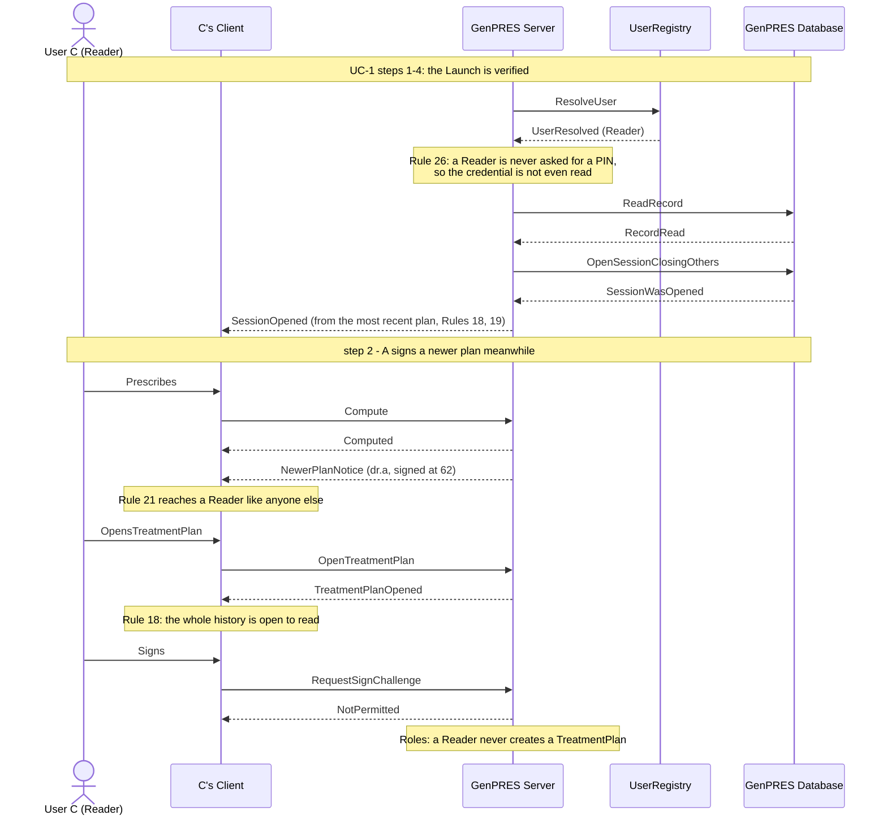

# A Reader consults a Patient

UC-9. User C holds the Reader Role. They see the plan that counts, and are told when it
moves on — but nothing they do can ever be signed.

Precondition: Patient 2 has a head, User A holds an open Prescriber Session for it, and C
launches (UC-1 ext 5c).

## Reading it

**A Reader prescribes like anyone.** Concept 15 is not gated by Role — C can explore
alternatives freely. What is gated is signing, and only signing.

**No PIN is ever read.** Not asked and ignored: the credential stage is skipped whole at
the launch, because a Reader has nothing to prove (Rule 26).

**Rule 21 does not discriminate.** C is told a newer plan exists on exactly the same terms
as a Prescriber, because the notice rides on any response and gates nothing.

## What it leaves out

- **The refusal is audited** (Rule 46), like every refused request.

---

Drawn from UC-9 in [`Integration.fsx`](Integration.fsx). The full trace of all eleven use
cases is written to `Integration.run.txt` beside it when the script runs.
