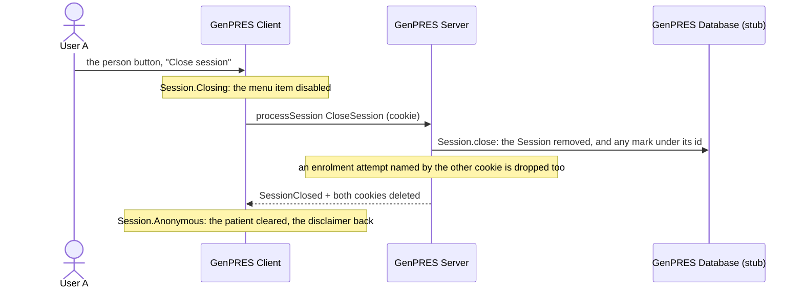

# User closes GenPRES

UC-10. User A closes the Session deliberately. It is gone without a mark, and the next launch
starts clean: no stray Session, no notice.

Precondition: [uc-03](uc-03-prescribe-and-sign.md) has left an open Session with its work
signed.

## Reading it

**No mark, so nothing to tell.** The User did this. `close` removes the Session from the state
and removes any ending mark under its id with it; that second removal is also how a Client
acknowledges an ending it was told ([session-endings](session-endings.md)). The next launch
says nothing about it, now or ever.

**The browser always leaves without a credential.** The cookies are deleted in a `finally`:
even when the server-side close throws, the browser holds no session cookie afterwards, and
the exception still surfaces. A close that fails on the wire keeps the Session open on the
Client, with a snackbar asking to try again.

**Unsigned work goes with it, unwarned.** The cart existed only in the browser; closing drops
it. The Client does not warn.

**Closing the browser instead reaches nothing.** No close can be inferred, and with no idle
clock the Session stays in the server's memory until the same login launches elsewhere
(marked superseded, told to nobody, since the tab is gone) or the server restarts.

## Not built

A warning when unsigned work is on screen at the close. The idle clock that would end a
Session whose tab was closed (Rule 10; [uc-08](uc-08-session-ends.md)). The audit (Rule 46).

---

Read off `Session.close` in `src/Informedica.GenPRES.Server/ServerApi.Session.fs`, the
`CloseSession` arm in `ServerApi.SessionCommand.fs`, and `SessionMsg.Close` in
`SessionMachine.fs` and `Components/TitleBar.fs` in `src/Informedica.GenPRES.Client/`. The
design is UC-10 in [`Integration.fsx`](Integration.fsx).
