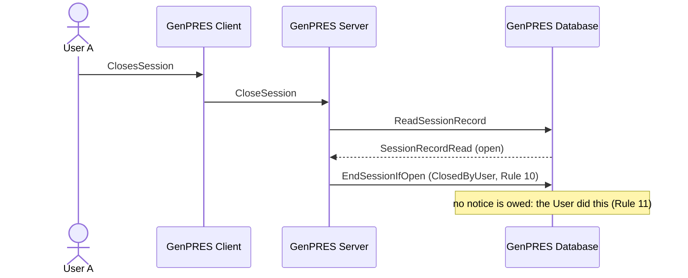

# User closes GenPRES

UC-10. User A closes the Session deliberately. It ends as closed by the User, and the next
launch starts clean — no stray Session, no notice.

Precondition: UC-3 has left an open Session with its work signed.

The next launch says nothing about it, now or ever.

## What it leaves out

- **Unsigned work at the close** (ext 1a). The Client warns; closing drops it. It existed
  only in the browser (Concept 16), so closing is what drops it.
- **Closing the browser instead** (ext 1b). Nothing reaches the Server, so no close can be
  inferred. The Session idles out and A is told at the next launch — a harmless notice.

---

Drawn from UC-10 in [`Integration.fsx`](Integration.fsx). The full trace of all eleven use
cases is written to `Integration.run.txt` beside it when the script runs.
