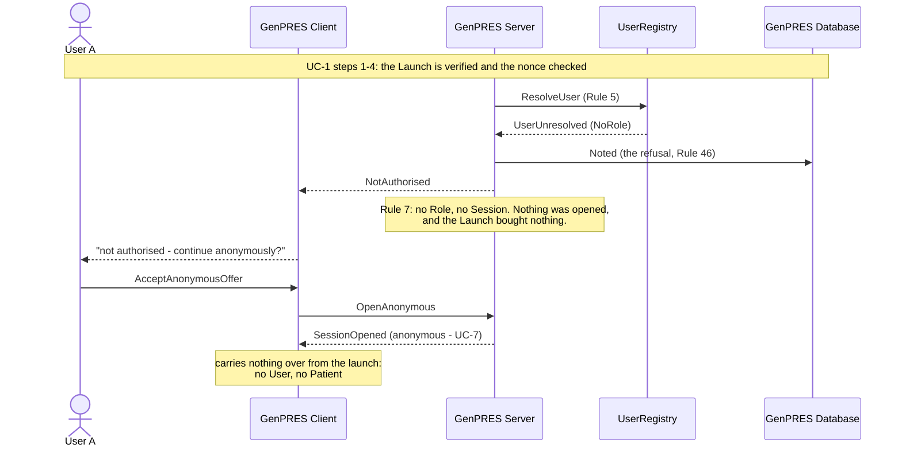

# A User's authority is withdrawn

UC-11. The UserRegistry stops returning a Role for User A. A keeps anonymous decision
support and nothing more, and nothing of A's is left pending anywhere.

Precondition: A had a Role; the registry no longer returns one.

## Reading it

**The credential survives, and is inert.** GenPRES still holds A's UserCredential, but it
carries no Role and there is no launched Session to sign in. Concept 7 is explicit that a
credential proves who you are, never what you may do.

**Nothing half-done is left behind.** Unsigned work never left A's browser, so the record
holds exactly what A signed and nothing else. That is Guarantee 2, and it is why a
withdrawal needs no clean-up.

**The anonymous open is offered here and not everywhere.** Relaunching would give the same
answer however often it is asked, so the offer is worth making. A forged or spent Launch
gets a refusal with no offer, because a relaunch would cure it.

## What it leaves out

- **The withdrawal landing mid-Session** (ext 1a). The Session keeps the Role its launch
  established, so reading and prescribing ride it out — but every signature re-takes the
  Role (Rule 38), so signing is blocked at once and nothing more can be committed.
- **A registry that is merely down.** Not a withdrawal: for a bounded grace after the
  launch the launch's Role stands, and the audit says so. Past it, signing fails closed.

---

Drawn from UC-11 in [`Integration.fsx`](Integration.fsx). The full trace of all eleven use
cases is written to `Integration.run.txt` beside it when the script runs.
