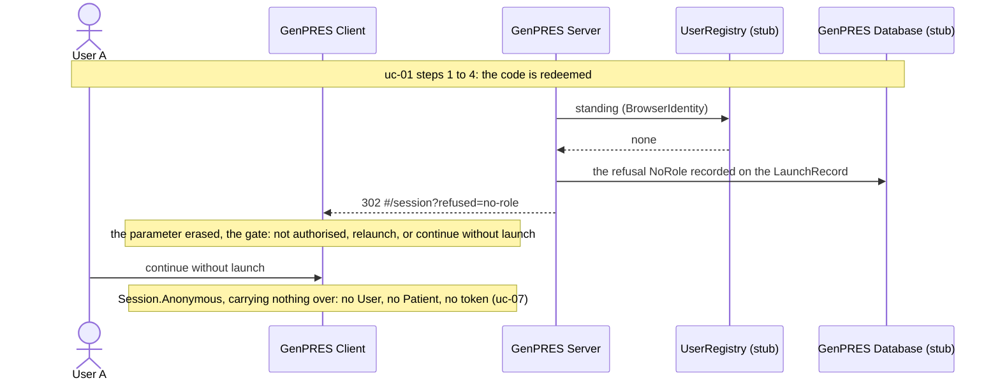
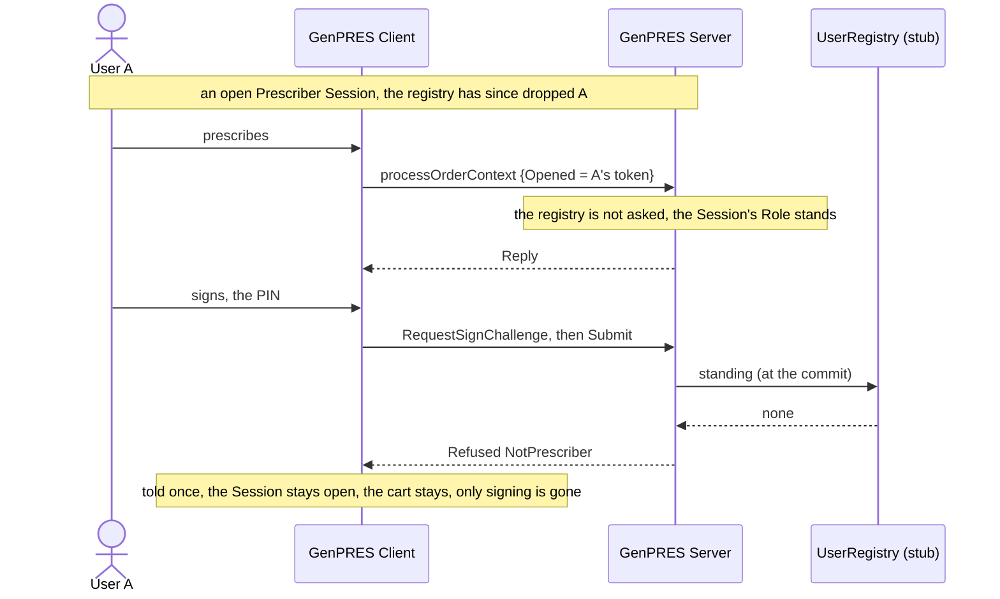

# A User's authority is withdrawn

UC-11. The UserRegistry no longer returns a standing for User A. A keeps anonymous decision
support and nothing more, and nothing of A's is left pending anywhere.

Precondition: A had a Role; the registry no longer returns one. In the demo the identity
`unknown` is a login the stub directory does not know.

And when the withdrawal lands during an open Session:

## Reading it

**The credential survives, and is inert.** The state still holds A's credential, but the
registry gives it no Role and there is no launched Session to sign in. A credential proves who
you are, never what you may do.

**Nothing half-done is left behind.** Unsigned work never left A's browser, so the record
holds exactly what A signed and nothing else. That is why a withdrawal needs no clean-up.

**The anonymous open is offered here and not everywhere.** Relaunching would give the same
answer however often it is asked, so the gate offers to continue without a launch, and only
for this refusal, an unreachable Server and an ended Session. A forged or spent Launch gets a
refusal with no offer, because a relaunch would cure it.

**Mid-Session, only the signature fails, and it fails closed.** Computing requests never ask
the registry, so reading and prescribing ride on the Role the launch established. Every commit
re-takes the Role from the registry, and no standing, a Role other than Prescriber, or a
registry that cannot answer, all refuse the signature `NotPrescriber`. The Session is not
ended by it. The stub directory cannot withdraw a standing while the server runs, so this
branch is pinned by the server tests, not by the walkthrough.

## Not built

The bounded grace when the registry is merely down (Rule 38): today there is no difference
between a withdrawal and an outage, and the commit refuses at once. Ending the Session, not
only the signing, on a withdrawal. The MVP overview lists both as an issue to file
([mvpap2019-gap-overview.md](../../roadmap/mvpap2019-gap-overview.md), row 2.1.10). The audit
of the refusals (Rule 46).

---

Read off `Session.callback` and `Session.commit` in
`src/Informedica.GenPRES.Server/ServerApi.Session.fs`, `StubDirectory.standingOf` in
`ServerApi.StubAdapters.fs`, and `gateFor` in `SessionGatePolicy.fs` in
`src/Informedica.GenPRES.Client/`. The design is UC-11 in [`Integration.fsx`](Integration.fsx).
