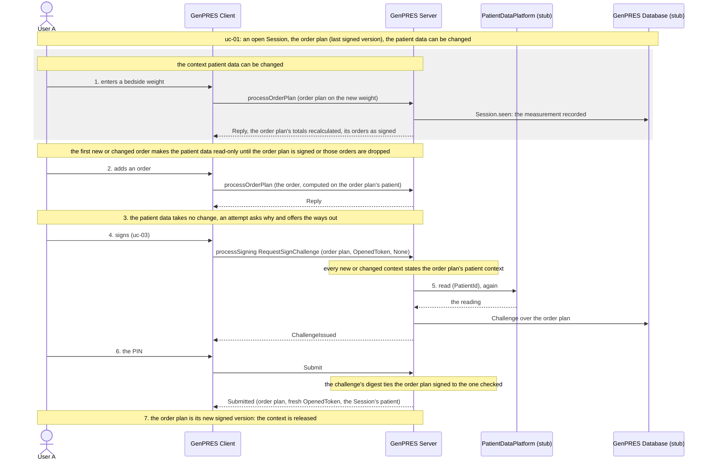

# The patient context is held while the order plan has new or changed orders

UC-12. User A prescribes for a Patient, and every order they add is computed on the patient
context of that moment: weight, height, gestational age, gender, department, renal function and
access. Without a hold User A could change that context after the first order was on the order
plan, and the orders already there were left as they were computed, while the order plan's
patient followed the edit. So User A could sign orders that were composed on different data.
This page holds the context from the first new or changed order to the sign, so that everything
a signed version adds rests on one patient context.

**Built** in [#1075](https://github.com/informedica/GenPRES/issues/1075), pull requests #1090
to #1095; the [implementation plan](../../implementation-plans/1075-held-patient-context.md)
lists what each step landed and where the build deviated from the design. The difference from
the EHR's reading (12c) is a projection, built when a view needs it. What the code did before is
under [Before #1075](#before-1075).

Precondition: [uc-01](uc-01-launch.md) has left an open Session for an identified Patient,
started from the head of its record, with the Prescriber Role. Anonymous use and the url mode
sign nothing and are never held.

## Reading it

1. **User A changes the patient data.** The order plan has no new or changed order, so the
   context is released. User A enters a bedside weight; the Client sends the order plan on the
   new weight, the Server records the measurement (`Session.seen`) and recalculates the order
   plan's totals. The orders of the last signed version stay as they were signed.
2. **User A adds an order.** It is computed on the order plan's patient data. From here the
   order plan has a new order, and the context is held.
3. **The patient data takes no change.** The fields keep their values, read-only. An attempt to
   change one, by pointer or keyboard, or the reset, asks why, with two ways out that drop the
   new and changed orders: remove them, or refresh from the EHR (12b). The third way out,
   signing, is the order plan's own button.
4. **User A signs.** The Client asks for a challenge over the order plan. The Server first
   checks that every new or changed context states the order plan's patient context, and refuses
   `ContextDiffers` when one does not.
5. **The challenge.** The Server reads the EHR again, as in uc-03, and issues the challenge over
   the order plan's digest. When the EHR reads other data, the data notice comes first (12c).
6. **The PIN and the commit.** User A enters the PIN and the Client submits. The commit compares
   the order plan with the challenge by digest, so it signs the order plan checked in step 4,
   and appends the version.
7. **The context is released.** The order plan is its new signed version: nothing in it is new
   or changed, and the patient data can be changed again.

**Held by the order plan, not by a clock or a row.** The context is held while the order plan
has a new or changed order: one added, or changed, since the version last opened or signed. Only
the order plan is ever signed, as a version; an order is new or changed against that version.
The orders of the last signed version, loaded at the launch, hold nothing, so a launch on a
patient with a signed order plan starts released. The hold is not a state the Server keeps: the
Server keeps nothing of the order plan between requests (Rule 32). The Client derives it from
the order plan it holds, and the Server derives the same fact from the order plan it is asked to
sign.

**The Client informs, the Server checks.** The patient data takes no change while the context is
held, and an attempt asks why, with the ways out. From the sign until the signature is answered
or cancelled the order plan takes no change at all, so the version signed is the order plan
shown. The rule is the Server's:
every order context of the order plan states the patient it was computed on
(`OrderPlan.OrderContexts[].Patient` on the wire, `PlanContext.Context.Patient` in the domain),
and at the challenge the Server refuses an order plan whose new or changed contexts state
another patient context than the order plan's own. The Server compares what the contexts state;
it does not compute them again. So the check catches a Client that sends orders composed on
different data, not a Client that states one patient on a context computed on another. The
commit needs no check of its own: the challenge's digest ties the order plan signed to the one
checked.

**Released three ways.** By the sign: the order plan is the new version, nothing in it is new or
changed. By removing every new and changed order: nothing new or changed is left, though the
order plan need not be the version it opened, since an order of that version that was changed
and then removed stays removed; a removal holds nothing. By a refresh: a new launch, an explicit
refresh in GenPRES that reads the EHR again and drops those orders, or a browser reload, which
drops them with the Client's state. Also released when the Session ends, idle
([#1061](https://github.com/informedica/GenPRES/issues/1061)) or otherwise
([uc-08](uc-08-session-ends.md)).

**The age is fixed apart.** An identified patient's age is fixed by the Server from the open to
the sign and put on every request
([implementation plan for #976](../../implementation-plans/976-two-patient-modes.md)). The hold
of this page covers the fields the User can change; the age rule stands as it is.

**A bedside measurement waits for the release.** A weight measured while the context is held
cannot be entered until the order plan is signed or its new and changed orders are dropped. That
is the clinical cost of the rule, accepted for the first build; re-prescribing those orders on
the new context is a follow-up (see [To settle](#to-settle)).

## What a signature can be refused with, beside uc-03's

| `SigningRefusal` | At | Means |
|------------------|----|-------|
| `ContextDiffers` | challenge | a new or changed order states another patient context than the order plan is signed on |

The Client shows it once and returns to the order plan: the orders it names are the ones to
remove or prescribe again.

## Extensions

**12a User A removes every new and changed order.** Nothing new or changed is left, so the
patient data can be changed at once. Releasing the hold does not restore the version it
opened: an order of that version that was changed and then removed stays removed.

**12b User A refreshes.** From the question of step 3, which says the new and changed orders are
dropped. The Server reads the EHR again, projects it at the time of the refresh with the user's
measurements over it, and reopens the head on it under a fresh OpenedToken; the standing
challenge is spent and the notice dropped. The Session's patient becomes the one read again,
the age with it, and the order plan is the head again, released; without a head it opens empty.
A refresh that did not happen is told, and changes nothing.

**12c The EHR reads other data at the sign.** The data notice is shown as in uc-03, saying that
the version is signed on the data as it was and the new data applies after the sign; the version
is signed on the held context. That it rests on data other than the EHR's reading is not
stored: the commit keeps the EHR reading it was signed on beside the version, and the two tell
the difference. The new data applies from the next round, once the context is released.

**12d Two Users.** Each holds their own context in their own order plan. The first to sign wins
([uc-04](uc-04-two-users.md)); the other rebuilds on the new head, and their new and changed
orders keep the context they were composed on until they sign or drop them.

**12e The Session ends while the context is held.** The new and changed orders go with the
Client state as they do today; the relaunch starts released. Once the carry-over of
[#518](https://github.com/informedica/GenPRES/issues/518) is built, the order plan carried into
the next Session carries its hold with it.

## Before #1075

A change to the patient context sent `PatientChanged` to the order context and the order plan
(`updatePatient` in `App.fs`). The order plan recomputed its totals with the new patient; the
contexts kept the patient they were created with (`OrderPlanMachine.step`). The order plan's
patient, its totals and the patient data of a signed version followed the edit, and nothing
compared them with the patient of each context. The accept of a data notice set the draft to
the notice's data, orders or not. The order plan could change while a signature was under way.

## Where this changes the design

- **Concept 15** makes prescribing change the Patient Data of the PatientContext freely within a
  Session. Under this page it does so only while the order plan has no new or changed order.
- **Concept 16**, the WorkPlan, gains a state: held or released, derived from its orders.
- **Rule 44**, the data notice before the challenge: while the context is held the version is
  signed on the held context, not on the data as it stands.
- The model in [`Integration.fsx`](Integration.fsx) has prescribing change the patient data at
  any step; it has no hold.

## To settle

- **Which fields.** As built: weight, height, gestational age, gender, department, renal function
  and access, the data the rules read that the User can change; the age is fixed by the Server.
  The check at the challenge compares the location too, which the rules read but the panel does
  not offer.
- **Which Sessions.** Settled: an identified patient only. Anonymous use and the url mode are
  never held, since nothing is signed there.
- **Measurements.** As built: recorded per request; while the context is held the panel's edits
  are ignored, so it sends none. They stand over a refresh, as they stand over a sign.
- **What counts as changed.** As built: an order context whose id the head does not hold, or
  whose content differs from the head's; the Server compares the domain values less the age and
  the intake. A change to the order plan's filter alone is not.
- **Re-prescribing on a new context.** A path that takes the new and changed orders to a new
  context instead of dropping them, which is the replacement
  [#672](https://github.com/informedica/GenPRES/issues/672) asks for signed contexts too.
- **How the version records** that it was signed on data other than the EHR's reading. Settled:
  it does not; it is projected from the EHR reading the commit keeps beside the version. Not the
  `Verified` flag: that records whether the platform could be read at the challenge, and old
  versions keep that meaning.

---

Read off `patientHeld` in `src/Informedica.GenPRES.Client/App.fs` and the panel in
`Views/Patient.fs`; `HeldContextPolicy.fs`, `OrderPlanMachine.fs`, `SigningMachine.fs` and
`SessionMachine.fs` in `src/Informedica.GenPRES.Client.Core/`; and `Session.challenge`,
`Session.differingContexts` and `Session.refresh` in
`src/Informedica.GenPRES.Server/ServerApi.Session.fs`. The design it changes
is Concepts 15 and 16 and Rule 44 in
[GenPRES-MainEHR-Integration-V8.md](GenPRES-MainEHR-Integration-V8.md).
